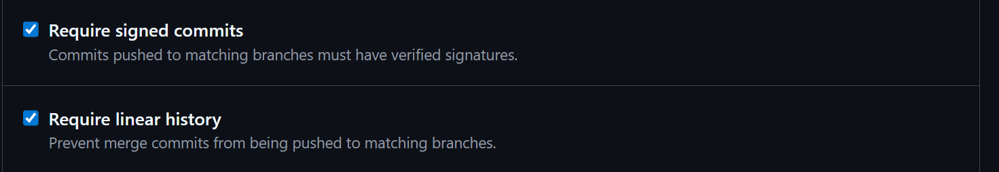
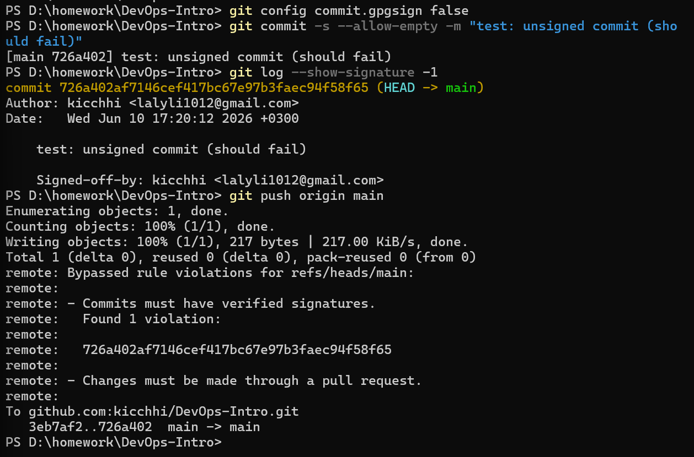
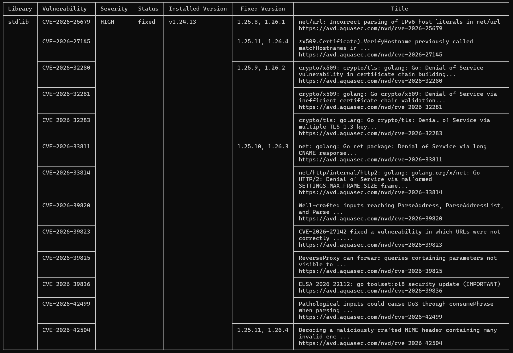
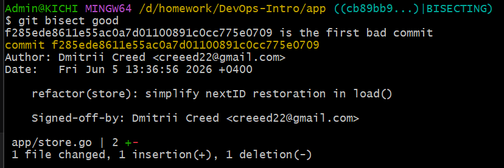
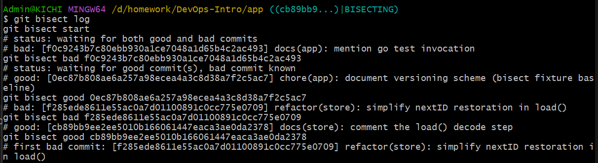
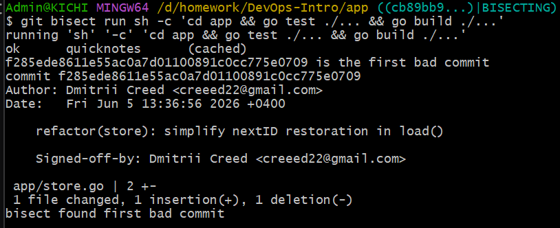
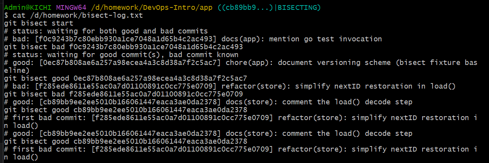

# Lab2
Фролова Анастасия Ивановна, M25-RO-01
a.frolova@innopolis.university

## 1.1

Ниже представлены скриншоты запускаемых команд.

## 1.2

В папке `.git/` хранится вся история репозитория. Здесь видим 
- HEAD (указатель на текущую ветку);
- config (настройки);
- objects/ (все объекты Git);
- refs/ (ссылки на ветки и теги);
- index (стейджинг-область);
- hooks/ (скрипты-обработчики событий).

HEAD указывает на ветку `main` — это значит, чт мы сейчас на ветке main.

В папке `refs/heads/` лежат файлы всех локальных веток. Каждый файл содержит SHA последнего коммита в этой ветке. Здесь видим ветку `main` и папку `feature/`.

В `objects/` объекты Git хранятся в подпапках по первым двум символам SHA-хеша. Это сделано для оптимизации — файловая система быстрее работает, когда в одной папке не слишком много файлов. Каждый объект — это blob (содержимое файла), tree (директория) или commit.

В репозитории 67 loose-объектов (несжатых).

## 1.3 Моделирование чрезвычайной ситуации + восстановление

История коммитов до сброса:

Коммиты после сброса:

`git reflog`

Восстанавливаем коммит:

Проверяем, что коммит восстановился:

> Вопрос: что произойдет, если git gc выполнится между неудачным сбросом и восстановлением?

> Ответ: Если выполится git gc (сборщик мусора), потерянные коммиты будут безвозвратно удалены. Git gc удаляет недостижимые объекты, которые недостижимы (на них нет ссылок из веток или тегов). Поэтому случайно удаленные коммиты необходимо восстанавливать как можно быстрее.

---

## Task2. Отметьте релиз и перебазируйте фичу

### 2.1 Аннотированный релиз с подписью

Проверяем, что тег аннотирован и подписан

### 2.2: Rebase + force-with-lease

Моделирование "движения вверх по течению" (не знаю корректный перевод или нет)

Сделала коммит в main, затем создала временную ветку от main. В ней сделала коммит. Затем сравниваю логи до и после rebase.

Логи до и после:

### 2.3

> Вопрос: когда выбирать merge, а когда rebase.

> Ответ: Merge используется, когда важно сохранить историю ветвления и не переписывать коммиты. Rebase - для локальных веток перед PR, переписывает коммиты, и получается линейная история. Поэтому нельзя использовать rebase для веток, на которые уже кто-то ссылается.

## 3. Бонусное задание

### 3.1 Bisect вручную

Вручную выполняю bisect

Тест провалился:

Поправляем: 

Логи: 

### 3.2 Автоматизация процесса

`git bisect run sh -c 'cd app && go test ./... && go build ./...'`

> Вопрос: как bisect нашел его за log₂(N) шагов?

> Ответ: bisect использует бинарный поиск, между хорошим и плохим выбирет коммит в середине, и проверяет его, следовательно, за log₂(N) шагов найдется первый плохой коммит.

Еще раз полный лог: 

