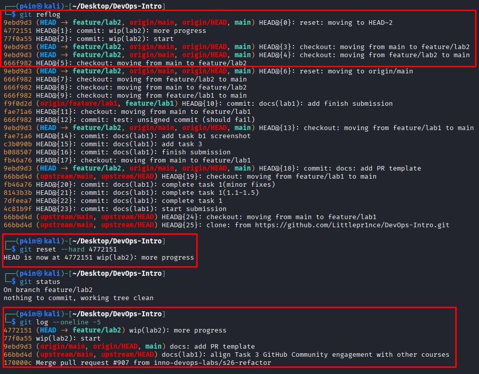

# Lab 2 submission

# Lab 2 — Version Control Deep Dive: Internals, Recovery, Rebase

**Student:** T.R. Shekhmametyev

## Task 1 — Git Object Model + Reflog Recovery

### 1.1 Explore Git Object Model

First, I inspected the current HEAD commit.

```bash
┌──(p4in㉿kali)-[~/Desktop/DevOps-Intro]
└─$ git rev-parse HEAD
9ebd9d302bd158506d7c009b96c4845da0b94925
```
Then I checked the object type stored at HEAD.

```bash
┌──(p4in㉿kali)-[~/Desktop/DevOps-Intro]
└─$ git cat-file -t HEAD
commit
```

Next, I inspected the commit object itself.

```bash
┌──(p4in㉿kali)-[~/Desktop/DevOps-Intro]
└─$ git cat-file -p HEAD
tree b2fe0c7c5e1b86c2995fdccb8e8b18e8a19fd322
parent 66bbd4db9228bc9a4cab7439746b993749c026ab
author T. R. Shekhmametyev <ssssasaskfrjd@gmail.com> 1780954910 -0400
committer T. R. Shekhmametyev <ssssasaskfrjd@gmail.com> 1780954910 -0400
gpgsig -----BEGIN SSH SIGNATURE-----
 U1NIU0lHAAAAAQAAADMAAAALc3NoLWVkMjU1MTkAAAAgZtwj+wzePcwUxnAQDmsXhuxOA8
 ....
 -----END SSH SIGNATURE-----

docs: add PR template

Signed-off-by: T. R. Shekhmametyev <ssssasaskfrjd@gmail.com>
```
The commit object references a tree object.
I inspected the tree:

```bash
┌──(p4in㉿kali)-[~/Desktop/DevOps-Intro]
└─$ git cat-file -p b2fe0c7c5e1b86c2995fdccb8e8b18e8a19fd322
040000 tree 1d07791eee3c3dd0955a02402b05b3a357816d8d    .github
100644 blob 1c0a1e94b7bbdd951f456cda51af6b8484cc3cee    .gitignore
100644 blob d10c04c6e7e0014f4fe883599c11747c15012d4e    README.md
040000 tree 7d0898a908e274ea809722844cdbd836f3b1c05a    app
040000 tree 6db686e340ecdd318fa43375e26254293371942a    labs
040000 tree 3f11973a71be5915539cb53313149aa319d69cb5    lectures
```
Finally, I inspected the README blob (Output truncated)

```bash
┌──(p4in㉿kali)-[~/Desktop/DevOps-Intro]
└─$ git cat-file -p d10c04c6e7e0014f4fe883599c11747c15012d4e
# DevOps Intro — Modern DevOps Practices Through One Project

[](#course-roadmap)
[-success)](#the-project-quicknotes)
[](#course-roadmap)
[](#grading)

A 10-week practical introduction to DevOps at Innopolis University. You will package, ship, observe, harden, and deploy **one** Go service — QuickNotes — across every lab. The discipline you learn here is the spine of modern production engineering.

> 💬 *"If it hurts, do it more often."* — Jez Humble

---

## Course Roadmap

10 weekly labs + 2 optional bonus labs:
```

### Object Chain

The explored chain was:

```text
HEAD
↓
Commit 9ebd9d302bd158506d7c009b96c4845da0b94925
↓
Tree b2fe0c7c5e1b86c2995fdccb8e8b18e8a19fd322
↓
Blob d10c04c6e7e0014f4fe883599c11747c15012d4e
↓
README.md
```

### Reflection

This exercise demonstrated Git's internal object model. A commit does not directly store files. Instead, a commit references a tree object, which represents the directory structure. Trees reference blobs, and blobs contain the actual file contents.

---

### 1.2 Explore the .git Directory

I inspected the repository internals.
The directory contains configuration files, logs, references, objects, hooks, and the index.

```bash
┌──(p4in㉿kali)-[~/Desktop/DevOps-Intro]
└─$ ls -la .git/
total 60
drwxrwxr-x  7 p4in p4in 4096 Jun  9 14:04 .
drwxrwxr-x  7 p4in p4in 4096 Jun  9 13:57 ..
-rw-rw-r--  1 p4in p4in   96 Jun  8 19:20 COMMIT_EDITMSG
-rw-rw-r--  1 p4in p4in  466 Jun  9 14:04 config
-rw-rw-r--  1 p4in p4in   73 Jun  8 10:51 description
-rw-rw-r--  1 p4in p4in  108 Jun  9 13:57 FETCH_HEAD
-rw-rw-r--  1 p4in p4in   29 Jun  9 14:04 HEAD
drwxrwxr-x  2 p4in p4in 4096 Jun  8 10:51 hooks
-rw-rw-r--  1 p4in p4in 3183 Jun  9 14:04 index
drwxrwxr-x  2 p4in p4in 4096 Jun  8 10:51 info
drwxrwxr-x  3 p4in p4in 4096 Jun  8 10:51 logs
drwxrwxr-x 66 p4in p4in 4096 Jun  9 13:57 objects
-rw-rw-r--  1 p4in p4in   41 Jun  9 13:57 ORIG_HEAD
-rw-rw-r--  1 p4in p4in  112 Jun  8 10:51 packed-refs
drwxrwxr-x  5 p4in p4in 4096 Jun  8 10:51 refs
```
Current HEAD:

```bash
┌──(p4in㉿kali)-[~/Desktop/DevOps-Intro]
└─$ cat .git/HEAD
ref: refs/heads/feature/lab2
```

This shows that HEAD currently points to the `feature/lab2` branch.

Branches:

```bash
┌──(p4in㉿kali)-[~/Desktop/DevOps-Intro]
└─$ ls .git/refs/heads/
feature  main
```

Objects:

```bash
┌──(p4in㉿kali)-[~/Desktop/DevOps-Intro]
└─$ ls .git/objects/ | head
06
0a
0b
0c
0d
0e
0f
13
18
1a
```

Number of loose objects:

```bash
┌──(p4in㉿kali)-[~/Desktop/DevOps-Intro]
└─$ find .git/objects -type f | wc -l
72
```

### Reflection

The `.git` directory is the actual Git repository. Branches are stored as references that point to commit SHAs. Objects are stored inside `.git/objects` and are organized by the first two characters of their SHA hash. Git tracks commits, trees, and blobs using this object database.

---

### 1.3 Simulate Disaster and Recover Using Reflog

I created two commits with 2 lines like in lab description:

```bash
┌──(p4in㉿kali)-[~/Desktop/DevOps-Intro]
└─$ git commit -S -s -m "wip(lab2): start"
Enter passphrase for "/home/p4in/.ssh/id_ed25519": 
[feature/lab2 77f0a55] wip(lab2): start
 1 file changed, 1 insertion(+)
 create mode 100644 submissions/lab2.md

┌──(p4in㉿kali)-[~/Desktop/DevOps-Intro]
└─$ git commit -S -s -am "wip(lab2): more progress"
Enter passphrase for "/home/p4in/.ssh/id_ed25519": 
[feature/lab2 4772151] wip(lab2): more progress
 1 file changed, 1 insertion(+)
```

Then I intentionally removed them:

```bash
┌──(p4in㉿kali)-[~/Desktop/DevOps-Intro]
└─$ git reset --hard HEAD~2
HEAD is now at 9ebd9d3 docs: add PR template
```

After the reset:

```bash
┌──(p4in㉿kali)-[~/Desktop/DevOps-Intro]
└─$ git status 
On branch feature/lab2
nothing to commit, working tree clean
```

The commits disappeared from `git log`.
Then I inspected the reflog (i put here only relevant output out of all output):

```bash
┌──(p4in㉿kali)-[~/Desktop/DevOps-Intro]
└─$ git reflog
9ebd9d3 (HEAD -> feature/lab2, origin/main, origin/HEAD, main) HEAD@{0}: reset: moving to HEAD~2
4772151 HEAD@{1}: commit: wip(lab2): more progress
77f0a55 HEAD@{2}: commit: wip(lab2): start
9ebd9d3 (HEAD -> feature/lab2, origin/main, origin/HEAD, main) HEAD@{3}: checkout: moving from main to feature/lab2
9ebd9d3 (HEAD -> feature/lab2, origin/main, origin/HEAD, main) HEAD@{4}: checkout: moving from feature/lab2 to main
666f982 HEAD@{5}: checkout: moving from main to feature/lab2
.....
```

The reflog preserved the previous commit locations.
I restored the branch using:

```bash
┌──(p4in㉿kali)-[~/Desktop/DevOps-Intro]
└─$ git reset --hard 4772151
HEAD is now at 4772151 wip(lab2): more progress
```

Verification:

```bash
┌──(p4in㉿kali)-[~/Desktop/DevOps-Intro]
└─$ git log --oneline -5
4772151 (HEAD -> feature/lab2) wip(lab2): more progress
77f0a55 wip(lab2): start
9ebd9d3 (origin/main, origin/HEAD, main) docs: add PR template
```


### What if `git gc` had run?

After the hard reset, the commits became unreachable. However, Git still retained them because they were referenced by the reflog. If aggressive garbage collection (`git gc`) had removed unreachable objects after the reflog entries expired, those commits could have been permanently deleted. In that situation recovery would become significantly more difficult or impossible.

This task demonstrated that Git rarely deletes data immediately. Even after a destructive reset, previously reachable commits can often be recovered through the reflog. Understanding reflog recovery is one of the most important safety skills when working with Git.
