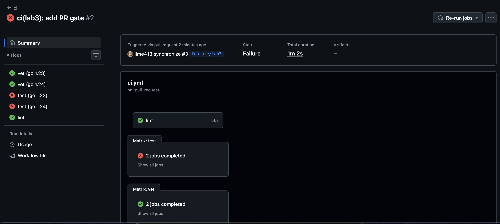

# Lab 3 Submission

## Chosen Path

GitHub Actions.

I picked GitHub Actions because the lab uses GitHub by default and the course flow is built around pull requests on GitHub.

## Task 1

### Green CI Run

Green run after the fix:

https://github.com/lime413/DevOps-Intro/actions/runs/27573596586

### Failed Run And Fix

Failed run:

https://github.com/lime413/DevOps-Intro/actions/runs/27573354392

Screenshot:

Deliberate failing commit:

`f6a5ec746b0f66fc1930813ffcc85b3c6153766a`

Fix commit:

`28aa5363378e13e7b8783e70c3d522acce6dbe4e`

### Branch Protection

TODO: add a screenshot of the branch protection rule for `main`.

### Design Answers

#### a) Why pin the runner version instead of using `ubuntu-latest`?

`ubuntu-latest` can change at any time. If GitHub moves it to a newer image, the pipeline may start failing even when the project code did not change. A pinned version makes the environment stable and easier to debug.

#### b) Why split `vet`, `test`, and `lint` into separate jobs?

Separate jobs show exactly what failed. They can also run in parallel, so the total wall-clock time is lower. If everything is inside one job, one early failure hides the rest of the results and the whole pipeline is slower.

#### c) What real attack does SHA pinning prevent?

SHA pinning protects the workflow from a supply-chain attack where a tag or release reference points to changed or malicious code. A clear example is the `tj-actions/changed-files` compromise from March 2025. With a full commit SHA, the workflow runs one exact version of the action, not whatever code the tag points to later.

#### d) What is `permissions:` and what principle is behind it?

`permissions:` defines what the GitHub token inside the workflow can do. The right principle is least privilege: give the workflow only the smallest access it needs. For this lab, `contents: read` is enough.

#### e) GitLab-only question

I used GitHub Actions, so this question does not apply.

## Task 2

### Optimizations Applied

1. Added Go cache through `actions/setup-go`.
2. Added a matrix for Go `1.23` and `1.24` on `vet` and `test`.
3. Added path filters so docs-only changes do not start the pipeline.

Note: this project has no `app/go.sum` file because it has no direct external module dependencies. For this reason, the cache key uses `app/go.mod`, which is the stable input available in this repository.

### Timing Table

| Scenario | Wall-clock |
| --- | --- |
| Baseline (no cache, single Go version, no path filter) | TODO |
| With cache | TODO |
| With cache + matrix | 72 s |

### Design Answers

#### f) Why cache `go.sum`-keyed inputs and not build outputs?

Inputs such as module versions are deterministic and safe to reuse when the dependency file does not change. Build outputs are less stable because they depend on the platform, toolchain, flags, and environment details. Caching inputs gives speed without mixing old compiled artifacts into a new run.

#### g) What does `fail-fast: false` change, and when do you want `fail-fast: true`?

`fail-fast: false` lets all matrix cells continue even if one cell fails. That is useful in this lab because we want to see whether both Go versions fail or only one. `fail-fast: true` is better when saving CI time is more important than collecting all results.

#### h) What is the risk of cache poisoning from a malicious PR?

A malicious PR may try to write bad data into a cache and then make protected branches restore it later. If that happens, trusted runs could use files prepared by untrusted code. The defense is to scope caches carefully and avoid sharing writable caches from untrusted contexts with protected branches.

## Bonus Task

I have not completed the Bonus task yet.

## What Still Needs To Be Done On GitHub

1. Enable branch protection on your fork's `main`.
2. Add the branch protection screenshot.
3. Measure the baseline and cache-only timing runs for Task 2.4.
