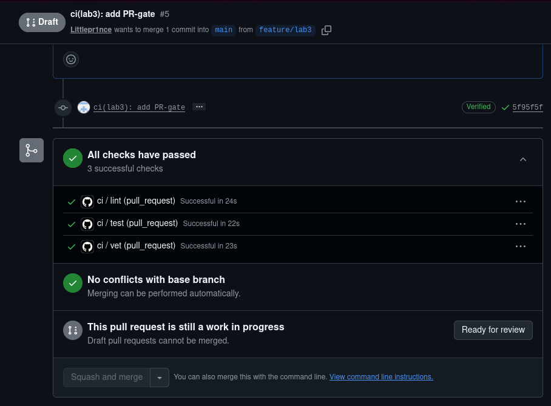
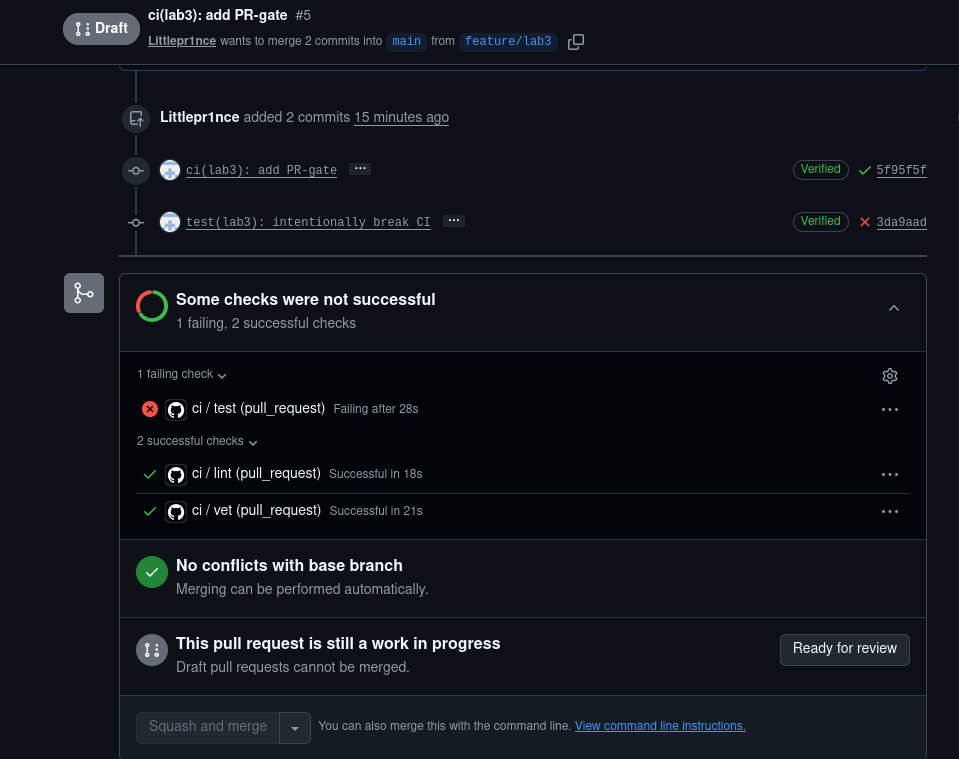
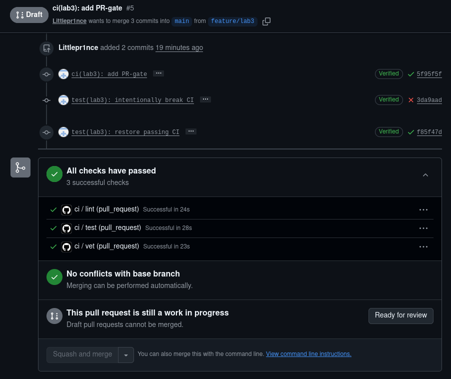
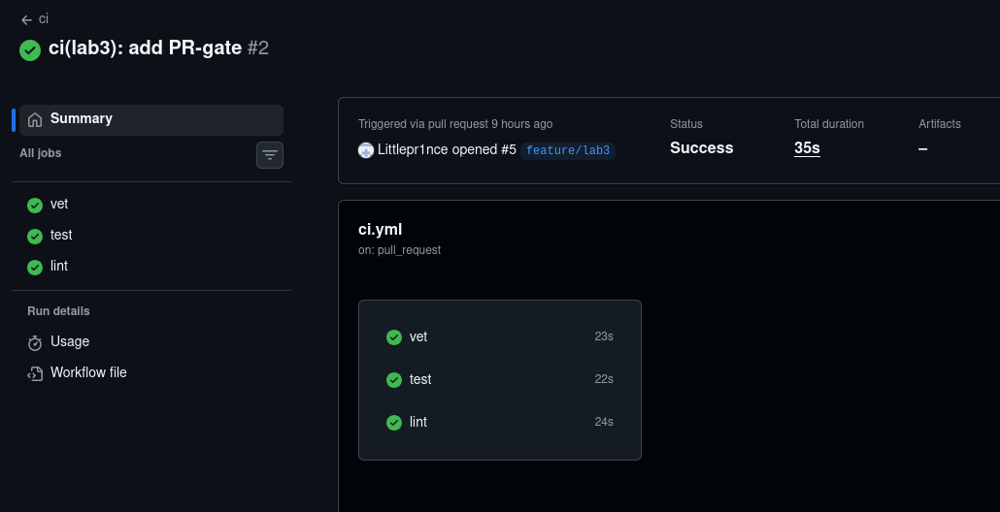
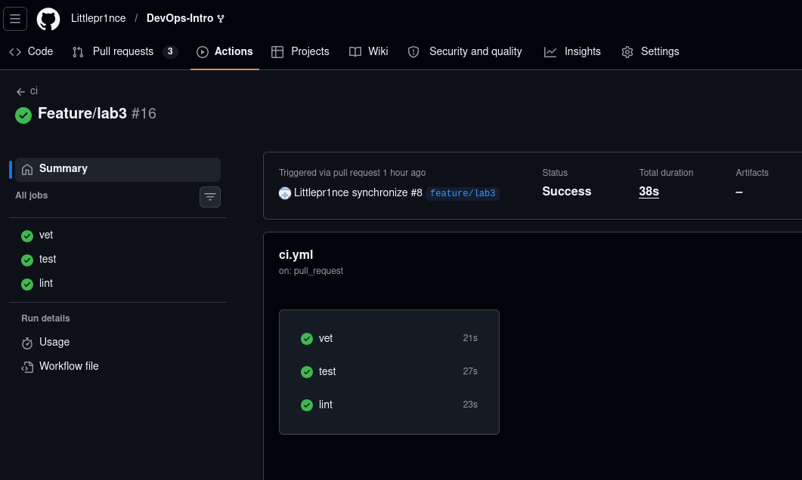
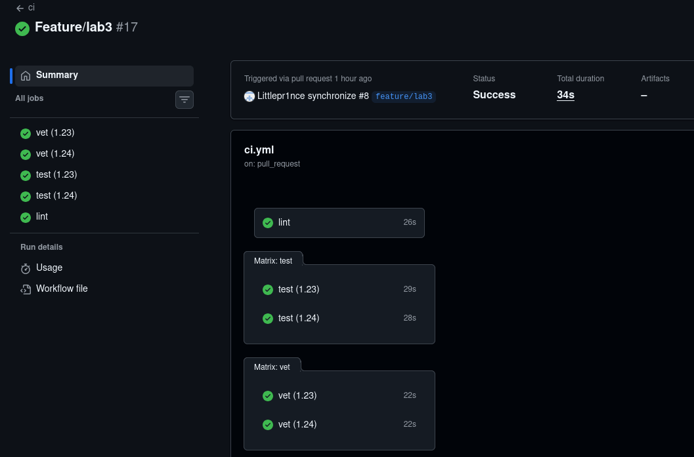
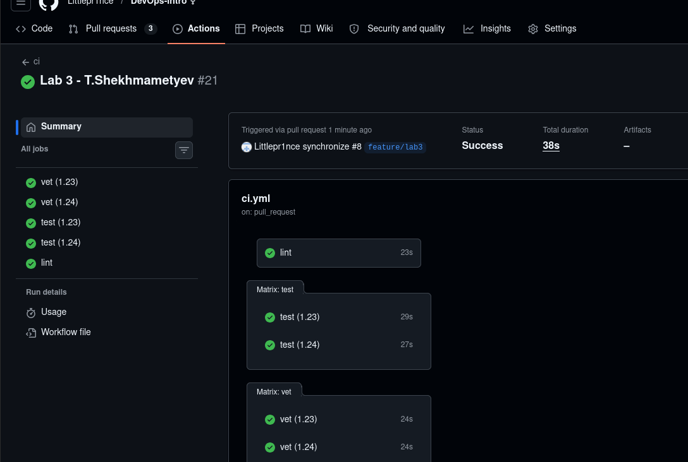
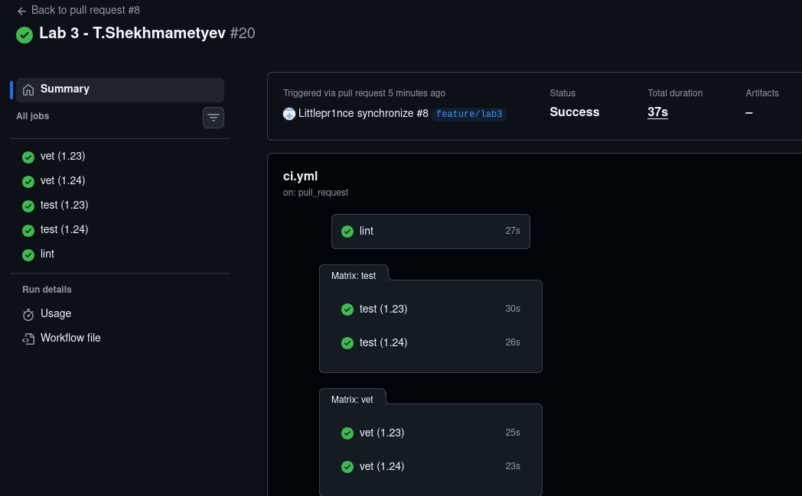
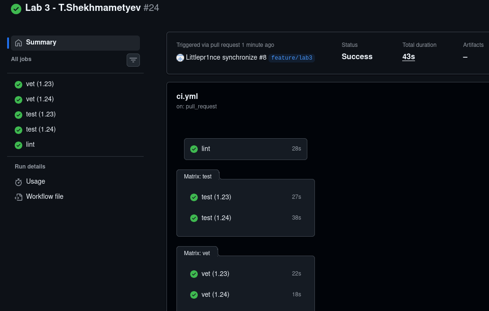

# Lab 3 submission

# Lab 3

## Platform choice

I chose GitHub Actions because the project is already hosted on GitHub and GitHub Actions 
is tightly integrated with pull requests, branch protection rules and repository management.
This makes it easy to implement CI/CD for QuickNotes without introducing an additional platform.

## Task 1.1 and 1.4 - CI implementation and iteration to green

I implemented a CI pipeline for QuickNotes using GitHub Actions.

The workflow executes three independent jobs:
* vet
* test
* lint

The workflow is configured to run on:

* pushes to main
* pull requests targeting main

I iterated on the workflow configuration until all checks passed successfully.

Link: https://github.com/Littlepr1nce/DevOps-Intro/actions/runs/27525351060

## 1.2 Design questions

### a) Why pin the runner version (ubuntu-24.04) instead of ubuntu-latest? What breaks otherwise?

`ubuntu-24.04` is pinned to guarantee reproducible builds.
`ubuntu-latest` may suddenly point to a newer operating system version,
which can introduce different package versions,
deprecations or compatibility issues and unexpectedly break the pipeline.

### b) Why split vet + test + lint into separate units? What would happen with one combined job?

`vet`, `test` and `lint` are separated to isolate responsibilities and allow parallel execution.
If they were combined into one job, a failure in one step would stop 
the entire pipeline and make troubleshooting harder.

### c) GH path: what real attack does SHA pinning prevent? Cite the date + name of the incident from Lecture 3

SHA pinning prevents supply-chain attacks caused by a compromised third-party GitHub Action.
It ensures that the workflow always executes the exact audited commit instead of a mutable tag.

Lecture 3 referenced the March 2025 tj-actions/changed-files compromise,
where attackers modified a GitHub Action and exposed CI secrets.

### d) GH path: what is permissions: and what's the principle behind it?

`permissions:` defines which GitHub API permissions are granted to the workflow token (`GITHUB_TOKEN`).
The underlying security principle is least privilege:
workflows should receive only the permissions they actually need.

### e) GitLab path: what's the difference between a stage and a job? What would dependencies: do that stages: doesn't?

In GitLab CI, a stage is a high-level execution phase (for example: build, test, deploy),
while a job is an individual task executed within a stage.
`dependencies:` allows a job to download artifacts from specific earlier jobs,
whereas `stages:` only defines the execution order between groups of jobs.

## Task 1.3 - Resources used

I used the official documentation provided in the assignment:

GitHub Actions Quickstart
GitHub Actions Workflow syntax reference
actions/setup-go documentation
golangci/golangci-lint-action documentation

The workflow was adapted to the QuickNotes project structure by using app/ as the working directory.

## Task 1.5 Prove the gate works

To prove that the PR gate works, I intentionally broke a test in `app/handlers_test.go` by changing the expected HTTP status code.

Broken commit:

`test(lab3): intentionally break CI`

Link: https://github.com/Littlepr1nce/DevOps-Intro/actions/runs/27525728100

Fix commit:

`test(lab3): restore passing CI`

Link: https://github.com/Littlepr1nce/DevOps-Intro/actions/runs/27525935469

## Task 1.6 Branch protection

I configured a branch protection rule for `main` with the following settings:

* Require a pull request before merging
* Require status checks to pass before merging
* Require branches to be up to date before merging
* Required checks:
  * vet
  * test
  * lint

## Task 2 — Make It Fast and Smart

### 2.1 - 2.2 - 2.3 Applied optimizations

I applied three CI optimizations.

First, I enabled caching through `actions/setup-go` by setting `cache: true`.
This allows GitHub Actions to reuse downloaded Go modules 
and Go build cache data between workflow runs.

Second, I added a build matrix for `vet` and `test`,
running these jobs against Go `1.23` and Go `1.24` in parallel.
This helps detect toolchain-specific issues and reduces
the risk of "works on my machine" problems.
After introducing the build matrix,
I updated the required checks in the branch protection rule to match the new check names.

The branch protection rule was updated to require the matrix-generated checks instead of the original `vet` and `test` checks.

Third, I added path filters so that the workflow only runs when files 
inside `app/**` or `.github/workflows/**` change. 
Documentation-only changes no longer trigger unnecessary CI runs.

### 2.4 Timing measurements

| Scenario                                               | Wall-clock |
| ------------------------------------------------------ | ---------- |
| Baseline (no cache, single Go version, no path filter) | 35 s       |
| With cache                                             | 38 s       |
| With cache + matrix                                    | 34 s       |

baseline screenshot:

with cache screenshot:

with cache+matrix screenshot:

The cache optimization did not significantly improve the total wall-clock time because QuickNotes has almost no external dependencies.
Most of the pipeline time is spent on runner provisioning, repository checkout and Go toolchain setup rather than downloading Go modules.
Small differences between runs are expected because GitHub-hosted runners have variable startup times and matrix jobs execute in parallel.

## 2.5 - Design questions

### f) Why cache `go.sum`-keyed inputs and not build outputs?

`go.sum`-keyed inputs are deterministic because they describe the exact dependency versions used by the project.
If `go.sum` does not change, the same dependencies can be safely restored from cache.
Build outputs are less reliable because they may depend on the operating system, architecture, Go version,
compiler flags and environment variables. 
Caching deterministic inputs is safer and more reproducible than caching generated outputs.

### g) What does `fail-fast: false` change in a matrix run, and when do you actually want `fail-fast: true`?

With `fail-fast: false`, GitHub Actions continues running all matrix jobs even if one of them fails.
This is useful for compatibility testing because it shows exactly which Go versions are affected by a problem.
`fail-fast: true` is useful when CI resources are limited and continuing after the first failure would only waste time.

### h) What's the risk of an attacker writing a cache from a malicious PR that protected branches later read?

The main risk is cache poisoning. An attacker could try to inject malicious data into a cache that is later restored by trusted branches or workflows.
This could influence future CI runs by introducing modified dependencies or build artifacts. 
GitHub mitigates this by restricting cache access between branches, 
but workflows should still use narrow cache keys and cache deterministic dependency inputs instead of executable outputs.

## Bonus Task — Pipeline Performance Investigation

### B.1 Pipeline profiling

I inspected the execution times reported by GitHub Actions.

| Unit | Total duration |
|------|----------------|
| vet (1.23) | 22 s |
| vet (1.24) | 18 s |
| test (1.23) | 27 s |
| test (1.24) | 38 s |
| lint | 28 s |

The GitHub Actions summary view did not provide an exact breakdown for runner startup,
dependency setup and cleanup separately. 
However, most of the wall-clock time is spent preparing GitHub-hosted runners and 
setting up the Go environment rather than executing the Go commands themselves.

### B.2 Additional optimizations

I applied three additional optimizations beyond Task 2:

* Added `concurrency` to automatically cancel outdated workflow runs.
* Added `GOFLAGS=-buildvcs=false` to avoid unnecessary VCS metadata processing.
* Added `timeout-minutes: 5` to prevent jobs from hanging indefinitely.

### B.3 Before/after measurements

| Configuration | Wall-clock |
|---------------|------------|
| Cache + matrix | 38 s |
| Cache + matrix + concurrency + GOFLAGS | 37 s |
| Cache + matrix + concurrency + GOFLAGS + timeout | 43 s |

The additional optimizations did not significantly reduce the total execution time. 
The measurements vary between runs because GitHub-hosted runners have non-deterministic startup times.
The pipeline still remains well below the target of 90 seconds.

### B.4 Bottleneck analysis

The dominant cost is GitHub runner provisioning rather than the Go commands themselves. 
QuickNotes is a small project with almost no external dependencies, so the actual `vet`, `test` and `lint` commands complete quickly.
To reduce the execution time further, the application itself would need to contain fewer tests or additional simplifications,
but such changes would provide little practical benefit.
Most of the remaining overhead comes from GitHub-hosted runner initialization, which is outside the repository's control.
I would stop optimizing at around 30–40 seconds because the current pipeline is already sufficiently fast and 
additional optimizations would add unnecessary complexity without meaningful gains.

