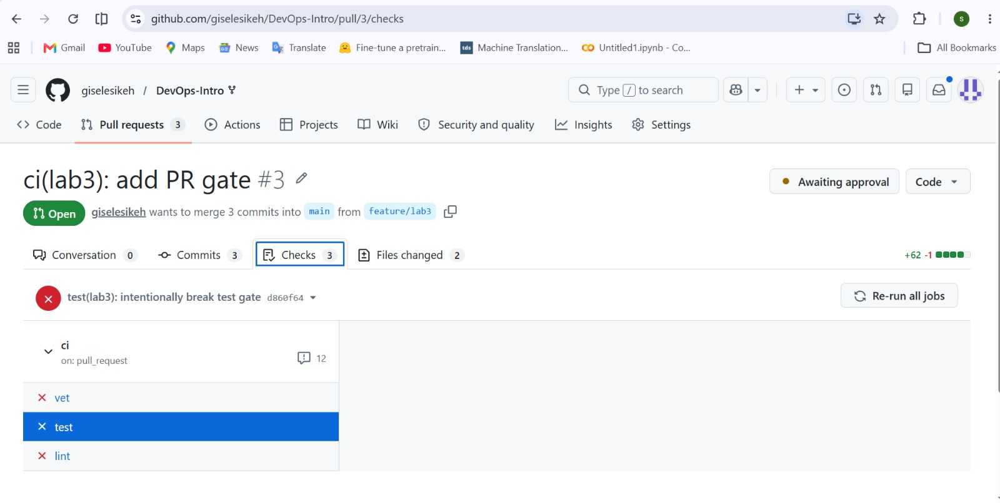
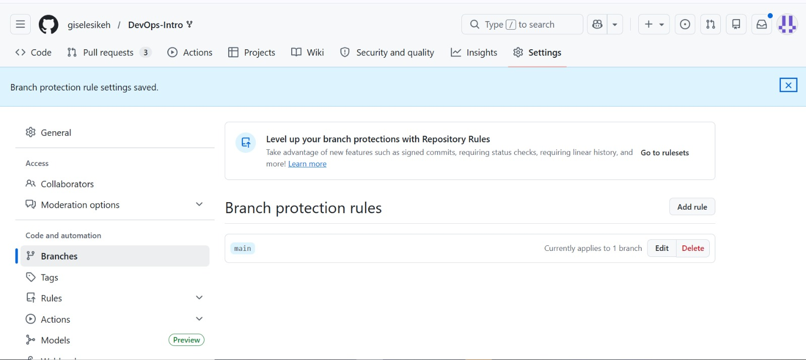
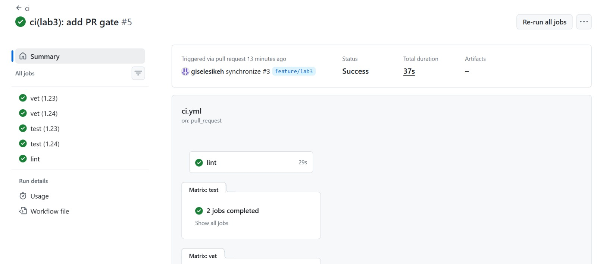
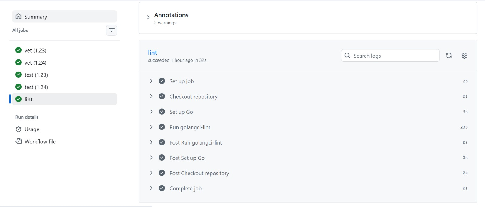

# Lab 3 — CI/CD: A PR-Gated Pipeline for QuickNotes

## Chosen path

I chose the GitHub Actions path because I can access GitHub and my lab repository is hosted on GitHub. The CI configuration is written in `.github/workflows/ci.yml`.

Course PR: https://github.com/inno-devops-labs/DevOps-Intro/pull/1003  
Fork PR: https://github.com/giselesikeh/DevOps-Intro/pull/3

---

## Task 1 — PR gate

### CI jobs implemented

The workflow runs three independent jobs against the `app/` directory:

- `vet`: runs `go vet ./...`
- `test`: runs `go test -race -count=1 ./...`
- `lint`: runs `golangci-lint run` using pinned `golangci-lint` version `v2.5.0`

The runtime is pinned to `ubuntu-24.04`, not `ubuntu-latest`.

The workflow declares least-privilege permissions:

```yaml
permissions:
  contents: read
```

All GitHub Actions used in the workflow are pinned by full commit SHA.

### Green CI run

Green CI run: https://github.com/giselesikeh/DevOps-Intro/actions/runs/27276906098


### Failed gate proof

To prove the PR gate works, I intentionally broke a test in `app/handlers_test.go` and pushed the commit:

`test(lab3): intentionally break test gate`

The CI became red, so the PR was not green and could not be safely merged.

Failed commit: `d860f64`  
Failed run evidence: screenshot captured from the GitHub Checks tab showing failed `vet`, `test`, and `lint`.



Then I reverted the broken commit with:

`Revert "test(lab3): intentionally break test gate"`

After the revert, the CI became green again.

### Branch protection

Branch protection was enabled on my fork for the `main` branch.

The rule requires:

- status checks to pass before merging
- branches to be up to date before merging
- required checks: `vet`, `test`, and `lint`

Branch protection evidence: screenshot captured from GitHub Settings → Branches showing the `main` rule saved.



---

## Task 1 design questions

### a) Why pin the runner version (`ubuntu-24.04`) instead of `ubuntu-latest`? What breaks otherwise?

I pinned the runner to `ubuntu-24.04` because `ubuntu-latest` can change when GitHub updates the default image. If the underlying OS image changes, installed tools, system libraries, package versions, or default behavior can change without any change in my repository. That can make CI unstable and cause a workflow that passed before to fail later for reasons unrelated to my code.

### b) Why split vet, test, and lint into separate units? What would happen with one combined job?

Splitting `vet`, `test`, and `lint` into separate jobs gives faster feedback because the jobs can run in parallel. It also makes failures easier to diagnose because the failed job immediately tells me whether the problem is static analysis, tests, or linting. With one combined job, the workflow would be more serial, slower, and one early failure could hide later problems.

### c) What real attack does SHA pinning prevent? Cite the date and name of the incident from Lecture 3.

SHA pinning prevents a supply-chain attack where a third-party action tag is moved to malicious code. A tag like `v4` can be changed by someone with access to the action repository, but a full commit SHA points to a specific immutable commit. Lecture 3 mentioned the March 2025 `tj-actions/changed-files` incident, where attackers rewrote tags to a malicious version and leaked secrets from many CI runs.

### d) What is `permissions:` and what principle is behind it?

`permissions:` controls the default GitHub token permissions available to the workflow. I set `contents: read` because the workflow only needs to read the repository code to run checks. The principle behind this is least privilege: give the workflow only the access it needs and nothing more.

### e) GitLab path: what is the difference between a stage and a job? What would `dependencies:` do that `stages:` does not?

In GitLab CI, a stage is a serial group in the pipeline, while a job is an individual unit of work inside a stage. Jobs in the same stage can run in parallel, but the next stage starts only after the previous stage finishes. `dependencies:` controls which artifacts a job downloads from earlier jobs; it does not define the pipeline order the way `stages:` does.

---

## Task 2 — Make it fast and smart

### Optimizations applied

1. **Caching**  
   I enabled Go caching through `actions/setup-go` using `cache: true` and `cache-dependency-path: app/go.sum`. This caches Go module and build cache inputs keyed by the module dependency file.

2. **Build matrix**  
   I added a matrix for `vet` and `test` so both run against Go `1.23` and Go `1.24`. I also set `fail-fast: false` so that one failed matrix cell does not cancel the others.

3. **Path filter**  
   I added path filters so CI runs only when files in `app/**` or `.github/workflows/ci.yml` change. A docs-only `README.md` change did not trigger a new CI run, which proves the path filter works.

### Timing table

| Scenario | Wall-clock |
|---|---:|
| Baseline: no cache, single Go version, no path filter | 29 s |
| With cache | 42 s |
| With cache + matrix | 36 s |

The cache-only run was slower in this small project because runner startup and lint setup dominate the total time. The matrix version still stayed fast because matrix jobs ran in parallel.

### Matrix and timing evidence

The final optimized workflow ran `vet` and `test` against Go `1.23` and `1.24`, while `lint` ran once. The full optimized pipeline completed in 36 seconds.



### Task 2 design questions

### f) Why cache `go.sum`-keyed inputs and not build outputs?

Caching `go.sum`-keyed inputs is safe because `go.sum` represents deterministic dependency inputs. If the dependencies do not change, the cache can be reused safely. Build outputs should not be treated as source of truth because they may depend on environment details, compiler behavior, or previous build state. Outputs should be reproducible from clean inputs.

### g) What does `fail-fast: false` change in a matrix run, and when do you actually want `fail-fast: true`?

`fail-fast: false` means all matrix jobs continue running even if one version fails. This is useful because I can see whether the failure happens only on Go `1.23`, only on Go `1.24`, or both. `fail-fast: true` is useful when CI minutes are expensive and the first failure is enough to stop the whole validation run.

### h) What is the risk of an attacker writing a cache from a malicious PR that protected branches later read?

The risk is cache poisoning. A malicious PR could try to write harmful or incorrect cached content that a protected branch later restores and trusts. That could affect builds, tests, or tools in later trusted runs. GitHub mitigates this by restricting cache access and cache writes across branches and trust boundaries, but CI should still cache inputs carefully and avoid trusting build outputs from untrusted code.

---

## Bonus Task — Pipeline performance investigation

### B.1 Profile

I profiled the CI run using the GitHub Actions per-step timing breakdown.

| Unit | Runner/startup | Checkout | Dependency setup | Actual work | Cleanup/post steps | Total |
|---|---:|---:|---:|---:|---:|---:|
| vet (1.23) | 1 s | 1 s | 1 s | 16 s | 1 s | 23 s |
| vet (1.24) | 1 s | 1 s | 1 s | 17 s | 0 s | 21 s |
| test (1.23) | 2 s | 1 s | 2 s | 22 s | 0 s | 30 s |
| test (1.24) | 1 s | 1 s | 0 s | 22 s | 0 s | 25 s |
| lint | 2 s | 0 s | 3 s | 23 s | 0 s | 32 s |

The full workflow remains below the 90-second target because the jobs run in parallel.



### B.2 Extra optimizations beyond Task 2

I applied three additional optimizations beyond Task 2:

1. **Concurrency cancellation**  
   I added a `concurrency` group with `cancel-in-progress: true`, so outdated CI runs for the same PR are cancelled when a newer commit is pushed.

2. **Disable Go VCS stamping**  
   I added `GOFLAGS=-buildvcs=false` to avoid extra VCS metadata work during Go commands in CI.

3. **Job timeouts**  
   I added `timeout-minutes: 5` to the jobs so stuck jobs fail quickly instead of wasting CI minutes.

### B.3 Before/after table

| Optimization applied | Before (s) | After (s) | Saving |
|---|---:|---:|---:|
| Concurrency cancellation | 36 | 36 | 0 |
| `GOFLAGS=-buildvcs=false` | 36 | 36 | 0 |
| Job timeouts | 36 | 36 | 0 |
| **Total wall-clock** | **36** | **36** | **0** |

These optimizations mainly improve reliability and CI resource usage. They do not significantly reduce the measured wall-clock time for this small project because the dominant cost is still the actual vet, test, and lint work.

### B.4 Bottleneck analysis

The remaining dominant step is the actual lint/test work, especially `golangci-lint` and `go test -race`, not checkout or Go setup. QuickNotes is small, so runner scheduling and fixed setup overhead are a large part of the total runtime. To make it shorter from the code side, the project would need fewer expensive checks, smaller test setup, or less work inside race-enabled tests. I would stop optimizing once the full PR gate consistently stays below about one minute, because below that point further improvements would save little time compared with the effort and complexity added to the pipeline.