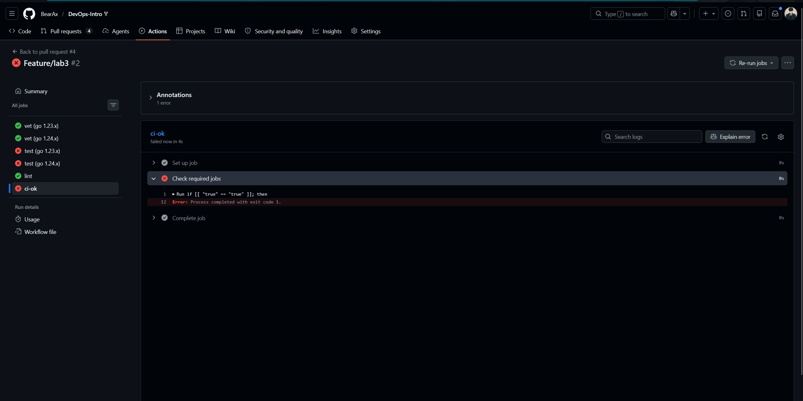
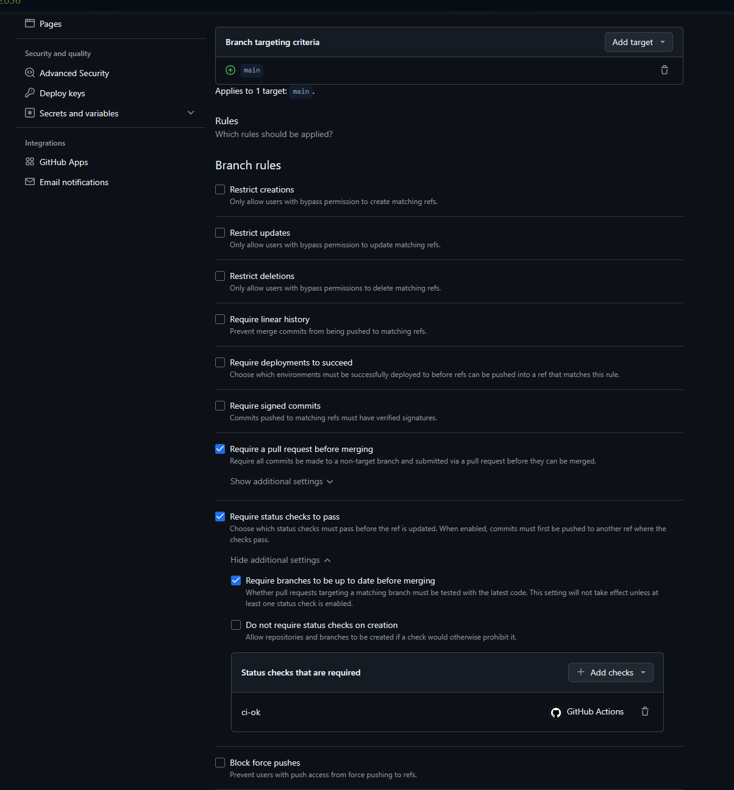
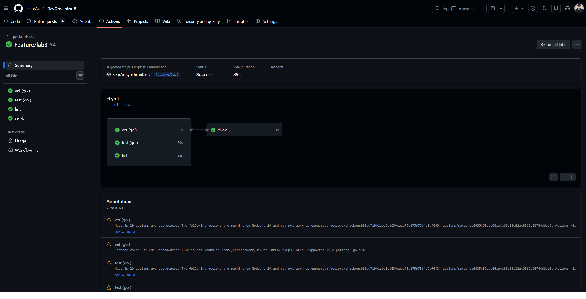
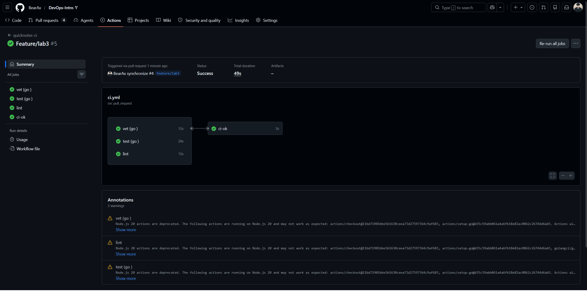
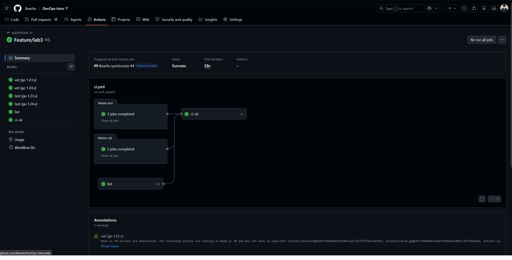
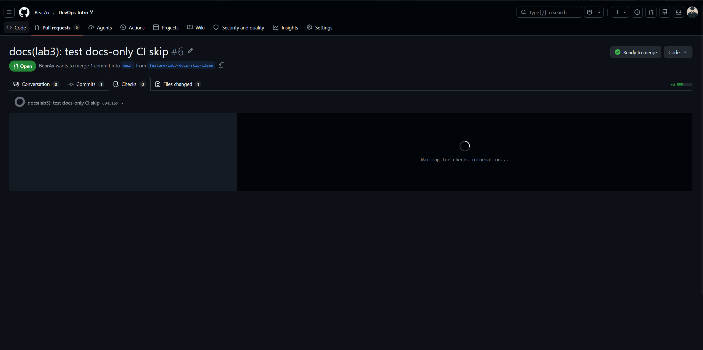

# Lab 3 Submission

Chosen path: GitHub Actions.

I chose GitHub Actions because the course repository and my fork are already on GitHub, so the PR gate can run in the same place where the review and branch protection rules live.

## Task 1 - PR Gate

### CI Configuration

Workflow file: `.github/workflows/ci.yml`

The workflow runs three independent units of work:

* `vet (go 1.23.x)` and `vet (go 1.24.x)` run `go vet ./...` in `app/`.

* `test (go 1.23.x)` and `test (go 1.24.x)` run `go test -race -count=1 ./...` in `app/`.

* `lint` runs `golangci-lint run` in `app/` with `golangci-lint` pinned to `v2.5.0`.

* `ci-ok` aggregates the required jobs so branch protection can require one stable check name even though the matrix expands `vet` and `test`.

The workflow uses:

* Pinned runner: `ubuntu-24.04`.

* Least-privilege token permissions: `contents: read`.

* Full-SHA action pins with readable version comments.

* `actions/setup-go` dependency caching.

* Path filters for `app/**` and `.github/workflows/ci.yml`.

### Evidence To Add After PR Runs

Green CI run:

```text
https://github.com/BearAx/DevOps-Intro/actions/runs/27604560723/job/81613358274?pr=4
```

Deliberate failing run from Task 1.5:

```text
Failed run: https://github.com/BearAx/DevOps-Intro/pull/4/checks?sha=4d40acc2249c4e61722a40516b4a8d505fe59174
fix commit SHA: 1cbfae257978ad42747b91057984d501ad6b6086
```



Branch protection evidence:




### Design Questions

#### a) Why pin `ubuntu-24.04` instead of `ubuntu-latest`?

`ubuntu-latest` is a moving pointer. GitHub can retarget it to a newer image, which may change preinstalled tools, shell behavior, OpenSSL versions, package versions, or default compiler behavior without a commit in this repo. Pinning `ubuntu-24.04` makes the CI environment predictable and keeps failures tied to our changes instead of a surprise runner image migration.

#### b) Why split vet, test, and lint into separate units?

Separate jobs make failures easier to diagnose because a vet failure, test failure, and lint failure appear as different checks. They also run in parallel, so the wall-clock time is the slowest job instead of the sum of all three commands. A single combined job is simpler but slower and less precise: the first failing command hides later failures until another run.

#### c) What real attack does SHA pinning prevent?

SHA pinning prevents tag-retargeting attacks against reusable actions. Lecture 3 cites the March 2025 `tj-actions/changed-files` compromise, where attackers rewrote action tags to a malicious version and leaked secrets from public CI runs. If a workflow pins a full commit SHA, moving `v1`, `v4`, or another tag cannot silently change what code runs in CI.

#### d) What is `permissions:` and what principle is behind it?

`permissions:` controls the default `GITHUB_TOKEN` privileges granted to the workflow. Setting `contents: read` follows least privilege: the workflow can read repository content, but it cannot write code, create releases, modify pull requests, or perform unrelated privileged actions unless explicitly granted.

#### e) GitLab path: stages, jobs, and dependencies

Not applicable to my chosen GitHub Actions path. In GitLab CI, a job is one unit of work, while a stage groups jobs and controls broad execution order. `dependencies:` is more specific than `stages:` because it controls which previous-job artifacts a job downloads; stage order alone only says when jobs may run.

## Task 2 - Make It Fast and Smart

### Optimizations Applied

Caching:

`actions/setup-go` has `cache: true` and uses `app/go.sum` plus `app/go.mod` as dependency inputs. QuickNotes currently has no external module dependencies, so `app/go.sum` may not exist; including `app/go.mod` still gives the cache a stable module-input key.

Matrix:

The `vet` and `test` jobs run against `1.23.x` and `1.24.x` with `fail-fast: false`, so both Go versions report their result even if one fails.
The `ci-ok` job uses `if: always()` and fails if any required job fails or is cancelled, which avoids branch-protection churn when matrix check names change.

Path filters:

The workflow runs only when `app/**` or `.github/workflows/ci.yml` changes. A docs-only PR that touches only root documentation should not spend CI minutes on QuickNotes checks.

Additional small optimization:

The workflow sets `GOFLAGS=-buildvcs=false`, which avoids VCS stamping work in CI clones where full Git metadata is not needed for these checks.

### Timing Table

```text
| Scenario                                             | Wall-clock |
|------------------------------------------------------|-----------:|
| Baseline: no cache, single Go version, no path filter | 39s       |
| With cache                                            | 49s       |
| With cache + matrix                                   | 38s       |
```




The cache did not significantly reduce total wall-clock time because QuickNotes has no third-party dependencies. Most time was spent on runner provisioning, checkout, setup-go, and linter setup rather than module download.

Docs-only skip evidence:

```text
URL of PR: https://github.com/BearAx/DevOps-Intro/pull/6
```


### Design Questions

#### f) Why cache `go.sum`-keyed inputs and not build outputs?

The dependency inputs are deterministic: `go.mod` and `go.sum` describe exactly which module versions should be downloaded. Caching those inputs lets CI reuse downloaded modules and build cache entries while still rebuilding the project from source. Treating final build outputs as reusable artifacts is riskier because outputs can depend on OS image details, compiler flags, environment variables, architecture, or poisoned state from a previous run.

#### g) What does `fail-fast: false` change in a matrix run?

With `fail-fast: false`, GitHub lets every matrix cell finish even after one cell fails. That is useful here because we want to know whether the failure is specific to Go `1.23.x`, Go `1.24.x`, or both. I would use `fail-fast: true` for expensive deploy or integration matrices where one failure proves the candidate is bad and saving runner minutes matters more than collecting all combinations.

#### h) What is the cache poisoning risk from malicious PRs?

If an untrusted PR could write a cache that protected branches later restore, the attacker could plant malicious tools, compiled objects, or dependency state and wait for trusted CI to execute or reuse it. GitHub mitigates this by scoping cache access by branch and event so pull requests can generally read caches from the base branch but cannot overwrite caches used by protected default-branch runs. The safe design is still to key caches from trusted dependency files and avoid executing arbitrary cached binaries as authority.

## Bonus Task - Pipeline Performance Investigation

Not attempted.
