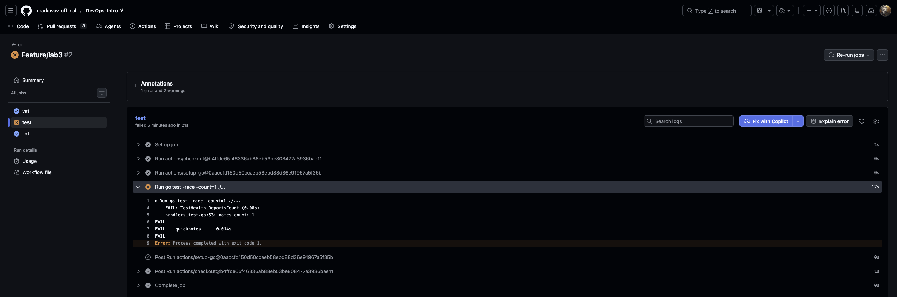
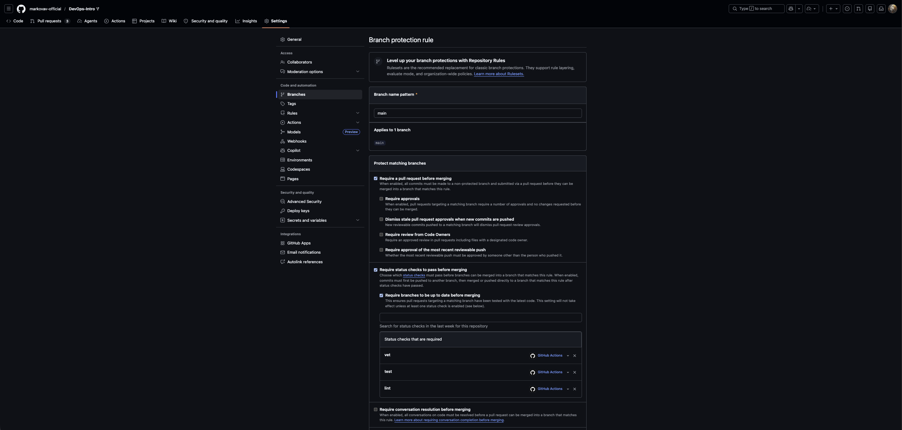
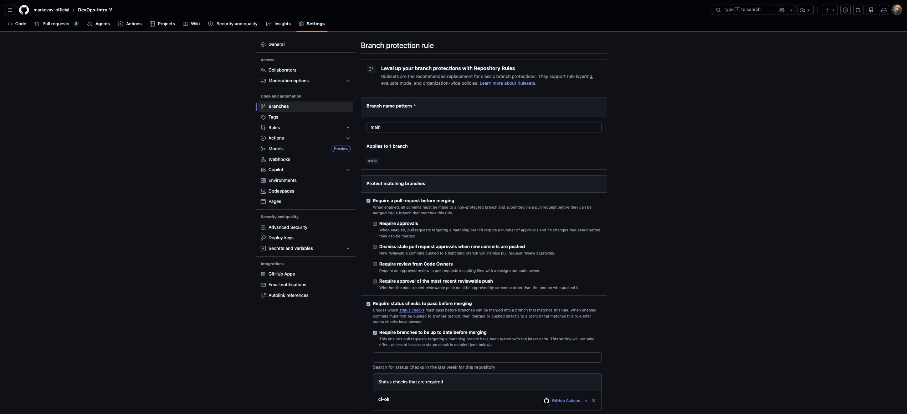

# Lab 3 submission

**Path:** GitHub Actions — already using GitHub for Lab 1–2 (signed commits, branch protection, PR template).

---

## Task 1 — PR Gate (vet + test + lint)

### CI config

Workflow: `.github/workflows/ci.yml`

- **Triggers:** `push` / `pull_request` → `main`
- **Jobs:** `vet`, `test`, `lint` (golangci-lint v2.5.0) — Task 1 baseline; Task 2 adds cache, matrix, path filter, `ci-ok`
- **Runner:** `ubuntu-24.04` (pinned)
- **Actions:** SHA-pinned (`checkout`, `setup-go`, `golangci-lint-action`)
- **Permissions:** `contents: read`

### Green CI run

`https://github.com/markovav-official/DevOps-Intro/actions/runs/27528351703`

### Deliberate failure + fix (Task 1.5)

**Break commit** — expected notes count changed `1` → `999` in `TestHealth_ReportsCount` (`app/handlers_test.go:52`).

Local `go test -race -count=1 ./...` (same command as CI `test` job):

```text
--- FAIL: TestHealth_ReportsCount (0.00s)
    handlers_test.go:53: notes count: 1
FAIL
FAIL	quicknotes	0.666s
FAIL
```

**CI:** `test` job fails; `vet` and `lint` still pass. PR merge blocked because branch protection requires all three checks.

**Failed run:** `https://github.com/markovav-official/DevOps-Intro/actions/runs/27528969661`



**Fix commit** — reverted `999` → `1` in `TestHealth_ReportsCount`; local tests pass:

```text
$ go test -race -count=1 ./...
ok  	quicknotes	1.495s
```

**Green run (after fix):** `https://github.com/markovav-official/DevOps-Intro/actions/runs/27529130257`

### Branch protection

Required status checks: **`vet`**, **`test`**, **`lint`** (after Task 2 matrix → switch to `ci-ok` or matrixed names).



Settings → Branches → `main`:
- Require status checks to pass before merging
- Require branches to be up to date before merging
- Required checks: `vet`, `test`, `lint`

---

### Design questions (Task 1.2)

**a) Why pin `ubuntu-24.04` instead of `ubuntu-latest`?**

`ubuntu-latest` is a moving label — GitHub retargets it when a new LTS lands. A workflow that passed yesterday can fail tomorrow because the runner image gained or dropped system packages, different default tool versions, or stricter sandbox behaviour. Pinning `ubuntu-24.04` makes CI reproducible: the same YAML sees the same OS baseline until you consciously bump the pin ([Lecture 3](https://github.com/inno-devops-labs/DevOps-Intro/blob/main/lectures/lec3.md), Slide 8).

**b) Why split vet + test + lint into separate jobs?**

Each job runs on its own runner in parallel, so wall-clock is dominated by the slowest unit, not the sum of all three. Separate jobs also give a clear signal in the PR checks UI — reviewers see exactly which gate failed without reading a combined log. One combined job would serialize or interleave steps on one VM, blur failure attribution, and prevent running vet/test on a Go matrix while lint stays single-version.

**c) What attack does SHA pinning prevent? (GH path)**

In **March 2025**, the `tj-actions/changed-files` action was compromised; an attacker rewrote tags to malicious versions, exfiltrating secrets from thousands of CI runs ([Lecture 3](https://github.com/inno-devops-labs/DevOps-Intro/blob/main/lectures/lec3.md), Slide 16). Pinning `uses:` to a full 40-char commit SHA means the workflow always fetches that exact code — moving a tag cannot silently swap your checkout step to malware.

**d) What is `permissions:` and what's the principle behind it?**

`permissions:` sets the maximum GitHub token scope the workflow (or job) receives. Starting with `contents: read` follows **least privilege**: the job can clone the repo but cannot push, open issues, or write packages unless a step explicitly needs more. If a compromised action tries to exfiltrate via the default `GITHUB_TOKEN`, a narrow scope limits blast radius.

**e) GitLab path — stages vs jobs, and `dependencies:`**

*(GitHub path chosen.)* On GitLab, **stages** run sequentially (`test` → `scan` → `deploy`); **jobs** within one stage run in parallel. `dependencies:` controls which prior jobs' artifacts a job downloads — finer than `stages:` alone, which only orders stages but does not pick artifact subsets.

---

## Task 2 — Cache, Matrix, Path Filter

### Optimizations applied

| Optimization | What it does |
|--------------|--------------|
| **Go module cache** | `actions/setup-go` with `cache: true`, `cache-dependency-path: app/go.mod` |
| **Build matrix** | `vet` + `test` on Go **1.23** and **1.24**, `fail-fast: false` |
| **Path filter** | CI runs only when `app/**` or `.github/workflows/**` change |
| **`ci-ok` gate** | Single aggregation job with `if: always()`; branch protection requires **only** `ci-ok` |

### Green CI run

`https://github.com/markovav-official/DevOps-Intro/actions/runs/27529469084`

### Branch protection update

> **Branch protection update:** after this commit, replace required checks `vet`/`test`/`lint` with **`ci-ok`** only — matrix reports `vet (1.23)`, `test (1.24)`, etc., and the old names hang at *Expected* forever ([Lab 3 §2.2](labs/lab3.md)).



### Timing table (Task 2.4)

> QuickNotes has **zero third-party dependencies** (`app/go.mod` has no `require` block, no `go.sum`). Cache rows are expected to be nearly flat — the finding is *why*, not a misconfiguration ([Lab 3 §2.4](labs/lab3.md)).

| Scenario | Wall-clock | Notes |
|----------|-----------:|-------|
| Baseline Task 1 (no cache, single Go, no path filter) | 43 s | [run 27529130257](https://github.com/markovav-official/DevOps-Intro/actions/runs/27529130257) — slowest job `test` (36 s) |
| With cache (single Go 1.24, no matrix) | 31 s | [run 27530508715](https://github.com/markovav-official/DevOps-Intro/actions/runs/27530508715) — jobs: `lint` 22 s, `vet` 18 s, `test` 10 s (parallel wall ~28 s) |
| With cache + matrix | 38 s | [run 27529469084](https://github.com/markovav-official/DevOps-Intro/actions/runs/27529469084) — 4 matrix cells + `lint` in parallel |

**Finding:** module cache is empty (zero deps), but total time still dropped **43 s → 31 s** on the cache probe — mostly runner variance and warm **Go build cache** (`GOCACHE`), not downloaded modules. `go test -race` in the probe run took **4 s** vs **29 s** baseline; matrix run **21 s**. Cache alone does not guarantee stable speed without real `go.sum` inputs.

**Per-step breakdown** — `test` job, cache probe [run 27530508715](https://github.com/markovav-official/DevOps-Intro/actions/runs/27530508715):

| Step | Duration | Cacheable? |
|------|----------|------------|
| Set up job | 1 s | No |
| `actions/checkout` | 0 s | No |
| `actions/setup-go` | 2 s | Toolchain; no modules to restore |
| `go test -race` | 4 s | Build cache may hit on repeat runs |
| `golangci-lint` (`lint` job, total) | 22 s | Actual work — slowest job this run |

Matrix run `test (1.23)` [run 27529469084](https://github.com/markovav-official/DevOps-Intro/actions/runs/27529469084) for comparison: `setup-go` **2 s**, `go test -race` **21 s**.

### Design questions (Task 2)

**f) Why cache `go.sum`-keyed inputs and not build outputs?**

Module download results are deterministic for a given `go.sum` — the same inputs always produce the same cached tarball. Build outputs can vary with compiler flags, Go version, or VCS metadata; caching them risks stale binaries. QuickNotes has no `go.sum`, so module cache is empty; our probe still ran **31 s** vs baseline **43 s** because `GOCACHE` warmed on repeat runs (`go test -race` **4 s** vs **29 s**), not because dependencies were restored.

**g) What does `fail-fast: false` change in a matrix, and when use `fail-fast: true`?**

With `fail-fast: false`, all matrix cells run even if one fails — you see whether the bug is Go 1.23-specific, 1.24-specific, or both. With `fail-fast: true` (GH default), the first failing cell cancels siblings, hiding which combination broke. Use `fail-fast: true` when cells are expensive and redundant (e.g. smoke test on 10 identical shards) or when early exit saves meaningful minutes.

**h) Cache poisoning risk and GitHub mitigations**

A malicious PR could try to populate the cache with bad data that a later protected-branch build restores. GitHub restricts cache **write** access: caches from fork PRs are not available to the base branch's default workflow, and cache keys are scoped. See [Dependency caching — Restrictions for accessing the cache](https://docs.github.com/en/actions/using-workflows/caching-dependencies-to-speed-up-workflows#restrictions-for-accessing-a-cache).
