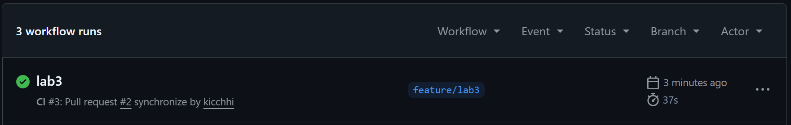
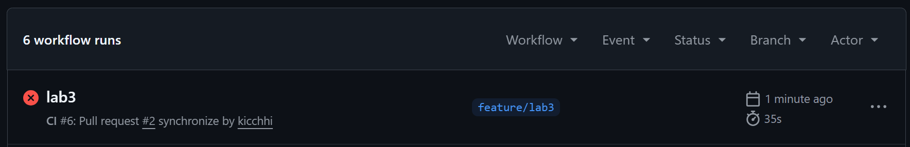
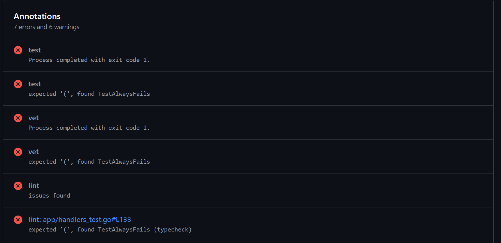
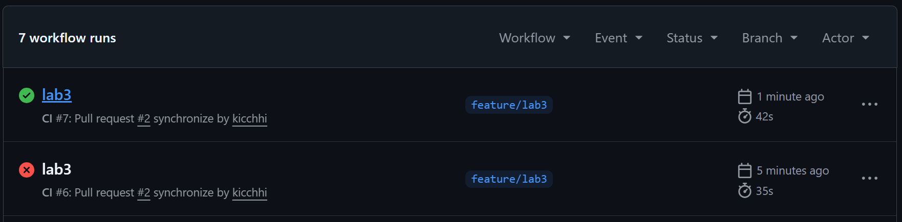

# Lab 3 — CI/CD Submission

Frolova AI,    M25-RO-01

**Path:** GitHub Actions. Выбран по той причине, что я постоянно пользуюсь GitHub для демонстрации и хранения проектов.

## Task 1 — PR Gate

### Скриншоты

Первый успешный CI:

Сломанный тест:

Восстановленный тест:

Ссылка: https://github.com/kicchhi/DevOps-Intro/actions/runs/27698833264

### Branch protection

Правила защиты были установлены.

### Design questions

**a) Why pin runner version instead of ubuntu-latest?**  
Пследняя версия изменится, указывать на конкретную версию надежнее.

**b) Why split vet + test + lint into separate units?**  
Параллельный запуск, быстрая обратная связь. Если олин упадет, остальные будут работать.

**c) What real attack does SHA pinning prevent?**  
Инцидент tj-actions/changed-files, март 2025

**d) What is `permissions:` and what's the principle behind it?**  
Принцип наименьших привилегий. Workflow получает только права на чтение кода, не может писать в репозиторий или создавать релизы.

## Task 2 — Cache + Matrix + Path Filter

### Optimizations applied
- [ ] Кэш (`cache: true` в `actions/setup-go`)
- [ ] Матрица (Go 1.23 + 1.24)
- [ ] Path filter (`paths: app/**`)

### Timing table
| Scenario | Time |
|----------|------|
| Baseline (no cache, single Go) | ... |
| With cache | ... |
| With cache + matrix | ... |

### Design questions
**f) Why cache `go.sum`-keyed inputs and not build outputs?**  
(твой ответ)

**g) What does `fail-fast: false` change in a matrix run?**  
(твой ответ)

**h) What's the risk of an attacker writing a cache from a malicious PR?**  
(твой ответ)

## Bonus — Performance Investigation (если делал)

### Optimizations applied (≥3)
1. ...
2. ...
3. ...

### Before/after table
| Optimization | Before (s) | After (s) |
|--------------|-----------:|----------:|
| ... | ... | ... |

### Bottleneck analysis
(4-6 предложений)