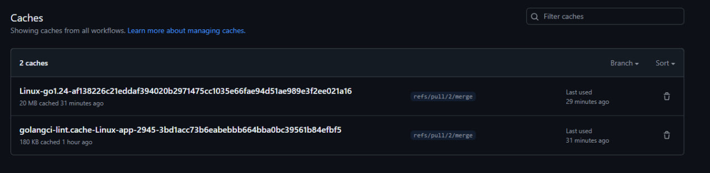
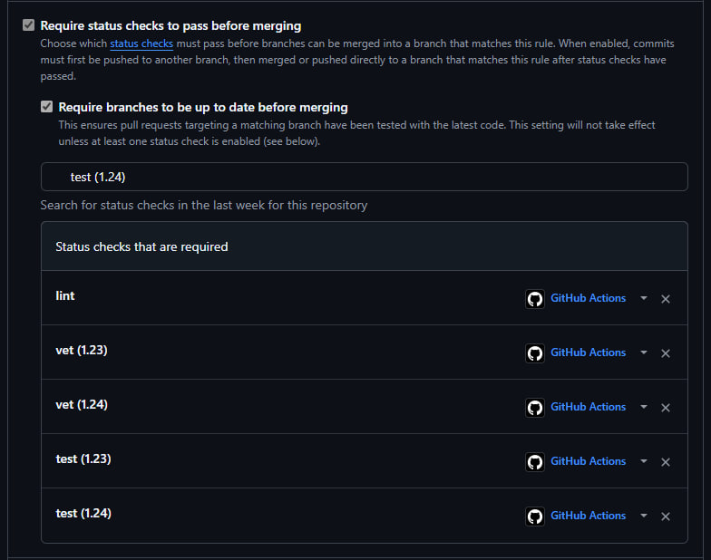
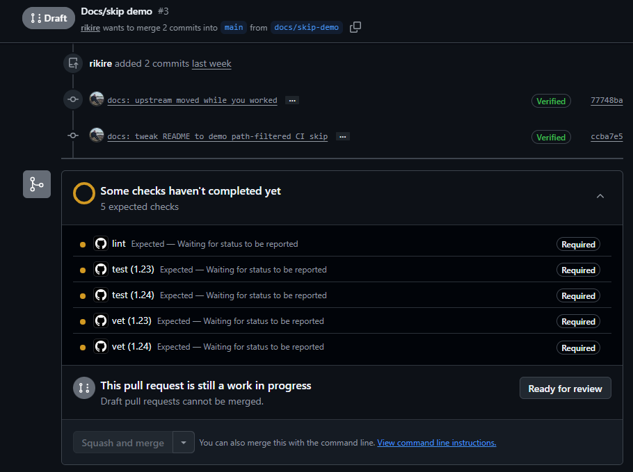

# Lab 3 — CI/CD: A PR-Gated Pipeline for QuickNotes

**Chosen path: GitHub Actions.**
Reason: my fork lives on github.com (`rikire/DevOps-Intro`), I can sign in
normally, and GitHub-hosted runners cover this lab on the free tier. No need
for the GitLab fallback, which exists for people locked out of GitHub.

CI config: [`.github/workflows/ci.yml`](../.github/workflows/ci.yml)

---

## Task 1 — The PR Gate

### What the pipeline does

Three independent jobs run on every push to `main` and every PR targeting
`main`:

| Job    | Command                        | Working dir |
| ------ | ------------------------------ | ----------- |
| `vet`  | `go vet ./...`                 | `app/`      |
| `test` | `go test -race -count=1 ./...` | `app/`      |
| `lint` | `golangci-lint run` (v2.5.0)   | `app/`      |

Hardening applied:

- Runner pinned to `ubuntu-24.04` (not `ubuntu-latest`).
- Go pinned to `1.24`.
- Every third-party action pinned by full 40-char commit SHA with the tag in a
  trailing comment:
  - `actions/checkout@11bd71901bbe5b1630ceea73d27597364c9af683  # v4.2.2`
  - `actions/setup-go@3041bf56c941b39c61721a86cd11f3bb1338122a  # v5.2.0`
  - `golangci/golangci-lint-action@4afd733a84b1f43292c63897423277bb7f4313a9  # v8.0.0`
- `permissions: contents: read` declared at the workflow level (least privilege).
- `golangci-lint` pinned to `v2.5.0`; the repo config `app/.golangci.yml` is in
  the v2 format, which is why the action is v8 (v8 is the first line that runs
  golangci-lint v2).

### Evidence

`https://github.com/rikire/DevOps-Intro/pull/2`

I changed the expected title in `TestCreateNote_RoundTrip` from `"first"` to
`"second"` so the round-trip assertion fails.

- Break commit: `52fa89e` — *test(lab3): deliberately break round-trip assertion*
- Result: `test` job went **red**; `vet` and `lint` stayed **green** (proof the
  jobs are independent). Merge was **blocked** by branch protection.
- Fix commit: `0b0a349` — *test(lab3): restore round-trip assertion*
- Result: all three checks green again.

Screenshots:

-  <!-- S1: PR with red `test`, green vet+lint -->
-  <!-- S2: expanded log showing FAIL handlers_test.go -->
-  <!-- S5: "Required statuses must pass" blocking merge -->
-  <!-- S3: all checks green after revert -->

**Branch protection (step 1.6):**

`main` on my fork requires a PR, requires the `vet`/`test`/`lint` status checks
to pass, and requires branches to be up to date before merging.

-  <!-- S4 -->

---

### 1.2 Design questions

**a) Why pin the runner (`ubuntu-24.04`) instead of `ubuntu-latest`? What breaks otherwise?**

`ubuntu-latest` is a moving alias: GitHub repoints it to the next Ubuntu LTS on
their own schedule. The day that flips, my pipeline silently runs on a different
OS image — different default package versions, different pre-installed
toolchain, sometimes a different glibc. A build that was green yesterday can go
red today with zero changes from me, and I can't reproduce "the environment
from last week." Pinning `ubuntu-24.04` makes the runner a deterministic input:
the image only changes when *I* bump the tag, as a reviewed commit. It also
matches the lecture rule — don't pin to `ubuntu-latest` in 2026 if you need
stability.

**b) Why split vet + test + lint into separate jobs? What happens with one combined job?**

Three reasons:
1. **Isolation of signal.** When the red shows up, the job name tells me *which*
   gate failed without reading logs. In step 1.5 only `test` went red while
   `vet`/`lint` stayed green — instant diagnosis.
2. **Parallelism.** Separate jobs run on separate runners at the same time, so
   wall-clock ≈ the slowest job instead of the sum of all three.
3. **No short-circuit.** A combined `vet && test && lint` script stops at the
   first failure. If vet fails I never learn whether tests also fail; I fix vet,
   re-run, *then* discover the test failure — two round-trips instead of one.

The cost of splitting is some duplicated setup (checkout + setup-go in each
job), which caching (Task 2) largely neutralizes.

**c) GH path: what real attack does SHA pinning prevent? Cite the incident from Lecture 3.**

Git tags are **mutable** — anyone who can push to an action's repo can move
`v4` (or even `v4.2.2`) to point at new, malicious code. If I reference an
action by tag, I'm trusting that maintainer's GitHub account *forever*. A full
commit SHA is immutable: it names exact content, so a moved tag can't swap code
under me.

The incident: in **March 2025** the popular **`tj-actions/changed-files`**
action was compromised. The attacker rewrote its tags to a malicious version,
which dumped CI secrets from thousands of public workflow runs into the logs.
Anyone pinned by SHA was unaffected; anyone pinned by tag pulled the malicious
code automatically.

**d) GH path: what is `permissions:` and what's the principle behind it?**

`permissions:` sets the scopes of the automatic `GITHUB_TOKEN` that GitHub
injects into the run. By default that token can be quite broad (read/write to
repo contents, etc.). I declare `contents: read` so the token can *only* read
the repo and nothing else — it can't push commits, open PRs, edit issues, or
publish packages. The principle is **least privilege**: give each job the
minimum authority it needs, so that if a step (or a compromised dependency)
runs hostile code, the blast radius is tiny. A lint/test gate never needs write
access, so it doesn't get it.

**e) GitLab path: difference between a *stage* and a *job*? What does `dependencies:` do that `stages:` doesn't?**

(Not my chosen path — answered for completeness.)
A **job** is a single unit of work (one script in one container). A **stage** is
an ordered group of jobs: all jobs in stage *N* run in parallel, and stage *N+1*
starts only after every job in stage *N* passes. So `stages:` controls
**execution order and gating**.

`dependencies:` is about **artifacts, not ordering**. By default a job downloads
the artifacts of every job in all prior stages. `dependencies: [build]` narrows
that to only fetch `build`'s artifacts — saving download time and avoiding stale
files — without changing *when* the job runs. In short: `stages:` answers "what
runs before what"; `dependencies:` answers "whose outputs do I actually pull
in."

---

## Task 2 — Make It Fast and Smart

### Optimizations applied

**1. Caching the Go build cache.**
This module has **zero external dependencies and no `go.sum`** (`go list -m all`
prints only `quicknotes`). So `setup-go`'s built-in `cache: true` is unusable —
it needs a `go.sum` to compute its key and would error. The only thing worth
caching here is the **build cache** (`~/.cache/go-build`): compiled stdlib +
package objects. I cache it with `actions/cache`, keyed on
`hashFiles('app/go.mod', 'app/**/*.go')` plus the Go version, with a
`restore-keys` prefix fallback. The cache is verifiable in the repo's
**Actions → Caches** list as `Linux-go1.24-…` (≈20 MB) and as a *"Cache restored
from key…"* line in the run log.

-  <!-- S6 -->

**2. Build matrix over Go 1.23 + 1.24.**
`vet` and `test` run as a `strategy.matrix` over both Go versions with
`fail-fast: false`, so a failure on one toolchain doesn't cancel the other and I
can see exactly which version broke. `lint` stays single-version (1.24) — linting
isn't toolchain-sensitive here. The cache key includes `${{ matrix.go }}` so the
two versions keep separate caches.

Adding the matrix changes the status-check names (`vet (1.23)`, `vet (1.24)`,
`test (1.23)`, `test (1.24)`), so I updated branch protection on `main` to
require all four matrix cells plus `lint`:

-  <!-- S8 -->

**3. Path filters.**
`on.push.paths` / `on.pull_request.paths` restrict CI to `app/**` and
`.github/workflows/ci.yml`. A docs-only change (e.g. editing a README) no longer
burns CI minutes. Demonstrated with a throwaway PR (`docs/skip-demo`) that edits
only `README.md` — no CI jobs run on it:

-  <!-- S7 -->

Known trade-off: with **strict required checks**, a docs-only PR that skips CI
also can't auto-merge — the required checks sit in `Expected` forever. A
production fix is a tiny "always-runs" guard job that reports success when paths
don't match; for this lab the skip demonstration is enough.

### Timing table

Wall-clock from the CI UI (runner variance is high for a job this small, so
treat these as ±10 s — the lab's "measure the median" caveat applies hard here):

| Scenario | Wall-clock |
|----------|-----------|
| Baseline (no cache, single Go 1.24, no path filter) | 39 s |
| With cache (single Go 1.24, warm cache) | 45 s |
| With cache + matrix (Go 1.23 + 1.24, warm cache) | 43 s |

**Reading the numbers — the honest result:** caching gives **no net speedup
here, and is marginally slower**. The project compiles in seconds because it has
no dependencies, so the time saved by restoring compiled objects is smaller than
the overhead of downloading + unpacking + re-uploading a ~20 MB cache. The matrix
*doubles the work* (two Go versions) yet barely moves wall-clock (45 → 43 s)
because the cells run **in parallel** — that's the matrix doing its job, not a
measurement error. For a real service with dozens of dependencies the cache row
would drop dramatically; for QuickNotes the right call would be to **drop the
cache** and keep only the matrix + path filter. The skill the lab teaches —
"measure before you optimize" — pays off precisely by exposing an optimization
that isn't one.

### 2.5 Design questions

**f) Why cache `go.sum`-keyed inputs and not build outputs?**

`go.sum` pins every dependency to an exact content hash, so it's a *deterministic
input*: the cache key changes only when dependencies actually change, and a
restored cache is guaranteed to match the exact module set the build will use.
Build *outputs* (linked binaries, arbitrary artifacts) are a bad cache key
because they can differ across toolchain versions, build flags, timestamps, and
host — key on them and you risk restoring stale or mismatched artifacts that
silently corrupt a build. Go's own build cache (`GOCACHE`) is the one "output"
that *is* safe to cache, because Go internally content-addresses each entry by a
hash of all its inputs (source, compiler version, flags) and only reuses an entry
when those inputs match exactly. In this repo there's no `go.sum` (zero deps), so
I key on `hashFiles(go.mod, **/*.go)` — the deterministic inputs — and rely on
Go's content-addressed build cache for correctness.

**g) What does `fail-fast: false` change, and when do you want `fail-fast: true`?**

With the default `fail-fast: true`, the moment one matrix cell fails GitHub
**cancels all the other cells**. That's bad for a version matrix: if `test
(1.23)` fails you never learn whether `1.24` also fails — you lose the signal
that tells you "this is a 1.23-specific regression." `fail-fast: false` lets
every cell finish, so the matrix becomes a diagnostic. You want `fail-fast: true`
when you *don't* care which cell failed and want to save time/CI minutes — e.g. a
large or expensive matrix where any single failure blocks the merge anyway, so
the first failure is enough signal and running the rest is wasted spend.

**h) Risk of an attacker writing a cache from a malicious PR that protected branches later read?**

This is **cache poisoning**: a PR (possibly from a fork) runs CI, writes a cache
entry, and if a protected branch or a later PR restores that cache by matching
its key, it executes/trusts attacker-controlled bytes — a poisoned build cache
could ship a tampered binary, a poisoned module cache could inject malicious
code. GitHub mitigates this by **scoping caches to branches**: a workflow can
only restore caches created in its own branch, its PR base branch, or the default
branch — and a PR's cache cannot be read by the default/protected branch. So a
malicious PR can't silently plant a cache that `main`'s protected pipeline will
later consume. (See GitHub Docs → *Caching dependencies to speed up workflows →
"Restrictions for accessing a cache"*; Lecture 3 phrased it as "GitHub now
restricts cache writes to the default branch.")

## Bonus — Pipeline Performance Investigation

<!-- TODO -->
