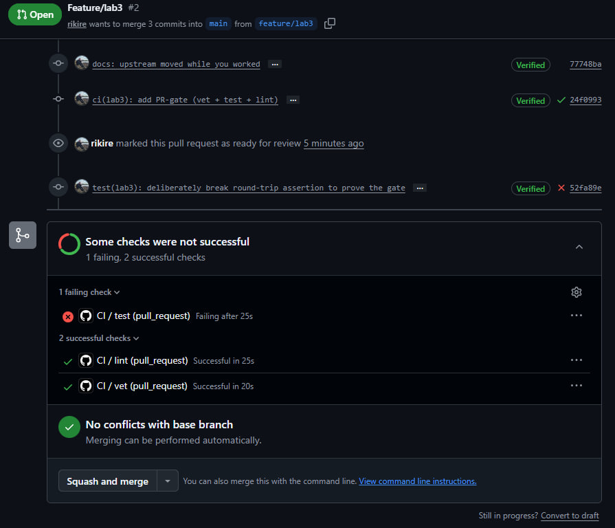
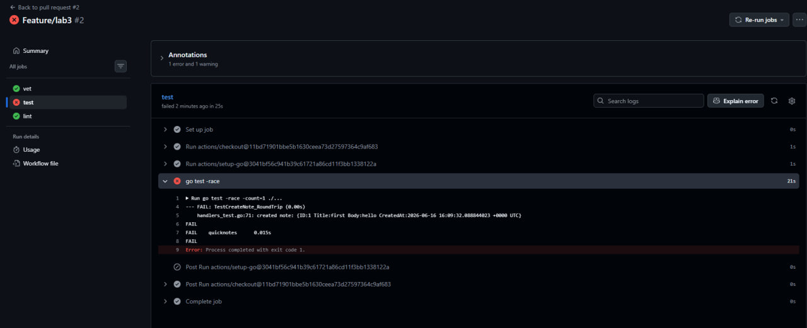
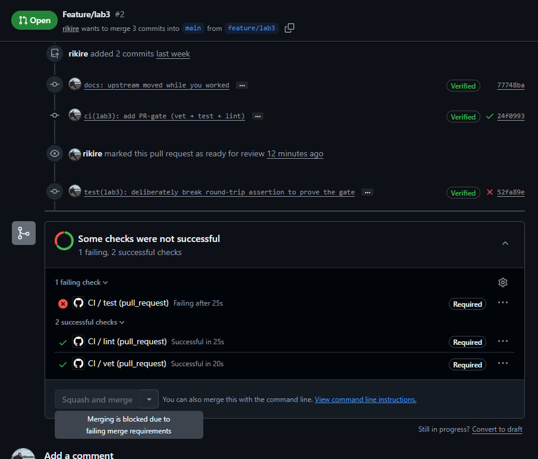
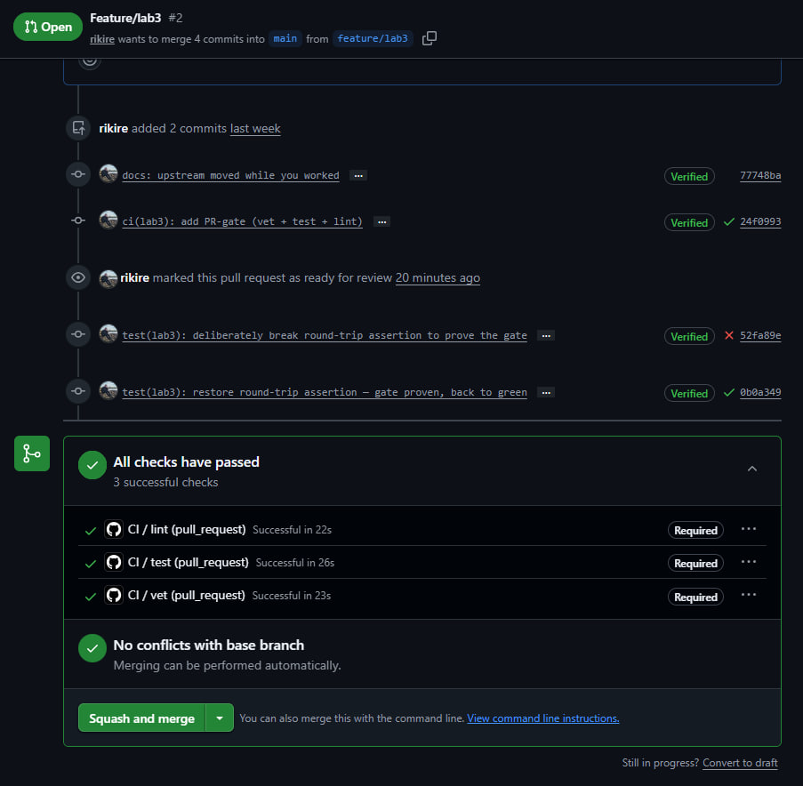
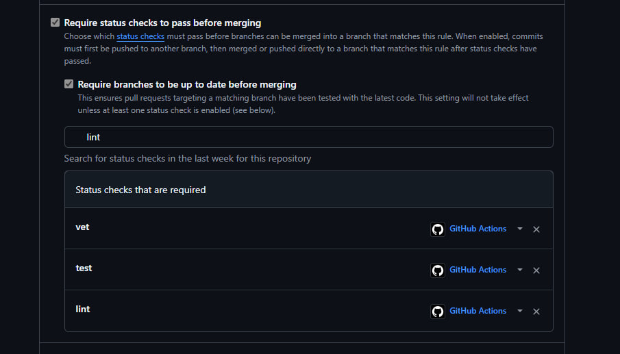

# Lab 3 — CI/CD: A PR-Gated Pipeline for QuickNotes

**Chosen path: GitHub Actions.**
Reason: my fork lives on github.com (`rikire/DevOps-Intro`), I can sign in
normally, and GitHub-hosted runners cover this lab on the free tier. No need
for the GitLab fallback, which exists for people locked out of GitHub.

CI config: [`.github/workflows/ci.yml`](../.github/workflows/ci.yml)

---

## Task 1 — The PR Gate

### What the pipeline does

Three independent jobs run on every push to `main` and every PR targeting
`main`:

| Job    | Command                        | Working dir |
| ------ | ------------------------------ | ----------- |
| `vet`  | `go vet ./...`                 | `app/`      |
| `test` | `go test -race -count=1 ./...` | `app/`      |
| `lint` | `golangci-lint run` (v2.5.0)   | `app/`      |

Hardening applied:

- Runner pinned to `ubuntu-24.04` (not `ubuntu-latest`).
- Go pinned to `1.24`.
- Every third-party action pinned by full 40-char commit SHA with the tag in a
  trailing comment:
  - `actions/checkout@11bd71901bbe5b1630ceea73d27597364c9af683  # v4.2.2`
  - `actions/setup-go@3041bf56c941b39c61721a86cd11f3bb1338122a  # v5.2.0`
  - `golangci/golangci-lint-action@4afd733a84b1f43292c63897423277bb7f4313a9  # v8.0.0`
- `permissions: contents: read` declared at the workflow level (least privilege).
- `golangci-lint` pinned to `v2.5.0`; the repo config `app/.golangci.yml` is in
  the v2 format, which is why the action is v8 (v8 is the first line that runs
  golangci-lint v2).

### Evidence

`https://github.com/rikire/DevOps-Intro/pull/2`

I changed the expected title in `TestCreateNote_RoundTrip` from `"first"` to
`"second"` so the round-trip assertion fails.

- Break commit: `52fa89e` — *test(lab3): deliberately break round-trip assertion*
- Result: `test` job went **red**; `vet` and `lint` stayed **green** (proof the
  jobs are independent). Merge was **blocked** by branch protection.
- Fix commit: `0b0a349` — *test(lab3): restore round-trip assertion*
- Result: all three checks green again.

Screenshots:

-  <!-- S1: PR with red `test`, green vet+lint -->
-  <!-- S2: expanded log showing FAIL handlers_test.go -->
-  <!-- S5: "Required statuses must pass" blocking merge -->
-  <!-- S3: all checks green after revert -->

**Branch protection (step 1.6):**

`main` on my fork requires a PR, requires the `vet`/`test`/`lint` status checks
to pass, and requires branches to be up to date before merging.

-  <!-- S4 -->

---

### 1.2 Design questions

**a) Why pin the runner (`ubuntu-24.04`) instead of `ubuntu-latest`? What breaks otherwise?**

`ubuntu-latest` is a moving alias: GitHub repoints it to the next Ubuntu LTS on
their own schedule. The day that flips, my pipeline silently runs on a different
OS image — different default package versions, different pre-installed
toolchain, sometimes a different glibc. A build that was green yesterday can go
red today with zero changes from me, and I can't reproduce "the environment
from last week." Pinning `ubuntu-24.04` makes the runner a deterministic input:
the image only changes when *I* bump the tag, as a reviewed commit. It also
matches the lecture rule — don't pin to `ubuntu-latest` in 2026 if you need
stability.

**b) Why split vet + test + lint into separate jobs? What happens with one combined job?**

Three reasons:
1. **Isolation of signal.** When the red shows up, the job name tells me *which*
   gate failed without reading logs. In step 1.5 only `test` went red while
   `vet`/`lint` stayed green — instant diagnosis.
2. **Parallelism.** Separate jobs run on separate runners at the same time, so
   wall-clock ≈ the slowest job instead of the sum of all three.
3. **No short-circuit.** A combined `vet && test && lint` script stops at the
   first failure. If vet fails I never learn whether tests also fail; I fix vet,
   re-run, *then* discover the test failure — two round-trips instead of one.

The cost of splitting is some duplicated setup (checkout + setup-go in each
job), which caching (Task 2) largely neutralizes.

**c) GH path: what real attack does SHA pinning prevent? Cite the incident from Lecture 3.**

Git tags are **mutable** — anyone who can push to an action's repo can move
`v4` (or even `v4.2.2`) to point at new, malicious code. If I reference an
action by tag, I'm trusting that maintainer's GitHub account *forever*. A full
commit SHA is immutable: it names exact content, so a moved tag can't swap code
under me.

The incident: in **March 2025** the popular **`tj-actions/changed-files`**
action was compromised. The attacker rewrote its tags to a malicious version,
which dumped CI secrets from thousands of public workflow runs into the logs.
Anyone pinned by SHA was unaffected; anyone pinned by tag pulled the malicious
code automatically.

**d) GH path: what is `permissions:` and what's the principle behind it?**

`permissions:` sets the scopes of the automatic `GITHUB_TOKEN` that GitHub
injects into the run. By default that token can be quite broad (read/write to
repo contents, etc.). I declare `contents: read` so the token can *only* read
the repo and nothing else — it can't push commits, open PRs, edit issues, or
publish packages. The principle is **least privilege**: give each job the
minimum authority it needs, so that if a step (or a compromised dependency)
runs hostile code, the blast radius is tiny. A lint/test gate never needs write
access, so it doesn't get it.

**e) GitLab path: difference between a *stage* and a *job*? What does `dependencies:` do that `stages:` doesn't?**

(Not my chosen path — answered for completeness.)
A **job** is a single unit of work (one script in one container). A **stage** is
an ordered group of jobs: all jobs in stage *N* run in parallel, and stage *N+1*
starts only after every job in stage *N* passes. So `stages:` controls
**execution order and gating**.

`dependencies:` is about **artifacts, not ordering**. By default a job downloads
the artifacts of every job in all prior stages. `dependencies: [build]` narrows
that to only fetch `build`'s artifacts — saving download time and avoiding stale
files — without changing *when* the job runs. In short: `stages:` answers "what
runs before what"; `dependencies:` answers "whose outputs do I actually pull
in."

---

## Task 2 — Make It Fast and Smart

<!-- TODO: cache, matrix (1.23/1.24), path filters, timing table, answers f/g/h -->

## Bonus — Pipeline Performance Investigation

<!-- TODO -->
