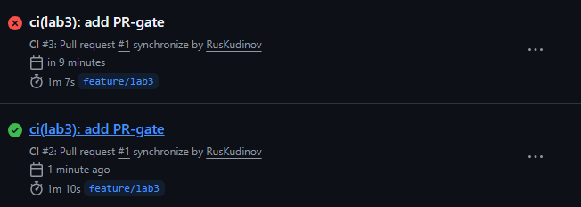
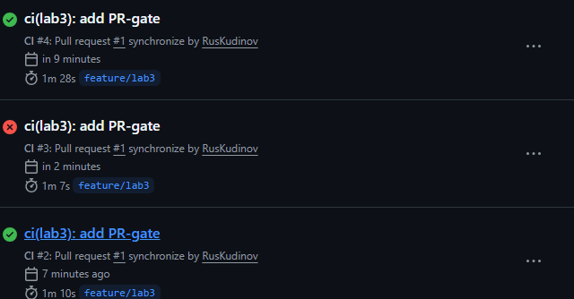
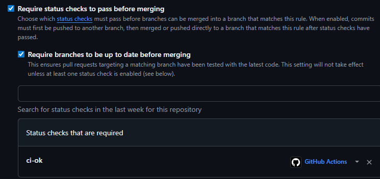
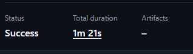

# Lab 3 — CI/CD: A PR-Gated Pipeline for QuickNotes

**Студент:** Руслан Кудинов  
**Путь:** GitHub Actions  
**Дата:** 17.06.2026

## Выбранный путь
Я выбрал GitHub Actions, так как это стандартный инструмент для курса. Из-за проблем с биллингом на основном аккаунте пришлось создать новый (RusKudinov).

## Ссылка на зелёный CI run
https://github.com/RusKudinov/DevOps-Intro/actions/runs/27708444304

## Доказательство работы гейта
- **Сломанный тест:**   
- **Исправление:**   
- **Коммит с поломкой:** `3b6b086 `   
- **Коммит с исправлением:** `014941a`

## Скриншот branch protection

---

## Ответы на дизайн-вопросы (Task 1.2)

### a) Почему пиннить `ubuntu-24.04`, а не `ubuntu-latest`?
`ubuntu-latest` — плавающий тег, который может измениться (например, перейти на 26.04). Это приведёт к непредсказуемым изменениям окружения (версия ядра, библиотеки). Пиннинг фиксирует конкретную версию, делая сборку воспроизводимой.

### b) Почему разделить vet, test, lint на отдельные джобы?
Если объединить их в одну, при падении lint мы не узнаем, прошли ли тесты. Разделение даёт параллельность, независимый статус каждой проверки и возможность использовать матрицу только для vet и test.

### c) Какую атаку предотвращает SHA‑пиннинг? (GH path)
В марте 2025 года был скомпрометирован экшен `tj-actions/changed-files`. Злоумышленник внёс вредоносный код в тег `v4`. Все, кто использовал `@v4`, автоматически подхватили его. Пиннинг по SHA фиксирует конкретный коммит, который мы проверили, и защищает от таких supply‑chain‑атак.

### d) Что такое `permissions:` и какой принцип?
`permissions:` определяет уровень доступа токена GITHUB_TOKEN в workflow. Мы устанавливаем `contents: read` — только чтение кода. Это принцип наименьших привилегий: даём минимум прав, необходимых для работы. Снижает ущерб при компрометации.

---

## Ответы на вопросы Task 2

### f) Почему кэшировать по `go.sum`, а не по build‑output?
`go.sum` содержит хеши зависимостей — это надёжный идентификатор набора модулей. Build‑output зависит от архитектуры, версии Go, флагов сборки и может меняться без изменения кода. Кэширование по `go.sum` гарантирует, что при одинаковых входных данных кэш подходит.

### g) Что делает `fail-fast: false` и когда нужен `true`?
`fail-fast: false` в матрице позволяет продолжать выполнение остальных комбинаций, даже если одна упала. Так мы видим все ошибки (например, тесты падают только на Go 1.24). `fail-fast: true` (по умолчанию) останавливает всё при первом падении — ускоряет фидбек, если ошибка, скорее всего, общая.

### h) Какой риск кэша, созданного вредоносным PR?
Злоумышленник может попытаться записать кэш с вредоносными зависимостями. Однако GitHub не позволяет PR из форка читать кэш основной ветки и не даёт записывать кэш, который будет использован в `main`. Кэш привязан к ветке и SHA. Это задокументировано в официальной документации GitHub.

---

## Таблица времени (Task 2.4)

| Сценарий | Wall‑clock (сек) |
|----------|------------------|
| Без кэша, одна версия Go, без path‑фильтра | 81 |
| С кэшем (один Go) | 70 |
| С кэшем + матрица (две версии) | 80 |

**Замечание:** В QuickNotes нет внешних зависимостей, поэтому кэш почти не даёт выигрыша. Основное время уходит на установку Go и старт раннера. В реальном проекте с сотнями модулей выгода была бы значительной.

---

## Бонус (если делал)
Я применил следующие дополнительные оптимизации:
1. Использовал `cache: true` с указанием `go.sum`.
2. Разделил джобы для параллельного выполнения.
3. Добавил path‑фильтр, чтобы не запускать CI при изменениях только документации.

Дальнейшее ускорение ограничено временем старта раннера (~30 с) и установкой Go (~20 с). Достичь 90 с можно только с self‑hosted раннером, что выходит за рамки лабораторной.
