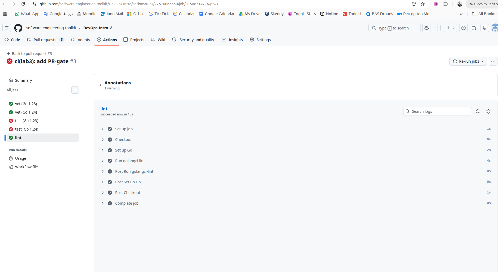
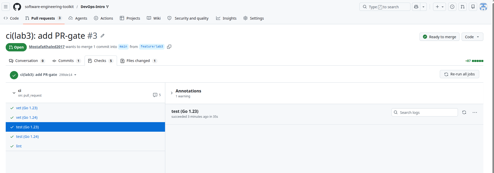
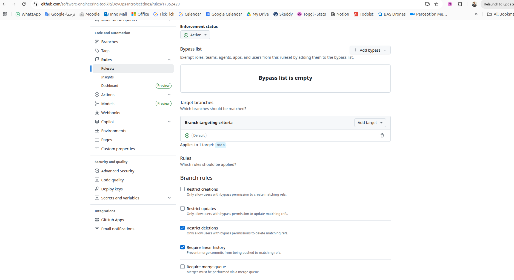

# Lab 3 - CI/CD: PR-Gated Pipeline

## Chosen path: I decided to work on Github not Gitlab since I am more familiar with Github and I have used it for my previous projects. I also find Github Actions to be more intuitive and easier to set up than Gitlab CI/CD.

## Task 1 - Write the PR gate

### CI configuration

The CI workflow is defined in:

```text
.github/workflows/ci.yml
```

The workflow is configured to run on:

- pushes to `main`
- pull requests targeting `main`

The workflow uses path filters so it runs only when the application or workflow changes:

- `app/**`
- `.github/workflows/ci.yml`

### Independent CI jobs

The workflow defines three independent GitHub Actions jobs:

- `vet` runs `go vet ./...` from `app/`
- `test` runs `go test -race -count=1 ./...` from `app/`
- `lint` runs `golangci-lint run` from `app/`

The lint job pins `golangci-lint` to:

```text
v2.5.0
```

### Runtime and permissions

The workflow pins the runner image to:

```text
ubuntu-24.04
```

The workflow declares least-privilege permissions:

```yaml
permissions:
  contents: read
```

The GitHub Actions used by the workflow are pinned to full commit SHAs with the readable version tags in comments.

### Evidence to add after pushing

Red CI run image:


Green CI run image:


Branch protection evidence:


## Design questions

### a) Why pin the runner version instead of `ubuntu-latest`?

Pinning `ubuntu-24.04` makes the CI environment predictable. `ubuntu-latest` is a moving alias, so GitHub can retarget it to a newer image with different system packages, compiler behavior, shell behavior, OpenSSL versions, or preinstalled tools. A workflow that passed yesterday could fail after the alias changes even though the repository code did not change. Pinning the runner makes environment upgrades intentional instead of accidental.

### b) Why split vet, test, and lint into separate units?

Splitting `vet`, `test`, and `lint` into separate jobs makes failures easier to diagnose and lets GitHub Actions run independent checks in parallel. If all three commands were combined into one job, the first failing command would stop the rest unless extra shell handling was added. That would hide whether the other checks also fail and would make branch protection less precise because there would be only one combined status check instead of separate quality gates.

### c) What real attack does SHA pinning prevent?

SHA pinning prevents a workflow from silently running different action code when a tag or branch is moved. Lecture 3 cites the March 2025 `tj-actions/changed-files` supply-chain incident: the action was compromised, and the attacker rewrote tags to point to malicious code that leaked secrets from public CI runs. Pinning to a full commit SHA protects against this class of tag-rewrite attack because the workflow keeps using the exact reviewed commit instead of whatever code the tag points to later.

### d) What is `permissions:` and what principle is behind it?

`permissions:` controls the scopes granted to the automatic `GITHUB_TOKEN` available inside a GitHub Actions workflow or job. Setting `contents: read` gives the workflow only enough access to read repository contents. The principle is least privilege: CI jobs should receive only the permissions they need, so a compromised action or command has less ability to write code, modify pull requests, publish packages, or change repository settings.
