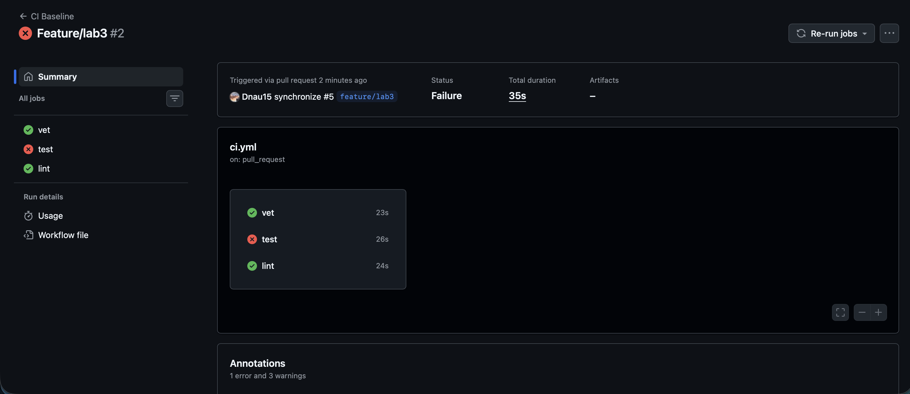
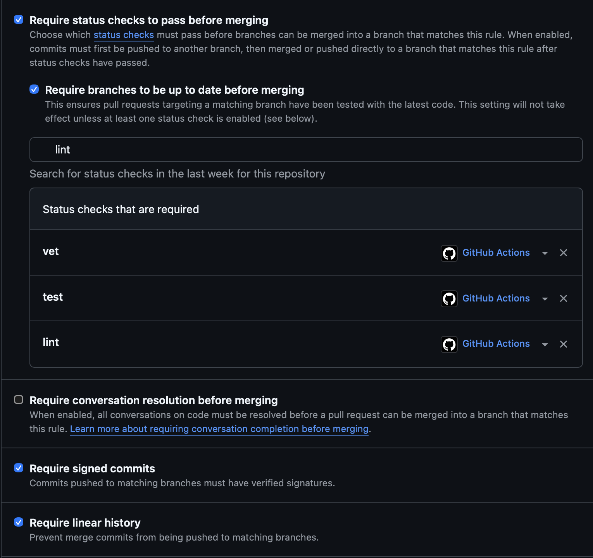

GitHub. I have some troubles with signing into Innopolis GitLab account.

### Green CI run
https://github.com/Dnau15/DevOps-Intro/actions/runs/27645595628

All three units passed: `vet`, `test`, `lint`.

### Failed run + fix (Task 1.5)
To prove the gate blocks a broken PR, I changed an expected value in
`app/handlers_test.go`, pushed, and the `test` check went **red** and the
PR became un-mergeable.

- ❌ Failed run: `<link to the red run>`
- 🔧 Fix commit (reverted the breakage, check green again): `<commit SHA / link>`

### Branch protection (Task 1.6)
`main` on my fork requires the status checks to pass before merging, and
requires branches to be up to date.

---

## Design Questions (1.2)

### a) Why pin `ubuntu-24.04` instead of `ubuntu-latest`?
`ubuntu-latest` is a **moving alias**: GitHub periodically re-points it to a
newer LTS (e.g. 22.04 → 24.04). When that flip happens, the pre-installed
toolchain, system libraries (glibc), and default packages change **under
you** — a PR that was green yesterday can fail today with zero code changes,
and the failure is hard to diagnose because nothing in your repo moved.
Pinning `ubuntu-24.04` makes the environment **reproducible**: the same
commit builds in the same environment months later. What breaks otherwise:
silent toolchain/library bumps, removed CLI tools your steps assumed were
present, and non-deterministic, "spooky-action-at-a-distance" CI failures.

### b) Why split vet + test + lint into separate units?
Two reasons: **parallelism** and **isolation**.
- *Parallelism:* three independent jobs run concurrently on separate
  runners, so wall-clock ≈ the slowest single job instead of the sum.
- *Isolation:* each unit gets its own status check, so a red ✗ tells you
  *immediately* whether it's a vet, test, or lint problem.

In one combined job they run **serially in a single shell**, and the shell
stops at the first failing command — so a `go vet` failure aborts before
tests ever run, hiding whether the tests pass. You also can't require or
re-run them independently in branch protection. Splitting gives faster,
clearer, granular feedback.

### c) What attack does SHA pinning prevent? (incident name + date)
The **tj-actions/changed-files supply-chain compromise, March 2025**
(~March 14, 2025). Mutable references like `@v44` or `@v1` are **tags**, and
a tag can be silently re-pointed to a different commit. In the tj-actions
incident the attacker repointed the action's tags to a malicious commit that
dumped CI runner memory — leaking secrets into the build logs of *every*
repo that referenced the action by tag. Pinning to a **full 40-char commit
SHA** makes the reference **immutable**: even if the tag is moved, your
workflow keeps running the exact reviewed commit, so a hijacked tag can't
inject new code into your pipeline.

### d) What is `permissions:` and the principle behind it?
`permissions:` declares the scopes granted to the automatic `GITHUB_TOKEN`
for the workflow/job (e.g. `contents`, `pull-requests`, `packages` —
each `read`/`write`/`none`). The principle is **least privilege**: grant only
what the job actually needs. A build-and-test pipeline only needs to read the
code, so `contents: read` is enough. If a step or a compromised third-party
action turns malicious, a read-only token sharply limits the blast radius —
it can't push commits, cut releases, or alter issues/PRs. Starting from
`contents: read` and adding scopes narrowly (only when a step needs them) is
the safe default.

### e) (GitLab) stage vs job; what `dependencies:` adds over `stages:`
*(Answered for completeness even though I took the GitHub path.)*
A **job** is a single unit of work — one `script` executed by a runner.
A **stage** is a named group of jobs: all jobs in a stage run **in parallel**,
and stages themselves run **sequentially** — every job in stage N must
succeed before stage N+1 starts. So `stages:` controls **ordering**.
`dependencies:` is about **artifact flow**: it specifies which earlier jobs'
artifacts a job downloads, independent of ordering. With `dependencies: []`
a job pulls *no* artifacts (faster, cleaner), and combined with `needs:` you
can build a DAG where a job starts as soon as its specific dependencies
finish — instead of waiting for the whole previous stage. In short:
`stages:` = execution order; `dependencies:` = which artifacts get passed.

## Task 2 — Make It Fast and Smart

### Optimizations applied
- **Dependency cache** — enabled `actions/setup-go` caching
  (`cache-dependency-path: app/go.mod`). It restores the Go module + build
  cache between runs. Visible in the log as the "Restore cache" / "Save cache"
  steps.
- **Build matrix** — `vet` and `test` now run against Go **1.23** and **1.24**
  in parallel via `strategy.matrix` with `fail-fast: false`, so a failure on
  one toolchain still reports the result for the other.
- **Path filter** — `on.pull_request.paths` restricts runs to changes under
  `app/**` or `.github/workflows/**`; docs-only PRs (e.g. README) skip CI
  entirely.
- **`ci-ok` aggregation job** — a single required check (`if: always()`,
  `needs: [vet, test, lint]`) so the matrix can be changed freely without
  re-editing branch protection.

### Timing (median of 5 runs)
| Scenario | Wall-clock |
|----------|-----------|
| Baseline (no cache, single Go 1.24, no path filter) | **39 s** |
| With cache | **38 s** |
| With cache + matrix | **52 s** |

**zero third-party dependencies** — `app/go.mod` has no `require` block and
there is no `go.sum` — so the module cache has nothing to store. The dominant
costs are runner provisioning, `actions/checkout`, and the Go toolchain
download, none of which `setup-go`'s module cache touches. The matrix row is
*higher* (52 s) because it runs four `vet`/`test` cells plus `lint`; even
though the cells run in parallel, each pays its own provisioning + toolchain
download, and wall-clock is bounded by the slowest cell plus the serial `lint`
job. On a dependency-heavy project the cache row would drop sharply; here it is
correctly boring.

### Design questions

**f) Why cache `go.sum`-keyed inputs and not build outputs?**
Inputs are deterministic and content-addressed: a given `go.sum` always maps to
the exact same module bytes, so a cache keyed on `hash(go.sum)` is safe — a hit
is guaranteed correct, and changing a dependency changes the key, which
naturally invalidates the cache. Build *outputs* depend on the compiler
version, build flags, and `GOOS`/`GOARCH`; subtle variation can yield stale or
mismatched artifacts that are silently wrong and hard to validate. Caching
inputs trades a cheap rebuild for a correctness guarantee; caching outputs
risks poisoning correctness for marginal speed.

**g) What does `fail-fast: false` change, and when do you want `true`?**
With `fail-fast: false`, one failing matrix cell does **not** cancel the
others — every combination runs to completion, so you can see *which* Go
version broke (essential for diagnosing toolchain-specific bugs). The default
`fail-fast: true` cancels all in-progress and pending cells the moment one
fails. You want `true` when the matrix is large and expensive and you only need
fast "something broke" feedback to block a merge and save CI minutes; `false`
when per-cell diagnostics matter — which is our case.

**h) Risk of an attacker writing a cache from a malicious PR that a protected
branch later reads?**
This is **cache poisoning**: a PR workflow can write a cache entry; if a run on
a protected branch later restored it, the attacker's tampered artifacts would
execute with the trust and permissions of `main`, enabling code execution or
secret exfiltration.
