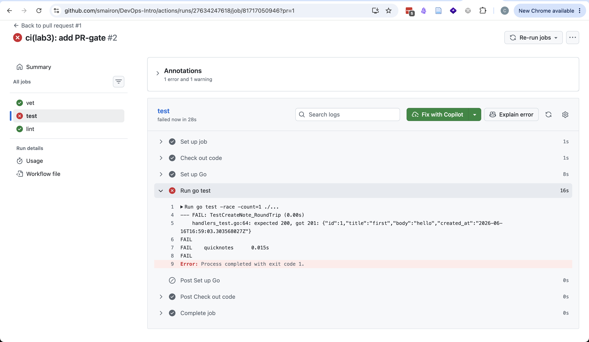

# Lab 3 Submission

## Path Chosen

I used GitHub Actions.

Reason: this fork is hosted on GitHub, so GitHub Actions is the most direct and simple choice for this repository.

## CI Result

Green CI run:

- Initial green run: https://github.com/smairon/DevOps-Intro/actions/runs/27594868651
- Final green run after fixing the intentional failure: https://github.com/smairon/DevOps-Intro/actions/runs/27634676628

## Proof That the Gate Works

I made one small change in a test on purpose. I changed the expected HTTP status code in `app/handlers_test.go` from `201` to `200`.

Result:

- The `test` check became red.
- The pull request could not be merged.

Evidence:

- Failed run link: https://github.com/smairon/DevOps-Intro/actions/runs/27634247618
- Screenshot of failed run: 

- Fix commit that restored the test: https://github.com/smairon/DevOps-Intro/commit/fa9f410889773109b9a324d1234c47aca92b9469

## Branch Protection

I enabled branch protection for `main` in my fork.

Enabled rules:

- Require status checks to pass before merging
- Require branches to be up to date before merging
- Required checks: `vet`, `test`, `lint`

Evidence:

- Branch protection screenshot: 

## Design Questions

### a) Why pin the runner version (`ubuntu-24.04`) instead of `ubuntu-latest`? What breaks otherwise?

`ubuntu-latest` can change at any time. After such a change, your pipeline may start using a new OS image with different preinstalled tools, different package versions, or changed behavior. Then a workflow that was green yesterday can fail today without any code change in your project. Pinning `ubuntu-24.04` makes the environment stable and easier to debug.

### b) Why split vet + test + lint into separate units? What would happen with one combined job?

Separate jobs run independently and can run in parallel. This makes feedback faster and clearer. If everything is inside one job, one early failure stops the later steps, so you may not see all problems at once. A combined job is also slower, because `vet`, `test`, and `lint` cannot run at the same time.

### c) GH path: what real attack does SHA pinning prevent? Cite the date + name of the incident from Lecture 3.

SHA pinning protects against a supply chain attack where an action tag is moved to malicious code. A tag like `v4` or even `v4.2.2` is still a moving reference, but a full commit SHA points to one exact immutable commit. Lecture 3 gives the example of the **March 2025 `tj-actions/changed-files` compromise**, where the attacker rewrote tags and leaked secrets from many CI runs.

### d) GH path: what is `permissions:` and what is the principle behind it?

`permissions:` defines what the workflow token is allowed to do in GitHub. For example, `contents: read` lets the workflow read repository contents but not write to the repository. The principle is least privilege: give the workflow only the minimum access it needs, so a bug or compromised action has less power.

### e) GitLab path: what is the difference between a stage and a job? What would `dependencies:` do that `stages:` does not?

A job is one unit of work, such as running tests or linting. A stage is a group of jobs, and stages define the high-level order of execution. For example, all jobs in one stage usually finish before the next stage starts. `dependencies:` is more specific: it tells one job which earlier jobs it should download artifacts from. So `stages:` controls order, while `dependencies:` controls artifact flow between jobs.

## Notes

Workflow file: `.github/workflows/ci.yml`

The workflow has:

- Trigger on push to `main`
- Trigger on pull requests to `main`
- Three separate jobs: `vet`, `test`, `lint`
- Pinned runner: `ubuntu-24.04`
- Pinned action SHAs
- Least-privilege `permissions: contents: read`