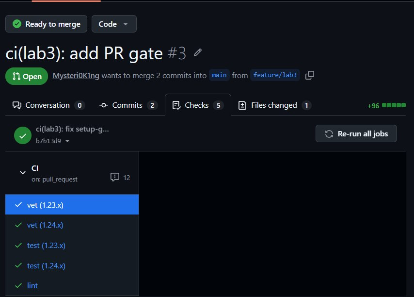
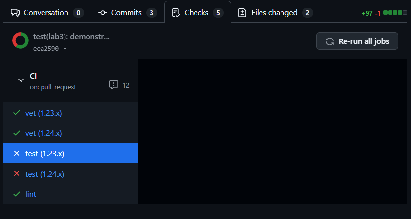
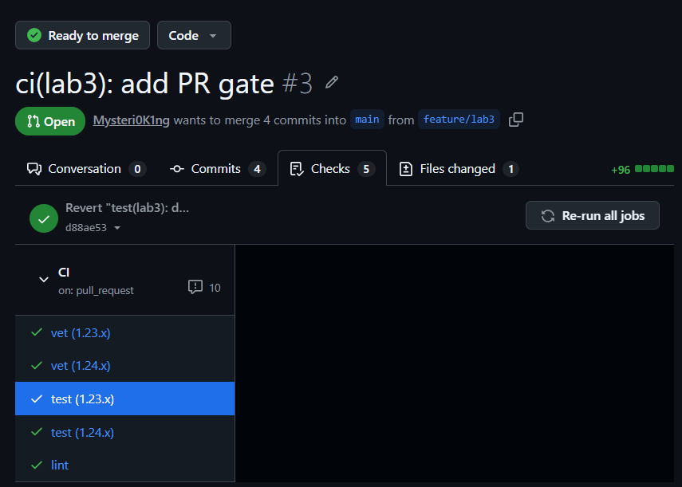
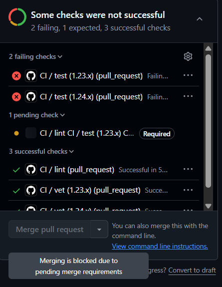

# Lab 3 Submission

## Chosen path

I chose GitHub Actions because my repository and PR workflow are already on GitHub.

## Task 1 — PR gate

### Green CI run

Link: https://github.com/Mysteri0K1ng/DevOps-Intro/pull/3/checks



### Failed CI run

screenshot:



### Fix commit

Commit:

```bash
git revert HEAD -S -s
git push
```



### Branch protection

Screenshot:



## Design questions

### a) Why pin the runner version instead of `ubuntu-latest`?

Pinning the runner version, for example ubuntu-24.04, makes the CI environment predictable and reproducible. If I use ubuntu-latest, GitHub can later move it to a newer image with different system packages, Go tooling, or defaults, and the pipeline may start failing even though the project code did not change.

### b) Why split vet, test, and lint into separate units?

I split vet, test, and lint into separate jobs so the PR shows exactly which kind of quality gate failed. If everything was in one combined job, the first failing command could stop the whole job and hide the results of the other checks. Separate jobs also run in parallel, which makes the pipeline easier to debug and usually faster in wall-clock time.

### c) What real attack does SHA pinning prevent?

SHA pinning helps prevent supply-chain attacks where an action tag, such as v1 or v4, is moved or compromised after I already trusted it. A real example is the March 2025 tj-actions/changed-files supply-chain incident, where using a mutable action reference could cause CI to execute compromised code. Pinning to a full commit SHA makes the workflow use one exact reviewed version instead of whatever code a tag points to later.

### d) What is `permissions:` and what principle is behind it?

permissions: controls what access the GitHub Actions GITHUB_TOKEN has during the workflow. Setting permissions: contents: read gives the pipeline only the access it needs to checkout and read the repository. This follows the principle of least privilege: CI jobs should not receive write access, secret access, or other powers unless they actually need them.

## Task 2 — Make it fast and smart

### Timing table

| Scenario | Wall-clock |
|----------|------------|
| Baseline | 1m 13s |
| With cache | 1m 18s |
| With cache + matrix | 1m 13s |

### Optimizations applied

I enabled Go dependency caching using `app/go.sum` as the cache key. This lets CI reuse downloaded modules when dependencies do not change, although in my run the cache was slightly slower because of cache overhead and runner variance.

I added a Go matrix for `1.23.x` and `1.24.x` for `vet` and `test`. This checks compatibility with two toolchains while still keeping wall-clock time low because the jobs run in parallel.

I added path filters so CI runs only when `app/**` or the workflow file changes. This avoids wasting CI minutes on unrelated documentation-only changes.

I kept `vet`, `test`, and `lint` as separate jobs so failures are easier to understand and independent checks can run in parallel.

### f) Why cache `go.sum`-keyed inputs and not build outputs?

Caching with a key based on go.sum is safer because go.sum describes the exact module dependencies that the Go project needs. These inputs are deterministic: if go.sum does not change, the downloaded modules should be the same. Build outputs are less reliable to cache because they can depend on the OS image, Go version, compiler flags, race detector settings, and other environment details, so reusing them can create subtle or stale results.

### g) What does `fail-fast: false` change?

fail-fast: false means that if one matrix job fails, GitHub Actions will not cancel the other matrix jobs. This is useful here because I want to see whether the failure happens only on Go 1.23, only on Go 1.24, or on both versions. I would use fail-fast: true when the jobs are expensive and one failure is already enough information, for example in a large deployment pipeline where continuing other matrix jobs would waste CI minutes.

### h) What is the cache poisoning risk?

The risk is cache poisoning: a malicious PR could try to store modified files or tools in the CI cache, and later a trusted branch could restore and execute that poisoned cache. This could turn an untrusted PR run into influence over a protected branch run. GitHub reduces this risk by scoping cache access between branches: workflow runs can restore caches from the current branch and default branch, but parent or sibling branches cannot read caches created by unrelated child branches. Even with those mitigations, I should avoid caching executable untrusted outputs and prefer dependency caches keyed by trusted files such as go.sum.

