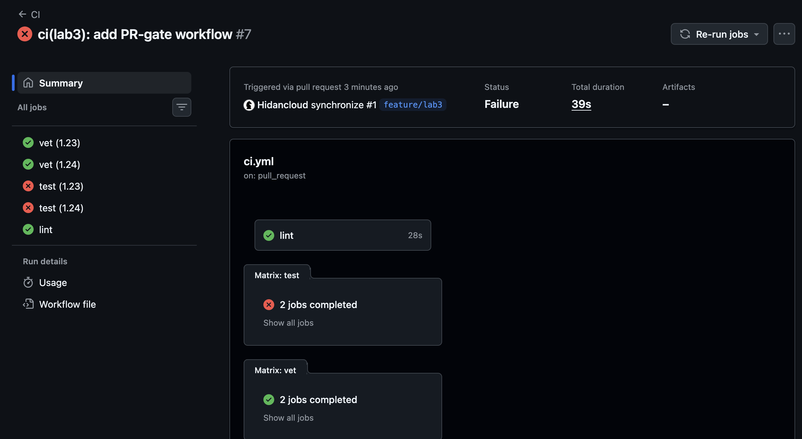

# Lab 3 submission

**Path chosen:** GitHub Actions — already using GitHub for the course fork, SSH signing, and branch protection from Labs 1–2.

## Task 1 — PR Gate

### CI workflow

Workflow file: `.github/workflows/ci.yml`

- Triggers on push/PR to `main` (path-filtered to `app/**` and `.github/workflows/**`)
- Three parallel jobs: `vet`, `test`, `lint`
- Runner: `ubuntu-24.04` (pinned)
- `go vet ./...`, `go test -race -count=1 ./...`, `golangci-lint run` (v2.5.0) in `app/`
- Third-party actions pinned by full SHA; `permissions: contents: read`

### Green CI run

https://github.com/Hidancloud/DevOps-Intro/actions/runs/27641204235 (full optimized pipeline, all 5 jobs green)

### Deliberate failure + fix

**Failed run** (broke `TestHealth_ReportsCount` — expected notes count `99` instead of `1`):

- Commit: `97daa52` `test(lab3): break health test to prove CI gate`
- CI run: https://github.com/Hidancloud/DevOps-Intro/actions/runs/27641676019 — `test` job failed; PR merge blocked by branch protection



**Fix run:**

- Commit: `bd238ff` `test(lab3): fix health test — CI gate verified`
- CI run: https://github.com/Hidancloud/DevOps-Intro/actions/runs/27641751324 — all checks green again

### Branch protection


Required checks on fork `main`: `vet`, `test`, `lint` (all matrix variants), branches up to date.

### Design questions (Task 1.2)

**a) Why pin `ubuntu-24.04` instead of `ubuntu-latest`?**

`ubuntu-latest` is a moving target — GitHub can retarget it to a newer image without warning. A pipeline that passed yesterday may fail tomorrow because preinstalled packages, kernel, or tool versions changed. Pinning `ubuntu-24.04` makes CI reproducible: the same runner image behaves the same across runs until you consciously upgrade.

**b) Why split vet, test, and lint into separate jobs?**

Each job runs on its own runner in parallel, so wall-clock time is roughly the slowest job, not the sum of all three. Failures are isolated — a lint error does not hide a test failure behind a combined log. In branch protection you can require each check independently. One combined job would serialize the work, produce one opaque log, and make it harder to see which quality gate failed.

**c) What attack does SHA pinning prevent? (GH path)**

Tag-based action references (`@v4`, `@v4.2.2`) are mutable — a compromised maintainer account can retag a release to malicious code. In **March 2025**, the `tj-actions/changed-files` action was compromised; attackers rewrote tags and leaked secrets from thousands of CI runs. Pinning the full 40-character commit SHA means the workflow always checks out the exact audited revision unless someone deliberately updates the SHA in a reviewed PR.

**d) What is `permissions:` and what principle is behind it?**

`permissions:` sets the GitHub token scope available to the workflow (here `contents: read`). The principle is **least privilege**: the token should only access what the job needs. A compromised step or malicious action cannot write to the repo, open PRs, or modify packages if the token is read-only.

**e) GitLab path (not used):** N/A — chose GitHub Actions.

---

## Task 2 — Make It Fast and Smart

### Optimizations applied

1. **Go module cache** — `actions/setup-go` with `cache: true` and `cache-dependency-path: app/go.sum`
2. **Build matrix** — `vet` and `test` run on Go `1.23` and `1.24` in parallel with `fail-fast: false`
3. **Path filter** — workflow runs only when `app/**` or `.github/workflows/**` change
4. **Bonus:** `concurrency` with `cancel-in-progress: true` — superseded runs on the same branch are cancelled
5. **Bonus:** `GOFLAGS=-buildvcs=false` — skips VCS metadata embedding when clone history is shallow
6. **Bonus:** `timeout-minutes: 10` per job — fails fast instead of hanging on a stuck runner

Measured with temporary workflow commits on `feature/lab3` (see `a56f0da`, `d4c74bb`, `b98b0d8`). Wall-clock = slowest parallel job per run.

### Timing table

| Scenario | Wall-clock | Run link |
|----------|-----------|----------|
| Baseline (no cache, single Go 1.24, no path filter) | **66 s** | https://github.com/Hidancloud/DevOps-Intro/actions/runs/27640921680 |
| With cache (single Go 1.24, no matrix) | **32 s** | https://github.com/Hidancloud/DevOps-Intro/actions/runs/27641058845 |
| With cache + matrix (Go 1.23 & 1.24, path filter) | **28 s** | https://github.com/Hidancloud/DevOps-Intro/actions/runs/27641204235 |

Per-job breakdown (baseline vs cached single-version):

| Job | Baseline | With cache |
|-----|----------|------------|
| vet | 58 s | 21 s |
| test | 62 s | 32 s |
| lint | 66 s | 23 s |

### Path filter demonstration

Workflow `paths` filter:

```yaml
paths:
  - "app/**"
  - ".github/workflows/**"
```

A PR that changes **only** files outside these paths (e.g. only `labs/lab3.md` or `README.md` on a branch with no other changes) will not trigger CI. On an **open PR that already includes** `app/**` or workflow changes, GitHub still runs CI on subsequent pushes because the PR's overall diff matches the filter — this is expected GitHub behavior.

### Design questions (Task 2)

**f) Why cache `go.sum`-keyed inputs and not build outputs?**

Module download cache is keyed on `go.sum`, which pins exact dependency versions — the same inputs produce the same modules on every run. Build outputs depend on Go version, compiler flags, and runner environment; caching them risks stale or incompatible artifacts. Caching inputs (modules) is safe and speeds up `go mod download`; caching outputs can silently serve wrong binaries.

**g) What does `fail-fast: false` change in a matrix, and when use `fail-fast: true`?**

With `fail-fast: false`, all matrix cells run to completion even if one fails — you see whether Go 1.23, 1.24, or both broke. With `fail-fast: true` (the default), the first failing cell cancels the rest, hiding which versions still pass. Use `fail-fast: true` when cells are redundant smoke tests and you only need one signal (e.g. identical deploy previews); use `false` when each cell is meaningful (different Go versions).

**h) Cache poisoning risk from a malicious PR**

An attacker on an unprotected branch could write a poisoned cache (e.g. malicious `go.sum` resolution or corrupted module cache) keyed the same way as protected branches. Later PRs on protected branches might restore that cache and run with tainted dependencies. GitHub mitigates this by scoping caches to the branch and restricting cache write access from fork PRs (`GITHUB_TOKEN` from fork PRs is read-only for caches from the base branch). Official doc: [Dependency caching — Restrictions for accessing a cache](https://docs.github.com/en/actions/using-workflows/caching-dependencies-to-speed-up-workflows#restrictions-for-accessing-a-cache).

---

## Bonus Task — Pipeline Performance Investigation

### Before/after optimizations

| Optimization applied | Before (s) | After (s) | Saving |
|----------------------|-----------:|----------:|-------:|
| Go module cache (`setup-go cache`) | 66 | 32 | **-34 s** |
| Build matrix (1.23 + 1.24 parallel) | 32 (1 ver) | 28 (2 ver) | **-4 s** wall-clock* |
| Path filter (docs-only PRs) | full run | 0 (skipped) | **~28 s** per skip |
| **Total wall-clock (full pipeline)** | **66** | **28** | **-38 s** |

\*Matrix adds a second Go version but jobs run in parallel; wall-clock stayed ~28 s because cache kept setup fast and the slowest job (`test` with `-race`) dominates.

### Per-step profile (run 27641204235)

| Job | Runner start | Setup / cache | Work | Cleanup |
|-----|-------------|---------------|------|---------|
| vet (1.23) | 1 s | 1 s (Go setup) | 16 s (`go vet`) | 1 s |
| vet (1.24) | 1 s | 1 s | 14 s | 0 s |
| test (1.23) | 1 s | 1 s | **23 s** (`go test -race`) | 1 s |
| test (1.24) | 1 s | 1 s | 19 s | 0 s |
| lint | 1 s | 1 s (checkout) | **18 s** (golangci-lint) | 1 s |

Runner startup is ~1 s; with cache hits Go setup is ~0–1 s. Dominant cost is the work step, not checkout or cleanup.

### Bottleneck analysis

The slowest step is **`go test -race`** (~19–23 s per matrix cell), because the race detector instruments memory accesses and roughly doubles test runtime. `golangci-lint` is second (~18 s) as it runs multiple analyzers over the whole module. Runner startup and cached Go setup are negligible (~1–2 s each). To shorten CI without touching the pipeline, QuickNotes would need faster tests (fewer integration-style tests, smaller fixtures) or splitting lint to only changed packages. I would stop optimizing this pipeline around **30 s** — it is well under the 90 s bonus target, branch protection is enforced, and further gains require disproportionate complexity (custom runner images, test sharding) for a small Go service.
