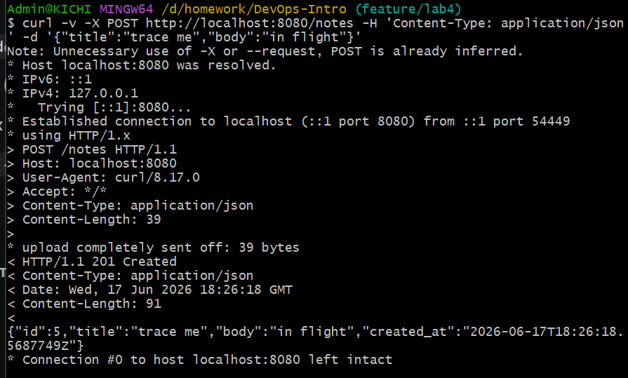
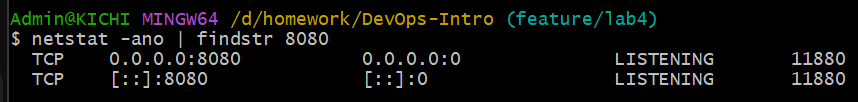
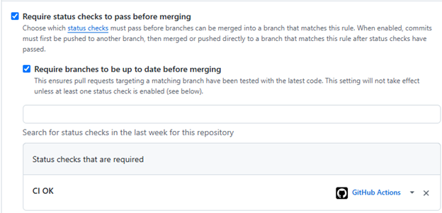

# Lab 3 submission

# I CHOOSE GITHUB ACTIONS PATH

## 1.2
### a

ubuntu-24.04 is a sertain, stable, LTS version of OS. It's been out for several years, therefore, tests've been done, vulnerabilities - fixed. This label will run the same OS every run. No random unknown changes. Meanwhile, ubuntu-latest can be changed to some new, not tested OS ad can break anything at any moment

### b

Split -> runs in paralel -> faster. Also, much more clear, as I can see, witch point caused failure. In united job afret first failure other checks woun't be done at all.

### c

An attacker can, possibly, change the version tag and make VM execude someone other's code. By pinning exact commit I make CI use exact checked commit, therefore there wouldn't be such vulnearbility.

### d

Permission shows what GH workflow can do with repository. Principle - least priveledge. It means, that is someone can do their job without some priveledge - this someone shouldn't have this priveledge. 

## Bad commit screenshot

## Logs

## Fix commit screenshot

![link to good commit] (https://github.com/Long1Tail/DevOps-Intro/pull/3/changes/61ce79952dde9ed59597353acb487e23c208eb24)

| Scenario | Wall-clock |
|----------|------------|
| Baseline | 39s |
| With chache | 40s |
| With matrix | 1.42s |

I did the following optimisations:
- caching
- paralel execution

### f 
Caching dependencies using a key derived from go.sum ensures deterministic and reproducible build environments by locking the exact dependency graph. In contrast, caching build artifacts is generally less reliable because the generated binaries may depend on the runner’s hardware, compiler version, or system configuration, making them unsafe to reuse across different environments.

### g 
Setting fail-fast: false allows every job in the matrix to run to completion, even if some jobs fail, providing a complete view of all existing issues. By comparison, fail-fast: true is often preferable during active development or pull request validation, as it terminates the workflow after the first failure, reducing resource consumption and accelerating feedback.

### h
A potential security concern is cache poisoning, where an attacker attempts to inject malicious artifacts into a cache through a pull request. GitHub addresses this risk through strict cache isolation: workflows triggered by pull requests may read caches associated with the target branch, but they cannot create, modify, or overwrite caches belonging to protected branches.