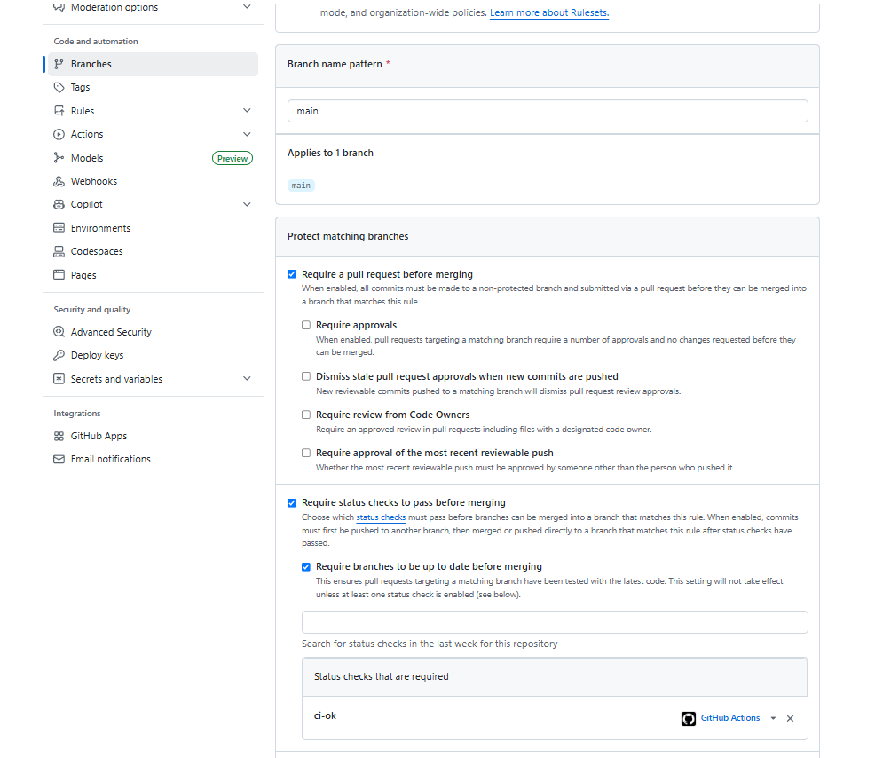

# Lab 3 Submission

**Chosen Path:** GitHub Actions

## Task 1: PR Gate
- **Link to red CI run:** https://github.com/infernaltiger/DevOps-Intro/actions/runs/27550110703
- **Link to green CI run:** https://github.com/infernaltiger/DevOps-Intro/actions/runs/27550434637
- **Branch Protection Screenshot:** 
- **Failure & Fix Evidence:** 
  - Failed run screenshot: 
  - Fix commit hash: ` 9edbb6db4a1199b08814bca0630b822abfdec4cf`

### Design Questions (1.2)
**a) Why pin the runner version (`ubuntu-24.04`) instead of `ubuntu-latest`?**  
Pinning ensures reproducibility. `ubuntu-latest` is a floating tag that GitHub updates periodically. An unexpected upgrade can introduce new default tool versions or deprecate old ones, silently breaking the build.

**b) Why split vet + test + lint into separate units?**  
Splitting allows parallel execution (faster wall-clock time), isolated caching, and easier debugging. If combined, a failure in `lint` would prevent us from seeing if `test` also failed.

**c) What real attack does SHA pinning prevent?**  
It prevents supply chain attacks where a maintainer's account is compromised and a mutable tag is rewritten to point to malicious code. The `tj-actions/changed-files` action was compromised in March 2025 this way, leaking secrets from thousands of CI runs.

**d) What is `permissions:` and what's the principle behind it?**  
`permissions:` defines the scopes of the default `GITHUB_TOKEN`. The principle is **least privilege**: by defaulting to `contents: read`, we prevent the workflow from accidentally or maliciously modifying the repository.

## Task 2: Make It Fast and Smart
### Timing Table
| Scenario | Wall-clock |
| --- |------------|
| Baseline (no cache, single Go version, no path filter) | 63 s       |
| With cache | 46 s       |
| With cache + matrix | 50 s       |

### Applied Optimizations Description
### Applied Optimizations Description
1. **Dependency Caching**: Enabled `cache: true` in `actions/setup-go` keyed by `app/go.sum`. This reduced wall-clock time by avoiding redundant `go mod download` on every run.
2. **Build Matrix**: Added `strategy.matrix` for Go 1.23 and 1.24 with `fail-fast: false`. Interestingly, this added ~4s to wall-clock time. However, the value is not speed but confidence of workflow: we now catch specific bugs with versions that would otherwise ship to production.
3. **Path Filtering**: Added `on.pull_request.paths` to skip the pipeline entirely if only documentation (e.g., `README.md`) is changed, saving CI minutes on docs-only PRs.
### Design Questions (2.5)
**f) Why cache `go.sum`-keyed inputs and not build outputs?**  
Inputs (downloaded modules) are deterministic and safe to reuse. Build outputs can vary subtly or become corrupted. Rebuilding from cached inputs is fast and guarantees correctness.

**g) What does `fail-fast: false` change, and when do you want `fail-fast: true`?**  
`fail-fast: false` ensures all matrix combinations run to completion even if one fails. In my run, this means if Go 1.23 fails but Go 1.24 passes, I see both results instead of having the 1.24 job cancelled. `fail-fast: true` is desirable in late-stage CI (e.g., nightly full-suite runs) where you only care about "is anything broken?" and want to save CI minutes by canceling redundant jobs immediately.

**h) What's the risk of an attacker writing a cache from a malicious PR?**  
An attacker could poison the cache with malicious dependencies. If a protected branch later reads this poisoned cache, it could execute malicious code. GitHub mitigates this by restricting cache writes to the default branch.

## Bonus Task
### Before/After Table
### Before/After Table
| Optimization applied | Before (s) | After (s) | Saving |
| --- | --- | --- | --- |
| 1. Manual cache for golangci-lint (binary + analysis cache) | 50 | 42 | -8 s |
| 2. `concurrency` group to cancel duplicate runs | 42 | 44 | +2 s (saves CI minutes, not wall-clock) |
| 3. `set-safe-directory: false` in checkout | 44 | 49 | +5 s (regression — golangci-lint needs git) |
| **Total wall-clock** | **50** | **49** | **-1 s** |

### Applied Optimizations Description
1. **Manual cache for golangci-lint**: Added `actions/cache` for `~/.cache/golangci-lint` and `~/go/bin` keyed by `.golangci.yml` hash. This reduced lint time by ~8s by reusing the linter's internal analysis cache across runs.
2. **`concurrency` group**: Added `concurrency: { group: ci-${{ github.ref }}, cancel-in-progress: true }` to cancel redundant runs when multiple commits are pushed in quick succession. This does not accelerate a single run (and adds ~2s overhead) but saves CI minutes in active development — a different kind of optimization.
3. **`set-safe-directory: false`**: Attempted to skip git's safe.directory check in checkout. Unexpectedly regressed performance by ~5s, probably because `golangci-lint` relies on git operations internally.

### Bottleneck Analysis

The single step that dominates the remaining time is the `golangci-lint` execution (~27-32s in different runs), as it performs deep static analysis with multiple linters enabled across the entire codebase.
To make it shorter at the code level, we would need to change QuickNotes itself: reduce the number of enabled linters in `.golangci.yml` (e.g., disable expensive ones like `gocyclo`, `gocognit`, or `wrapcheck` for this small project), exclude generated files and test fixtures via `issues.exclude-dirs`, and split the codebase into smaller Go modules so each lint run analyzes less code.

Team would stop optimizing when the pipeline consistently runs under 45-60 seconds, because at that point the marginal developer time saved per PR (5-10 seconds) no longer justifies the complexity of maintaining highly fragmented CI jobs, self-hosted runners, or custom Docker images. 

Notably, not every "optimization" improved wall-clock time in my measurements: `concurrency` added 2s of overhead because it is designed to save CI minutes on duplicate runs rather than accelerate a single run, and `set-safe-directory: false` slowed the pipeline by 5s. This confirms that CI optimization is empirical, not declarative: every change must be measured, not assumed.

