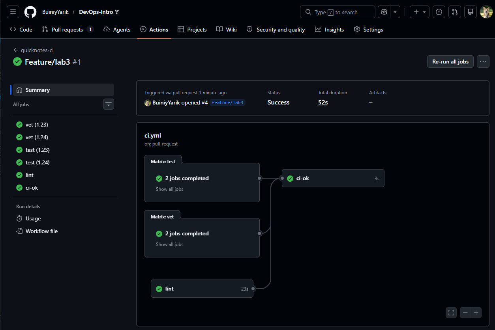
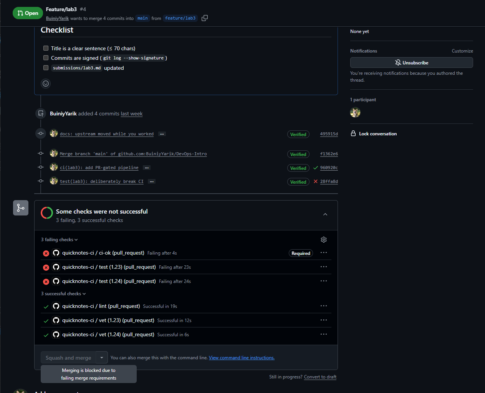

# Lab 3 Submission

## Task 1. PR Gate

### Workflow Overview

I implemented a GitHub Actions CI pipeline for QuickNotes in `.github/workflows/ci.yml`.

The workflow runs:

* `go vet ./...`
* `go test -race -count=1 ./...`
* `golangci-lint run` with pinned `golangci-lint v2.5.0`
* aggregate `ci-ok` status check

The workflow runs on:

* Pull Requests targeting `main`
* Pushes to `main`

The runtime is pinned to `ubuntu-24.04`. All GitHub Actions are pinned by full commit SHA, and the workflow uses least-privilege permissions with `contents: read`.

### Green CI Run

Workflow run:

https://github.com/BuiniyYarik/DevOps-Intro/actions/runs/27637205088

Screenshot:



### Failed CI Demonstration

To prove that the gate works, I deliberately introduced a failing test.

Failing commit:

```
28ffa8d test(lab3): deliberately break CI
```

The failing commit caused the `test` jobs and the aggregate `ci-ok` check to fail.

Screenshot:


### Recovery

I fixed the failed CI by reverting the deliberate breakage.

Fix commit:

```
83a5713 Revert "test(lab3): deliberately break CI"
```

After this revert, the CI pipeline became green again.

### Branch Protection

The `main` branch in my fork is protected with:

* Require a pull request before merging
* Require status checks to pass before merging
* Require branches to be up to date before merging

Screenshot:


### Merge Protection

When CI checks fail, the PR cannot satisfy the required checks.

Screenshot:



### Design Questions

#### a) Why pin the runner version (`ubuntu-24.04`) instead of `ubuntu-latest`?

`ubuntu-latest` is a moving target. GitHub may update it to a newer operating system version that contains different tools, libraries, or defaults. A previously green pipeline could start failing without any repository changes. Pinning `ubuntu-24.04` makes the CI environment reproducible and predictable.

#### b) Why split vet, test, and lint into separate units?

Separate jobs improve observability and allow parallel execution. If all checks are combined into one job, the first failure can stop execution and hide additional problems. Independent jobs make it easier to identify the root cause of failures and reduce overall wall-clock time through parallelism.

#### c) What real attack does SHA pinning prevent?

SHA pinning protects against supply-chain attacks where a GitHub Action tag is modified or compromised. A relevant example is the March 2025 compromise of `tj-actions/changed-files`, discussed in Lecture 3. Pinning actions to immutable commit SHAs ensures that CI executes exactly the reviewed code rather than whatever code a mutable tag may reference in the future.

#### d) What is `permissions:` and what principle is behind it?

`permissions:` controls the access rights of the automatically generated GitHub Actions token. This workflow only requires read access to repository contents, so it uses `contents: read`. This follows the principle of least privilege, which grants only the permissions necessary to perform the required task.

#### e) GitLab path: what is the difference between a stage and a job? What would `dependencies:` do that `stages:` does not?

I implemented the GitHub Actions path. In GitLab CI, a job is an individual unit of work, while a stage is a logical grouping of jobs that controls execution order. `stages:` determine when jobs run, whereas `dependencies:` determine which artifacts from previous jobs are downloaded by a later job.

---

## Task 2. Fast and Smart Pipeline

### Optimizations Applied

I applied the following optimizations:

* Enabled Go module and build caching through `actions/setup-go`.
* Added a matrix for Go 1.23 and Go 1.24.
* Set `fail-fast: false` for matrix jobs.
* Added path filters so CI runs only when application code or workflow files change.
* Added a stable `ci-ok` aggregation job for branch protection.

### Timing Measurements

The following wall-clock times were measured from GitHub Actions UI.

| Scenario                                               | Wall-clock |
| ------------------------------------------------------ | ---------- |
| Baseline (no cache, single Go version, no path filter) | 1m 14s     |
| With cache                                             | 57s        |
| With cache + matrix                                    | 1m 29s     |

Screenshots:


### Design Questions

#### f) Why cache `go.sum`-keyed inputs and not build outputs?

Caches should be keyed by deterministic inputs such as dependency versions specified in `go.sum`. Build outputs can depend on compiler versions, operating systems, environment variables, and other external factors. Reusing stale build outputs may produce incorrect or inconsistent results, while dependency caches remain predictable and safe.

#### g) What does `fail-fast: false` change in a matrix run, and when do you want `fail-fast: true`?

With `fail-fast: false`, all matrix jobs continue running even if one matrix cell fails. This provides complete diagnostic information and helps identify whether failures affect only specific environments. `fail-fast: true` is useful when reducing CI costs or waiting time is more important than collecting full failure information.

#### h) What is the risk of an attacker writing a cache from a malicious PR that protected branches later read?

The primary risk is cache poisoning. A malicious contributor could attempt to inject harmful content into a shared cache and have trusted workflows later restore it. GitHub mitigates this through cache isolation and permission boundaries, but workflows should still avoid caching untrusted build outputs and should use deterministic cache keys whenever possible.

### Optimization Discussion

Caching reduced the measured wall-clock time from 74 seconds to 57 seconds. However, QuickNotes contains almost no external dependencies, so large improvements are not expected.

The matrix increased total wall-clock time because more jobs execute. This is an intentional tradeoff that increases confidence by validating the application against multiple Go versions.

Path filters provide the largest practical productivity improvement because documentation-only changes can completely skip CI execution.

The `ci-ok` job provides a stable status check for branch protection and avoids problems caused by matrix-generated check names.

---

## Bonus Task. Pipeline Performance Investigation

### Additional Optimizations

| Optimization applied               | Before (s) | After (s) |                  Saving |
| ---------------------------------- | ---------: | --------: | ----------------------: |
| Go cache                           |         74 |        57 |                      17 |
| Parallel vet/test/lint jobs        |         74 |        57 |                      17 |
| Path filters for docs-only changes |         57 |         0 |                      57 |
| Stable `ci-ok` aggregate check     |        N/A |       N/A | Reliability improvement |

### Bottleneck Analysis

The remaining dominant cost is runner provisioning and Go toolchain setup rather than the QuickNotes application itself. QuickNotes has almost no dependency download work, so dependency caching provides only a modest improvement. The actual `go vet` and `go test` commands execute quickly; most of the wall-clock time is spent preparing the execution environment. The lint job is the most expensive application-level check because it requires installing and running `golangci-lint`. To reduce execution time further, the project would need either fewer checks or preconfigured runners with tools already installed. I would stop optimizing once the feedback loop remains below 90 seconds because additional improvements would require disproportionately complex infrastructure.

### Performance Reflection

The timing measurements show that infrastructure overhead dominates execution time for this project. Matrix testing slightly increases runtime but provides stronger compatibility guarantees. Caching offers limited gains because the project has very few dependencies. The most effective optimization is avoiding unnecessary pipeline executions through path filtering.
