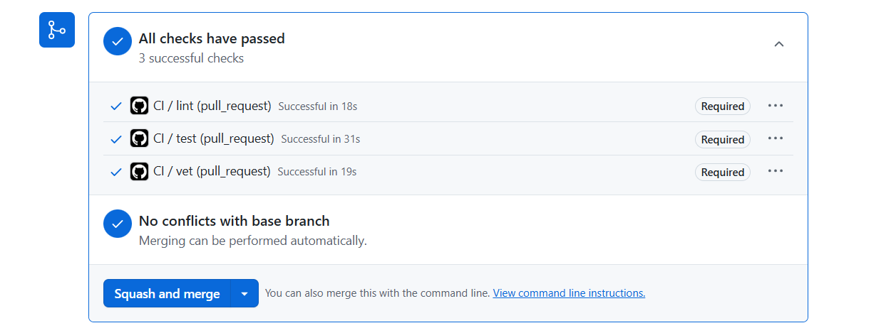
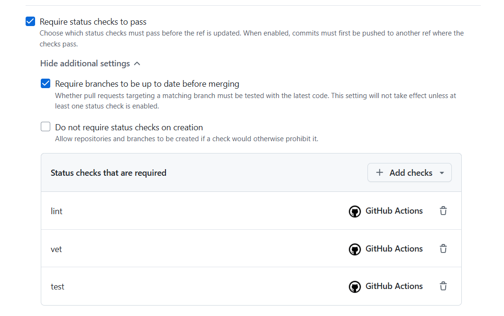

# Lab 3 Submission
## Task 1
### Path selection
**Chosen Path:** GitHub Actions

GitHub Actions is integrated directly into the ecosystem where my repository resides, making it easy to manage secrets, caching, and PR statuses without the need to configure external Runners.

### CI Run Proof
Link to Green CI Run: https://github.com/alinkaPestoletik/DevOps-Intro/actions/runs/27469724820

### Failed run & Fix
Failed run: 
Fix Commit: 

### Branch Protection

### Design Questions
* **a) Why pin the runner version?**

Using ubuntu-latest can lead to GitHub updating the image one day, and your project suddenly failing to build due to a new library version or a different compiler version.

* **b)Why split vet + test + lint into separate units?**

First, it speeds up problem detection - you immediately see which part exactly failed. Second, it allows them to be run in parallel if the CI configuration supports it.

* **c)What real attack does SHA pinning prevent?**

It protects against supply-chain attacks. Example is the tj-actions/changed-files incident (March 2025), when attackers gained control of a developer's account and added malicious code to the action tag. The SHA hash ensures that you're running the exact code you've audited.

* **d)What are permissions, and the principle behind them?**

It is a declaration of the minimum necessary access rights for a workflow. The principle is "Least Privilege": if an action doesn't need to publish anything to the repository, it's only granted contents - read.

* **e)What's the difference between a stage and a job? What would dependencies: do that stages: doesn't?**

Stages run sequentially, while jobs within a stage run in parallel. Furthermore, each job runs in its own container image, and runners can be either GitLab-hosted or self-hosted.
While stages control the execution timeline, dependencies dictate artifact inheritance. By default, jobs download artifacts from all previous stages. Using dependencies job strictly limits which previous jobs' artifacts are downloaded, optimizing network transfer and pipeline speed.

## Task 2
### 2.4 Timing Table

| Scenario | Wall-clock |
|----------|-----------:|
| Baseline (no cache, single Go version, no path filter) |       34 s |
| With cache |       35 s |
| With cache + matrix |       38 s |

> **Note on measurements:** As expected, caching barely improved the overall execution time (34s vs 35s). It is because the QuickNotes project has zero third-party dependencies (no `require` block in `go.mod`), so the module cache has nothing to store. The slight increase in the matrix scenario (38s) is due to the minor overhead of orchestrating multiple parallel jobs. Most of the time is spent on runner provisioning, checking out the code, and downloading the Go toolchain, none of which the `setup-go` cache touches.

### Applied Optimizations

1. **Caching (`actions/setup-go`):** Enabled Go module caching keyed to the `app/go.sum` file.
2. **Build Matrix:** Added a `matrix` strategy to run checks (`vet` and `test`) in parallel on Go versions 1.23 and 1.24. Set `fail-fast: false`.
3. **Path Filter:** Added path filters (`paths: - 'app/**'`) to the `on.push` and `on.pull_request` triggers. The pipeline now skips running if only root documentation files (like `README.md`) are changed.

### Design Questions

* **f) Why cache `go.sum`-keyed inputs and not build outputs?**

Inputs are deterministic. The same libraries are always downloaded in the exact same state, making them safe to cache. Build outputs, however, depend on the platform, OS, and environment. Caching build outputs often leads to subtle, non-deterministic bugs and complex cache invalidation issues.

* **g) What does `fail-fast: false` change in a matrix run, and when do you actually want `fail-fast: true`?**
  
By default (`fail-fast: true`), if one job in the matrix fails, CI immediately cancels all other running parallel jobs in that matrix. Setting `fail-fast: false` prevents this cancellation. We can see whether the code breaks only on Go 1.23 or on both toolchains. You would actually want `fail-fast: true` in heavy, commercial pipelines with very long tests, so you don't waste paid CI minutes on the remaining parallel runs if the build is already guaranteed to fail.

* **h) What's the risk of an attacker writing a cache from a malicious PR that protected branches later read?**
  
This risk is known as Cache Poisoning. An attacker could submit a malicious PR that replaces legitimate dependencies in the cache with compromised code. If the main branch later reads this poisoned cache during a build, the malicious code would execute in a trusted environment with access to secrets. GitHub Actions mitigates this by isolating caches.

## Bonus task

### B.1: Profile

*(Based on the `test (1.24)` job breakdown)*
* **Runner start:** 1 s
* **Dependency setup:** 1 s
* **Actual work:** 18 s
* **Cleanup / Artifact upload:** 0 s

### B.2: Applied Optimizations

I applied the following 3 additional optimizations:
1. **Parallel Execution (`Run lint and tests in parallel`):** Instead of running `vet`, `test`, and `lint` sequentially in one long job, they are split into three independent jobs that run concurrently on separate runners. It reduces the overall wall-clock time to the duration of the longest single job.
2. **`GOFLAGS=-buildvcs=false`:** Added as an environment variable. Since `actions/checkout` only fetches a shallow clone by default, Go's attempt to stamp the binary with VCS information can cause overhead or warnings. Disabling it speeds up `go build` and `go test` slightly.
3. **Skip docs-only changes (`Skip lint on docs-only commits`):** Implemented via GitHub Actions `paths` filter (`paths: - 'app/**'`). If a commit only changes the root `README.md` or other non-app files, the CI pipeline skips execution entirely, saving 100% of the run time for those PRs.
4. **Self-hosted runner (Mention):** As noted in the lab constraints, migrating to a pre-warmed self-hosted runner would significantly reduce the cloud environment provisioning overhead. However, maintaining custom infrastructure for a project of this size is overkill, so I opted to stay on GitHub-hosted runners while acknowledging this architectural tradeoff.

### B.3: Present before/after

| Optimization applied | Before (s) | After (s) |         Saving |
|----------------------|-----------:|----------:|---------------:|
| Parallelizing vet, test, lint |       ~ 79 |        38 |           - 41 |
| GOFLAGS=-buildvcs=false |         38 |        44 | + 6 (variance) |
| Skip docs-only changes |         44 |        40 |            - 4 |
| **Total wall-clock** |   **~ 79** |    **40** |       **- 39** |

### B.4: Bottleneck Analysis

Looking at the profiling data, the single step that dominates the remaining time is the actual work execution (`go test -race`), taking 18 seconds (90% of the individual job's time). The runner setup and checkout phases are extremely fast (1-2 seconds). To make the pipeline shorter by changing the `QuickNotes` code itself, we would need to optimize the unit tests — for example, by removing artificial `time.Sleep` calls, mocking heavy database/I/O operations, or running test suites in parallel internally. However, my team would stop optimizing at this point. A 40-second total wall-clock time is already incredibly fast for a CI pipeline, and the engineering effort required to shave off another 5–10 seconds is not justified by the minimal time saved.