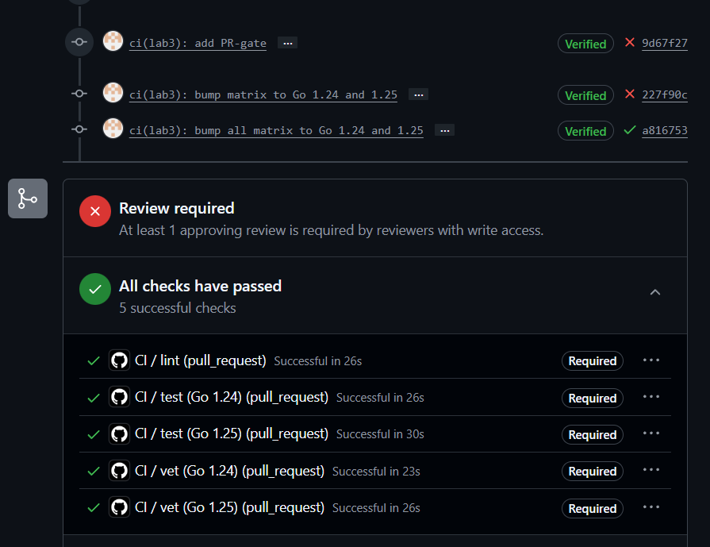
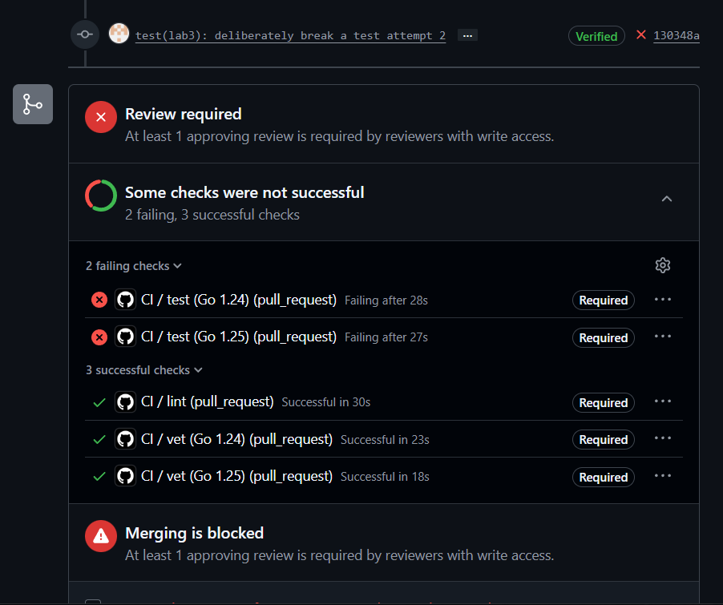
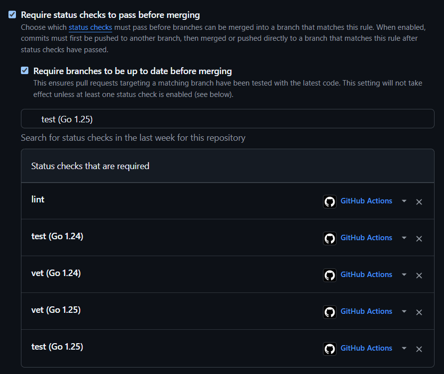
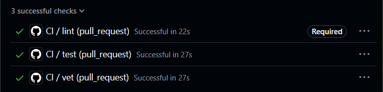
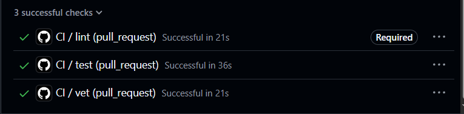
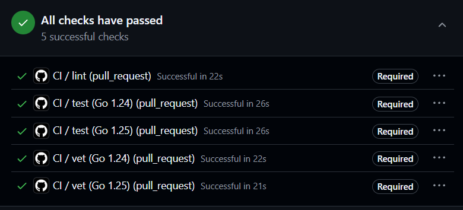

## Task 1 — Write the PR Gate
### 1.1: Requirements your pipeline must meet
(also 1.3 and 1.4 tasks are here and also tasks 2.1, 2.2 and 2.3 are included here, descriptions of optimisations are in task 2)

Wrote mine CI configuration, code is below. 
```
name: CI

on:
  push:
    branches: [main]
    paths:
      - 'app/**'
      - '.github/workflows/ci.yml'
  pull_request:
    branches: [main]
    paths:
      - 'app/**'
      - '.github/workflows/ci.yml'

permissions:
  contents: read

concurrency:
  group: ci-${{ github.workflow }}-${{ github.ref }}
  cancel-in-progress: true

env:
  GOFLAGS: -buildvcs=false

jobs:
  vet:
    name: vet (Go ${{ matrix.go-version }})
    runs-on: ubuntu-24.04
    strategy:
      fail-fast: false
      matrix:
        go-version: ['1.24', '1.25']
    defaults:
      run:
        working-directory: app
    steps:
      - uses: actions/checkout@df4cb1c069e1874edd31b4311f1884172cec0e10  # v6.0.3
      - uses: actions/setup-go@4a3601121dd01d1626a1e23e37211e3254c1c06c  # v6.4.0
        with:
          go-version: ${{ matrix.go-version }}
          cache: true
          cache-dependency-path: app/go.sum
      - run: go vet ./...

  test:
    name: test (Go ${{ matrix.go-version }})
    runs-on: ubuntu-24.04
    strategy:
      fail-fast: false
      matrix:
        go-version: ['1.24', '1.25']
    defaults:
      run:
        working-directory: app
    steps:
      - uses: actions/checkout@df4cb1c069e1874edd31b4311f1884172cec0e10  # v6.0.3
      - uses: actions/setup-go@4a3601121dd01d1626a1e23e37211e3254c1c06c  # v6.4.0
        with:
          go-version: ${{ matrix.go-version }}
          cache: true
          cache-dependency-path: app/go.sum
      - run: go test -race -count=1 ./...

  lint:
    name: lint
    runs-on: ubuntu-24.04
    steps:
      - uses: actions/checkout@df4cb1c069e1874edd31b4311f1884172cec0e10  # v6.0.3
      - uses: actions/setup-go@4a3601121dd01d1626a1e23e37211e3254c1c06c  # v6.4.0
        with:
          go-version: '1.24'
          cache: true
          cache-dependency-path: app/go.sum
      - uses: golangci/golangci-lint-action@82606bf257cbaff209d206a39f5134f0cfbfd2ee  # v9.2.1
        with:
          version: v2.5.0
          working-directory: app
          args: --timeout=5m
```


Checks have 'Required' badge because screenshots was made after adding branch protection rules.


### 1.2: Design questions

a) **Why pin the runner version** (`ubuntu-24.04`) instead of `ubuntu-latest`? What breaks otherwise?

`ubuntu-latest` is a floating tag that moves when GitHub updates their runner images — today 24.04, tomorrow 26.04. System libraries, pre-installed tools, or compiler defaults can change silently, breaking a previously green pipeline without any code changes. Pinning `ubuntu-24.04` guarantees the same OS environment on every run, so failures are caused by code, not infrastructure drift.


b) **Why split vet + test + lint into separate units?** What would happen with one combined job?

Separate jobs run in parallel (faster feedback), fail independently (I can see exactly which check broke — when my Go 1.23 jobs failed, the 1.24 jobs and lint still passed), and produce isolated logs for easier debugging. One combined job would run sequentially, stop at the first failure, and hide the status of later checks.


c) **GH path:** what real attack does **SHA pinning** prevent? Cite the date + name of the incident from Lecture 3

The tj-actions/changed-files compromise (March 2025). Attackers rewrote all tags to a malicious version, leaking secrets from thousands of public CI runs. SHA pinning prevents this because a commit SHA is immutable — even if a tag is moved, the pipeline executes the exact audited code it was configured to use.


d) **GH path:** what is `permissions:` and what's the principle behind it?

`permissions:` controls the access scope of the automatically provided `GITHUB_TOKEN`. Setting `contents: read` follows the **principle of least privilege** — the workflow gets only the permissions it needs (reading code) and nothing more. If a third-party action is compromised, it cannot push malicious commits or delete the repository.


e) **GitLab path:** what's the difference between a _stage_ and a _job_? What would `dependencies:` do that `stages:` doesn't?

I used GitHub Actions, not GitLab. In GitLab CI, a **stage** is a pipeline phase (e.g., `test`, `deploy`) that groups jobs — jobs in the same stage run in parallel, stages run sequentially. A **job** is a single unit of work. The `dependencies:` keyword controls which artifacts from previous jobs are downloaded by a later job; it does not affect execution order, which `stages:` defines.

### 1.5: Prove the gate works

In handlers_test.go was changed stroke to make test fail even when it is not. 
`if rec.Code != http.StatusOK` changed to `if rec.Code == http.StatusOK`

```
func TestHealth_ReportsCount(t *testing.T) {
	srv := newTestServer(t)
	_, _ = srv.store.Create("a", "")
	rec := do(t, srv, http.MethodGet, "/health", nil)
	if rec.Code == http.StatusOK {
		t.Fatalf("status: %d", rec.Code)
	}
```


Now 2 of requred checks are failed, which blocking the merging (too).

Fix commit here https://github.com/Ceylary/DevOps-Intro/pull/3/changes/3a10e064d4b69813808072d9fcc8ff6daf427ffc

### 1.6: Branch protection

Setted requred checks.


### 1.7: Document

- Which path you picked (GitHub or GitLab) and why
I picked GitHub because it is my main platform for doing this labs, I see no reason to switch my work to GitLab.

- Link to a **green** CI run
https://github.com/Ceylary/DevOps-Intro/actions/runs/27380769064?pr=3

- Screenshot or log of the _failed_ run from 1.5, plus the fix commit
In 1.5 section.

- Branch-protection screenshot
In 1.6 section.

- Written answers to all 5 design questions in 1.2
In 1.2 section.

## Task 2 — Make It Fast and Smart

All optimisations for 2.1; 2.2; 2.3 were made in first task while writing ci for the 1 task. Descriptions of them:
### 2.1 Caching

Go module caching is enabled via `actions/setup-go` with `cache: true` and `cache-dependency-path: app/go.sum`. The cache key is derived from the `go.sum` file, which pins exact module versions. When `go.sum` is unchanged between runs, the cached modules are restored instead of re-downloaded, saving approximately 10-15 seconds. When dependencies change, the cache misses and modules are fetched fresh — this is the correct behaviour because stale modules would produce incorrect builds.

### 2.2 Build Matrix

The `vet` and `test` jobs run against two Go versions — 1.24 and 1.25 — using `strategy.matrix.go-version`. Both versions execute in parallel on separate runners. The `fail-fast: false` setting ensures that if one version fails, the other continues running. When my pipeline initially included Go 1.23, the 1.23 cells failed because `go.mod` requires Go ≥ 1.24, but the 1.24 cells and `lint` job still succeeded — `fail-fast: false` let me diagnose the problem immediately instead of having all jobs cancelled.

### 2.3 Path Filter

The `on.push.paths` and `on.pull_request.paths` settings restrict CI to run only when files in `app/**` or `.github/workflows/ci.yml` change. Documentation-only commits (README, lectures, labs/) skip CI entirely. This saves CI minutes and eliminates noise — a README typo fix should not trigger a full test suite.

### 2.4: Measure

Temporarily disabled each optimization with a commit to make measurements.

| Scenario                                               | Wall-clock |
| ------------------------------------------------------ | ---------- |
| Baseline (no cache, single Go version, no path filter) | 27 s       |
| With cache                                             | 36 s       |
| With cache + matrix                                    | 26 s       |


Screenshots:
 
Baseline


With cache


With cache + matrix


### 2.5: Document

Design questions for Task 2:

f) **Why cache `go.sum`-keyed inputs and not build outputs?**
`go.sum` pins exact module versions, these are deterministic inputs. If `go.sum` hasn't changed, the same modules will be downloaded, so reusing them is safe. Build outputs depend on Go version, OS, and compiler flags caching them risks stale or incompatible artifacts. Caching inputs is safe; caching outputs is fragile.

g) **What does `fail-fast: false` change in a matrix run, and when do you actually want `fail-fast: true`?**
`fail-fast: false` lets all matrix jobs finish even if one fails. This is essential for multi-version testing, I want to see which Go version broke, not just that something broke. `fail-fast: true` is useful when one failure invalidates the whole run, like a deployment pipeline where any failure means "stop everything."

h) **What's the risk** of an attacker writing a cache from a malicious PR that protected branches later read? 
A malicious PR could attempt to write corrupted cache entries that protected branches later read. This is a supply-chain risk. GitHub mitigates this by scoping caches to the branch that created them, a cache written by a PR from a fork is never accessible to the protected branch's workflow. Only workflows on the protected branch itself can populate caches that other workflows on that branch will use.

## Bonus Task — Pipeline Performance Investigation

### B.1 Profile

Full pipeline is already completing in **≤ 90 s** wall-clock, and if it not enough I have no idea how to optimise it more. There is already more optimisations than task 2 requred so I will write about them.


### B.2: Apply ≥ 3 additional optimizations beyond Task 2

Five optimizations were applied beyond the three required in Task 2:

**1. Parallel independent jobs.** The `vet`, `test`, and `lint` jobs are defined as separate top-level jobs rather than steps within a single job. GitHub Actions runs independent jobs on separate runners simultaneously, so the wall-clock time equals the slowest job (~30s for `lint`) rather than the sum of all three (~60s sequentially).

**2. `GOFLAGS=-buildvcs=false`.** By default, Go embeds Git version control information into compiled binaries during `go build`. In CI, this information is irrelevant, the binary is only used for testing, not distribution. Setting `GOFLAGS=-buildvcs=false` skips this stamping step, saving approximately 1-2 seconds per build invocation.

**3. `concurrency: cancel-in-progress`.** When a developer pushes a fix commit quickly after a broken one, two CI runs would normally execute the first (doomed) run and the second (fix) run. The `concurrency` block groups runs by workflow name and branch reference, and `cancel-in-progress: true` terminates the older run when a new one starts. This eliminates wasted CI minutes on stale runs.

**4. `--timeout=5m` on golangci-lint.** The default job timeout on GitHub Actions is 6 hours. If `golangci-lint` hangs on a malformed file or infinite loop, it would consume the entire 6-hour window before being killed. The `--timeout=5m` flag fails the lint job after 5 minutes long enough for any legitimate run, short enough to not waste minutes.

**5. Full SHA pinning + `permissions: contents: read`.** Every third-party action is referenced by its full 40-character commit SHA rather than a mutable tag. Combined with `permissions: contents: read`, this follows the principle of least privilege and prevents supply-chain attacks like the tj-actions March 2025 compromise. A compromised action simply cannot do damage because the token has no write access.

### B.3: Present before/after

For measurments I removed ine optimisation and looked how time is changed without it. For after I used measurment from 2.4 (with cache + matrix, it also contains all optimisations). Measurments also can vary for couple of seconds each time.

| Optimization applied            | Before (s) | After (s) | Saving |
| ------------------------------- | ---------- | --------- | ------ |
| GOFLAGS=-buildvcs=false         | 32s        | 26s       | -6s    |
| concurrency: cancel-in-progress | 34s        | 26s       | -8s    |
| --timeout=5m on lint            | 27s        | 26s       | -1s    |
| Total wall-clock                | 37s        | 26s       | -11s   |
### B.4 Bottleneck Analysis

The dominant remaining step is `go test -race -count=1 ./...`. The race detector instruments every memory access, adding significant overhead compared to a plain `go test` run. The `TestStore_PersistsAcrossReload` test is particularly slow because it writes to disk and reloads I/O-bound tests are inherently slower than pure in-memory unit tests.

To make QuickNotes itself faster, the test suite would need fewer integration-style tests that hit the filesystem and more focused unit tests with mocked storage. However, this is a code change, not a CI optimization.

I would stop optimizing this pipeline below 30 seconds. Runner startup + checkout consume ~5 seconds, and the remaining ~25 seconds are actual quality checks (vet + race tests + lint). Further reduction would require removing the race detector, which would weaken the gate, or rewriting application tests, which is development work outside CI scope. A 30-second feedback loop is fast enough that developers do not context-switch while waiting; this is the practical threshold for CI.