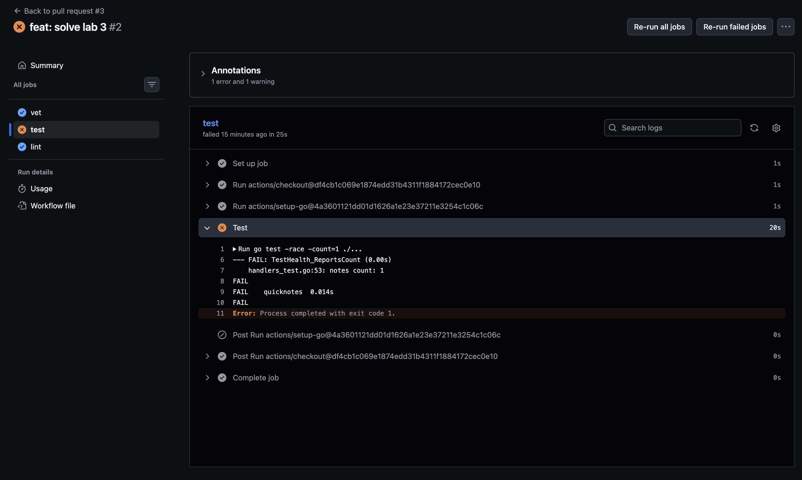
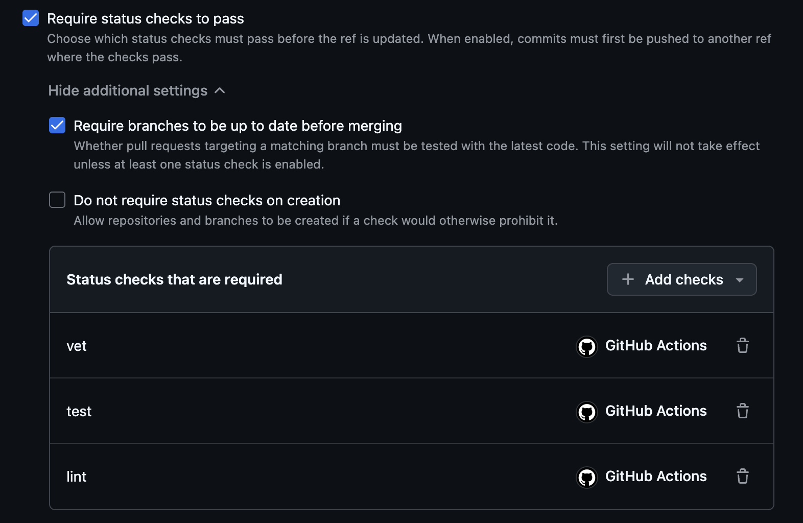

# Lab 3 submission

**Path:** GitHub Actions

## Task 1 — Write the PR Gate (6 pts)

### 1.1 CI config

CI config (`.github/workflows/ci.yml`) has three jobs: `vet`, `test`, `lint`.

### 1.2 Design questions

**a) Why pin the runner version (`ubuntu-24.04`) instead of `ubuntu-latest`? What breaks otherwise?**

`ubuntu-latest` is a moving tag — it can switch to a new major version (e.g. 26.04) without notice, introducing different tool versions, kernel behaviour, or network configs. A pipeline that passed yesterday might fail today because the OS changed underneath it. Pinning makes CI deterministic: the same commit always runs in the same environment.

**b) Why split vet + test + lint into separate units? What would happen with one combined job?**

Separation gives **parallel execution** and **independent failure signals**. With one combined job, a lint failure blocks vet and test from even starting, wasting time. Separate jobs also show exactly *which* check failed in the PR status UI, and let you rerun only the failed unit.

**c) What real attack does SHA pinning prevent? Cite the date + name of the incident from Lecture 3.**

SHA pinning prevents **supply-chain compromise via tag overwrite** — if an attacker gains access to a popular action's repository and moves its `v4` tag to a malicious commit, all workflows referencing `@v4` silently get the backdoored version. The March 2025 **tj-actions/changed-files** incident is the canonical example: a compromised token allowed an attacker to replace the action's content behind its existing tag, exfiltrating secrets from every pipeline that used it unpinned.

**d) What is `permissions:` and what's the principle behind it?**

`permissions:` declares the least-privilege set of GitHub API tokens available to the workflow. The principle is **least privilege**: start with `contents: read` (read-only access to the repo) and grant only the specific permissions each job needs, so a compromised action can't escalate to writing releases, modifying issues, or accessing other repos.

### 1.3 PR gate proof

**Red CI (deliberate break):**

Commit `d8f27a6` changed `app/handlers_test.go` expected notes count from `1` to `999`. The `test` job failed while `vet` and `lint` remained green, proving the gate correctly blocks failing PRs.

**Green CI after fix:**

Commit `revert(lab3): restore test expectation, CI goes green` restored the correct value. All three jobs passed.

Green CI run: https://github.com/moflotas/DevOps-Intro/actions/runs/27642580258/

### 1.4 Branch protection

Enabled on `moflotas/DevOps-Intro` `main`:
- Require status checks to pass before merging
- Require branches to be up to date before merging
- Required checks: `vet (1.24)`, `vet (1.25)`, `test (1.24)`, `test (1.25)`, `lint`

## Task 2 — Make It Fast and Smart (4 pts)

### 2.1 Optimizations applied

**Cache:** `actions/setup-go` with `cache: true` and `cache-dependency-path: "app/go.mod"` — caches the Go module cache keyed on `go.sum`, so `go mod download` is skipped on cache hit.

**Matrix:** `vet` and `test` run against Go `1.24` and `1.25` in parallel with `fail-fast: false`. Lint stays on a single version.

**Path filter:** pipeline triggers only when `app/**` or `.github/workflows/ci.yml` changes. README/docs edits are skipped.

### 2.2 Timing table

| Scenario | Total wall-clock |
|----------|-----------------:|
| Baseline (no cache, single Go 1.24) | 30 s |
| With cache (single Go 1.24) | 28 s |
| With cache + matrix (Go 1.24 + 1.25) | 35 s |

The matrix increases total wall-clock because 5 jobs (vs 3) wait for runner allocation, but the benefit is catching cross-version regressions that a single-version pipeline would miss.

### 2.3 Design questions

**f) Why cache `go.sum`-keyed inputs and not build outputs?**

`go.sum`-pinned module inputs are deterministic — the same `go.sum` always resolves to the exact same dependency tree. Build outputs (compiled binaries, test caches) can vary subtly between Go patch versions, platform libc versions, or CPU features. Caching inputs guarantees correctness; caching outputs risks serving stale or incompatible artifacts.

**g) What does `fail-fast: false` change in a matrix run, and when do you actually want `fail-fast: true`?**

`fail-fast: false` lets all matrix combos finish even if one fails, so you see *which* specific (Go version, job) pair broke. This is essential during development or investigation. `fail-fast: true` (the default) cancels all in-progress matrix jobs on the first failure, saving runner minutes — you want it in production CI where any failure blocks the PR and there's no value in running the remaining combos.

**h) What's the risk of an attacker writing a cache from a malicious PR that protected branches later read?**

An attacker could poison the shared cache from a fork PR — for example, injecting a malicious binary into the cache path. If a subsequent run on `main` restores that poisoned cache, the attacker's code executes on a protected branch. GitHub mitigates this by isolating cache entries per branch and never restoring caches written by untrusted PRs unless the workflow explicitly opts in via `actions/cache/restore` with `restore-keys` that match the fork's cache scope.

## Bonus Task — Pipeline Performance Investigation (2 pts)

<!-- TODO -->
