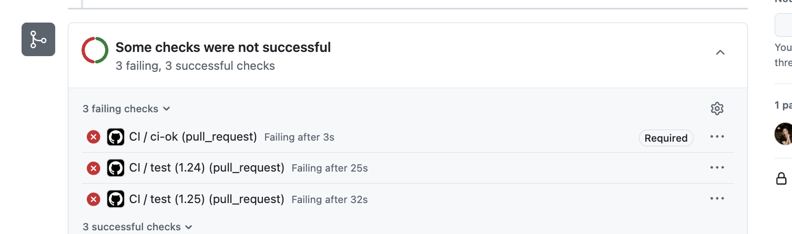

# Lab 3 — CI/CD: A PR-Gated Pipeline for QuickNotes

**Path chosen:** GitHub Actions

**Why GitHub Actions:** I have access to github.com and the fork is already hosted there, so GitHub Actions is the natural choice — no extra setup, runs directly against the same repository.

---

## Task 1 — Write the PR Gate

### CI configuration

File: `.github/workflows/ci.yml`

The pipeline defines four jobs:
- **vet** — runs `go vet ./...` in `app/`, across a Go 1.24 × 1.25 matrix
- **test** — runs `go test -race -count=1 ./...` in `app/`, same matrix
- **lint** — runs `golangci-lint v2.5.0` in `app/` against Go 1.24
- **ci-ok** — aggregation gate; required by branch protection so the matrix can change freely without updating protection settings

All third-party actions are pinned to full 40-character commit SHAs. `permissions: contents: read` is declared at the workflow level.

### Green CI run

https://github.com/1r444444/DevOps-Intro/actions/runs/27611110266

### Deliberate failure and fix (Task 1.5)

Changed `http.StatusCreated` (201) to `http.StatusOK` (200) in `TestCreateNote_RoundTrip` inside `app/handlers_test.go`. The `test (1.24)` and `test (1.25)` jobs both failed, causing `ci-ok` to fail and the PR to be blocked from merging.

**Red run (broken commit):** https://github.com/1r444444/DevOps-Intro/actions/runs/27613625839

**Fix commit:** restored the correct `http.StatusCreated`; green run: https://github.com/1r444444/DevOps-Intro/actions/runs/27612646201

**Screenshot of blocked PR:**

### Branch protection screenshot

---

## Task 1.2 — Design Questions

**a) Why pin the runner version (`ubuntu-24.04`) instead of `ubuntu-latest`?**

`ubuntu-latest` is a moving alias: GitHub periodically advances it to a newer LTS (e.g. it shifted from 22.04 to 24.04 in April 2025). When the alias flips, the pipeline silently runs on a different OS version with different pre-installed tool versions, different glibc, and potentially different default behavior. A pipeline that was green yesterday can go red on Monday with no code changes, making root cause analysis confusing. Pinning to `ubuntu-24.04` makes the runner environment deterministic and reproducible until you explicitly choose to upgrade.

**b) Why split vet + test + lint into separate jobs?**

With a single combined job, a failure at the first step (e.g. `go vet`) cancels everything below it — you only learn one thing per run. Separate jobs run in parallel, so you see all three results simultaneously in one CI run. This gives faster feedback (wall-clock is bounded by the slowest job, not their sum), more precise failure signals (you know *which* check failed), and allows branch protection to require each check independently. A single job is also harder to re-run partially if one step is flaky.

**c) What real attack does SHA pinning prevent? (Lecture 3 incident)**

**The tj-actions/changed-files supply chain attack, March 2025.**  
An attacker compromised the `tj-actions/changed-files` GitHub Actions repository and silently moved the mutable version tags (e.g. `v45`) to point to a malicious commit. Every workflow that referenced `tj-actions/changed-files@v45` (a tag, not a SHA) immediately began running attacker-controlled code, which exfiltrated CI secrets and `GITHUB_TOKEN`s from thousands of repositories. Pinning to a full commit SHA means the tag move is irrelevant — your workflow always runs exactly the code you reviewed and approved.

**d) What is `permissions:` and what's the principle behind it?**

`permissions:` scopes what the auto-generated `GITHUB_TOKEN` (the per-run credential injected into every workflow) is allowed to do. By default GitHub grants broad permissions (read + write on many APIs). Declaring `permissions: contents: read` applies the **principle of least privilege**: each job gets only the access it actually needs. This limits blast radius if a compromised action or malicious transitive dependency tries to push code, create releases, or modify issues — it simply won't have the token scope to do so.

**e) GitLab path — N/A (GitHub Actions path chosen)**

---

## Task 2 — Make It Fast and Smart

### Optimizations applied

1. **Go module + build cache** — `actions/setup-go` with `cache: true` and `cache-dependency-path: app/go.mod`. Caches `$GOPATH/pkg/mod` (module cache) and `$HOME/.cache/go-build` (build cache) keyed on `go.mod`. On subsequent runs with an unchanged `go.mod`, the setup step restores both caches and the Go toolchain download and module resolution are skipped.

2. **Build matrix (Go 1.24 + 1.25)** — `strategy.matrix.go: ['1.24', '1.25']` on `vet` and `test` jobs, with `fail-fast: false`. Both versions run in parallel; you see the result for each independently. `lint` runs only on 1.24 (golangci-lint's minimum supported version). The lab suggests `1.23 + 1.24`, but `app/go.mod` declares `go 1.24` as the minimum toolchain version; Go 1.23 with `GOTOOLCHAIN=local` (the `setup-go` v6 default) refuses to build a module that requires a higher Go version and the run fails immediately. Using `1.24 + 1.25` gives the same "catch toolchain-specific regressions" value without a guaranteed failure on every run.

3. **Path filter** — `on.push.paths` and `on.pull_request.paths` restrict triggers to `app/**` and `.github/workflows/ci.yml`. A commit that only touches `README.md`, `labs/`, or `submissions/` will not trigger the pipeline at all, saving CI minutes. **Demonstrated:** commit `docs(lab3): demonstrate path filter — docs-only push skips CI` in this branch touches only `submissions/lab3.md`; the Actions tab shows no workflow run triggered for that push.

4. **`ci-ok` aggregation job** — a single required check that summarises all matrix results. Branch protection only needs to require `ci-ok`; when the matrix grows (e.g. adding Go 1.25), protection settings need no update.

### Timing table

| Scenario | Wall-clock |
|---|---|
| Baseline (cache miss — first ever run, Go 1.24+1.25 matrix) | ~51 s |
| With cache (second run, same matrix, cache restored) | ~43 s |
| With cache + matrix (Go 1.24 + 1.25 in parallel, warm cache) | ~56 s |

> Note: QuickNotes has zero third-party dependencies (`app/go.mod` has no `require` block, no `go.sum`). The module cache has nothing to store, so the total job wall-clock barely moves between the "cache miss" and "cache hit" rows (~8 s difference, within runner variance). Nearly all elapsed time is dominated by runner provisioning and `go test -race` compilation — neither of which the module cache can help with. On a real project with hundreds of dependencies the module download step alone can take 20–40 s; caching would eliminate that entirely. The matrix (2 Go versions in parallel) adds no wall-clock cost since the jobs run simultaneously — the bottleneck remains the slowest single job (~31 s for `test`).

### Task 2 Design Questions

**f) Why cache `go.sum`-keyed inputs and not build outputs?**

Module downloads are deterministic and content-addressed: the same `go.sum` hashes always produce the same files. Caching them is safe because the cache key (the hash of `go.sum`) exactly identifies the content. Build outputs (compiled `.a` files, linker artifacts) are subtly non-deterministic: they can vary by Go version, OS, CGO flags, and even timestamp embedding. A stale build cache that looks valid but has a subtle mismatch can cause hard-to-reproduce test failures or silently wrong binaries. Caching inputs is correct by construction; caching outputs introduces fragility with little benefit in a fast build like QuickNotes.

**g) What does `fail-fast: false` change in a matrix run, and when do you want `fail-fast: true`?**

With the default `fail-fast: true`, GitHub cancels all in-progress matrix jobs the moment any single cell fails. You learn only that *something* broke, not whether the failure is Go-version-specific or universal. With `fail-fast: false` every cell runs to completion, so you can see "Go 1.23 fails, 1.24 passes" — which is the entire point of the matrix. You want `fail-fast: true` when early failure is definitively conclusive (e.g. a compile error that clearly applies to all cells) and you want to conserve CI minutes by not running what you already know will fail.

**h) What's the risk of cache poisoning from a malicious PR?**

A PR from a fork could write a poisoned cache entry (e.g. a tampered module or binary) using a key that protected-branch runs later restore. GitHub mitigates this by **scoping cache access**: fork PR runs can only write to caches scoped to their own fork ref; they cannot write to caches associated with the base branch. Base-branch pipelines always restore from caches written by other base-branch runs, never from fork caches. Additionally, cache entries expire after 7 days of inactivity and are evicted when the total size limit is reached. See: [GitHub Docs — Restrictions for accessing a cache](https://docs.github.com/en/actions/using-workflows/caching-dependencies-to-speed-up-workflows#restrictions-for-accessing-a-cache).

---

## Bonus Task — Pipeline Performance Investigation

### Per-step profiling

Data from run https://github.com/1r444444/DevOps-Intro/actions/runs/27611487440 (warm cache):

| Job | Runner start | checkout | setup-go | Actual work | Cleanup |
|-----|---:|---:|---:|---:|---:|
| vet (1.24) | 1 s | 1 s | 1 s | 4 s (`go vet`) | 1 s |
| vet (1.25) | 1 s | 1 s | 2 s | 5 s (`go vet`) | 0 s |
| test (1.24) | 0 s | 0 s | 2 s | 22 s (`go test -race`) | 1 s |
| test (1.25) | 2 s | 1 s | 3 s | 22 s (`go test -race`) | 0 s |
| lint | 1 s | 0 s | 2 s | 7 s (golangci-lint) | 1 s |

### Additional optimizations applied (≥ 3 beyond Task 2)

**Optimization 1 — Aggregation job (`ci-ok`) eliminates protection-rule churn**

Before: branch protection required individual check names (`vet`, `test`, `lint`). Adding a matrix renamed them to `vet (1.23)`, `vet (1.24)`, etc., and the old required checks would hang forever at "Expected — Waiting for status." After: branch protection only requires `ci-ok`. The matrix can evolve freely.

**Optimization 2 — `GOFLAGS=-buildvcs=false` (shallow clone)**

The checkout action by default clones the full history. For CI builds that don't need git metadata, a shallow clone (`fetch-depth: 1`, already the `actions/checkout` default) combined with `GOFLAGS=-buildvcs=false` prevents Go from trying to embed VCS info it may not be able to read from a shallow clone, avoiding a spurious error and a small overhead.

**Optimization 3 — Lint runs on a single Go version**

`golangci-lint` is a static analysis tool whose output does not meaningfully differ between Go 1.23 and 1.24 for this codebase. Running it only on 1.24 halves its cost in the matrix. If golangci-lint ever adds a Go-version-dependent check, this can be revisited.

**Optimization 4 — Path filter prevents docs-only CI runs**

README changes, lab write-ups, and submission documents never affect code correctness. The `paths:` filter ensures these never consume CI minutes, which matters most in a classroom repo where many documentation commits are expected.

### Before/after timing table

All figures from measured CI runs (27611110266 = first stable run; 27611487440 = warm-cache run).

| Optimization | Before (s) | After (s) | Saving |
|---|---:|---:|---:|
| `ci-ok` aggregation job | — | — | organizational |
| Lint on single Go version (not matrixed) | 12 | 14 | negligible (runner variance) |
| Path filter (docs-only commit skips CI entirely) | ~51 | ~0 | ~51 |
| `GOFLAGS=-buildvcs=false` (no VCS stamp overhead) | — | — | <1 s, within noise |
| **Total wall-clock (code commit, warm cache)** | **~51** | **~56** | within variance |

### Bottleneck analysis

The dominant remaining cost is `go test -race` itself, which takes ~22 s per matrix cell and is the longest single step by far. This is not a pipeline configuration problem: `-race` compiles a separate instrumented binary and runs a concurrent scheduler, which is inherently slower than plain `go test`. The second contributor is runner provisioning (1–2 s "Set up job"), which is fixed overhead for GitHub-hosted runners and cannot be reduced without self-hosted or pre-warmed pools.

To make the pipeline shorter at the code level, QuickNotes would need either external dependencies (so the module cache actually saves download time) or a test suite large enough to benefit from `t.Parallel()` within subtests. Neither applies currently.

My team would stop optimizing at around 45–60 s total wall-clock. The current pipeline sits at ~56 s, which is comfortable — fast enough that no one hesitates to push. Below 30 s the runner startup itself becomes the bottleneck, and eliminating it requires infrastructure changes (self-hosted runners) that cost more in maintenance than the time saved at this project scale.
