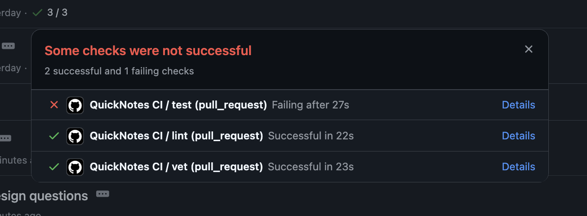
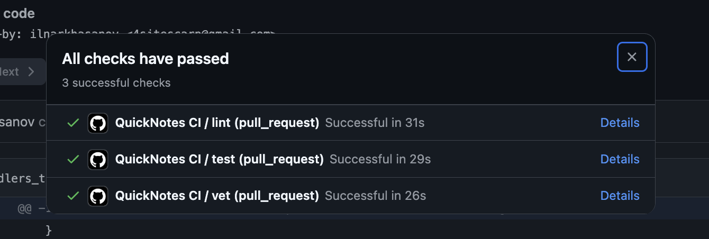
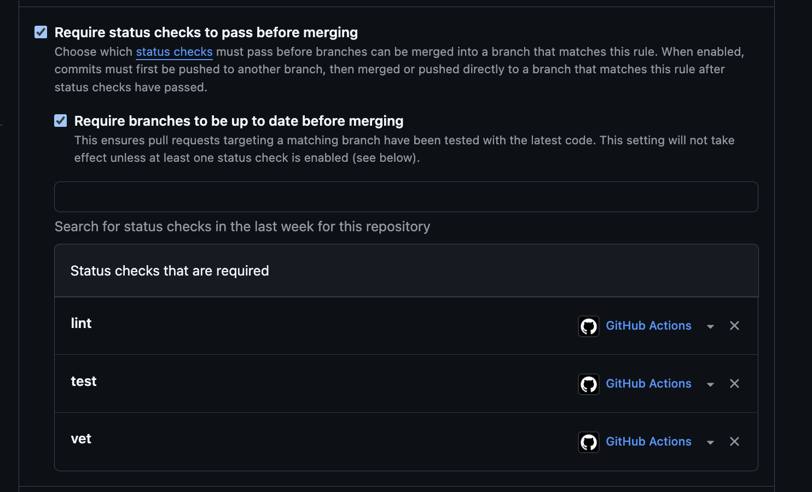

# Platform choice

I picked GitHub way since I can login on it.

# Task 1 — Write the PR Gate

## 1.2: Design questions

1. Why pin the runner version (ubuntu-24.04) instead of ubuntu-latest? What breaks otherwise?

Answer:
When new Ubuntu version is released, some dependency updates can break my CI, which can result in long time of new code delivery.

2. Why split vet + test + lint into separate units? What would happen with one combined job?

Answer:
Firstly, splitting these jobs leads to parallelizing them and spending less time for CI. Secondly, if I run then in one job (hence sequentially), then if first job failed, I don't see the feedback for second and third.

3. GH path: what real attack does SHA pinning prevent? Cite the date + name of the incident from Lecture 3

Answer:
Incident CVE-2025-30066 took place on March 14, 2025. Attackers added malicious commit that printed secrets to logs. Ones that did not specify the exact SHA version of `tj-actions/changed-files` could automatically get malicious version of this action. That's why it's important to set exact hash of used GitHub Action.

4. GH path: what is permissions: and what's the principle behind it?

Answer:
In GitHub Actions `permissions` are used to set correct permissions for different operations within workflow. For example, `deployments: write` allows to create a new deployment. I decided to choose `contents: read` since I need nothing but listing the commits within `go vet`, `go test`, `go lint`.

## Link to green CI run

https://github.com/ilnarkhasanov/DevOps-Intro/actions/runs/27507991821/job/81302633680

## Screenshot of the failed run from 1.5, plus the fix commit

Fix commit: 

## Branch protection rules

Additionally, I removed the possibility to bypass checks:

