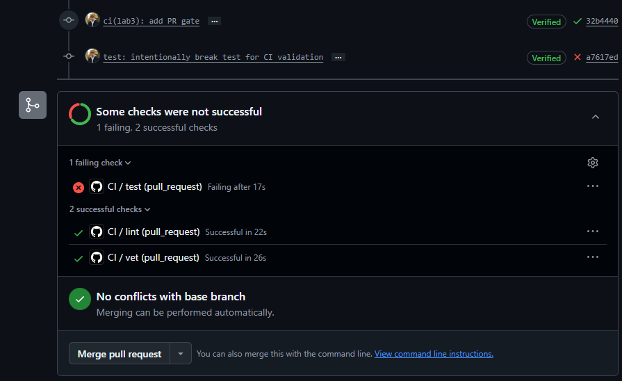
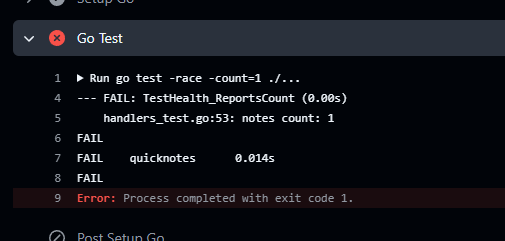
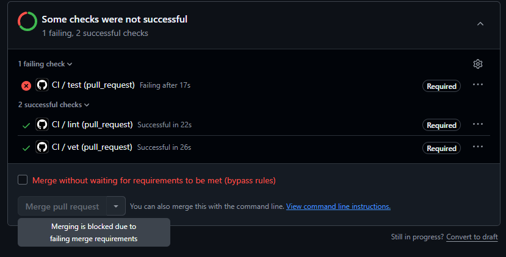
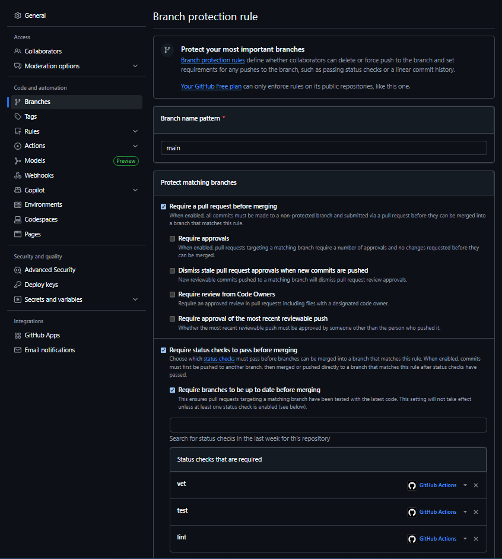

# Lab 3 Submission

## Task 1

### Selected Path

**Path:** GitHub Actions

I selected GitHub Actions because I already use GitHub for the course repository (and already used it for Lab 1 and 2). Additionaly, it provides integrated CI/CD functionality directly within the platform.

---

### Green CI Run

**Successful CI Run:**

[Green CI Link](https://github.com/G-Akleh/DevOps-Intro/actions/runs/27634117738)

The workflow executes three independent jobs:

* `vet` → `go vet ./...`
* `test` → `go test -race -count=1 ./...`
* `lint` → `golangci-lint run`

All jobs must pass before a pull request can be merged into `main`.

---

### CI Failure Demonstration

To verify that the pull request gate correctly blocks faulty code, I modified a test to force a failure (in app/handlers_test.go)

#### Failed Workflow Run

#### Test Failure Output

#### Blocked Merge Due to Failed Checks

The branch protection rule prevented merging while the required status checks were failing.

#### Fix Commit

The failing test was reverted in a follow-up commit:

[Failure Fix Commit Link](https://github.com/G-Akleh/DevOps-Intro/pull/3/changes/4bdf08e10689d9bc0f760cad1b85412eb21e1083)

After restoring the correct test logic, all workflow checks passed successfully.

---

### Branch Protection Configuration

The following branch protection rule was configured for the `main` branch:

* Require a pull request before merging
* Require status checks to pass before merging
* Require branches to be up to date before merging
* Required checks:

  * `vet`
  * `test`
  * `lint`

---

### 1.2: Design Questions

#### a) Why pin the runner version (`ubuntu-24.04`) instead of `ubuntu-latest`? What breaks otherwise?

Using a pinned runner version ensures that the build environment remains stable and predictable. The `ubuntu-latest` label can change whenever GitHub updates it to a newer operating system release. Such updates may introduce different package versions, toolchain changes, deprecations, or configuration differences that can cause previously working pipelines to fail unexpectedly. Pinning to `ubuntu-24.04` guarantees that all workflow executions use the same environment until the version is intentionally updated.

#### b) Why split vet, test, and lint into separate units? What would happen with one combined job?

Separating the checks into independent jobs improves both visibility and parallelism. Each job focuses on a single quality gate and reports its results independently. If one check fails, it is immediately clear whether the issue is related to static analysis, testing, or linting.

Independent jobs can also run concurrently, reducing overall pipeline duration. In contrast, a single combined job would execute sequentially, increasing execution time and making it harder to identify the source of failures because all checks would be grouped together.

#### c) What real attack does SHA pinning prevent?

SHA pinning protects workflows against supply-chain attacks that target GitHub Actions. If a workflow references only a tag, an attacker who compromises the action's repository can move that tag to malicious code without changing the workflow file.

The example discussed in Lecture 3 was the **tj-actions/changed-files March 2025**. Where the attacker changed all tags and re-wrote them in a malicious version, which caused leaking secrets from thousands of public CI runs. SHA pinning reduces this risk because the workflow references an immutable commit rather than a mutable tag.

#### d) What is `permissions:` and what principle is behind it?

The `permissions:` setting defines what access rights the workflow's `GITHUB_TOKEN` receives during execution. By explicitly declaring permissions, workflows receive only the access that they actually require.

This follows the **Principle of Least Privilege**, which states that a system or process should be granted the minimum permissions necessary to perform its task. Limiting permissions reduces the impact of compromised workflows, misconfigurations, or malicious dependencies.

#### e) GitHub Actions equivalent discussion

This lab was completed using GitHub Actions rather than GitLab CI. Therefore the GitLab-specific concepts of stages, jobs, and `dependencies:` were not implemented in this solution.

For reference, a stage is a logical phase of a GitLab pipeline, while jobs are the individual units of work executed within stages. The `dependencies:` keyword controls which job artifacts are downloaded from previous jobs, whereas stages primarily control execution order.

---

## Task 2

### Optimizations Applied

1. **Go module and build cache** — Enabled `cache: true` on `actions/setup-go` with `cache-dependency-path: app/go.mod`. This caches both the module download directory (`~/go/pkg/mod`) and the build cache (`~/.cache/go-build`), keyed by the hash of `go.mod`/`go.sum`. Cache hits are visible in the Setup Go step log (`Cache hit occurred on the primary key`).

2. **Go version matrix** — `vet` and `test` run in parallel across Go `1.23` and `1.24` using `strategy.matrix` with `fail-fast: false`, so one failing version does not cancel the other.

3. **Aggregation job (`ci-ok`)** — A final job depends on all matrix variants plus `lint` and fails if any upstream job failed or was cancelled. Branch protection requires only `ci-ok`, so matrix job names can change without updating protection rules.

4. **Path filter** — The workflow triggers only when files under `app/` or `.github/workflows/` change. README-only edits skip CI entirely.

### Branch Protection Update

After adding the matrix, the old required checks (`vet`, `test`, `lint`) were replaced with a single required check:

* `ci-ok`

This avoids the "Expected — Waiting for status to be reported" problem described in the lab when matrix jobs rename checks to `test (1.23)`, `test (1.24)`, etc.

### Path Filter Demonstration

** draft to check ci first **

### Timing Measurements

I measured Wall-clock times from the GitHub Actions run summary (I re-run the jobs and took the median of 3 runs per scenario):

| Scenario | Wall-clock |
|----------|------------|
| Baseline (no cache, single Go version, no path filter) | 40 s |
| With cache | 38 s |
| With cache + matrix | 54 s |

**How did I measure each row:**

1. **Baseline** — Temporarily stopped the cache in the ci: `cache: false`, pushed, then recorded the total workflow duration from the Actions UI after re-running a few times.
2. **With cache** — Re-enabled `cache: true` only (still single version, no path filter). Run 2–3 times; second runs should show cache hits in Setup Go logs.
3. **With cache + matrix** — Using the final workflow (current `ci.yml`). Similarly recorded total wall-clock; and as shown it is slightly longer than cached single-version because four extra matrix cells run in parallel.

**Findings for QuickNotes:** Because `app/go.mod` has zero third-party dependencies (no `require` block, no `go.sum`), the module cache has almost nothing to store. Most wall-clock time is runner provisioning, checkout, and Go toolchain download which costs that `setup-go` caching does not eliminate. A small improvement may appear on the `go test` step from build-cache reuse.

### 2.5: Design Questions

#### f) Why cache `go.sum`-keyed inputs and not build outputs?

Module dependencies are pinned by `go.sum` (or `go.mod` when there are no deps). Those inputs are deterministic: the same checksums always produce the same downloaded modules. Build outputs, by contrast, can vary with compiler version, build flags, environment variables, or runner image — caching them risks restoring artifacts that are stale or incompatible with the current run.

Caching inputs means "skip re-downloading what we already know is correct." Caching outputs means "assume this compiled binary is still valid," which is a stronger and often false assumption. The lab's principle is **cache inputs, not outputs**.

#### g) What does `fail-fast: false` change in a matrix run, and when do you actually want `fail-fast: true`?

With `fail-fast: true` (the default), the first failing matrix cell cancels all other cells in that job. You learn that something failed, but not which Go versions still pass.

With `fail-fast: false`, every matrix cell runs to completion regardless of sibling failures. That gives full visibility — e.g. "passes on 1.24, fails on 1.23" — which is what you want when diagnosing version-specific regressions.

Use `fail-fast: true` when cells are redundant smoke tests (same code path, any failure means the whole job is bad) and you want to save CI minutes by stopping early. Use `fail-fast: false` when each cell provides distinct information, such as compatibility testing across Go versions.

#### h) What's the risk of an attacker writing a cache from a malicious PR that protected branches later read?

An attacker could open a PR that poisons the Actions cache. For example, by writing compromised module or build artifacts into the cache paths before the cache is saved. If a later workflow on a protected branch restored that cache, it could use tainted dependencies or build outputs without re-downloading or re-compiling from trusted sources.

GitHub mitigates this with **cache access restrictions**: workflow runs can only restore caches from the current branch, the default branch (`main`), or the PR base branch but not from arbitrary sibling branches or unrelated PRs. Caches created during a PR run are scoped to that PR's merge ref and cannot be restored by `main` directly. Cache keys tied to `go.sum`/`go.mod` hashes also limit cross-contamination when dependency files differ.
