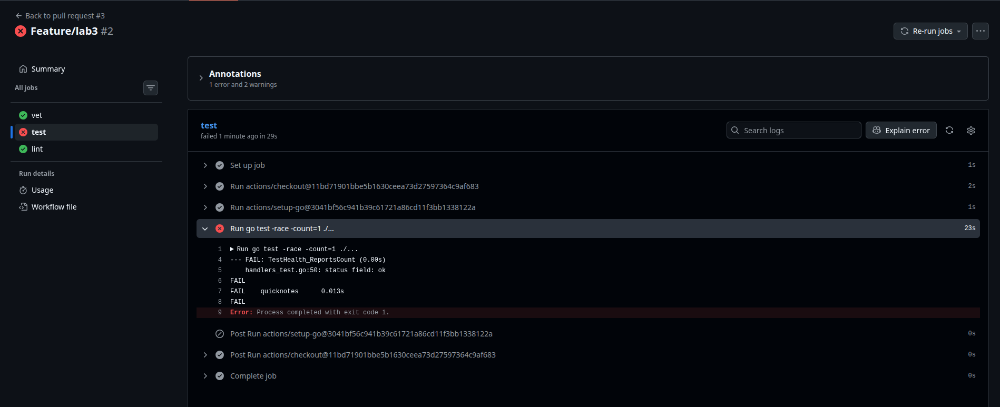
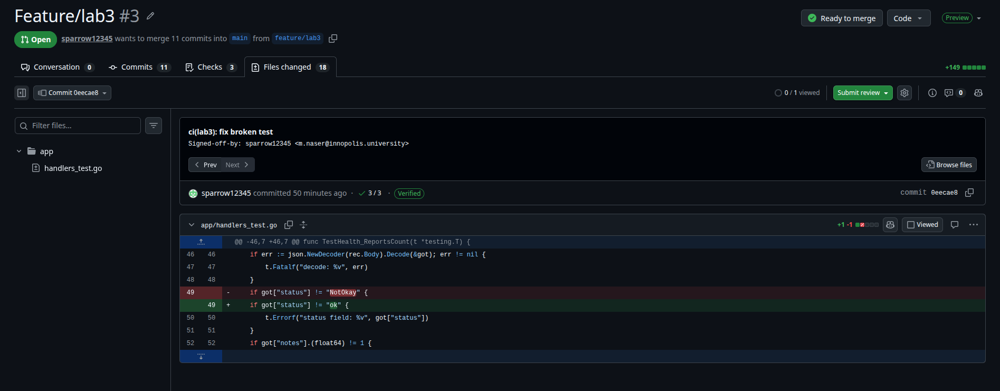
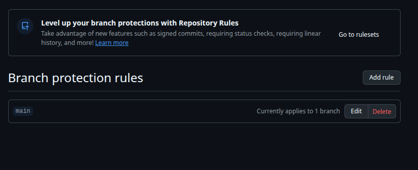
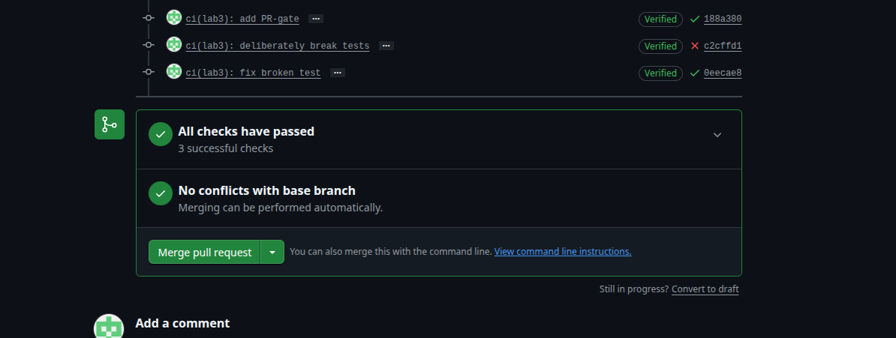
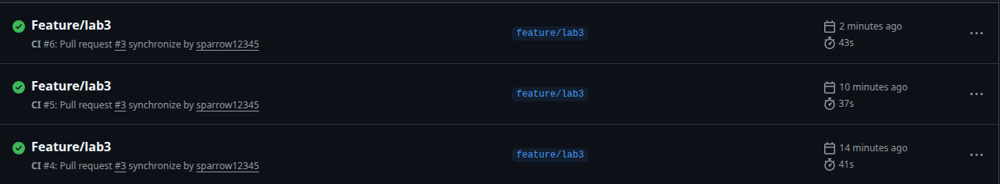

# Lab 3 submission

## Task 1: Write the PR Gate

### Why GitHub?

Because I can sign in to github.com and my fork already lives there.

### Green CI run

[Clear CI run](https://github.com/sparrow12345/DevOps-Intro/actions/runs/27569104479)

### Failed run and fix

### Branch protection

### Questions

**a) Why pin the runner version (`ubuntu-24.04`) instead of ubuntu-latest? What breaks otherwise?**

`ubuntu-latest` is a moving alias. GitHub repoints it to the next LTS on their schedule, and when they do, the preinstalled toolchain change. Which can cause pipelines that were working fine to break. By pinning `ubuntu-24.04` we make sure that the pipeline won't break unexpectedly when GitHub updates their runners. And we can handle the update by ourselves.

**b) Why split vet + test + lint into separate units? What would happen with one combined job?**

- Parallelism: separate jobs run on separate runners simultaneously, since they're not dependent on each other.

- Signal: separate jobs can tell us exactly where our problem is, ex: (vet -> code error/bugs, test -> wrong code logic/broken test, lint -> style issues).

**c) GH path: what real attack does SHA pinning prevent?**

A tag-hijack / supply-chain injection against a third-party action. A Git tag like @v4 is a mutable pointer, whoever controls the action's repo can move it to point at new, malicious code, and every workflow referencing @v4 silently pulls it on the next run. This is exactly the tj-actions/changed-files compromise of March 2025: attackers gained write access and repointed the action's tags to a malicious version, leaking a loot of secrets from multiple runners. By pinning to a specific SHA, we ensure that we're always running the exact code we reviewed and tested, and not a moving target that can be hijacked.

**d) GH path: what is `permissions:` and what's the principle behind it?**

Control the access level of the GITHUB_TOKEN. We can restrict it to only the permissions we need for our workflow. This follows the principle of least privilege, which states that we should only grant the minimum permissions necessary for a task, reducing the attack surface and potential damage if the token is compromised.

## Task 2: Make It Fast and Smart

### Measurements table

| Scenario | Wall-clock |
|----------|-----------|
| Baseline (no cache, single Go version, no path filter) | 41 s |
| With cache | 37 s |
| With cache + matrix | 43 s |

### Description of each optimization

**Caching:** `setup-go` caches the Go module and build caches for us automatically once we point it at the lockfile with `cache-dependency-path: app/go.sum`. The key comes from the `go.sum` hash, so it stays valid until a dependency actually changes.

**Go matrix (1.23 + 1.24):** `vet` and `test` run against both Go versions in parallel, which catches bugs that only show up on one toolchain. Lint stays on 1.24 since it only needs to run once. The cells run on separate runners, so the matrix barely adds wall-clock.

**Path filter:** The `pull_request` trigger is scoped to `app/**` and the workflow file, so a docs-only PR (like a README edit) doesn't trigger any runs and wastes no CI minutes.

### Questions

**f) Why cache `go.sum`-keyed inputs and not build outputs?**

`go.sum` pins the exact version of every module, so a cache keyed on its hash is safe: if the hash matches, the dependencies are the same, and as soon as one changes the key changes with it. Build outputs don't have that property. Compiled archives and binaries bake in the toolchain version, build tags, and paths, so restoring an old one can give a green build that doesn't match your actual source.

**g) What does `fail-fast: false` change in a matrix run, and when do you actually want `fail-fast: true`?**

In a matrix, `fail-fast: true` cancels every still-running cell the moment one cell fails. With `fail-fast: false`, all cells run to completion regardless. We want `false` here because the whole reason for the matrix is to compare go `1.23` and `1.24` and `fail-fast` might kill one of the cells. We'd choose `fail-fast: true` when cells we want all cells to pass like in a large sharded test matrix where any single failure already means "block the merge" and we'd rather save CI minutes and give fast feedback than collect every failure.

**h) What's the risk of an attacker writing a cache from a malicious PR that protected branches later read?**

The risk is cache poisoning. A PR from a fork runs CI and can write to the shared cache, and if a protected branch later reads that cache, it runs whatever the attacker stuffed in there. A poisoned module or build cache basically becomes code execution in a trusted context, with access to real secrets.
