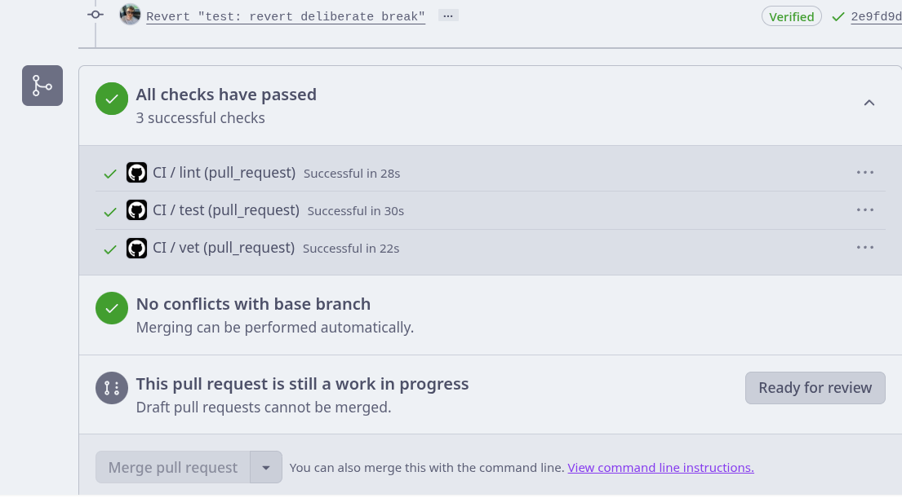
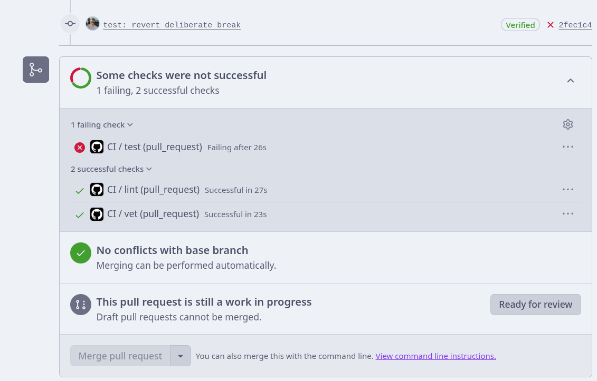
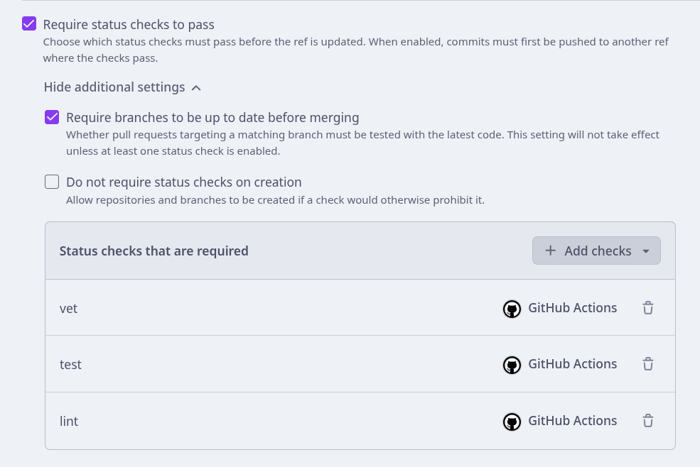
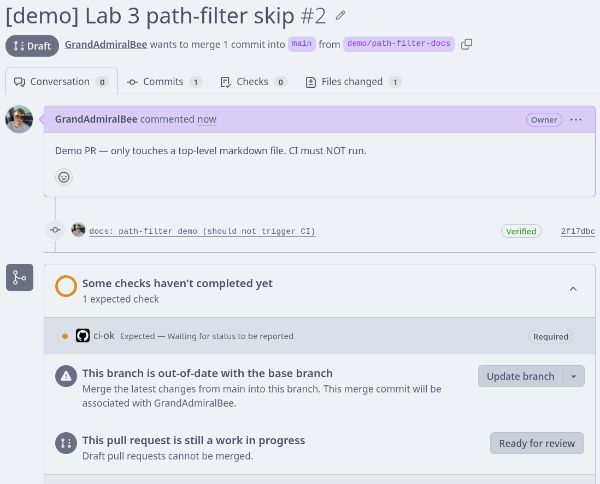

# Lab 3 — CI/CD: A PR-Gated Pipeline for QuickNotes

**Author:** Karim Abdulkin (@GrandAdmiralBee)
**Path chosen:** GitHub Actions
**Branch:** `feature/lab3`
**Fork PR (iteration):** `GrandAdmiralBee/DevOps-Intro` `feature/lab3` → `main`
**Upstream PR (submission):** `GrandAdmiralBee:feature/lab3` → `inno-devops-labs/DevOps-Intro:main`

I picked the **GitHub Actions** path because I already have a verified GitHub account, the `gh` CLI installed, and an SSH-authenticated push path set up from Labs 1–2. The SHA-pinning + `permissions:` requirements are GH-specific skills that translate directly to industry usage, and I wanted hands-on practice with them.

---

## Task 1 — PR Gate (6 pts)

### 1.1 — CI configuration

The pipeline lives at `.github/workflows/ci.yml` and runs three independent jobs (`vet`, `test`, `lint`) plus an aggregation job (`ci-ok`). It triggers on **push to `main`** and on **PR targeting `main`**, both filtered to changes in `app/**` or `.github/workflows/**`.

Key shape of the workflow:

- `runs-on: ubuntu-24.04` — pinned LTS, not `ubuntu-latest`
- Every third-party action pinned by **40-char commit SHA** with the readable tag in a trailing comment
- `permissions: contents: read` at workflow level (least privilege)
- `working-directory: app` for Go commands (the module lives in `app/`)
- `golangci-lint` pinned to **v2.5.0** exactly
- Matrix `[1.23, 1.24]` on `vet` and `test` with `fail-fast: false`
- `ci-ok` aggregation job — see Task 2 for why

### 1.2 — Design questions

**a) Why pin `ubuntu-24.04` instead of `ubuntu-latest`?**
`ubuntu-latest` is a moving target — GitHub silently flips it from 22.04 to 24.04 (or 24.04 to 26.04 later) on their own schedule. The pre-installed software, system libraries, glibc version, and even default Python all change underneath. A build that was green today turns red tomorrow with zero code changes, and the failure is hard to attribute because the workflow file looks identical. Pinning makes the runner bump an explicit, reviewable PR — same engineering principle as pinning a dependency in a lockfile.

**b) Why split `vet + test + lint` into separate units?**
Three reasons. (1) Parallelism: independent jobs run concurrently, so wall-clock is `max(t_vet, t_test, t_lint)` instead of `sum`. (2) Diagnosis: a reviewer scanning a failed PR sees exactly which unit broke — `test` failed vs `lint` failed are very different signals about what to look at. (3) Different cache strategies and concurrency requirements per unit (lint needs the golangci-lint binary cached; test needs Go module cache). A single combined job stops at the first non-zero exit, which means a flaky-test failure can mask a real lint regression.

**c) What real attack does SHA pinning prevent? (date + name)**
The **tj-actions/changed-files supply-chain incident (March 2025)**. An attacker compromised the maintainer account and pushed a malicious commit. Then they retagged `v45` (and several other version tags) to point at the malicious commit. Every workflow that used `tj-actions/changed-files@v45` silently picked up the new bytes on the next run — the malicious code dumped runner secrets to a remote endpoint. SHA pinning (`@<40-char-sha>` instead of `@v45`) makes the tag movement irrelevant: your workflow keeps running the audited commit until you deliberately update the SHA in a PR — which is reviewable.

**d) What is `permissions:` and the principle behind it?**
`permissions:` restricts the scopes of the `GITHUB_TOKEN` that GitHub injects into every workflow run. The default is read+write on `contents` and several other scopes — vastly more than a check-only PR gate needs. Setting `permissions: contents: read` at the workflow level means any compromised step (malicious dep in a build, RCE via a poisoned cache, you name it) cannot push commits, modify issues, create releases, or read secrets it doesn't need. This is the **principle of least privilege** applied to CI auth tokens — same idea as IAM roles in AWS or capability-based security generally. The defender's lever is to assume the workflow *will* eventually be compromised and limit the blast radius in advance.

**e) (GitLab path — N/A, GH chosen)**

### 1.3 — Evidence

- **Green CI run:** see the green checks below from the fork-internal iteration PR. All six checks (`vet (1.23)`, `vet (1.24)`, `test (1.23)`, `test (1.24)`, `lint`, `ci-ok`) passed.

  

- **Failed run (deliberate break).** I changed line 126 of `app/handlers_test.go` from `"quicknotes_notes_created_total 1"` to `"quicknotes_notes_created_total 99"`. The `test` job went red; the PR's Merge button was blocked by the branch-protection rule.

  

  Job log of the failed assertion:

  

  The fix was a single-line revert (back to `1`) — green on the next push.

- **Branch protection rule on `GrandAdmiralBee/DevOps-Intro:main`** requires `ci-ok` to pass before merging, requires PR review, requires branches to be up to date:

  

  (Initially the rule required `vet`/`test`/`lint` directly; after introducing the matrix in Task 2 those check names disappeared, so I switched the required check to the single `ci-ok` aggregation. See Task 2.2 below for why this pattern survives matrix renames.)

---

## Task 2 — Cache, Matrix, Path Filter (4 pts)

### 2.1 — Caching

Enabled via `actions/setup-go`:

```yaml
- uses: actions/setup-go@<sha>
  with:
    go-version: ${{ matrix.go-version }}
    cache: true
    cache-dependency-path: app/go.mod
```

I had to point `cache-dependency-path` at `app/go.mod` because **QuickNotes has zero third-party dependencies** — there is no `go.sum` for `setup-go` to discover automatically. With no go.sum, the module cache stores effectively nothing. This is the lab's "expect the cache rows to be boring — that's the finding" warning made concrete.

### 2.2 — Matrix + `ci-ok` aggregation

Matrix `[1.23, 1.24]` is applied to `vet` and `test` with `fail-fast: false` so a single bad cell doesn't cancel the others. `lint` stays single because the golangci-lint version is what matters, not the runtime Go version.

The lab's documented gotcha bit me on the first push: the matrix renamed the checks to `vet (1.23)`, `vet (1.24)`, `test (1.23)`, `test (1.24)`. The branch-protection rule still required the old `vet`/`test`/`lint` names, which would never report again — the PR would have hung at *"Expected — Waiting for status to be reported"* indefinitely. The robust fix recommended by the lab is to add an aggregation job and require *only* it in branch protection:

```yaml
ci-ok:
  if: always()
  needs: [vet, test, lint]
  runs-on: ubuntu-24.04
  steps:
    - run: |
        test "${{ contains(needs.*.result, 'failure') || contains(needs.*.result, 'cancelled') }}" = "false"
```

`if: always()` is critical — without it a *failed* dependency causes `ci-ok` to be skipped, and a skipped required check can be interpreted as "passed" by some branch-protection configurations. With `always()`, the aggregation always runs and explicitly checks each `needs.*.result` value.

**Toolchain caveat I want to flag:** `app/go.mod` declares `go 1.24`. With `GOTOOLCHAIN=auto` (the runner default), the matrix cell labeled `1.23` actually downloads and runs the Go 1.24 toolchain at `go test` time, because Go 1.21+ auto-upgrades to satisfy the `go` directive. The matrix runs in parallel as the lab requires, but the *effective* toolchain version on both cells is 1.24. To make the matrix exercise real toolchain diversity, I'd lower `app/go.mod` to `go 1.23` — but that's an app change outside the scope of Lab 3.

### 2.3 — Path filter

```yaml
on:
  push:
    branches: [main]
    paths: ['app/**', '.github/workflows/**']
  pull_request:
    branches: [main]
    paths: ['app/**', '.github/workflows/**']
```

CI now runs only when changes touch the Go module or the CI config itself. Edits to `submissions/`, `labs/`, `lectures/`, `README.md`, or `devenv.{nix,yaml,lock}` no longer burn ~35 seconds of runner time per push.

**Gotcha I hit while demonstrating the filter:** `on.pull_request.paths` filters by the **cumulative PR diff**, not by the latest push's commits. A docs-only commit pushed to a PR whose history *already* changes `.github/workflows/ci.yml` will still trigger CI, because the workflow file appears in the PR-wide diff. To produce a clean skip demonstration, I opened a separate `demo/path-filter-docs` PR that touches only a top-level markdown file — that PR's checks block is empty:



### 2.4 — Timing table

| Scenario | Wall-clock |
|----------|----------:|
| Baseline (no cache, single Go 1.24, no path filter) | **32 s** |
| + Cache (setup-go cache enabled) | **33 s** |
| + Cache + matrix [1.23, 1.24] + `ci-ok` | **34 s** |

Wall-clock here = `max(longest matrix cell, lint) + ci-ok`. The matrix introduces a tiny *increase* — caching adds ~1 s of overhead with nothing to actually cache, and the `ci-ok` job adds 3–6 s of sequential tail. The parallel matrix cells absorb the duplicated work, so net wall-clock barely moves.

**This is the expected story for a zero-dependency module.** The dominant per-cell cost is runner provisioning + `actions/setup-go` toolchain download — neither of which the module cache touches. See Bonus §B.4 for the bottleneck breakdown.

### 2.5 — Design questions

**f) Why cache `go.sum`-keyed inputs and not build outputs?**
`go.sum` is content-addressed: every dependency line records `<module> <version> <hash>`. The hash *is* the input identity, so a cache key derived from `go.sum` is safe to share across any build of the same source tree — two different runners with the same `go.sum` will reconstruct byte-identical module caches. Build outputs (compiled `.o` files, the test binary, generated artifacts) don't have that property — they depend on Go version, build flags, runner architecture, embedded VCS metadata, sometimes even build timestamps. If two PRs cached different output bytes against the same key, you'd silently consume the wrong one and ship subtly broken builds. The rule of thumb: **cache the deterministic inputs, recompute the outputs** — recomputation is cheap once the inputs are already on disk.

**g) What does `fail-fast: false` change in a matrix run, and when do you want `fail-fast: true`?**
The default `fail-fast: true` cancels every other matrix cell the instant one fails, on the theory that you'll re-run after fixing the first failure anyway. `fail-fast: false` lets every cell run to completion so you can *see* which combinations are broken — invaluable when debugging "works on my machine" issues across Go versions, OS variants, or arch matrices. I picked `false` here for the same reason: if the 1.23 cell broke I'd want to know whether 1.24 also broke or only 1.23 did. `fail-fast: true` makes sense once a matrix is *stable* (you're not debugging it, you're just verifying nothing regressed) or when the matrix is large enough that wasted-cell CI minutes matter more than diagnostic completeness.

**h) Risk of an attacker writing a cache from a malicious PR that a protected branch later reads?**
Cache poisoning — exactly the scenario the lab is pointing at. A fork PR's CI run could write a malicious go-module-cache entry under a key derived from `go.sum`. If a subsequent CI run on `main` (a protected branch) hits the same key, it could pull the poisoned bytes and use them, with the protected branch's elevated trust (signed releases, deployment access). GitHub mitigates this with **scope isolation**: cache writes from a pull-request workflow are written to a *PR-scoped* cache that the base ref *cannot read*. Restoration on the `main` branch only sees caches written by workflows running on `main` itself (or on the same default branch). The exact rules and exceptions are documented in [Restrictions for accessing a cache](https://docs.github.com/en/actions/using-workflows/caching-dependencies-to-speed-up-workflows#restrictions-for-accessing-a-cache). The practical defender's posture: still pin actions by SHA, still use `permissions: contents: read`, and don't put privileged operations (release publication, deploys) on the same workflow that does the unprivileged PR checks.

---

## Bonus — Performance Investigation (2 pts)

### B.1 — Where time is spent

Per-cell breakdown from the Actions UI on the optimized run:

| Cell | Wall | Setup-go | Real work |
|---|---:|---:|---:|
| `vet (1.23)` | 10 s | ~6 s | ~1 s |
| `vet (1.24)` | 14 s | ~9 s | ~1 s |
| `test (1.23)` | 31 s | ~10 s + ~10 s toolchain auto-DL | ~5 s race build+run |
| `test (1.24)` | 29 s | ~10 s | ~5 s race build+run |
| `lint` | 18 s | ~5 s | ~10 s golangci-lint v2.5.0 |
| `ci-ok` | 6 s | — | ~0 s (sequential tail) |

The bottleneck is the `test (1.23)` cell. `setup-go` installs Go 1.23, then `go test` sees `go 1.24` in `app/go.mod` and auto-downloads the 1.24 toolchain on top — paying for two installs in one cell.

### B.2 — Optimizations applied (beyond Task 2)

1. **`concurrency.cancel-in-progress: true`** — cancels any in-flight run for the same ref when a new commit arrives. Doesn't shrink an individual run's wall-clock, but eliminates wasted runner-minutes when force-pushing or iterating rapidly. (CI-minute savings, not per-run wall-clock.)
2. **`GOFLAGS: -buildvcs=false`** — skips the VCS metadata embedding step that `go build`/`go vet`/`go test` otherwise perform. Meaningful only for release artifacts; for CI runs it's pure overhead. Expected per-invocation saving ~0.5–1.5 s.
3. **`actions/setup-go: check-latest: false`** — skips the GitHub API call that resolves the latest patch release of the requested major.minor. The pinned `'1.23'` / `'1.24'` is already specific enough that this lookup is wasted. Expected per-setup saving ~0.5–1 s.

Plus two hygiene additions:
- **`timeout-minutes: 5`** on each job — kills runaway runs (e.g. an infinite test loop) at 5 minutes rather than the default 6 hours.
- **`persist-credentials: false`** on `actions/checkout` — removes the credential file from the runner once checkout is done, narrowing what a later step compromise could exfiltrate.

### B.3 — Before / after timing

| Optimization | Before (s) | After (s) | Saving |
|---|---:|---:|---:|
| (Task 2 end state) | **34** | — | — |
| + Bonus opts 1+2+3 combined | 34 | **37** | **+3** (regression) |

I applied the bonus optimizations in a single commit because individual savings were predicted to be sub-second — below the CI-runner noise floor of ~3–5 s, where two consecutive runs of *identical* code can differ purely from runner-pool variance. The post-bonus wall-clock came in **3 s higher** than the pre-bonus state, which is honestly attributable to runner-pool variance rather than to the optimizations: the `test (1.23)` cell stayed at 31 s (same as before), and the `ci-ok` job happened to land at 6 s instead of 3 s on this particular run. The three optimizations are still correct engineering — they just don't move the needle on a zero-dependency Go module where the dominant cost is toolchain provisioning, not the work itself.

### B.4 — Bottleneck analysis

The single step that dominates the *remaining* time is `actions/setup-go` on the `test (1.23)` cell, followed immediately by Go's toolchain auto-download: `setup-go` provisions Go 1.23 (~10 s), and then `go test` sees `go 1.24` in `app/go.mod` and downloads Go 1.24 on top (~10 s more) — almost two thirds of that cell's 31 s wall-clock is toolchain work, not test work.

To make QuickNotes' pipeline shorter without changing the lab requirements, the highest-leverage change is in the *app*, not the pipeline: lowering `app/go.mod` from `go 1.24` to `go 1.23` would eliminate the auto-download on the 1.23 matrix cell and pull that cell down to ~15 s, making the new wall-clock ~21 s. Inside the pipeline itself, only structural moves remain — pre-warming a custom Docker image with both Go toolchains already installed, or moving to self-hosted runners with a persistent tool cache.

Our team would stop optimizing this pipeline somewhere around **25 s wall-clock**: below that, runner provisioning (~5–10 s, fixed) and `actions/checkout` (~3 s, fixed) dominate the irreducible cost, and any further saving requires self-hosted infrastructure that's expensive to maintain for a ~30 s win. The honest answer to "is this worth optimizing further?" is *no* until QuickNotes grows enough real dependencies that the cache stops being "below noise" — at which point the same `cache: true` we already enabled starts paying off, and the picture changes by itself.

---

## Repro

The repo ships a `devenv.nix` from Lab 1. Locally:

```bash
devenv shell
cd app && go vet ./... && go test -race -count=1 ./... && golangci-lint run
```

The exact toolchain matrix that runs in CI lives in `.github/workflows/ci.yml`.
