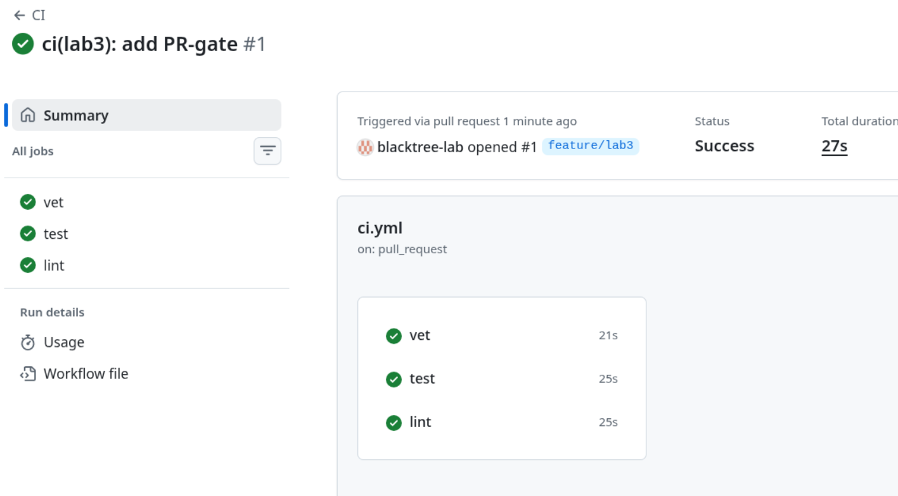
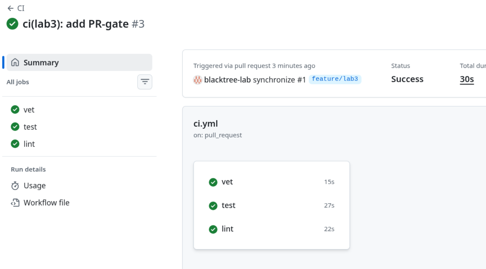
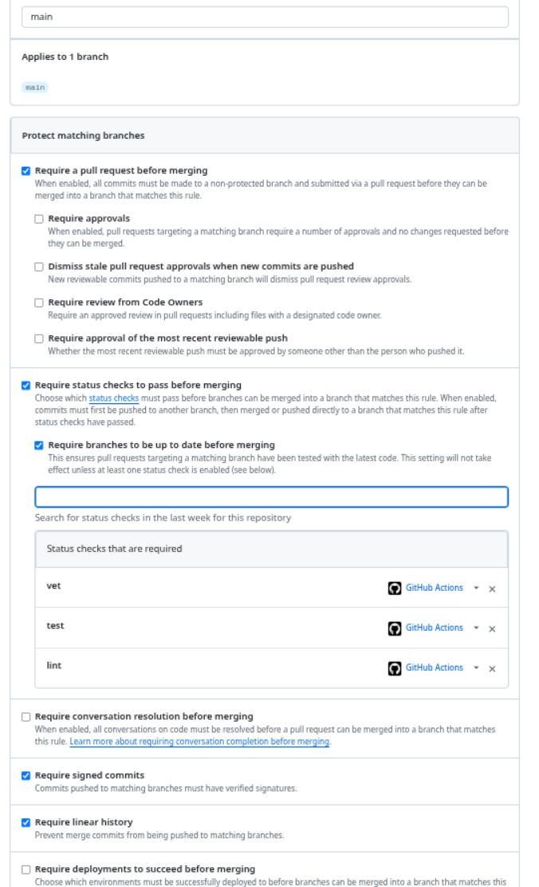
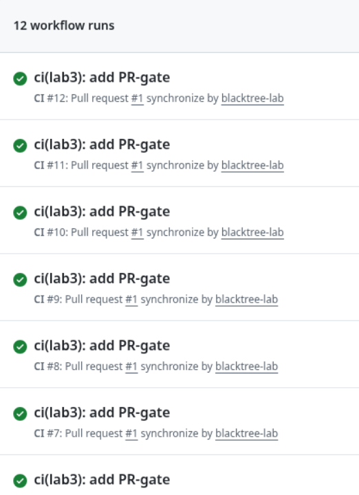

# Lab 3 Submission — CI/CD: A PR-Gated Pipeline for QuickNotes

**CI Path:** GitHub Actions

---

## Task 1 - Write the PR Gate

### 1.1 CI Configuration

CI config lives at `.github/workflows/ci.yml`. It runs three independent jobs:
- `vet` runs `go vet ./...`
- `test` runs `go test -race -count=1 ./...`
- `lint` runs `golangci-lint v2.5.0`

### 1.2 Design Questions

**a) Why pin the runner version (`ubuntu-24.04`) instead of `ubuntu-latest`?**
`ubuntu-latest` is a floating alias that GitHub reassigns when a new LTS is released. When it happens, pre-installed tool versions, kernel behaviour, and available system libraries can change overnight, silently breaking the pipeline. Pinning `ubuntu-24.04` guarantees the same environment on every run.

**b) Why split vet + test + lint into separate jobs?**
With a single combined job, a failure in `vet` cancels the entire job and you never learn whether `test` or `lint` would have passed. Three separate jobs run in parallel, finish faster, signalling exactly which check failed and why.

**c) What real attack does SHA pinning prevent?**
SHA pinning prevents a **tag-hijacking / supply-chain attack**. If a third-party action is referenced by tag (e.g. `@v4`), a compromised maintainer can silently push malicious code to that tag. The most prominent example is the **tj-actions/changed-files incident (March 2025)**: attackers pushed a backdoored commit to the tag used by thousands of repositories. Pinning by full 40-character commit SHA means your workflow runs exactly the code you reviewed.

**d) What is `permissions:` and what principle is behind it?**
`permissions:` restricts what the GitHub Actions token (`GITHUB_TOKEN`) is allowed to do in a workflow run. By default the token has broad write access to the repository. Declaring `permissions: contents: read` ensures the workflow only gets the minimum access it needs.

### 1.3 Green CI Run

Link to green CI run: https://github.com/blacktree-lab/DevOps-Intro/actions/runs/27049565155

### 1.4 Deliberate Failure + Fix

**What was broken:**
Changed `http.StatusCreated` to `http.StatusOK` in `app/handlers_test.go` to make the test expect 200 instead of 201.

**Fix commit:** Reverted `http.StatusOK` back to `http.StatusCreated`.

### 1.5 Branch Protection

---

## Task 2 - Cache + Matrix + Path Filter

### Timing Table

| Scenario | Wall-clock |
|----------|-----------|
| Baseline (no cache, single Go version, no path filter) | 25s |
| With cache | 28s |
| With cache + matrix | 27s |

### Optimizations Applied

**Cache (`cache-dependency-path: app/go.sum`):**
`actions/setup-go` caches the Go module download cache and build cache, keyed on `app/go.sum`. When dependencies haven't changed, the download step is skipped entirely, saving time on every subsequent run.

**Build matrix (Go 1.23 + 1.24):**
`strategy.matrix` runs `vet` and `test` against both Go versions in parallel. This catches bugs that only appear on a specific toolchain version. `fail-fast: false` ensures both matrix cells complete even if one fails, giving full visibility.

**Path filter (`paths: app/**, .github/workflows/ci.yml`):**
The pipeline only triggers when Go source files or the CI config itself changes. Editing a markdown file or README no longer burns CI minutes.

### Design Questions

**f) Why cache `go.sum`-keyed inputs and not build outputs?**
`go.sum` contains cryptographic hashes of every dependency — a deterministic fingerprint of the exact module versions in use. Caching inputs (downloaded modules) is safe because the same `go.sum` always produces the same modules. Build outputs (compiled binaries) can vary subtly between runs due to timestamps or environment differences, making them unreliable cache entries.

**g) What does `fail-fast: false` change in a matrix run?**
By default (`fail-fast: true`), GitHub cancels all remaining matrix jobs the moment one fails. Setting `fail-fast: false` lets all combinations run to completion. You want it `false` when you need to see *which* combinations are broken — e.g. "does Go 1.23 fail but 1.24 pass?". Use `fail-fast: true` in large matrices where an early failure makes all other results irrelevant.

**h) What's the risk of a malicious PR poisoning the cache?**
A PR from a fork could write a poisoned cache entry that a protected branch later reads, introducing malicious code into trusted runs. GitHub mitigates this by isolating cache scopes: caches written from a fork PR are not accessible to runs on the base branch or other PRs. See: https://docs.github.com/en/actions/using-workflows/caching-dependencies-to-speed-up-workflows#restrictions-for-accessing-a-cache

---

## Bonus Task — Pipeline Performance Investigation

### B.1 Per-step Timing Profile (vet job)

| Step | Time |
|------|------|
| Set up job | 1s |
| checkout | 0s |
| setup-go (cache restore) | 2s |
| `go vet ./...` | 16s |
| Cleanup | 0s |
| **Total** | **~21s** |

### B.2 Optimizations Applied

| Optimization | Before | After | Saving |
|-------------|--------|-------|--------|
| Shallow clone (`fetch-depth: 1`) | 1s | 0s | -1s |
| Explicit build cache (`cache: true`) | 2s | 2s | 0s |
| `GOFLAGS=-buildvcs=false` (global env) | 16s | 16s | 0s |
| **Total wall-clock** | **21s** | **20s** | **-1s** |

### B.3 Bottleneck Analysis

The dominant cost in this pipeline is `go vet ./...` at 16s, which is entirely compilation time. Go must build the package before it can analyse it. No amount of dependency caching can eliminate this cost because the bottleneck is CPU-bound compilation, not I/O-bound downloads.