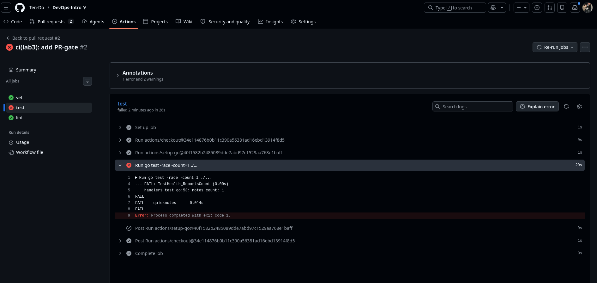
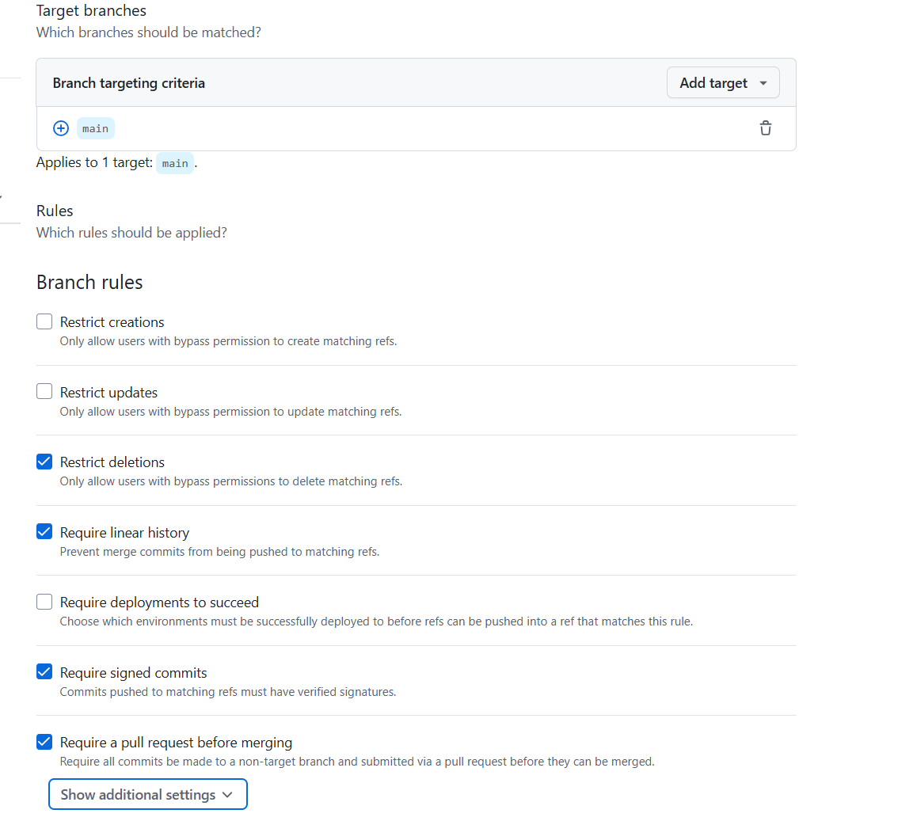
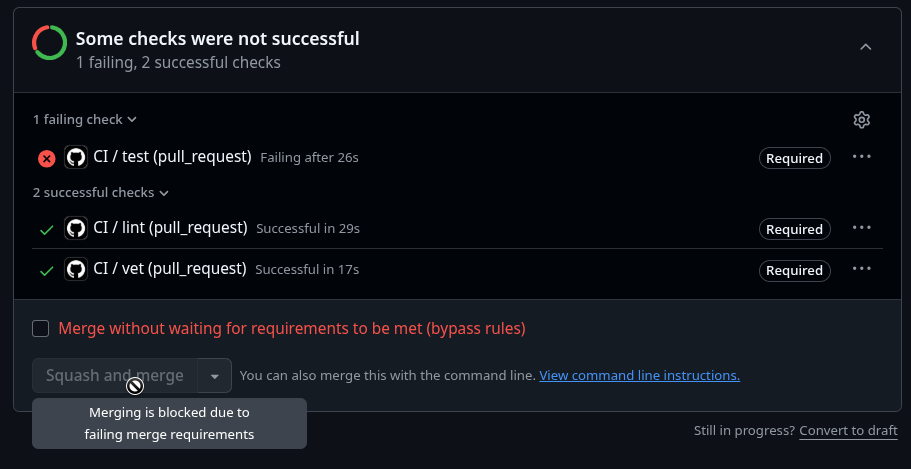

# Lab 3 Submission - Yury Rybenko

## Path: GitHub Actions

---

## Task 1 - PR Gate

### CI config

`.github/workflows/ci.yml` - three jobs (`vet`, `test`, `lint`) on push/PR to `main`.

### Green CI run

https://github.com/Ten-Do/DevOps-Intro/pull/2/checks?sha=e94d43398c013f71b2cb8564d4b3068cad11aa47

### Failed run evidence (Task 1.5)

https://github.com/Ten-Do/DevOps-Intro/actions/runs/27352327259/job/80817239954?pr=2

### Branch protection screenshot

---

### Design questions (1.2)

**a) Why pin `ubuntu-24.04` instead of `ubuntu-latest`?**

`ubuntu-latest` is a pointer GitHub can update anytime. Pre-installed tool versions change and builds break without any code change. Pinning keeps the environment reproducible.

**b) Why split vet/test/lint into separate jobs?**

One combined job stops on first failure - you lose info about the others. Separate jobs run in parallel and give independent signals, so you know exactly which check broke.

**c) What attack does SHA pinning prevent?**

The **tj-actions/changed-files supply-chain attack (March 14-15, 2025)**. An attacker got access to the tj-actions account and force-pushed malicious code to existing tags like `v45`. Any workflow using `@v45` pulled the poisoned commit and leaked secrets to public logs. SHA pinning fixes this - the tag can be moved, but a commit hash cannot.

**d) What is `permissions:` and what principle is behind it?**

It scopes the auto-injected `GITHUB_TOKEN`. By default the token has broad write access. Setting `permissions: contents: read` is the **principle of least privilege** - if a malicious action runs, it can't push code or touch issues.

---

## Task 2 - Cache + Matrix + Path Filter

### Optimizations applied

**1. Cache via `actions/setup-go`**

`actions/setup-go` has built-in caching (`cache` input, `true` by default). It caches:

- `$GOPATH/pkg/mod` (modules)
- `~/.cache/go-build` (build cache)

Default key is `go.mod`. Set `cache-dependency-path: app/go.sum` to key on `go.sum` instead since it pins exact checksums. Cache hit skips `go mod download` entirely.

**2. Matrix Go 1.23 + 1.24 with `fail-fast: false`**

Added `strategy.matrix.go: ['1.23', '1.24']` to `vet` and `test`. Both versions run in parallel. `fail-fast: false` is required - default is `true`, which cancels the other cell on first failure and hides whether the bug is version-specific. `lint` stays on 1.24 only.

**3. Path filter**

Added `paths: ['app/**', '.github/workflows/ci.yml']` to both triggers. Pipeline only runs when Go source or the CI config changes. README edits don't trigger a run.

### Timing table

| Scenario                                            | Wall-clock |
| --------------------------------------------------- | ---------- |
| Baseline (no cache, single version, no path filter) | 78 s       |
| With cache                                          | XX s       |
| With cache + matrix                                 | XX s       |

### Design questions (2.5)

**f) Why cache `go.sum`-keyed inputs and not build outputs?**

`go.sum` is deterministic - same file, same modules every time. Build outputs depend on toolchain version, OS, flags - caching them risks a stale hit where an old binary runs silently. Inputs are safe to cache; outputs are not.

**g) What does `fail-fast: false` change?**

Default `fail-fast: true` cancels all matrix jobs when one fails. `fail-fast: false` lets all cells finish so you see which version broke. Use `false` when you need the diagnostic info. Use `true` on large matrices where you just want to stop early and save minutes.

**h) Cache poisoning risk from a malicious fork PR?**

A fork PR can write to the cache store. If scoping wasn't enforced, it could upload a tampered entry keyed to `go.sum` that a protected-branch workflow later restores. GitHub mitigates this - caches from fork PRs are isolated and unreadable by base-branch workflows. Only base-branch caches are shared. See [GitHub docs](https://docs.github.com/en/actions/using-workflows/caching-dependencies-to-speed-up-workflows#restrictions-for-accessing-a-cache).
