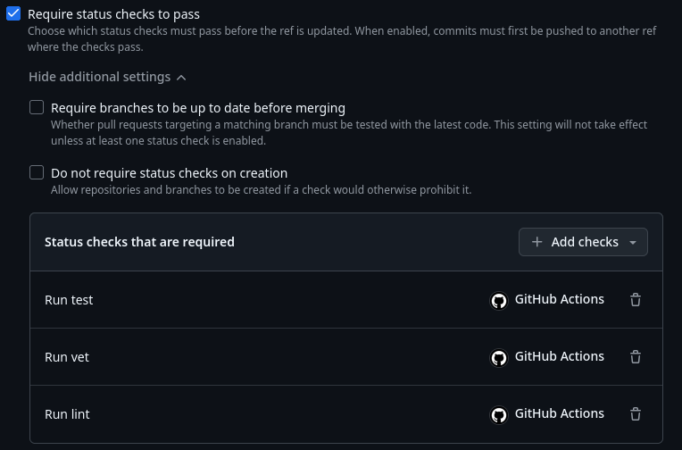
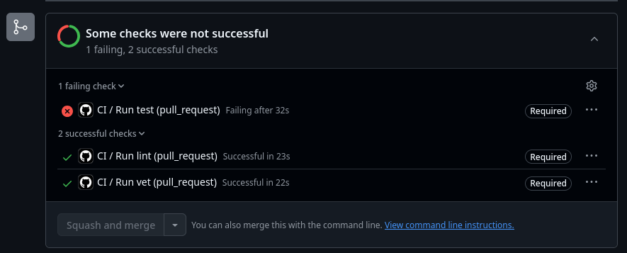
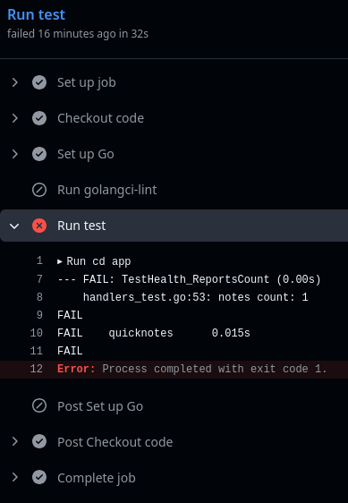
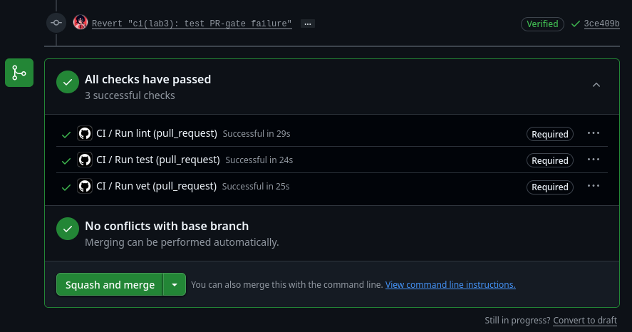

# Lab 3 submission
### The path
I have chosen GitHub path, because it works for me, and I already have an account.

### Branch protection rule

### Failed run + fix
Failed run prevents from merging:\

Failed run log:\

After fix:\

[Link to the green run](https://github.com/arsenez2006/DevOps-Intro/actions/runs/27502050568)

### Design questions
- a) `latest` tag is a moving target. When GitHub upgrades the underlying runner image version, our workflow inherits it. Sudden updates may introduce breaking changes in pre-installed software, leading to pipeline failures.
- b) One combined job runs sequentially, while separate units run concurrently, significantly reducing total pipeline execution time. If a single formatting commit triggers a combined job, where the lint error appears at the end of a 15-minute test suite run, the entire pipeline fails late. Furthermore, a failure in an early step might prevent subsequent steps from running at all, hiding other errors.
- c) SHA pinning prevents Supply Chain Attacks via tag mutability. Tags may be overwritten by a malicious actor, making our pipeline inherit the compromised code (In March 2025, the popular tj-actions/changed-files action was compromised; the attacker rewrote all tags to a malicious version, leaking secrets from thousands of public CI runs). A cryptographic SHA is immutable and cannot be spoofed.
- d) `permissions:` is the runner access configuration for workflows. On workflows initiation, GitHub automatically issues a short-lived access token for the runner. The runner access token permissions may be configured the `permissions:` directive. By explicitly defining permissions, we ensure that even if an attacker successfully injects malicious code into the runner, they cannot abuse the token to gain full access to the repository.
- f) Caching `go.sum`-keyed inputs ensures strict environmental reproducibility by fixing the dependency tree. Conversely, caching build outputs is unreliable because artifacts depend on host-specific hardware, compiler versions, and system flags, which often lead to invalid states when restored on different runners.
- g) `fail-fast: false` ensures that all matrix jobs run to completion even if one fails, allowing us to see the full scope of potential issues. `fail-fast: true` should be used during active development or PRs to stop the pipeline immediately upon the first error, which saves compute costs and provides faster feedback.
- h) An attacker could attempt to "poison" the cache by writing malicious artifacts from a PR that a protected branch might later read. GitHub mitigates this risk through strict scope isolation: workflows from PRs can read caches from the target branch, but they are explicitly forbidden from writing to or overwriting caches scoped to that protected base branch.

### Pipeline Measurements
<!-- baseline = 23 + 28 + 29 = 1m20s, real = 37
caching = 23 + 24 + 13 = 1m, real = 33
caching + version matrix = 13 + 14 + 24 + 26 + 19 + 12 = 1m48s, real = 30 -->
| Scenario | Wall-clock |
|----------|-----------|
| Baseline (no cache, single Go version, no path filter) | 37 s |
| With cache | 33 s |
| With cache + matrix | 30 s |

### Pipeline optimizations
- Every pipeline job are executed concurrently, reducing overall wall-time
- Build inputs (`setup-go` and `golandci-lint`) are cached