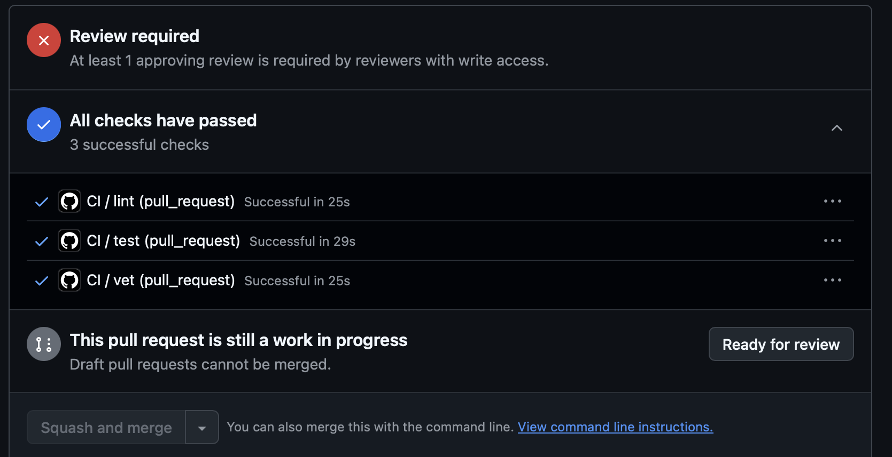
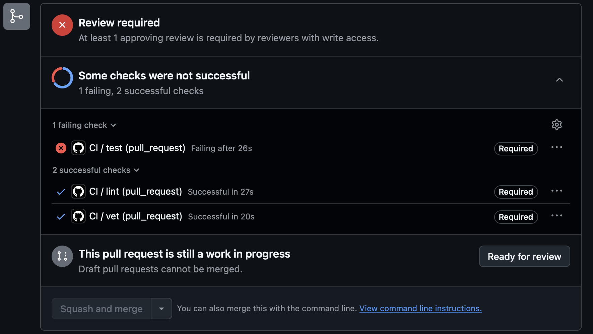
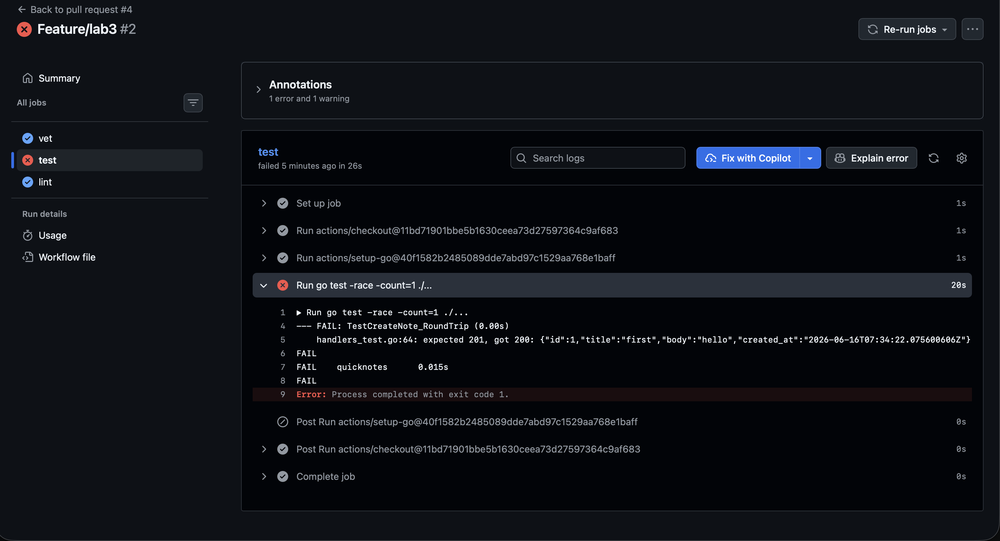
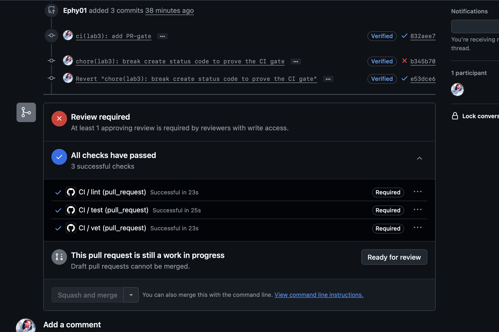
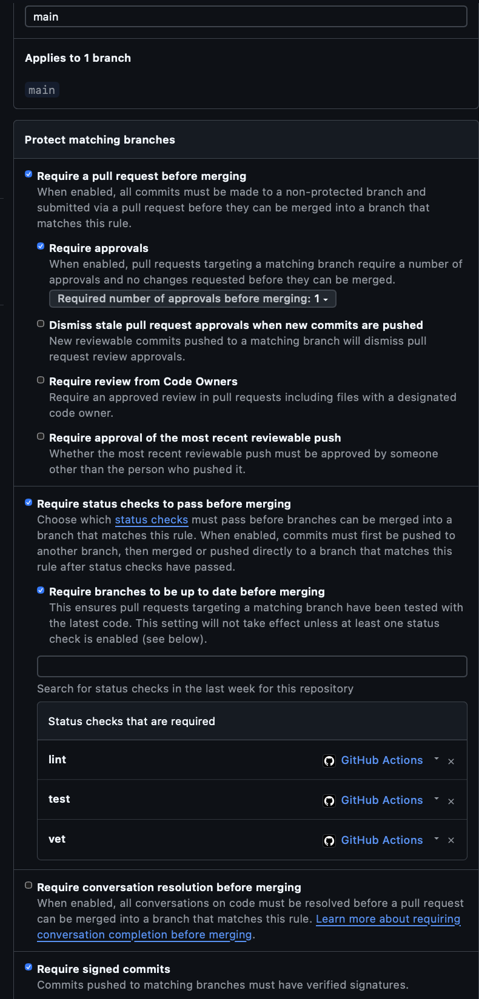
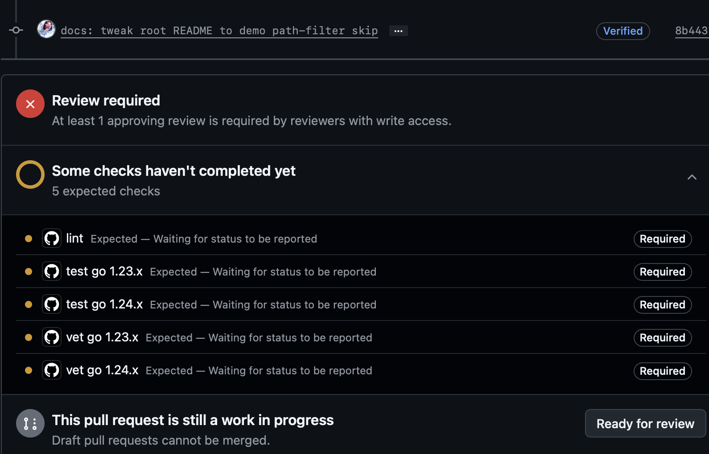
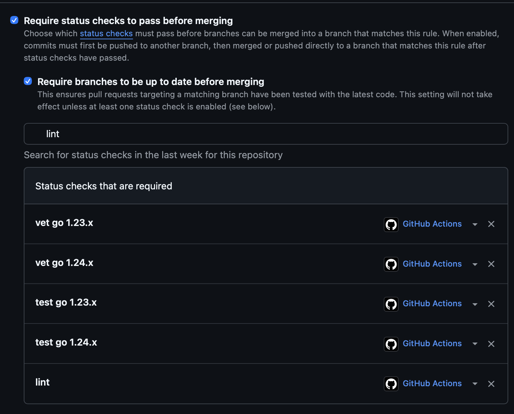

# Lab 3 - CI/CD: A PR-Gated Pipeline for QuickNotes


## Task 1 - Write the PR Gate

What have I done?

### Picked GitHub Actions

I chose the GitHub Actions path because... my fork and previous lab PRs are already on GitHub. I worked here. 


### Wrote CI pipeline

I added `.github/workflows/ci.yml` with three independent jobs:

- `vet` runs `go vet ./...`
- `test` runs `go test -race -count=1 ./...`
- `lint` runs `golangci-lint run` with `golangci-lint` pinned to `v2.5.0`

All commands run inside `app/`, because QuickNotes has its Go module there:

```
defaults:
  run:
    working-directory: app
```

The workflow triggers on pushes to `main` and pull requests targeting `main`. I pinned the runner to `ubuntu-24.04` and set:

```
permissions:
  contents: read
```

For GitHub Actions supply-chain hardening, I pinned actions by full commit SHA:

```
actions/checkout@11bd71901bbe5b1630ceea73d27597364c9af683 # v4.2.2
actions/setup-go@40f1582b2485089dde7abd97c1529aa768e1baff # v5.6.0
```


### Green CI run

Green CI run link: https://github.com/Ephy01/DevOps-Intro/actions/runs/27600575130

CI run was succesfull, however merge still required review following my branch rules




### Proved that CI blocks bugs

To prove that the PR gate works, I intentionally broke one test in `app/handlers_test.go`, pushed it, and waited for the GitHub check to fail.

Failed CI evidence:



So, my commits broke test job, here is the log




Then I reverted the broken commit and pushed again.
After the fix, CI returned to green:





### Branch protection

Since previous labs I have already had three rules applied to main branch: linear commit history, sighned commits, and required review. Now, I add the fourth rule: to merge checks should be passed. In particular the following jobs: vet, test, lint

Branch protection screenshot:




### Design questions

a) Why pin the runner version instead of using `ubuntu-latest`?

The main purpose to make CI environment predictable and robust. No sudden changes will appera.  `ubuntu-latest` is a moving alias, so GitHub can change the underlying image later. That can change installed packages, compilers, shell behavior, or system libraries, and a pipeline can start failing even if the repository did not change.

b) Why split `vet`, `test`, and `lint` into separate units?

Divie and conquer: many lightweight units are more convinient than one huge. Splitting them makes the pipeline easier to read and debug. For example: if `lint` fails, I immediately know it is a style/static-analysis problem. 

c) What real attack does SHA pinning prevent?

SHA pinning prevents an attacker from moving an action tag to malicious code. Recall incident from the march of 2025 with  `tj-actions/changed-files`, where tags were rewritten and CI secrets were leaked from many public workflow logs.

d) What is `permissions:` and what principle is behind it?

`permissions:` controls what the automatically created GitHub Actions token can do. I set `contents: read` because this CI pipeline only needs to read the repository. This follows security principle of giving the no more priviliages than something needs.

e) What's the difference between a *stage* and a *job*? What would `dependencies:` do that `stages:` doesn't?

I used GitHub Actions, so this didn't apply to my implementation, but conceptually:
A job is the actual unit of work in GitLab CI — it has a script: and runs on a runner. A stage is just an ordering label that groups jobs. 
`stages:` and `dependencies:` solve different problems. stages: controls execution order. dependencies: controls artifact flow — which earlier jobs' artifacts get downloaded into this job. 

---

## Task 2 - Make It Fast and Smart

What have I done?


I enabled caching in CI.

```
cache: true
cache-dependency-path: app/go.mod
```

The cache is based on the Go module inputs in `app/`, so CI does not need to download the same dependencies every time.

I ran CI, than, I added also matrix for `vet` and `test`.
```
go-version: ["1.23.x", "1.24.x"]
```

Now I run jobs for two go versions. Also, i put `fail-fast:false` since I want to know result of running on each of this version. 


And finally, filters: 


I configured the workflow to run only when app code or the CI workflow changes:

```
paths:
  - "app/**"
  - ".github/workflows/ci.yml"
```

` README ` won't trigger pipeline



Since now I have 5 jobs runners, I also changed my branch protection rule.




### Timing measurements

I measured wall-clock time from the GitHub Actions UI.

| Scenario | Wall-clock |
|----------|-----------:|
| Baseline, no cache, single Go version | 40 sec |
| With cache | 30 secs |
| With cache + matrix | 42 secs |

Short interpretation:

As it was expected: CI with cache is the fastest. Baseline have to recompile and build everything - it takes more time. Caching solves this problem. Cache + matrix - the longest, 5 jobs adds additional costs such as queue and provisioning of jobs. 


### Design questions

_Why cache `go.sum` or module-keyed inputs and not build outputs?_

Inputs are safer to cache because build results should be reproducible from source code and dependencies. If I cache final outputs, I might accidentally hide a broken  build. 

_What does `fail-fast: false` change, and when would `fail-fast: true` be useful?_

`fail-fast: false` means all matrix jobs continue even if one job fails. That is useful here because I want to know separate results for Go `1.23.x`, Go `1.24.x`. `fail-fast: true` is useful when one failure makes the rest of the matrix unimportant - both version must works or when CI timings are expensive, so fast feedback matters

_What is the cache poisoning risk from malicious PRs?_

A malicious PR could try to write dangerous files into a cache, then wait for a protected branch to restore and trust that cache later.  GitHub mitigates this with cache scoping rules between branches and pull requests, but the safe habit is still to cache deterministic dependencies and keep workflow permissions minimal.


