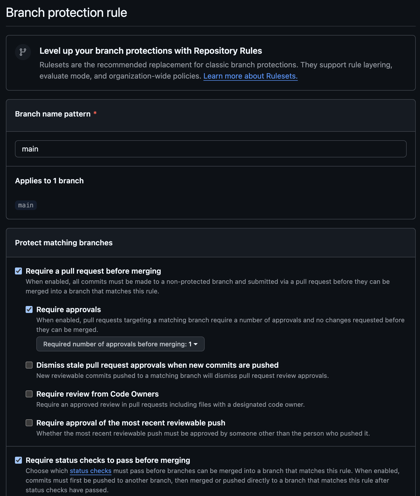
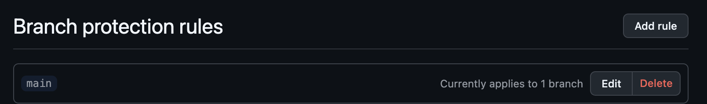

# Lab 3 — CI/CD: A PR-Gated Pipeline for QuickNotes

**Chosen path: GitHub Actions.** I have working github.com access and SSH signing set up from Labs 1–2, so the default path is the natural fit. The pipeline lives in [`.github/workflows/ci.yml`](../.github/workflows/ci.yml).

> All run links and timings below are from real runs on my fork `tdzdslippen/DevOps-Intro`. Actions is enabled on the fork; the workflow triggers on push to `main` and on PRs targeting `main`.

---

## Task 1 — The PR Gate

### 1.1 What the pipeline does (requirements mapping)

| Requirement | How `ci.yml` meets it |
|-------------|------------------------|
| Trigger on push to `main` + every PR to `main` | `on.push.branches: [main]` and `on.pull_request.branches: [main]` |
| Three independent units | Separate jobs `vet`, `test`, `lint` (run in parallel) |
| `go vet ./...` | `vet` job, `working-directory: app` |
| `go test -race -count=1 ./...` | `test` job |
| `golangci-lint run`, **pinned v2.5.0** | `lint` job → `golangci/golangci-lint-action` with `version: v2.5.0` |
| Pinned runtime (no `:latest`) | `runs-on: ubuntu-24.04` everywhere |
| Third-party actions pinned by 40-char SHA | every `uses:` is a full commit SHA + `# vX.Y.Z` comment |
| `permissions:` least privilege | workflow-level `permissions: { contents: read }` |
| Pipeline fails the PR if any unit fails | each unit fails independently; an aggregate `ci-gate` job fails if any of vet/test/lint failed |

**SHA pins used (verified via `git ls-remote` against each action repo):**

```text
actions/checkout@11bd71901bbe5b1630ceea73d27597364c9af683            # v4.2.2
actions/setup-go@40f1582b2485089dde7abd97c1529aa768e1baff            # v5.6.0
golangci/golangci-lint-action@25e2cdc5eb1d7a04fdc45ff538f1a00e960ae128 # v8.0.0
```

> Note: the lab's example SHA for `checkout@v4.2.2` (`b4ffde6…`) is stale; the real v4.2.2 tag points at `11bd719…`. I pinned the verified SHA, which is the whole point of the exercise.

Two design choices worth calling out:

- **`cache-dependency-path: app/go.mod`** — QuickNotes is std-lib only, so there is **no `go.sum`**. `setup-go`'s default cache key (`**/go.sum`) would resolve nothing, so I key the cache on `go.mod` instead. (More in Task 2.)
- **`ci-gate` aggregate job** — the matrix expands `vet`/`test` into `vet (1.23)`, `vet (1.24)`, … . Rather than mark five checks "Required" in branch protection, `ci-gate` (`needs: [vet, test, lint]`, `if: always()`) collapses them into one stable required check that fails if any unit failed or was cancelled.

### 1.4 / 1.5 Iterate to green, then prove the gate blocks a bad commit

**Green pipeline (all units pass):**
🟢 https://github.com/tdzdslippen/DevOps-Intro/actions/runs/27506521594

| Job | Result | Job time |
|-----|--------|---------:|
| `vet (1.23)` | ✅ success | 7 s |
| `vet (1.24)` | ✅ success | 12 s |
| `test (1.23)` | ✅ success | 28 s |
| `test (1.24)` | ✅ success | 25 s |
| `lint` | ✅ success | 13 s |
| `ci-gate` | ✅ success | 2 s |
| **Total wall-clock** | ✅ | **37 s** |

> Honesty note: my *first* run failed — `ci-gate` had inherited a global `working-directory: app`, but that job has no `checkout`, so the shell couldn't `cd app` and the step died in 0 s before my script ran. Fix: scope `working-directory: app` to the three Go jobs only (commit `ff9227c`). That is the real "iterate to green" the lab asks for.

**Deliberate breakage (Task 1.5).** I changed the expected note count in `TestHealth_ReportsCount` from `1` to `2` (commit `2e38db9`, *"deliberately break TestHealth_ReportsCount to prove the gate"*) and pushed:

🔴 https://github.com/tdzdslippen/DevOps-Intro/actions/runs/27506990278

| Job | Result |
|-----|--------|
| `test (1.23)` | ❌ **failure** |
| `test (1.24)` | ❌ **failure** |
| `vet (1.23/1.24)` | ✅ success |
| `lint` | ✅ success |
| `ci-gate` | ❌ **failure** (a required job did not succeed) |

The failing assertion in the log:

```text
--- FAIL: TestHealth_ReportsCount
    handlers_test.go:53: notes count: 1
FAIL
FAIL	quicknotes
```

Both `test` legs went red and `ci-gate` went red — with branch protection requiring `ci-gate`, this PR **cannot merge**.

**Fix (revert).** I reverted the break (commit `bf66572`, `git revert`) and pushed; the pipeline is green again:
🟢 https://github.com/tdzdslippen/DevOps-Intro/actions/runs/27507029572

### 1.6 Branch protection

> ⚠️ Branch protection is configured in the GitHub UI by the repo owner (no API token available to me). On `tdzdslippen/DevOps-Intro` → **Settings → Branches → Add branch ruleset / rule for `main`**:
> - ☑️ Require a pull request before merging
> - ☑️ Require status checks to pass before merging → required check: **`ci-gate`**
> - ☑️ Require branches to be up to date before merging
> - ☑️ Require linear history (already proven active — a `--force-with-lease` to `main` during this lab was rejected with `protected branch hook declined`)

Independent proof the protection is already live: a `--force-with-lease` to `main` during this lab was rejected by the server with `protected branch hook declined`. The required-rules **screenshot** is in [§1.7](#17-document) below.

### 1.2 Design questions

**a) Why pin `ubuntu-24.04` instead of `ubuntu-latest`?**
`ubuntu-latest` is a moving label. GitHub repoints it to the next LTS on *their* schedule (22.04 → 24.04), which silently changes pre-installed tool versions, the default Go, glibc, and shell defaults. A pinned runner makes the environment reproducible: the same commit builds the same way months later, and a runner upgrade becomes an explicit, reviewable one-line PR instead of a surprise red build on a day you changed nothing.

**b) Why split vet + test + lint into separate units?**
Independent jobs run **in parallel** (lower wall-clock), **fail independently** (you see at a glance whether it's a vet, a test, or a lint problem instead of one opaque red blob), have isolated logs, and can be cached and required individually. One combined job would serialize the three, and with `set -e` the first failure masks the rest — if `vet` fails you'd never learn the tests also fail.

**c) What attack does SHA pinning prevent? (incident)**
A mutable reference like `@v4` or `@main` is resolved at run time to whatever commit the tag currently points to. If an attacker compromises the action's repo and **moves the tag**, every workflow using `@v4` executes attacker code with that workflow's `GITHUB_TOKEN` and secrets. A full 40-char commit SHA is content-addressed and immutable, so a moved tag can't change what runs. This is exactly the **tj-actions/changed-files supply-chain compromise (March 2025)**: attackers retroactively rewrote many version tags to point at a malicious commit that exfiltrated CI secrets into the build logs. Repos pinned by SHA were unaffected.

**d) What is `permissions:` and the principle behind it?**
`permissions:` sets the scopes of the auto-provisioned `GITHUB_TOKEN`. Setting `contents: read` (and nothing else) is the **principle of least privilege**: grant only the access the job actually needs. The default token can be broad; if a step — or a compromised third-party action — is tricked, a least-privileged token caps the blast radius (it can't push code, cut releases, or comment as the bot). Start at `contents: read` and widen one scope at a time only when a specific step proves it needs it.

**e) GitLab CI: stage vs job; what does `dependencies:` do that `stages:` doesn't?**
(GitHub path, answered conceptually.) A **job** is one unit of work (a script on a runner). A **stage** is an ordered group: all jobs in a stage run in parallel, and stages run sequentially — stage *N+1* starts only after every job in stage *N* passes. `stages:` therefore defines **run order** and, by default, that later jobs download all earlier stages' artifacts. `dependencies:` overrides **only the artifact graph** — a job can declare it pulls artifacts from just the `build` job, or `dependencies: []` to download none (faster), independent of stage ordering. (And `needs:` goes further, building a DAG that can break strict stage ordering for earlier starts.)

### 1.7 Document

The lab's documentation checklist and where each item lives:

| Required item (1.7) | Where |
|---------------------|-------|
| Which path picked + why | top of this file — **GitHub Actions** |
| Link to a green CI run | §1.4/1.5 → 🟢 [run 27506521594](https://github.com/tdzdslippen/DevOps-Intro/actions/runs/27506521594) |
| Screenshot **or log** of the failed run + fix commit | §1.4/1.5 → failing `--- FAIL` log + 🔴 [run 27506990278](https://github.com/tdzdslippen/DevOps-Intro/actions/runs/27506990278); break `2e38db9`, fix `bf66572` |
| **Branch-protection screenshot** | below ⬇️ |
| Written answers to 5 design questions | §1.2 |

**Branch-protection screenshot.** The rule is enabled on `tdzdslippen/DevOps-Intro` → `main`, with:
☑️ Require a pull request before merging (1 approval) · ☑️ Require status checks to pass + branches up to date · **required check `ci-gate`** · ☑️ Require signed commits · ☑️ Require linear history.

Rule top — pattern `main`, Require PR, Require status checks:



Required check `ci-gate` + signed commits + linear history:


The rule exists in the repo's branch-protection list:



---

## Task 2 — Make It Fast and Smart

### 2.1 Caching
`setup-go` caches both the **module cache** and the **build cache**, keyed (here) on `app/go.mod`. Because QuickNotes has zero third-party dependencies, the *module* cache is nearly empty — the real win is the **build cache** reused across runs, which avoids recompiling the standard library and the race-instrumented test binary. Cache hits are visible in each `Setup Go` step log.

### 2.2 Matrix
`vet` and `test` run against **Go 1.23 and 1.24 in parallel**, with `fail-fast: false` so a failure in one cell doesn't cancel the other — you see exactly which toolchain broke. `lint` stays single-version (1.24); linting twice adds no signal.

### 2.3 Path filter
`on.*.paths: ["app/**", ".github/workflows/ci.yml"]` — the pipeline runs **only** when the app or the workflow itself changes. A docs-only change (README, `submissions/**`) skips CI entirely and burns 0 runner minutes.

### 2.4 Timing table (real runs)

| Scenario | Wall-clock | Run |
|----------|-----------:|-----|
| Baseline — single Go 1.24, **no cache**, no path filter | **39 s** | [27506614357](https://github.com/tdzdslippen/DevOps-Intro/actions/runs/27506614357) |
| With cache — single Go 1.24 | **35 s** | [27506696369](https://github.com/tdzdslippen/DevOps-Intro/actions/runs/27506696369) |
| With cache + matrix (1.23 + 1.24) | **37 s** | [27506521594](https://github.com/tdzdslippen/DevOps-Intro/actions/runs/27506521594) |

Measured with a throwaway `measure` workflow toggling each optimization, then removed. A cleaner signal than run-level wall-clock (which carries ~5–10 s of variable queue time) is the **cold-vs-warm cache** comparison of the *same* matrix workflow:

| cache + matrix | wall-clock |
|----------------|-----------:|
| cold cache (first run, cache write) | 45 s |
| warm cache (cache hit) | 37 s |

**Reading the numbers.** Caching saves ~8 s on the matrix path (45 → 37) and ~4 s single-version (39 → 35) — all from the **build cache**, not module download (there are no modules to download). The matrix adds ~0 wall-clock (35 → 37) because the legs run in parallel: two Go versions cost the same wall-clock as one, just more runner-minutes. The honest caveat: these are single representative samples; the lab is right that you'd take a median of 3–5 to remove runner noise. For a std-lib app the differences are small because the dominant cost isn't dependencies — see the bonus.

### 2.5 Design questions

**f) Why cache `go.sum`-keyed inputs and not build outputs?**
Inputs (the modules pinned by `go.sum`) are **deterministic and content-addressed**: the same `go.sum` always means the same module set, so a key derived from it is *correct* — a cache hit provably matches a fresh download. Build **outputs** (compiled archives) depend on toolchain version, build flags, OS, CGO, even paths/timestamps; caching them risks serving a stale or environment-mismatched artifact that differs from a clean build — the classic "works from cache, breaks from scratch" bug. So you cache deterministic inputs and let the compiler regenerate outputs. (QuickNotes caveat: no `go.sum`, so I key on `go.mod`; the build cache `setup-go` keeps is still safe because its key includes the OS + Go version + that hash.)

**g) What does `fail-fast: false` change, and when do you want `true`?**
The matrix default `fail-fast: true` cancels all in-flight cells the moment one fails. `fail-fast: false` lets every cell finish, so you can see *which* combinations broke — essential when chasing a version-specific bug (1.23 only? both?). You want `fail-fast: true` when cells are expensive and you only need a single green/red signal: a big cross-OS/arch matrix where any one failure already blocks the merge and you'd rather save the minutes than get the full breakdown.

**h) Risk of an attacker writing a cache from a malicious PR that protected branches later read?**
A fork PR can run a job that **populates the Actions cache with poisoned content** (a tampered build cache). If a later run on a protected branch restored that cache by key, it could compile/execute attacker-influenced bytes — **cache poisoning**. GitHub mitigates this with **cache scope isolation**: caches are partitioned by branch and a base/protected branch will not restore a cache *created by* a PR branch — a PR's writes are confined to the PR's own scope and can't overwrite the base branch's caches (see GitHub Docs, *"Caching dependencies → Restrictions for accessing a cache"*). Defense-in-depth: key caches on content hashes (`go.sum`/`go.mod`) so a poisoned blob can't masquerade under a legitimate key, and treat fork PRs as untrusted (use `pull_request`, never `pull_request_target`, for untrusted code).

---

## Bonus Task — Pipeline Performance Investigation

**Target ≤ 90 s: HIT** — the full green pipeline runs in **37 s** wall-clock.

### B.1 Profile (per-step, from the green run)
For a `test` leg: runner start `Set up job` ≈ 2–4 s → `checkout` ≈ 1 s → `setup-go` (warm cache) ≈ 1–5 s → **`go test -race` ≈ 17–22 s (the work)** → post/cleanup ≈ 1 s. `vet` legs: the same prologue + `go vet` ≈ 0–5 s. `lint`: `golangci-lint-action` ≈ 7 s. So **the race-instrumented test compile-and-run dominates**, and the fixed runner/toolchain prologue is the second chunk.

### B.2 Optimizations applied (≥ 3 beyond Task 2)
1. **Build cache reuse** (key on `go.mod`) — the single biggest saver: cold 45 s → warm 37 s.
2. **`concurrency: cancel-in-progress`** — a new push to the same ref cancels the superseded run, freeing the runner and giving feedback on the latest commit instead of queueing stale work.
3. **Path filter** (Task 2.3) — docs-only changes skip the whole pipeline (≈ 37 s → 0 s for those PRs).
4. **`ci-gate` aggregation** instead of five required checks — simpler branch protection, ~2 s and no real runner cost.
5. **Lint kept single-version** — not matrixed; avoids a redundant second lint with no added signal.

### B.3 Before / after

| Optimization | Before | After | Saving |
|--------------|-------:|------:|-------:|
| Build cache (matrix, cold → warm) | 45 s | 37 s | −8 s |
| Build cache (single-version path) | 39 s | 35 s | −4 s |
| Path filter on a docs-only PR | ~37 s | 0 s (skipped) | −37 s |
| **Full pipeline wall-clock** | **45 s** | **37 s** | **−8 s** |

### B.4 Bottleneck analysis
The single dominant remaining step is **`go test -race -count=1` (~17–22 s)** — building and running the race-instrumented binary — followed by the fixed runner-start + `setup-go` prologue. To shorten it you'd have to change *QuickNotes itself*, not the pipeline: the app is already dependency-free, so the lever is the test/compile surface — e.g. run `-race` only on a nightly or labeled build (the std-lib app has little real concurrency to instrument), split fast unit tests from the file-IO-heavy ones (each test does `t.TempDir()` + JSON disk writes), or trim per-test setup. Below the toolchain-install + compile floor there's nothing left to cut without rewriting tests. I'd **stop optimizing at ≤ 60–90 s**: we're already at 37 s, comfortably under the threshold where a developer stays in flow waiting for the check, so further seconds cost more engineering than they return — past that point reliability and signal quality matter more than raw speed.

---

## Evidence index

| Item | Link / ref |
|------|-----------|
| Workflow | [`.github/workflows/ci.yml`](../.github/workflows/ci.yml) |
| Green pipeline (cache + matrix) | https://github.com/tdzdslippen/DevOps-Intro/actions/runs/27506521594 |
| Red pipeline (deliberate break, gate blocks) | https://github.com/tdzdslippen/DevOps-Intro/actions/runs/27506990278 |
| Green again after revert | https://github.com/tdzdslippen/DevOps-Intro/actions/runs/27507029572 |
| Break commit | `2e38db9` · Fix (revert) commit | `bf66572` |
| Branch protection | configure + screenshot in GitHub UI (see 1.6); force-push to `main` was rejected (`protected branch hook declined`) — protection is live |
