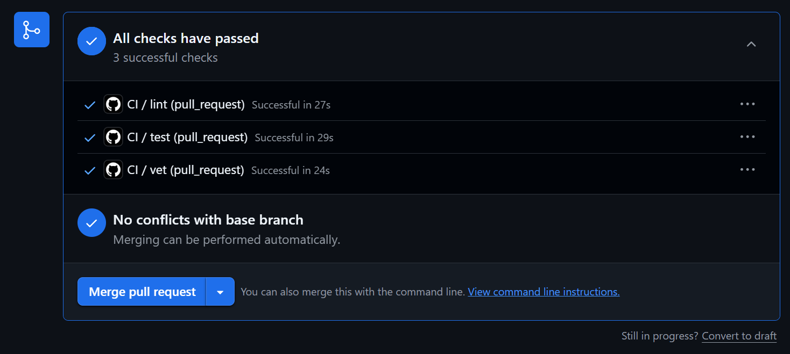
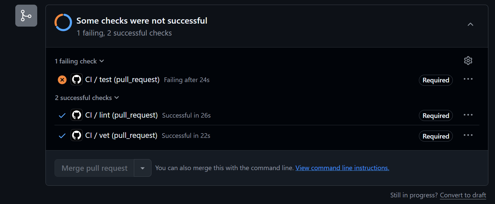
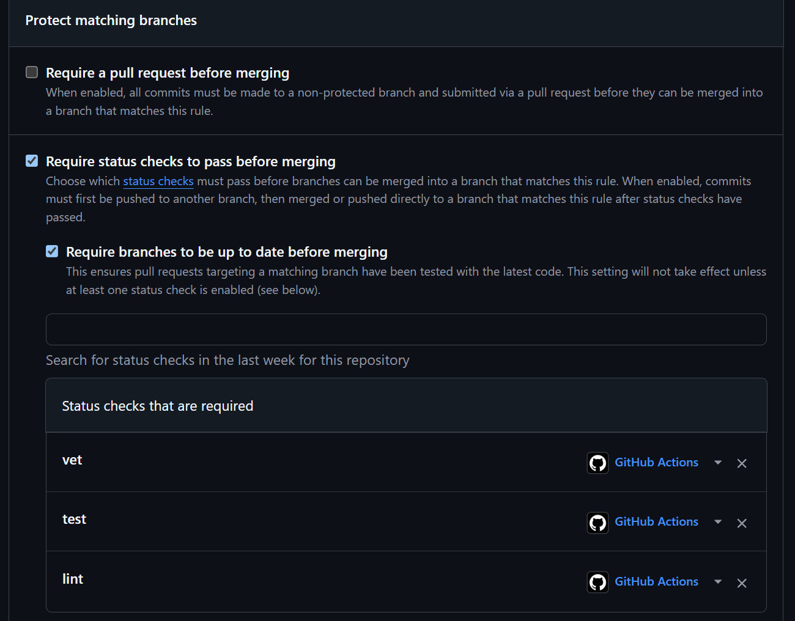

# Lab 3 submission

**Path: GitHub Actions** - I picked it because my fork and Labs 1-2 already live on GitHub, so a SHA-pinned `.github/workflows/ci.yml` runs natively with no extra tooling.

## Task 1: PR gate

CI config: [.github/workflows/ci.yml](../.github/workflows/ci.yml)

Green CI run: [run 27644045591](https://github.com/danielpancake/DevOps-Intro/actions/runs/27644045591)

### 1.2 Design questions

**a) Why pin `ubuntu-24.04` instead of `ubuntu-latest`?**
`ubuntu-latest` can change automatically when GitHub switches it to a newer Ubuntu version. That means the OS, preinstalled tools, and package versions may change without any updates to your code, potentially causing builds to fail unexpectedly.

**b) Why split vet + test + lint into separate units?**
They are independent tasks, so they can run in parallel. This reduces total pipeline time because the overall duration is roughly the time of the slowest job, not the sum of all three. Separate jobs also make failures easier to understand. You can immediately see whether the problem is a vet warning, a test failure, or a lint issue.

**c) What attack does SHA pinning prevent? (Lecture 3)**
SHA pinning protects against supply-chain attacks that exploit mutable tags or branches. Tags such as v4 can be moved to point to different code, so anyone with permission to modify the action's repository can change what your workflow runs without any changes in the repository.

**d) What is `permissions:` and the principle behind it?**
`permissions`: controls what the `GITHUB_TOKEN` can do in a GitHub Actions workflow. It lets you set access levels for resources such as repository contents, pull requests, and packages.

**e) GitLab path: stage vs job; what `dependencies:` adds**
In GitLab CI, a stage is a pipeline phase (for example, build, test, or deploy), while a job is a specific task that runs within a stage. Jobs in the same stage run in parallel, and the next stage only starts once the current one passes, so `stages:` controls execution order. `dependencies:` is separate: it controls artifact flow, listing which earlier jobs' artifacts a job downloads (`dependencies: []` downloads none). So stages decide when a job runs, while `dependencies:` decides what data it pulls in, even though stage ordering already sequences them.

### Evidence

Green run - all three required checks pass:

Failed run - `test` broken on purpose ([commit](https://github.com/danielpancake/DevOps-Intro/commit/0f250b6)); `test` is red and merge is blocked. Reverted in the [fix commit](https://github.com/danielpancake/DevOps-Intro/commit/19c587c):

Branch protection on `main` - `vet`, `test`, `lint` required + branches must be up to date:

## Task 2: Fast and smart

Cache + matrix run: [run 27645771948](https://github.com/danielpancake/DevOps-Intro/actions/runs/27645771948)

### 2.4 Timing

| Scenario | Wall-clock | Run |
| --- | --- | --- |
| Baseline (no cache, single Go version, no path filter) | ~38 s | [27644045591](https://github.com/danielpancake/DevOps-Intro/actions/runs/27644045591) |
| With cache (single Go version) | ~37 s | [27645418442](https://github.com/danielpancake/DevOps-Intro/actions/runs/27645418442) |
| With cache + matrix (1.23 + 1.24) | ~43 s | [27645771948](https://github.com/danielpancake/DevOps-Intro/actions/runs/27645771948) |

The cache row barely moves, and that is the expected result. QuickNotes has zero third-party dependencies (no `require` block, no `go.sum`), so the module cache has nothing to store. Most of the wall-clock is runner startup, checkout, and the Go toolchain download, none of which the cache touches. The matrix runs both Go versions in parallel, so it adds no wall-clock by itself; the extra ~5 s comes from the `ci-ok` gate, which waits for every job and then provisions its own runner.

### Optimizations applied

- **Cache** - `setup-go` with `cache: true` and `cache-dependency-path: app/go.mod`. We cache the deterministic inputs (Go module + build cache); the key is hashed from `go.mod` since there is no `go.sum`.
- **Matrix** - `vet` and `test` run against Go `1.23` and `1.24` in parallel with `fail-fast: false`, so a break in one toolchain version does not cancel or hide the other.
- **Path filter** - the pipeline triggers only when `app/**` or `.github/workflows/**` changes, so README- or submission-only PRs skip CI instead of burning minutes.
- **`ci-ok` gate** - one aggregation job (`if: always()`, `needs: [vet, test, lint]`) is the single required check. Branch protection now requires only `ci-ok`, so the matrix can rename its checks freely without leaving the PR stuck on a missing `vet`/`test` context.

### 2.5 Design questions

**f) Why cache `go.sum`-keyed inputs and not build outputs?**
Inputs are deterministic: the same `go.sum` always resolves to byte-identical module content, so a cache keyed on its hash is always safe to reuse and auto-invalidates the moment a dependency changes. Build outputs depend on the toolchain version, build flags, and OS, so reusing them across environments risks serving a stale or mismatched artifact. You cache the deterministic inputs and let the compiler rebuild outputs from them. (Here we key on `go.mod` because the project has no `go.sum`.)

**g) What does `fail-fast: false` change, and when do you want `fail-fast: true`?**
By default (`fail-fast: true`) GitHub cancels every other matrix cell as soon as one fails. `fail-fast: false` lets all cells finish, so you can see whether a failure is specific to one Go version or affects both, which is exactly what you want when debugging "works on 1.24, breaks on 1.23." You want `fail-fast: true` when the cells are equivalent and you only care that all pass, so the run bails early and saves CI minutes.

**h) Risk of an attacker writing a cache from a malicious PR that a protected branch later reads?**
A malicious PR could poison the shared cache (plant a tampered module or build artifact under a known key); if a protected branch later restores that key, it would execute attacker-controlled content - cache poisoning. GitHub mitigates this by scoping caches to a branch and its base: a cache written by a PR/feature branch is only readable by that branch and PRs based on it, not by `main` or unrelated branches, and fork PRs get read-only access to the base cache. Keying on a `go.sum`/`go.mod` hash adds a second layer, since tampered inputs change the hash and never collide with the trusted key.
