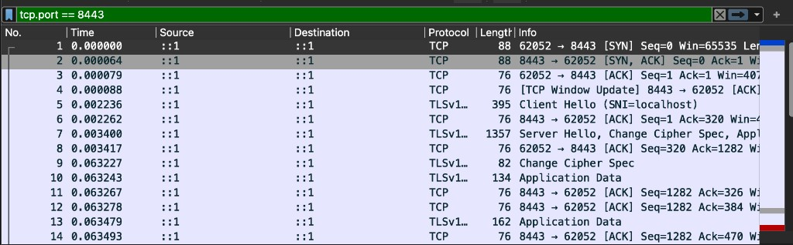
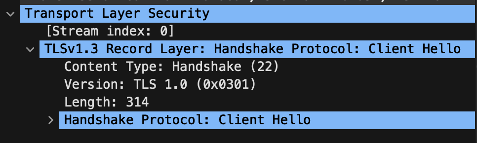
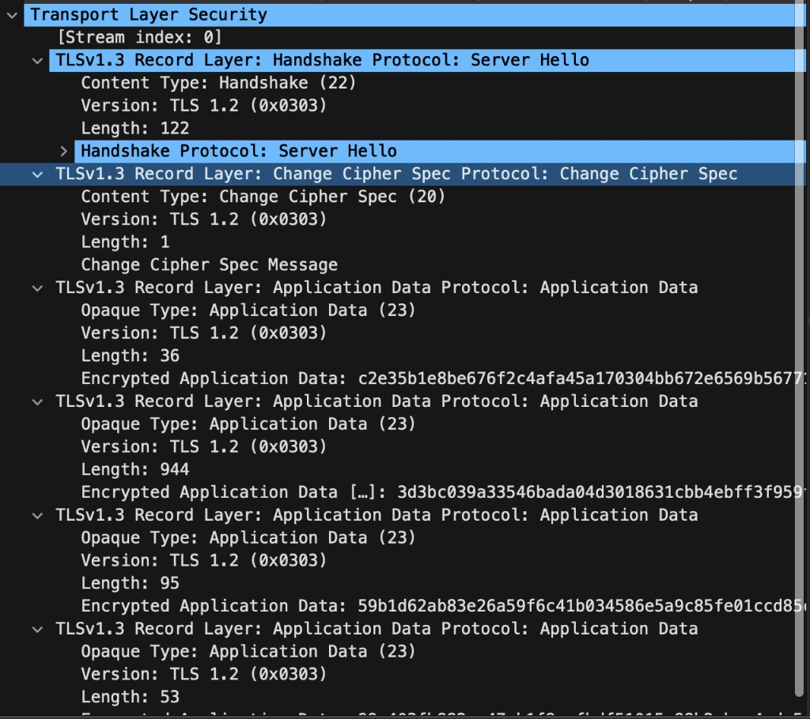

# Lab 4 Submission

Host: macOS. Linux-only commands are documented with the closest macOS equivalent where needed.

## Task 1 - Trace a Request End-to-End

Artifacts:

```text
lab4-artifacts/lab4-trace.pcap
lab4-artifacts/lab4-trace.txt
lab4-artifacts/debug-commands.txt
```

Request sent:

```bash
curl -v -X POST http://localhost:8080/notes \
  -H 'Content-Type: application/json' \
  -d '{"title":"trace me","body":"in flight"}'
```

Response:

```json
{"id":6,"title":"trace me","body":"in flight","created_at":"2026-06-16T18:19:05.060318Z"}
```

### Packet trace notes

TCP three-way handshake:

```text
21:19:05.059990 ::1.61327 > ::1.8080: Flags [S]
21:19:05.060056 ::1.8080 > ::1.61327: Flags [S.]
21:19:05.060071 ::1.61327 > ::1.8080: Flags [.]
```

HTTP request and JSON body:

```text
POST /notes HTTP/1.1
Host: localhost:8080
Content-Type: application/json
Content-Length: 39

{"title":"trace me","body":"in flight"}
```

HTTP response:

```text
HTTP/1.1 201 Created
Content-Type: application/json
Content-Length: 90

{"id":6,"title":"trace me","body":"in flight","created_at":"2026-06-16T18:19:05.060318Z"}
```

Connection close:

```text
21:19:05.061275 ::1.61327 > ::1.8080: Flags [F.]
21:19:05.061328 ::1.8080 > ::1.61327: Flags [F.]
```

### Five debugging commands

`ss` is not available on this macOS host, so I used `lsof` for the listener check:

```text
$ lsof -nP -iTCP:8080 -sTCP:LISTEN
COMMAND     PID USER   FD   TYPE   NODE NAME
quicknote 43857  mac    7u  IPv6        TCP *:8080 (LISTEN)
```

`ip route show` is Linux-only here, so I used `route -n get default`:

```text
route to: default
destination: default
interface: utun4
flags: <UP,DONE,CLONING,STATIC,GLOBAL>
mtu: 1500
```

`mtr` to localhost:

```text
HOST: local host report
  1.|-- localhost  0.0% loss, avg 0.1 ms
```

DNS:

```text
$ dig +short example.com @1.1.1.1
172.66.147.243
104.20.23.154
```

`journalctl` is systemd/Linux-only, so for this local run I captured the process log:

```text
2026/06/16 21:19:02 quicknotes listening on :8080 (notes loaded: 5)
```

### If QuickNotes returned 502

I would start outside-in: first check whether the reverse proxy can reach its upstream, then whether QuickNotes is listening on the expected port, then whether `/health` returns locally. A 502 usually means the proxy is alive but the upstream is unavailable, refusing connections, timing out, or returning malformed data. After that I would check recent process logs and the exact proxy upstream address.

## Task 2 - Outside-In Debugging on a Broken Deploy

Artifact:

```text
lab4-artifacts/broken-debug.txt
```

Root cause:

```text
listen tcp :8080: bind: address already in use
```

### Chain

1. Process check:

```text
$ ps-style check
PID    COMM
43857  quicknotes
```

Decision: one QuickNotes process was already running.

2. Listener check:

```text
$ lsof -nP -iTCP:8080 -sTCP:LISTEN
quicknote 43857 ... TCP *:8080 (LISTEN)
```

Decision: port `8080` was occupied.

3. Reachability:

```text
$ curl -s -o /dev/null -w "%{http_code}\n" http://localhost:8080/health
200
```

Decision: the existing service was healthy; the second instance failed before serving traffic.

4. Firewall:

```text
pfctl showed normal macOS anchors. No firewall rule was needed to explain the bind failure.
```

Decision: firewall was not the root cause.

5. DNS:

```text
$ dig +short localhost
```

Decision: DNS was not the root cause; the failure happened in `bind()`.

Repair:

```text
kill the existing quicknotes process
ADDR=:8080 go run .
curl -s http://localhost:8080/health
{"notes":4,"status":"ok"}
```

### Mini-postmortem

The broken deploy happened because two instances tried to own the same port. No person needed to make a dramatic mistake; the system allowed a second process to start without checking port ownership first. A service manager can prevent this with one declared unit, restart policy, and clear logs. A preflight check or health-gated deploy would catch the conflict before users see failures.

## Bonus - TLS Handshake

Artifacts:

```text
lab4-artifacts/lab4-tls.pcap
lab4-artifacts/lab4-tls.txt
lab4-artifacts/tls-summary.txt
lab4-artifacts/lab4-openssl-s-client.txt
```

I ran Caddy on `localhost:8443` as a TLS-terminating reverse proxy to QuickNotes:

```text
localhost:8443 {
  tls internal
  reverse_proxy localhost:8080
}
```

`curl -vk https://localhost:8443/health` shows the handshake:

```text
TLS handshake, Client hello (1)
TLS handshake, Server hello (2)
TLS handshake, Certificate (11)
TLS handshake, Finished (20)
SSL connection using TLSv1.3 / AEAD-CHACHA20-POLY1305-SHA256
HTTP/2 200
{"notes":4,"status":"ok"}
```

The pcap shows the TCP handshake followed by encrypted TLS records on port `8443`.

### Wireshark decode

Filtered capture on port `8443`:



ClientHello (`TLSv1.3`, SNI `localhost` visible in packet list):



ServerHello (`TLSv1.3`, then Change Cipher Spec and encrypted Application Data):



Certificate chain from `openssl s_client -connect localhost:8443 -servername localhost -showcerts`:

```text
Certificate chain
 0 s:
   i:CN=Caddy Local Authority - ECC Intermediate
 1 s:CN=Caddy Local Authority - ECC Intermediate
   i:CN=Caddy Local Authority - 2026 ECC Root

New, TLSv1.3, Cipher is TLS_AES_128_GCM_SHA256
Protocol: TLSv1.3
Verify return code: 20 (unable to get local issuer certificate)
```

TLS 1.0 and 1.1 are effectively killed during protocol negotiation: the client offers supported versions in ClientHello, and the server chooses the protocol in ServerHello. A 2026 server should not select TLS 1.0/1.1, so old clients fail at negotiation instead of continuing with weak protocol versions.
