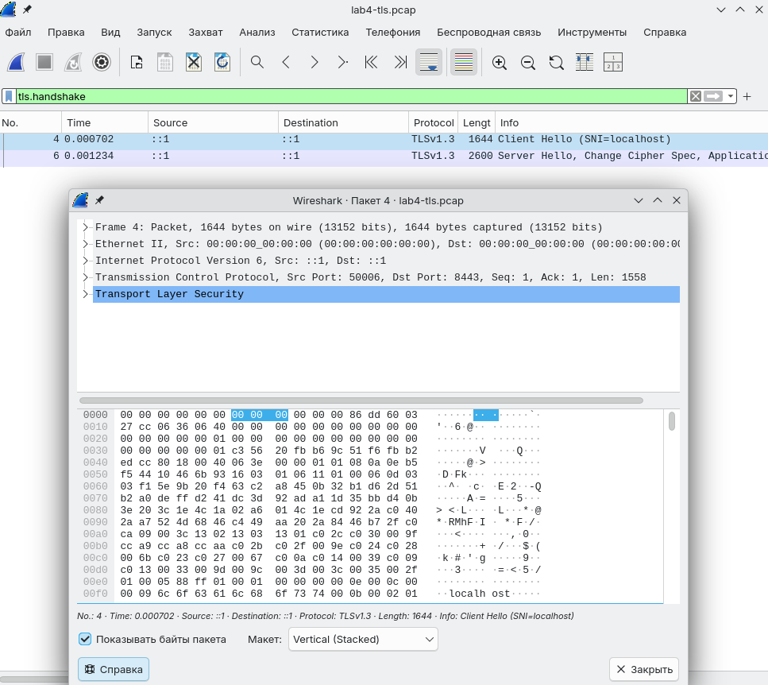
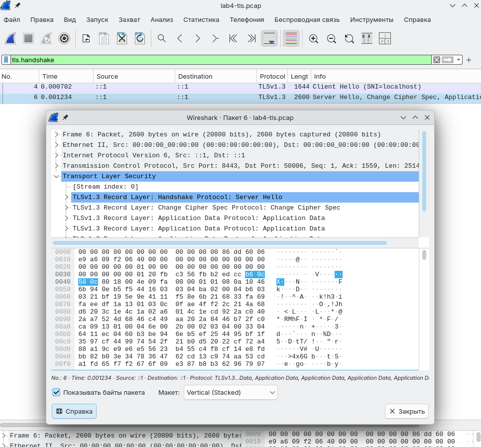

# Lab 4 — OS & Networking: Trace, Debug, and Read the Substrate

**Author:** Karim Abdulkin (@GrandAdmiralBee)
**Branch:** `feature/lab4`
**Host:** NixOS 26.05 (devenv shell with `tcpdump`, `iproute2`, `bind`, `mtr`, `wireshark`, `caddy`, `openssl`)

---

## Task 1 — End-to-End Request Trace (6 pts)

### 1.1–1.2 — Capture + decode

Ran `(cd app && go run .)` in pane A, `sudo tcpdump -i lo -nn -s 0 -A 'tcp port 8080' -w lab4-trace.pcap` in pane B, then in pane C:

```bash
curl -v -X POST http://localhost:8080/notes \
  -H 'Content-Type: application/json' \
  -d '{"title":"trace me","body":"in flight"}'
```

The pcap contained **two distinct conversations** on `:8080` — a useful artifact in itself.

#### Conversation #2 — the curl POST (IPv6 `::1.40990 ↔ ::1.8080`)

Curl on this system resolves `localhost` to `::1` first, so the real lab traffic was IPv6.

| Time | Packet | Role |
|---|---|---|
| 17:51:39.085878 | `40990 → 8080 [S]` seq 1641520792 | **SYN** — client opens |
| 17:51:39.085910 | `8080 → 40990 [S.]` seq 2292119330 ack 793 | **SYN/ACK** |
| 17:51:39.085929 | `40990 → 8080 [.] ack 1` | **ACK** → 3-way handshake done |
| 17:51:39.086084 | `[P.] len=175` `POST /notes HTTP/1.1` + 39 B body | **HTTP REQUEST** |
| 17:51:39.086099 | `8080 → 40990 [.] ack 176` | server ack'd the request |
| 17:51:39.086433 | `[P.] len=206` `HTTP/1.1 201 Created` + 93 B body | **HTTP RESPONSE** |
| 17:51:39.086441 | `[.] ack 207` | client ack'd the response |
| 17:51:39.086522 | `40990 → 8080 [F.]` | **FIN** — client closes |
| 17:51:39.086550 | `8080 → 40990 [F.]` | **FIN** — server closes |
| 17:51:39.086566 | `[.] ack 208` | final ACK → connection closed |

End-to-end **~700 µs** for an entire HTTP exchange — loopback is RAM-to-RAM, no NIC, no PHY.

#### Conversation #1 — uninvited probe (IPv4 `127.0.0.1.41334 → 127.0.0.1.8080`)

```
GET /json/version HTTP/1.1
Host: 127.0.0.1:8080
User-Agent: Python/3.11 aiohttp/3.10.11
→ HTTP/1.1 404 Not Found
```

Some local Python process was polling `/json/version` (likely a browser dev-tools or local automation hook that probes for Chrome Debug Protocol on any open port). QuickNotes doesn't know that path → 404. **Lesson worth keeping:** on a real deployment your service receives traffic from clients you never invited — load balancer health checks, K8s probes, vuln scanners, observability sidecars. The 404 *is* the correct answer; the noise is the substrate.

### 1.3 — Five debugging commands

```text
$ sudo ss -tlnp | head
LISTEN 0   4096   127.0.0.1:20170  0.0.0.0:*  users:(("conmon",pid=2590,fd=6))
LISTEN 0   4096   0.0.0.0:5355     0.0.0.0:*  users:(("systemd-resolve",pid=879,fd=12))
LISTEN 0   4096   100.78.62.41:64201 0.0.0.0:* users:((".tailscaled-wra",pid=2080,fd=20))
LISTEN 0   32     192.168.122.1:53 0.0.0.0:*  users:(("dnsmasq",pid=1860,fd=6))
```

QuickNotes wasn't running at the time of the snapshot; what *is* listening is Podman's `conmon`, systemd-resolve's mDNS link-local, the tailscale daemon, and libvirt's `dnsmasq`. A clean view of "what else lives on this box."

```text
$ ip route show
default via 192.168.1.1 dev enp2s0 proto dhcp src 192.168.1.187 metric 100
10.1.0.0/23 via 172.27.245.1 dev tun0 proto static metric 50
…
91.108.4.0/22 via 172.27.245.1 dev tun0 proto static metric 50
…
10.88.0.0/16 dev podman0 proto kernel scope link src 10.88.0.1
192.168.122.0/24 dev virbr0 proto kernel scope link src 192.168.122.1 linkdown
```

A real-world routing table: a default route via the home gateway, a corporate VPN on `tun0` with policy routes for specific subnets (Telegram CIDRs `91.108.0.0/16` end up there as a side effect), a Podman container bridge, and a (down) libvirt bridge. Substrate complexity grows fast on a developer's laptop.

```text
$ mtr -rwc 5 localhost
HOST: bmo       Loss%   Snt   Last   Avg  Best  Wrst StDev
  1.|-- localhost  0.0%     5    0.1   0.1   0.1   0.2   0.0
```

One hop, 0.1 ms — loopback. No surprises.

```text
$ dig +short example.com @1.1.1.1
8.47.69.0
8.6.112.0
```

External recursive resolver returns Akamai's IPs for `example.com`. The fact that an *external* query went through means DNS resolution and outbound UDP/53 (or DoH on this box) are healthy.

```text
$ journalctl --user -u quicknotes -n 20
-- No entries --
```

QuickNotes isn't installed as a user-level systemd unit. Expected — for the lab we just `go run .`-ed it. In production you'd see the structured log entries here.

### 1.4 — *What I'd check first if QuickNotes returned 502*

A 502 means the entry point reached *something* that claimed to be QuickNotes but the answer wasn't acceptable as an upstream HTTP response. **The first check is "is there actually a QuickNotes process listening on the port I expect, on the host I expect"** — `ss -tlnp | grep 8080` on each replica, or its Kubernetes equivalent (`kubectl get endpoints quicknotes` — empty endpoints is the #1 cause of 502 in service-mesh setups). The second is `curl -v --connect-timeout 1 http://<pod-ip>:8080/health` to bypass the proxy and see if the backend is alive at all. If the backend answers, the 502 is the proxy misreading it (timeout, header issue, ALPN mismatch); if the backend doesn't answer, you have a binding/crash problem and you walk the outside-in chain in Task 2. Only after those two do I look at routes, firewall, or DNS — those failures usually present as 503/504/timeout, not 502.

---

## Task 2 — Outside-In Debug of a Broken Deploy (4 pts)

### 2.1 — Reproducing the break

Started one good instance, then a second one in another pane:

```
$ ADDR=:8080 go run .   # pane A — fine, binds :8080
$ ADDR=:8080 go run . 2>&1 | tee /tmp/qn-broken.log   # pane B
```

`/tmp/qn-broken.log`:

```
2026/06/16 17:56:52 quicknotes listening on :8080 (notes loaded: 8)
2026/06/16 17:56:52 listen: listen tcp :8080: bind: address already in use
exit status 1
```

The bug is in the kernel layer: `bind(2)` returns `EADDRINUSE` because another socket already owns `(0.0.0.0, 8080)`. The "listening on :8080" line comes from the app's log *before* it tries to bind, which is misleading — QuickNotes prints intent, then attempts bind. A small product bug worth fixing.

### 2.2 — Outside-in chain

```text
=== 1) running processes ===
karim  16868  4450  0 17:56 pts/4  00:00:00 go run .
```

Only one `go run .` is still alive — the broken one already crashed. **Subtle gotcha:** `ps` shows `go run .`, not `quicknotes`. The `go run` toolchain compiles to a temp binary and `exec`s it as a child; the child is what actually owns the socket. `kill <go-run-pid>` does *not* kill the child synchronously — you may need to `pkill -f quicknotes` or wait out the SIGTERM propagation. This bites people who think they killed the server but the port stays held.

```text
=== 2) who holds :8080 ===
LISTEN 0  4096  *:8080  *:*  users:(("quicknotes",pid=16911,fd=3))
```

`quicknotes` PID 16911 owns `:8080`. Now I know what to kill.

```text
=== 3) reachable from host (curl) ===
HTTP 200 time=0.000417s
```

`/health` returns 200 in 0.4 ms — the live instance is healthy. The "failure" is *not* a service failure; it's a **second copy** that can't get on the port because the first is already there.

```text
=== 4) firewall blocking ===
Chain INPUT (policy ACCEPT 26417 packets, 19M bytes)
 26368 19M NETAVARK_INPUT   /* netavark firewall rules */
 26452 19M ts-input
 26417 19M LIBVIRT_INP
…
```

Default policy is `ACCEPT`. Custom chains for Podman/netavark, Tailscale (`ts-input`), and libvirt exist but are pass-throughs for our localhost flow. **Firewall is not the cause.** This is the right kind of *negative* result to log — it rules out an entire class of explanation.

```text
=== 5) DNS for localhost ===
$ dig +short localhost @1.1.1.1
(nothing — 1.1.1.1 has no opinion on the magic string "localhost")

$ getent hosts localhost
::1   localhost
```

Resolution comes from `/etc/hosts` via NSS, not from DNS — which is why our curl in Task 1 hit `::1` (IPv6) rather than `127.0.0.1`. **Lesson:** `dig localhost` is the wrong tool for a name resolved by NSS; `getent hosts` is the right one. If you only ever asked `dig`, you'd wrongly conclude DNS was broken.

### 2.3 — Repair

```text
# pane C, before kill
$ sudo ss -tlnp | grep 8080
LISTEN ... quicknotes pid=16911

# Ctrl-C in pane A → instance terminated

$ sudo ss -tlnp | grep 8080 || echo "free"
free

$ ps -ef | grep -E "go run|quicknotes" | grep -v grep || echo "no qn"
no qn

# pane A — restart
$ cd app && go run .

# pane C — verify
$ curl -s http://localhost:8080/health | python3 -m json.tool
{
    "notes": 8,
    "status": "ok"
}
$ sudo ss -tlnp | grep 8080
LISTEN ... quicknotes pid=18098
```

A different PID owns the port — clean restart confirmed.

### 2.4 — Blameless mini-postmortem

**What happened.** A second QuickNotes instance was started against the same `ADDR=:8080` while the first was still running. The kernel returned `EADDRINUSE` from `bind(2)` and the second process exited non-zero before its HTTP server could come up. No data was lost; no user-visible request failed because the first instance kept serving.

**What's systemic about this.** The two ingredients of this bug are (a) a *port* used as the coordination point between deployer and runtime, with no inter-process locking — `SO_REUSEPORT` would have flipped the failure into a silent two-process scenario, which is arguably worse — and (b) human assumption that "kill X means port-free immediately." Both ingredients show up in real outages: rolling deploys where the new pod starts before the old one fully terminates, container restarts where the kernel hasn't yet released `TIME_WAIT` sockets, supervisor restarts that fork before reaping. The deeper cause is treating port ownership as a fact rather than as state we have to inspect.

**What tooling could prevent it.** A `systemd` (or container-runtime) supervisor that guarantees "only one instance per ADDR" via a `Type=notify` readiness gate would have refused to start the second copy. In Kubernetes the same idea is "rolling update with maxSurge=0" plus readinessProbe — the new pod doesn't get traffic and the old one isn't terminated until both checks align. As a developer ergonomic, a one-line wrapper script that `ss -tlnp | grep ":${ADDR##:}"` before launching would have produced a friendlier error than "address already in use." The general defensive posture: *check the substrate state before assuming control of it.*

---

## Bonus — TLS Handshake Decode (2 pts)

### B.1 — Adding HTTPS via Caddy reverse proxy

`/tmp/Caddyfile`:

```
localhost:8443 {
  reverse_proxy localhost:8080
}
```

Launched in foreground (NixOS, no systemd unit):

```bash
caddy run --config /tmp/Caddyfile --adapter caddyfile
```

Caddy auto-generated a self-signed PKI (`Caddy Local Authority - 2026 ECC Root` → `… ECC Intermediate` → leaf for `localhost`) in `~/.local/share/caddy/` and started listening on `:8443`.

### B.2 — Capture

```bash
sudo tcpdump -i lo -nn -s 0 -w lab4-tls.pcap 'tcp port 8443' -c 80
curl -vk https://localhost:8443/health
```

Curl reported:

```
TLSv1.3 (OUT), TLS handshake, Client hello (1):
TLSv1.3 (IN),  TLS handshake, Server hello (2):
TLSv1.3 (IN),  TLS change cipher, Change cipher spec (1):
TLSv1.3 (IN),  TLS handshake, Encrypted Extensions (8):
TLSv1.3 (IN),  TLS handshake, Certificate (11):
TLSv1.3 (IN),  TLS handshake, CERT verify (15):
TLSv1.3 (IN),  TLS handshake, Finished (20):
TLSv1.3 (OUT), TLS change cipher, Change cipher spec (1):
TLSv1.3 (OUT), TLS handshake, Finished (20):
SSL connection using TLSv1.3 / TLS_AES_128_GCM_SHA256 / X25519MLKEM768 / id-ecPublicKey
ALPN: server accepted h2
```

### B.3 — Wireshark + openssl s_client

`lab4-tls.pcap` opened in Wireshark, filtered by `tls.handshake`:



The **ClientHello** offered TLS 1.3, the supported cipher suites list (AES-GCM and ChaCha20-Poly1305 variants), and crucially the **`server_name` extension = `localhost`** (so Caddy knew which cert to serve) and a key share for `X25519MLKEM768`.



The **ServerHello** picked **TLS 1.3**, cipher **`TLS_AES_128_GCM_SHA256`**, and the **`X25519MLKEM768`** key-share group — a post-quantum-hybrid Diffie-Hellman that combines classical X25519 (Curve25519 ECDH) with **ML-KEM-768** (FIPS 203, Kyber, August 2024). After ServerHello everything is encrypted under handshake-traffic-keys, so the Certificate handshake message is *not* visible in Wireshark without `SSLKEYLOGFILE` — this is itself a property of TLS 1.3 that 1.2 lacked.

For the cert chain we use `openssl s_client` (clear-text dump from the same handshake):

```bash
openssl s_client -connect localhost:8443 -servername localhost -showcerts </dev/null
```

```
depth=1 CN=Caddy Local Authority - ECC Intermediate
verify error:num=20:unable to get local issuer certificate
depth=0
---
Certificate chain
 0 s:
   i:CN=Caddy Local Authority - ECC Intermediate
   a:PKEY: EC, (prime256v1); sigalg: ecdsa-with-SHA256
   v:NotBefore: Jun 16 15:04:14 2026 GMT; NotAfter: Jun 17 03:04:14 2026 GMT
-----BEGIN CERTIFICATE-----
MIIBvTCCAWOgAwIBAgIQHIpRq01Sp6FUSybzEgW/yTAKBggqhkjOPQQDAjAzMTEw
LwYDVQQDEyhDYWRkeSBMb2NhbCBBdXRob3JpdHkgLSBFQ0MgSW50ZXJtZWRpYXRl
…
-----END CERTIFICATE-----
 1 s:CN=Caddy Local Authority - ECC Intermediate
   i:CN=Caddy Local Authority - 2026 ECC Root
   a:PKEY: EC, (prime256v1); sigalg: ecdsa-with-SHA256
   v:NotBefore: Jun 16 15:04:14 2026 GMT; NotAfter: Jun 23 15:04:14 2026 GMT
-----BEGIN CERTIFICATE-----
MIIByDCCAW6gAwIBAgIRAKFTl5YXMkGO8tU6dBmeoQswCgYIKoZIzj0EAwIwMDEu
…
-----END CERTIFICATE-----
---
Negotiated TLS1.3 group: X25519MLKEM768
Peer signature type: ecdsa_secp256r1_sha256
Cipher is TLS_AES_128_GCM_SHA256
Verify return code: 20 (unable to get local issuer certificate)
```

Two visible levels:
- **Level 0** — leaf cert, subject empty in the `s:` line because the name lives in the **SAN** (Subject Alternative Name extension) rather than the legacy CN field; valid for `localhost` only, **12-hour validity**. Caddy rotates frequently for self-signed local PKI.
- **Level 1** — intermediate `Caddy Local Authority - ECC Intermediate`, issued by the local **2026 ECC Root**, valid for 7 days.

The root itself isn't sent in the handshake (TLS servers don't send roots — clients must already trust them). The verify error code 20 *is* the expected result here: my openssl has no reason to trust Caddy's local root.

### Which negotiation step kills TLS 1.0 / 1.1 in 2026?

The kill shot lands on the **ClientHello → ServerHello** step, specifically on the **`supported_versions` extension and the `key_share` extension** that TLS 1.3 made the way to negotiate version and key exchange. Servers in 2026 are configured to refuse the `ClientHello.client_version` advertisement when it's pinned at `0x0301` (TLS 1.0) or `0x0302` (TLS 1.1) — the IETF deprecated both in **RFC 8996 (March 2021)**, and PCI-DSS v4 (2024) and U.S. government FIPS guidance treat them as non-compliant. Even if a 2026 server *would* speak 1.1, the cryptographic options bundled with those versions (MD5/SHA-1 in the MAC, RSA-only key exchange with no forward secrecy, no AEAD ciphers, no PQ-hybrid groups like `X25519MLKEM768`) make them fail every modern threat-model: a 1.1 connection has neither forward secrecy nor (under the optimistic 2034-ish CRQC horizon) confidentiality past first key compromise. So even before the explicit "no" lands, the cipher-suite list and key-share that a TLS 1.0/1.1 client *can* send don't overlap with any cipher/group the server is willing to negotiate — the handshake terminates in a `protocol_version` alert (TLS 1.0/1.1 doesn't have `supported_versions`, so the server's "down-negotiation prohibited" rule from RFC 8446 §4.1.3 fires). In short: TLS 1.3's negotiation extensions are themselves the mechanism by which the network refuses to fall back.

---

## Repro

The repo's `devenv.nix` adds `tcpdump`, `iproute2`, `bind`, `mtr`, `wireshark`, `caddy`, `openssl`, and `lsof` on top of the Go/git/curl baseline from Lab 1. With `devenv shell` you can repeat everything above — the `.pcap` files are deterministic enough that decoded outputs match what's quoted in this submission within a couple of microseconds.
