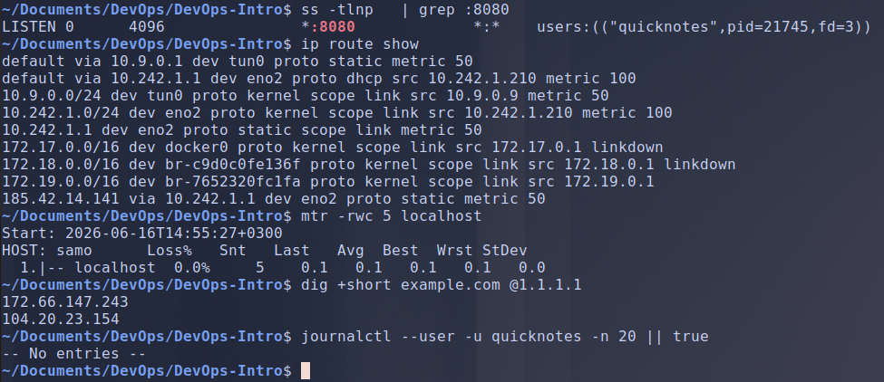
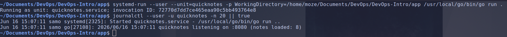
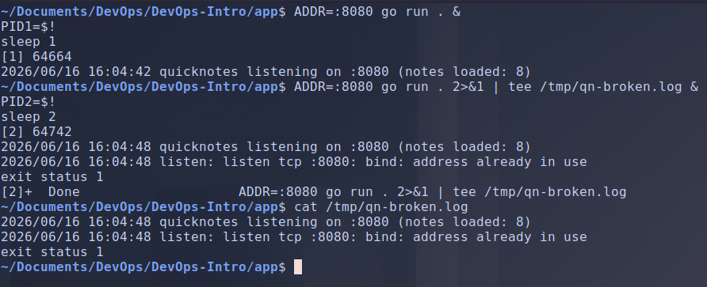
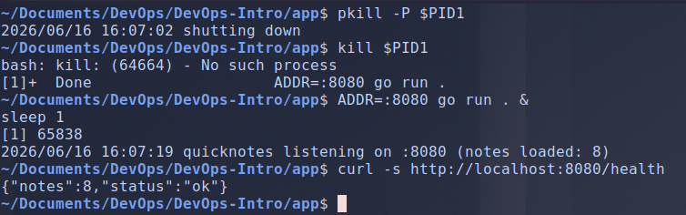

# Lab 4 submission

## Task 1: Trace a Request End-to-End

### Capture

- **Handshake:**

    ```bash
    14:37:45.615329 IP6 ::1.41280 > ::1.8080: Flags [S], seq 3032480471 ..... # SYN
    14:37:45.615344 IP6 ::1.8080 > ::1.41280: Flags [S.], seq 2891834856, ack ..... # SYN/ACK
    14:37:45.615352 IP6 ::1.41280 > ::1.8080: Flags [.], ack 1 ..... # ACK
    ```

- **Request:**

    ```bash
    14:37:45.615442 IP6 ::1.41280 > ::1.8080: Flags [P.], seq 1:175, ack 1 .....
    .POST /notes HTTP/1.1
    Host: localhost:8080
    User-Agent: curl/8.5.0
    Accept: */*
    Content-Type: application/json
    Content-Length: 39

    {"title":"trace me","body":"in flight"}
    14:37:45.615448 IP6 ::1.8080 > ::1.41280: Flags [.], ack 175 .....
    ```

- **Response:**

    ```bash
    14:37:45.615866 IP6 ::1.8080 > ::1.41280: Flags [P.], seq 1:207, ack 175 .....
    HTTP/1.1 201 Created
    Content-Type: application/json
    Date: Tue, 16 Jun 2026 11:37:45 GMT
    Content-Length: 93

    {"id":8,"title":"trace me","body":"in flight","created_at":"2026-06-16T11:37:45.615622707Z"}

    14:37:45.615873 IP6 ::1.41280 > ::1.8080: Flags [.], ack 207 .....
    ```

- **Connection close:**

    ```bash
    14:37:45.616064 IP6 ::1.41280 > ::1.8080: Flags [F.], seq 175, ack 207 .....
    14:37:45.616119 IP6 ::1.8080 > ::1.41280: Flags [F.], seq 207, ack 176 .....
    14:37:45.616135 IP6 ::1.41280 > ::1.8080: Flags [.], ack 208 .....
    ```

### Commands output





### What would you check first if QuickNotes returned 502?

A 502 means a gateway/proxy in front of QuickNotes got an invalid or no response from the upstream, so the proxy is up but the app behind it isn't answering correctly. I'd debug outside-in: first confirm the app process is actually running and listening on its port (`ss -tlnp | grep 8080`), then curl the app directly bypassing the proxy (`curl -v localhost:8080/health`) to decide whether the fault is in the app or between the app and proxy.
If the app answers fine directly, the proxy is pointing at the wrong port/host or timing out; if it doesn't, I check the app's logs for a crash.

## Task 2: Outside-In Debugging on a Broken Deploy

### Run a broken instance



### Outside-in chain

- **Is the app running?**

    command:

    ```bash
    ps -ef | grep "go run" | grep -v grep
    ```

    output:

    ```bash
    moze       64664   54359  0 16:04 pts/8    00:00:00 go run .
    ```

- **Is it listening on the expected port?**

    command:

    ```bash
    ss -tlnp | grep 8080
    ```

    output:

    ```bash
    LISTEN 0      4096               *:8080             *:*    users:(("quicknotes",pid=64699,fd=3))
    ```

- **Is it reachable from host?**

    command:

    ```bash
    curl -s -o /dev/null -w "%{http_code}\n" http://localhost:8080/health
    ```

    output:

    ```bash
    200
    ```

- **Is firewall blocking?**

    command:

    ```bash
    sudo iptables -L -n -v 2>/dev/null || sudo nft list ruleset 2>/dev/null || true
    ```

    output:

    ```bash
    Chain INPUT (policy ACCEPT 0 packets, 0 bytes)
    pkts bytes target     prot opt in     out     source               destination         

    Chain FORWARD (policy DROP 0 packets, 0 bytes)
    pkts bytes target     prot opt in     out     source               destination         
    118  129K DOCKER-USER  0    --  *      *       0.0.0.0/0            0.0.0.0/0           
    118  129K DOCKER-FORWARD  0    --  *      *       0.0.0.0/0            0.0.0.0/0           

    Chain OUTPUT (policy ACCEPT 0 packets, 0 bytes)
    pkts bytes target     prot opt in     out     source               destination
    ......
    ```

- **Is DNS working?**

    command:

    ```bash
    dig +short localhost
    ```

    output:

    ```bash
    127.0.0.1
    ```

### Root cause

From the command `ps -ef | grep "go run" | grep -v grep` we see that there is already a process running `go run .` with PID 64664. And from `ss -tlnp | grep 8080` we see that there is a process using port 8080, which is a process for the app `go run .` created.
When we try to start another instance of the app, it fails to bind to port 8080 because it's already in use by the first instance.

**Repair:**
We kill the child processes of the first instance (64664) then we kill it itself:



### What's systemic about this kind of failure, and what tooling could prevent it?

The second instance died with `bind: address already in use`. That isn't a bug. The kernel only allows one listener per port, so it rejected the duplicate.
This is something that might cause major problems in production environments. A deploy or restart often starts the new instance before the old one has released the port. Maybe the old process is still alive, maybe it crashed and nobody reaped it, maybe the socket is sitting in `TIME_WAIT`. The new instance can't bind, and the service goes down.
A supervisor like `systemd` avoids most of this: it stops the old unit completely before starting the new one, and it tracks the whole process group so an orphan can't keep holding the port.
