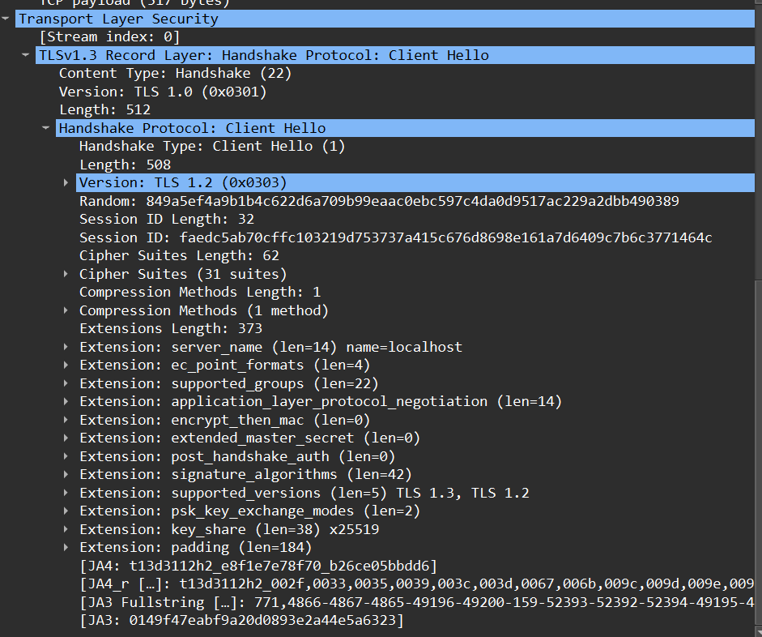
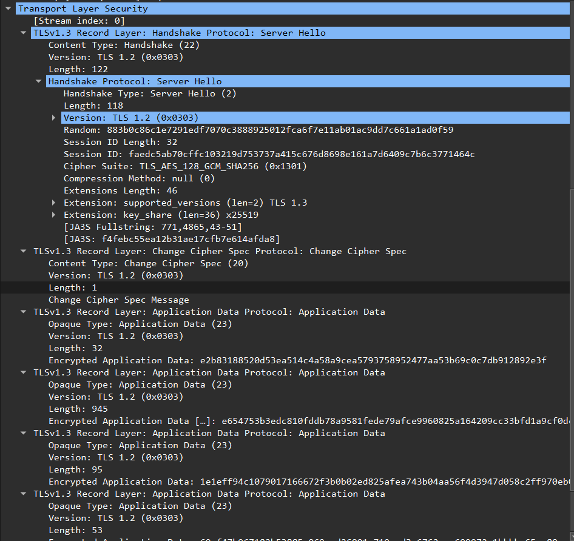
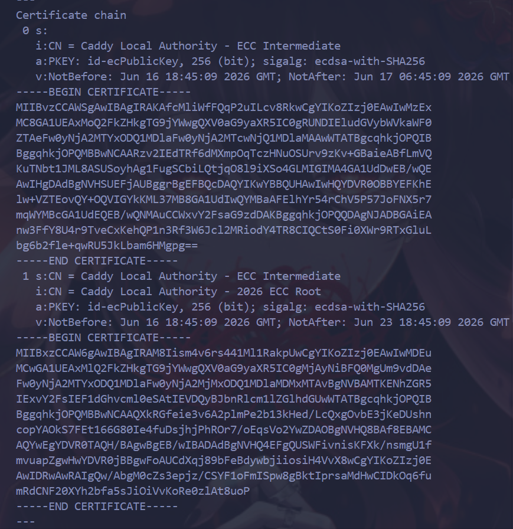

# Task 1 — Trace a request end-to-end

## Packet capture

The decoded packet capture is saved in `lab4-trace.txt`.

## Annotated trace

### TCP three-way handshake

```text
20:14:38.597650 IP 127.0.0.1.51824 > 127.0.0.1.8080: Flags [S], seq 3335370418, length 0
20:14:38.597701 IP 127.0.0.1.8080 > 127.0.0.1.51824: Flags [S.], seq 535201973, ack 3335370419, length 0
20:14:38.597752 IP 127.0.0.1.51824 > 127.0.0.1.8080: Flags [.], ack 1, length 0
```

### HTTP request

```text
20:14:38.597956 IP 127.0.0.1.51824 > 127.0.0.1.8080: Flags [P.], length 174
POST /notes HTTP/1.1
Host: 127.0.0.1:8080
User-Agent: curl/8.5.0
Accept: */*
Content-Type: application/json
Content-Length: 39

{"title":"trace me","body":"in flight"}
```

### HTTP response

```text
20:14:38.61063 IP 127.0.0.1.8080 > 127.0.0.1.51824: Flags [P.], length 206
HTTP/1.1 201 Created
Content-Type: application/json
Date: Tue, 16 Jun 2026 17:14:38 GMT
Content-Length: 93

{"id":7,"title":"trace me","body":"in flight","created_at":"2026-06-16T17:14:38.598761313Z"}
```

### Connection close

```text
20:14:38.616587 IP 127.0.0.1.51824 > 127.0.0.1.8080: Flags [F.], seq 175, ack 207, length 0
20:14:38.616709 IP 127.0.0.1.8080 > 127.0.0.1.51824: Flags [F.], seq 207, ack 176, length 0
20:14:38.61742 IP 127.0.0.1.51824 > 127.0.0.1.8080: Flags [.], ack 208, length 0
```

## Debugging commands

### 1. Listening socket

Command:

```bash
ss -tlnp | grep :8080
```

Output:

```bash
LISTEN 0      4096                *:8080            *:*    users:(("quicknotes",pid=8708,fd=3))
```

### 2. Routes

Command:

```bash
ip route show
```

Output:

```bash
default via 172.20.48.1 dev eth0 proto kernel 
172.20.48.0/20 dev eth0 proto kernel scope link src 172.20.56.44 
```

### 3. Reachability

Command:

```bash
mtr -rwc 5 localhost
```

Output:

```bash
Start: 2026-06-16T20:39:09+0300
HOST: WIN-UTA15SENBQB Loss%   Snt   Last   Avg  Best  Wrst StDev
  1.|-- localhost        0.0%     5    0.1   0.1   0.0   0.4   0.2
```

### 4. DNS

Command:

```bash
dig +short example.com @1.1.1.1
```

Output:

```bash
104.20.23.154
172.66.147.243
```

### 5. Logs

Command:

```bash
journalctl --user -u quicknotes -n 20 || true
```

Output:

```bash
-- No entries --
```

## What would you check first if QuickNotes returned 502?

```text
If QuickNotes returned 502, I would first check whether the gateway or reverse proxy can reach the backend on port 8080. I would verify that the QuickNotes process is running, that ss -tlnp shows a listener on :8080, and that curl http://127.0.0.1:8080/health returns a successful response locally. If the backend is healthy, I would then check proxy logs, firewall rules, DNS, and routing to find where the request fails.
```

# Task 2 — Outside-in debugging on a broken deploy

## Broken deploy reproduction

Command:

```bash
cd app/

ADDR=:8080 go run . &
PID1=$!
sleep 1

ADDR=:8080 go run . 2>&1 | tee /tmp/qn-broken.log &
PID2=$!
sleep 2

ps -ef | grep "go run" | grep -v grep
cat /tmp/qn-broken.log
```

Output:

```text
2026/06/16 21:17:58 quicknotes listening on :8080 (notes loaded: 7)
2026/06/16 21:17:58 listen: listen tcp :8080: bind: address already in use
exit status 1
```

Root cause:

```text
listen tcp :8080: bind: address already in use
```

The second QuickNotes instance failed because port `8080` was already occupied by the first running instance.

## Outside-in chain

### 1. Is the process running?

Command:

```bash
ps -ef | grep quicknotes
```

Output:

```text
nichita 9489 9416 0 21:17 pts/0 00:00:00 /home/nichita/.cache/go-build/.../quicknotes
nichita 9738 5770 0 21:20 pts/0 00:00:00 grep --color=auto quicknotes
```

Decision:

A QuickNotes process is running. This means the service is not completely down; at least one instance is alive.

### 2. Is it listening?

Command:

```bash
ss -tlnp | grep 8080
```

Output:

```text
LISTEN 0 4096 *:8080 *:* users:(("quicknotes",pid=9489,fd=3))
```

Decision:

QuickNotes is listening on port `8080`. The port conflict happened because this existing process already owned the port.

### 3. Is it reachable from the host?

Command:

```bash
curl -s -o /dev/null -w "%{http_code}\n" http://localhost:8080/health
```

Output:

```text
200
```

Decision:

The running QuickNotes instance is reachable from the host and returns a successful HTTP status code.

### 4. Is the firewall blocking it?

Command:

```bash
sudo iptables -L -n -v 2>/dev/null || sudo nft list ruleset 2>/dev/null || true
```

Output:

```text
No blocking rule was reported by the command.
```

Decision:

The failure is not caused by firewall blocking. The service is reachable locally, and the root cause is the port conflict.

### 5. Is DNS working?

Command:

```bash
dig +short localhost
```

Output:

```text
127.0.0.1
```

Decision:

`localhost` resolves correctly to `127.0.0.1`, so DNS is not the cause of the failure.

### Repair and re-verify

Command:

```bash
kill 9489
sleep 1

ADDR=:8080 go run . &
PID3=$!
sleep 1

curl -s http://127.0.0.1:8080/health
```

Output:

```text
{"notes":7,"status":"ok"}
```

Decision:

After killing the old QuickNotes process and starting a new single instance, the `/health` endpoint returned `status: ok`, so the service was repaired.

### Mini-postmortem

The failure was caused by two QuickNotes instances trying to bind to the same port. This is a systemic deployment issue, not an individual mistake: the deploy process allowed a new instance to start without first checking whether the old one was still using `:8080`. Better tooling could prevent this with systemd service management, health checks, pre-deploy port checks, and a restart strategy that safely stops or replaces the old process. A robust deployment should make this class of error visible before users are affected.

## Bonus Task — Decode the TLS handshake

### HTTPS layer

I added a local HTTPS layer using Caddy as a TLS-terminating reverse proxy. Caddy listened on `localhost:8443` and forwarded requests to QuickNotes on `localhost:8080`.

Caddyfile:

```text
localhost:8443 {
  reverse_proxy localhost:8080
}
```

### HTTPS verification

Command:

```bash
curl -vk https://localhost:8443/health
```

Important output:

```text
* TLSv1.3 (OUT), TLS handshake, Client hello (1)
* TLSv1.3 (IN), TLS handshake, Server hello (2)
* TLSv1.3 (IN), TLS handshake, Certificate (11)
* SSL connection using TLSv1.3 / TLS_AES_128_GCM_SHA256 / X25519 / id-ecPublicKey
* ALPN: server accepted h2
> GET /health HTTP/2
< HTTP/2 200
< server: Caddy
```

Decision:

The request reached QuickNotes through the HTTPS reverse proxy. The TLS connection used TLS 1.3 with `TLS_AES_128_GCM_SHA256`, and Caddy returned `HTTP/2 200`.

### TLS packet capture

Command:

```bash
sudo tcpdump -i lo -nn -s 0 -w lab4-tls.pcap 'tcp port 8443' &
TCPDUMP_PID=$!

curl -vk https://localhost:8443/health

sudo kill $TCPDUMP_PID
wait $TCPDUMP_PID 2>/dev/null
```

The TLS capture is saved as `lab4-tls.pcap`.

### ClientHello

Screenshot:



The ClientHello is the first TLS negotiation message sent by the client. In this capture, the client connects to `localhost` and offers modern TLS versions through the `supported_versions` extension: TLS 1.3 and TLS 1.2. It also includes supported cipher suites, ALPN, SNI (`localhost`), and key exchange information such as `x25519`.

### ServerHello

Screenshot:



The ServerHello is the server response that selects the final TLS parameters for the connection. In this capture, the server selected TLS 1.3 through the `supported_versions` extension, chose the cipher suite `TLS_AES_128_GCM_SHA256`, and used `x25519` for key exchange. After this step, the rest of the TLS connection becomes encrypted application data.

### Certificate chain

Command:

```bash
openssl s_client -connect localhost:8443 -servername localhost -showcerts </dev/null
```

Screenshot:



The certificate chain was issued by Caddy's local authority. The chain contains a Caddy local intermediate certificate and a Caddy local root certificate. I used `-servername localhost` so the TLS client sends SNI and Caddy can choose the correct local certificate for `localhost`.

### Which negotiation step kills TLS 1.0 / 1.1?

TLS 1.0 and TLS 1.1 are rejected during the version negotiation between ClientHello and ServerHello. The client offers supported TLS versions and cipher suites, and the server chooses one acceptable version in ServerHello. If the server policy no longer accepts TLS 1.0 or TLS 1.1, it will not select those versions, so the handshake cannot continue with deprecated TLS.
