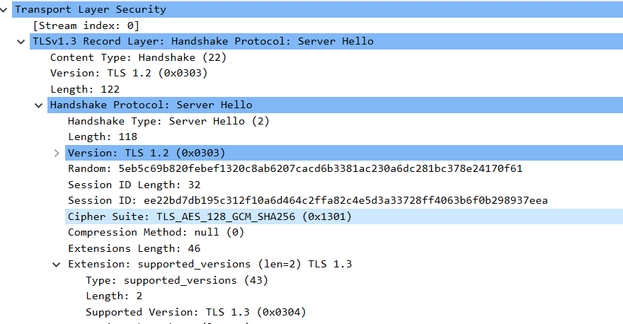

# Lab 4 Submission
## Task 1
### The TCP three-way handshake (SYN → SYN/ACK → ACK)
Here `curl` establishes a connection with the server on port 8080 (flags `[S]` - SYN, `[S.]` - SYN/ACK, `[.]` - ACK).
```Bash
12:42:59.985088 IP6 ::1.42754 > ::1.8080: Flags [S], seq 681494650, win 65476, options [mss 65476,sackOK,TS val 2227965264 ecr 0,nop,wscale 7], length 0
12:42:59.985280 IP6 ::1.8080 > ::1.42754: Flags [S.], seq 2578291022, ack 681494651, win 65464, options [mss 65476,sackOK,TS val 2227965264 ecr 2227965264,nop,wscale 7], length 0
12:42:59.985336 IP6 ::1.42754 > ::1.8080: Flags [.], ack 1, win 512, options [nop,nop,TS val 2227965264 ecr 2227965264], length 0
```
---

### The HTTP request line + the JSON body
```Bash
12:42:59.986359 IP6 ::1.42754 > ::1.8080: Flags [P.], seq 1:176, ack 1, win 512, options [nop,nop,TS val 2227965265 ecr 2227965264], length 175: HTTP: POST /notes HTTP/1.1
`..g...@....................................(..{...O...........
...Q...PPOST /notes HTTP/1.1
Host: localhost:8080
User-Agent: curl/8.18.0
Accept: */*
Content-Type: application/json
Content-Length: 39

{"title":"trace me","body":"in flight"}
```
---

### The HTTP response line + the response JSON
The server processes the request and returns a 201 Created status along with the created note.
```Bash
12:42:59.998187 IP6 ::1.8080 > ::1.42754: Flags [P.], seq 1:207, ack 176, win 512, options [nop,nop,TS val 2227965277 ecr 2227965265], length 206: HTTP: HTTP/1.1 201 Created
`.$....@.......................................O(..*...........
...]...QHTTP/1.1 201 Created
Content-Type: application/json
Date: Sun, 14 Jun 2026 09:42:59 GMT
Content-Length: 93

{"id":6,"title":"trace me","body":"in flight","created_at":"2026-06-14T09:42:59.986971837Z"}
```

### The connection close (FIN or RST)
Connection termination (flags `[F.]` - FIN). First, the client indicates it has finished transmitting, then the server acknowledges and also closes its side of the connection.
```Bash
12:42:59.998518 IP6 ::1.42754 > ::1.8080: Flags [F.], seq 176, ack 207, win 512, options [nop,nop,TS val 2227965277 ecr 2227965277], length 0
12:42:59.998630 IP6 ::1.8080 > ::1.42754: Flags [F.], seq 207, ack 177, win 512, options [nop,nop,TS val 2227965277 ecr 2227965277], length 0
12:42:59.998697 IP6 ::1.42754 > ::1.8080: Flags [.], ack 208, win 512, options [nop,nop,TS val 2227965277 ecr 2227965277], length 0
```
### Debugging Commands Output

**1. What's listening?**
```Bash
$ sudo ss -tlnp | grep :8080
LISTEN 0      4096               *:8080             *:* users:(("quicknotes",pid=3410,fd=3))
```
**2. Routes from your host**

```Bash
$ ip route show
default via 172.26.16.1 dev eth0 proto kernel
172.26.16.0/20 dev eth0 proto kernel scope link src 172.26.21.157
```
**3. Reachability (loop on lo)**

```Bash
$ mtr -rwc 5 localhost
Start: 2026-06-14T12:52:18+0300
HOST: Alina-Note Loss%   Snt   Last   Avg  Best  Wrst StDev
  1.|-- localhost   0.0%     5    0.1   0.1   0.0   0.4   0.2
```
**4. DNS works**

```Bash
$ dig +short example.com @1.1.1.1
8.6.112.0
8.47.69.0
```

**5. Logs (if installed as service)**
```Bash
$ journalctl --user -u quicknotes -n 20 || true
-- No entries --
```
### What would you check first if QuickNotes returned 502?

A 502 Bad Gateway error indicates that a reverse proxy or load balancer received an invalid response or could not connect to the upstream backend service. Using an outside-in approach, the first thing I would check is whether the QuickNotes application is actually running and listening on the expected port by executing sudo ss -tlnp | grep 8080 and checking its process status. If the process is running, the next step would be to verify local reachability using curl -I http://localhost:8080/health to see if the application itself is responsive or if a local firewall is blocking the connection.

## Task 2

### The Full Outside-In Chain
**Systemctl-style: is it running?**

```Bash
$ ps -ef | grep quicknotes
alina       4622    4576  0 13:16 pts/0    00:00:00 /home/alina/.cache/go-build/e0/e05dc24227b6b244f2cc3cfa5e951cb0f12dc650300be5f0cbd900209f0e98fe-d/quicknotes
alina       4712     416  0 13:18 pts/0    00:00:00 grep --color=auto quicknotes
Decision: Yes, the old QuickNotes process (PID 4622) is actively running in the background.
```
**Is it listening?**

```Bash
$ sudo ss -tlnp | grep 8080
LISTEN 0      4096               *:8080             *:* users:(("quicknotes",pid=4622,fd=3))
Decision: Yes, process 4622 is successfully bound to port 8080. It is why the new process was rejected by the OS.
````

**Reachable from host?**

```Bash
$ curl -s -o /dev/null -w "%{http_code}\n" http://localhost:8080/health
200
Decision: The existing old instance is fully healthy and responding with a 200 OK status.
```

**Firewall blocking?**

```Bash
$ sudo iptables -L -n -v 2>/dev/null || sudo nft list ruleset 2>/dev/null || true
Decision: Command returned empty. No firewall rules are currently blocking local traffic.
```

**DNS?**

```Bash
$ dig +short localhost
127.0.0.1
Decision: Localhost resolves correctly to the standard loopback address.
```

### The Root Cause Error
```Bash
2026/06/14 13:16:24 quicknotes listening on :8080 (notes loaded: 6)
2026/06/14 13:16:24 listen: listen tcp :8080: bind: address already in use
exit status 1
Root Cause: The new application instance failed to start because the previous instance of QuickNotes was still running and occupying TCP port 8080.
```
### Mini-Postmortem
```Text
A new deployment of QuickNotes failed to initialize, resulting in a bind: address already in use error.
The deployment strategy currently relies on manually executing binaries in the background (go run . &). Because the previous application process was not explicitly terminated before the new one was launched, it continued holding port 8080. The operating system correctly prevented the new instance from binding to the same network interface.
This class of error is highly preventable. We should adopt a proper process supervisor, such as systemd, or containerize the application using Docker. These tools ensure proper lifecycle management by automatically sending a SIGTERM signal to gracefully drain and shut down the old process before the new one is initialized.
```

## Bonus Task

### Wireshark Screenshots
**ClientHello packet showing TLS version, cipher suites offered, and SNI:**

**ServerHello packet showing chosen cipher and TLS version:**


### Which negotiation step kills TLS 1.0 / 1.1 in 2026?
```
The deprecation of TLS 1.0/1.1 is enforced immediately during the ClientHello / ServerHello negotiation step.
When a modern client sends a ClientHello, it uses the Supported Versions extension to list only secure protocols (TLS 1.2, TLS 1.3) and offers only modern Cipher Suites. If an outdated client attempts to connect offering only TLS 1.0/1.1, the modern server evaluates the ClientHello, finds no mutually acceptable secure protocols or ciphers, and instantly replies with a Handshake Failure alert instead of returning a ServerHello. This protocol mismatch completely kills the connection before any application data is ever exchanged.
```
### Certificate Chain
openssl s_client -connect localhost:8443 -servername localhost -showcerts </dev/null`:
```text
Connecting to 127.0.0.1
CONNECTED(00000003)
depth=1 CN=Caddy Local Authority - ECC Intermediate
verify error:num=20:unable to get local issuer certificate
verify return:1
depth=0
verify return:1
---
Certificate chain
 0 s:
   i:CN=Caddy Local Authority - ECC Intermediate
   a:PKEY: EC, (prime256v1); sigalg: ecdsa-with-SHA256
   v:NotBefore: Jun 14 15:25:00 2026 GMT; NotAfter: Jun 15 03:25:00 2026 GMT
-----BEGIN CERTIFICATE-----
MIIBvDCCAWOgAwIBAgIQUrUZaD7UgDmLAlrXhtl38zAKBggqhkjOPQQDAjAzMTEw
LwYDVQQDEyhDYWRkeSBMb2NhbCBBdXRob3JpdHkgLSBFQ0MgSW50ZXJtZWRpYXRl
MB4XDTI2MDYxNDE1MjUwMFoXDTI2MDYxNTAzMjUwMFowADBZMBMGByqGSM49AgEG
CCqGSM49AwEHA0IABFOKZ+zpcSAeZ1OtgKMJg/MuHILoKdRye1lBZoirt6h9MyYr
ebwdSW9fdWx4rJ/3S5jThBoBNJSRZ9VWfsgmr6KjgYswgYgwDgYDVR0PAQH/BAQD
AgeAMB0GA1UdJQQWMBQGCCsGAQUFBwMBBggrBgEFBQcDAjAdBgNVHQ4EFgQUAigx
Fq7Aj9fVV8TFbYOaM+h997AwHwYDVR0jBBgwFoAUeVpl1wgZ6KKxkQZWFpa4Ymfw
lYEwFwYDVR0RAQH/BA0wC4IJbG9jYWxob3N0MAoGCCqGSM49BAMCA0cAMEQCIGna
Yj5lfQZiRwBrchtQ7WjCAOPRnPtwxJuYWERuYslGAiA8SlPsGf4uu/4ky3zadVax
hyRBW4BlM1CUMp1ZC+yrhg==
-----END CERTIFICATE-----
 1 s:CN=Caddy Local Authority - ECC Intermediate
   i:CN=Caddy Local Authority - 2026 ECC Root
   a:PKEY: EC, (prime256v1); sigalg: ecdsa-with-SHA256
   v:NotBefore: Jun 14 15:25:00 2026 GMT; NotAfter: Jun 21 15:25:00 2026 GMT
-----BEGIN CERTIFICATE-----
MIIBxzCCAW6gAwIBAgIRALQu8Ci0w3Bysy/32hU9QIEwCgYIKoZIzj0EAwIwMDEu
MCwGA1UEAxMlQ2FkZHkgTG9jYWwgQXV0aG9yaXR5IC0gMjAyNiBFQ0MgUm9vdDAe
Fw0yNjA2MTQxNTI1MDBaFw0yNjA2MjExNTI1MDBaMDMxMTAvBgNVBAMTKENhZGR5
IExvY2FsIEF1dGhvcml0eSAtIEVDQyBJbnRlcm1lZGlhdGUwWTATBgcqhkjOPQIB
BggqhkjOPQMBBwNCAASxh2Jkl0Hc24GVkNlhw4p3He7z0t6U/r7DkKIt6+faxifS
qBFkgdIGvqyisDcBP+1/bCkrHT8pjUY2279tM9AKo2YwZDAOBgNVHQ8BAf8EBAMC
AQYwEgYDVR0TAQH/BAgwBgEB/wIBADAdBgNVHQ4EFgQUeVpl1wgZ6KKxkQZWFpa4
YmfwlYEwHwYDVR0jBBgwFoAUkp5HlVYhcn2GCJdxIOIk+a1MhCAwCgYIKoZIzj0E
AwIDRwAwRAIgTL3xajm9gvC9G7Oa0JfeNXDwigcKhZeEnAd9RBDind0CIF6zvx/M
cN9m4cJ0q74WaS1U3GZvCJX5JWbjzMhg8bDq
-----END CERTIFICATE-----
---
Server certificate
subject=
issuer=CN=Caddy Local Authority - ECC Intermediate
---
No client certificate CA names sent
Peer signing digest: SHA256
Peer signature type: ecdsa_secp256r1_sha256
Peer Temp Key: X25519, 253 bits
---
SSL handshake has read 1272 bytes and written 1615 bytes
Verification error: unable to get local issuer certificate
---
New, TLSv1.3, Cipher is TLS_AES_128_GCM_SHA256
Protocol: TLSv1.3
Server public key is 256 bit
This TLS version forbids renegotiation.
Compression: NONE
Expansion: NONE
No ALPN negotiated
Early data was not sent
Verify return code: 20 (unable to get local issuer certificate)
```