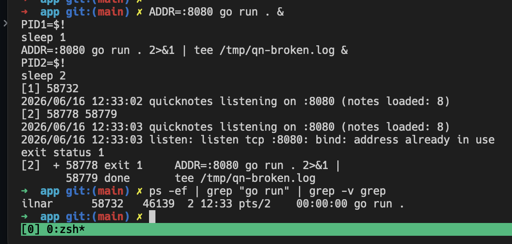
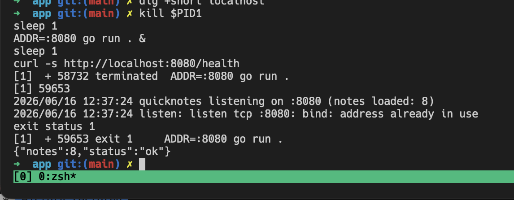

# Lab 4

## Task 1

### 1.2 Annotated Packet Capture (lab4-trace.txt)

The capture contains two complete TCP flows to `:8080` over IPv6 loopback (`::1`).
Annotated below is the **11:15:56 flow** (note id=8); the 11:09:49 flow is structurally identical.

```
━━━━━━━━━━━━━━━━━━━━━━━━━━━━━━━━━━━━━━━━━━━
 TCP THREE-WAY HANDSHAKE
━━━━━━━━━━━━━━━━━━━━━━━━━━━━━━━━━━━━━━━━━━━

# 1/3 — SYN: client initiates connection (seq=1048633962, no ack yet)
11:15:56.597329 IP6 ::1.55280 > ::1.8080: Flags [S],  seq 1048633962, win 65476, length 0

# 2/3 — SYN-ACK: server accepts, picks its own ISN, acks client ISN+1
11:15:56.597409 IP6 ::1.8080  > ::1.55280: Flags [S.], seq 67846154, ack 1048633963, win 65464, length 0

# 3/3 — ACK: client acks server ISN+1; connection is ESTABLISHED
11:15:56.597435 IP6 ::1.55280 > ::1.8080: Flags [.],  ack 1, win 512, length 0

━━━━━━━━━━━━━━━━━━━━━━━━━━━━━━━━━━━━━━━━━━━
 HTTP REQUEST (L7 payload inside TCP segment)
━━━━━━━━━━━━━━━━━━━━━━━━━━━━━━━━━━━━━━━━━━━

# PSH+ACK: client sends 175 bytes — the full HTTP request in one segment
11:15:56.597942 IP6 ::1.55280 > ::1.8080: Flags [P.], seq 1:176, length 175

POST /notes HTTP/1.1
Host: localhost:8080
User-Agent: curl/8.14.1
Accept: */*
Content-Type: application/json
Content-Length: 39

{"title":"trace me","body":"in flight"}

# ACK: server acknowledges receipt (ack 176 = byte after last received)
11:15:56.597956 IP6 ::1.8080  > ::1.55280: Flags [.], ack 176, win 511, length 0

━━━━━━━━━━━━━━━━━━━━━━━━━━━━━━━━━━━━━━━━━━━
 HTTP RESPONSE
━━━━━━━━━━━━━━━━━━━━━━━━━━━━━━━━━━━━━━━━━━━

# PSH+ACK: server sends 206 bytes — 201 Created + JSON body
# ~6 ms after request arrived: QuickNotes wrote to storage and replied
11:15:56.603599 IP6 ::1.8080  > ::1.55280: Flags [P.], seq 1:207, length 206

HTTP/1.1 201 Created
Content-Type: application/json
Date: Tue, 16 Jun 2026 15:15:56 GMT
Content-Length: 93

{"id":8,"title":"trace me","body":"in flight","created_at":"2026-06-16T15:15:56.602023034Z"}

# ACK: client acknowledges the 206-byte response
11:15:56.603626 IP6 ::1.55280 > ::1.8080: Flags [.], ack 207, win 511, length 0

━━━━━━━━━━━━━━━━━━━━━━━━━━━━━━━━━━━━━━━━━━━
 CONNECTION TEARDOWN (graceful FIN exchange)
━━━━━━━━━━━━━━━━━━━━━━━━━━━━━━━━━━━━━━━━━━━

# FIN from client: curl is done; half-closes its write side
11:15:56.603984 IP6 ::1.55280 > ::1.8080: Flags [F.], seq 176, ack 207, length 0

# FIN+ACK from server: QuickNotes closes its write side
11:15:56.604098 IP6 ::1.8080  > ::1.55280: Flags [F.], seq 207, ack 177, length 0

# Final ACK: client confirms server FIN; both sides fully closed
11:15:56.604129 IP6 ::1.55280 > ::1.8080: Flags [.], ack 208, win 512, length 0
```

**Key observations:**
- Traffic flows over **IPv6 loopback** (`::1`), not IPv4 — `curl localhost` resolved to `::1` on this host.
- Total round-trip for request + response: **~6 ms** (`.597` → `.603`), all within loopback.
- Teardown is a clean **FIN / FIN+ACK / ACK** — no RST, meaning both sides closed gracefully.
- The JSON body is **visible in plaintext** — no TLS on this path.

### 1.3 Five Debugging Commands

Input: `ss -tlnp   | grep :8080`

Output:
```
LISTEN 0      4096               *:8080             *:*    users:(("quicknotes",pid=46276,fd=3))
```

Input: `ip route show`

Output:
```
default via 192.168.64.1 dev enp0s1 proto dhcp src 192.168.64.7 metric 1002
192.168.64.0/24 dev enp0s1 proto dhcp scope link src 192.168.64.7 metric 1002
```

Input: `mtr -rwc 5 localhost`

Output:
```
Start: 2026-06-16T11:31:11-0400
HOST: debian    Loss%   Snt   Last   Avg  Best  Wrst StDev
  1.|-- localhost  0.0%     5    0.1   0.1   0.1   0.2   0.0
```

Input: `dig +short example.com @1.1.1.1`

Output:

```
8.47.69.0
8.6.112.0
```

Input: `journalctl --user -u quicknotes -n 20 || true`

Output:

```
-- No entries --
```

Note: `-- No entries --` means QuickNotes was not started as a systemd user service — it is running as a raw process. Journald has no visibility into it; logs go only to the terminal that launched it.

### 1.4 What would you check first if QuickNotes returned 502?

A 502 Bad Gateway means the reverse proxy is up but cannot reach its upstream. The first thing to check is whether the proxy config actually points at the right address and port — `grep -r "proxy_pass" /etc/nginx/` or equivalent for Caddy. If the config is correct, the next question is whether QuickNotes is still running: `ss -tlnp | grep :8080` shows whether the port is bound, and `ps aux | grep quicknotes` shows whether the process exists at all. If the process is gone, check its logs — but as this lab showed, if it was started outside of systemd, those logs may only exist on a terminal that has since closed. The three most common causes in order are: the proxy targeting the wrong port, QuickNotes having crashed with no automatic restart, and a port mismatch caused by the service restarting on a different address than the proxy expects.

## Task 2

### Task 2.1

Error capture:


### Task 2.2

Input: `ps -ef | grep quicknotes`

Output:

```
ilnar      58764   58732  0 12:33 pts/2    00:00:00 /home/ilnar/.cache/go-build/57/578e3d38afc7c0a37f14906359352cda84f36d7c11dbc7cc731191f28afbea41-d/quicknotes
ilnar      58986   46139  0 12:34 pts/2    00:00:00 grep --color=auto --exclude-dir=.bzr --exclude-dir=CVS --exclude-dir=.git --exclude-dir=.hg --exclude-dir=.svn --exclude-dir=.idea --exclude-dir=.tox --exclude-dir=.venv --exclude-dir=venv quicknotes
```

Decision: process is running, so it didn't crash — move to checking the port

Input: `ss -tlnp | grep 8080`

Output:

```
LISTEN 0      4096               *:8080             *:*    users:(("quicknotes",pid=58764,fd=3))
```

Decision: port 8080 is bound, so the listener is up — move to checking reachability

Input: `curl -s -o /dev/null -w "%{http_code}\n" http://localhost:8080/health`

Output:

```
200
```

Decision: service is healthy from localhost — no firewall or app issue

Input: `sudo iptables -L -n -v 2>/dev/null || sudo nft list ruleset 2>/dev/null || true`

Output: nothing

Decision: no firewall rules blocking traffic

Input: `dig +short localhost`

Output: nothing

Decision: expected — localhost is resolved via /etc/hosts, not DNS; no issue here

### Task 2.3



### 2.4 Root Cause and Blameless Postmortem

**Root cause:** `listen tcp :8080: bind: address already in use` — a second QuickNotes process attempted to bind port 8080 while the first was still holding it. The OS rejected the bind; the second instance exited immediately and silently from the perspective of any proxy in front of it.

**Blameless postmortem (≤ 200 words)**

The immediate trigger was a manual re-deploy without first stopping the running instance. But blaming the operator misses the real problem: the system offered no resistance to this mistake. There was no process supervisor enforcing a single-instance invariant. A systemd unit with `Restart=on-failure` would have refused to start a second copy and surfaced the conflict in `journalctl` immediately. Instead, the process ran outside of any supervision, so its stderr went to a terminal that may not have been watched, and the failure was only discoverable after the fact via `ss` or `ps`. The port conflict itself is detectable before it becomes an outage. A pre-start health check — or even a simple `ss -tlnp | grep :8080` in a deploy script — would abort the deploy and alert the operator rather than silently leaving the new instance dead. The systemic fix is to make the process lifecycle a first-class concern: a systemd unit file that owns the port, logs to journald, and enforces one running instance. That turns this class of failure from a silent production incident into a loud, local deploy error.
