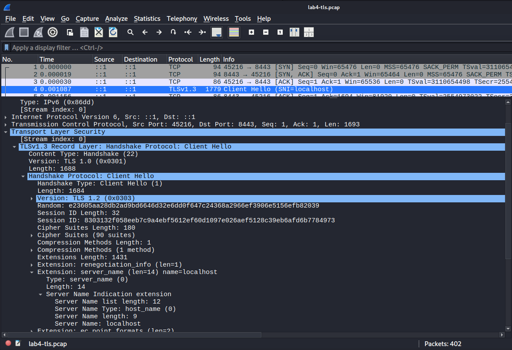
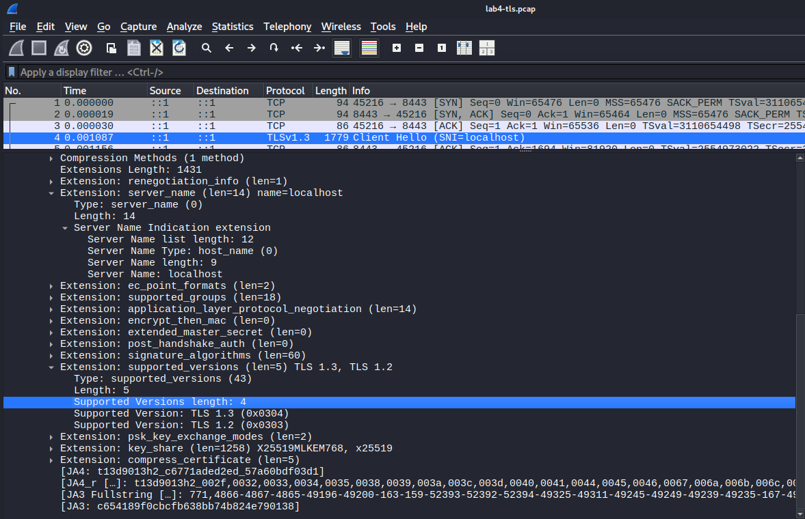
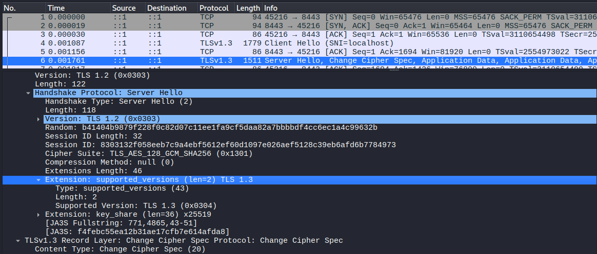

# Lab 4 submission
 
# Lab 4

## Task 1 — Trace a Request End-to-End

### 1.1 Start QuickNotes and capture network traffic

I launched QuickNotes locally and verified that the application was healthy.

```bash
┌──(p4in㉿kali)-[~/Desktop/DevOps-Intro]
└─$ curl http://localhost:8080/health
{"notes":5,"status":"ok"}
```

I then started a packet capture on the loopback interface and generated a single HTTP request.

Packet capture:

```bash
┌──(p4in㉿kali)-[~/Desktop/DevOps-Intro]
└─$ sudo tcpdump -i lo -nn -s 0 -A 'tcp port 8080' -w lab4-trace.pcap
[sudo] password for p4in: 
tcpdump: listening on lo, link-type EN10MB (Ethernet), snapshot length 262144 bytes
^C10 packets captured
20 packets received by filter
0 packets dropped by kernel
```

Request:

```bash
┌──(p4in㉿kali)-[~/Desktop/DevOps-Intro]
└─$ curl -v -X POST http://localhost:8080/notes \
-H 'Content-Type: application/json' \
-d '{"title":"trace me","body":"in flight"}'
```

Response:
```text
* Host localhost:8080 was resolved.
* IPv6: ::1
* IPv4: 127.0.0.1
*   Trying [::1]:8080...
* Established connection to localhost (::1 port 8080) from ::1 port 49206 
* using HTTP/1.x
> POST /notes HTTP/1.1
> Host: localhost:8080
> User-Agent: curl/8.19.0
> Accept: */*
> Content-Type: application/json
> Content-Length: 39
* upload completely sent off: 39 bytes
< HTTP/1.1 201 Created
< Content-Type: application/json
< Date: Wed, 17 Jun 2026 05:15:24 GMT
< Content-Length: 93
{"id":6,"title":"trace me","body":"in flight","created_at":"2026-06-17T05:15:24.332417621Z"}
* Connection #0 to host localhost:8080 left intact

```

The request successfully created a new note.
The packet capture was stopped manually and saved for further analysis.

---

## 1.2 Decode the capture

I decoded the capture using:

```bash
┌──(p4in㉿kali)-[~/Desktop/DevOps-Intro]
└─$ sudo tcpdump -r lab4-trace.pcap -nn -A | tee lab4-trace.txt
```

### TCP three-way handshake

The connection was established using the standard TCP handshake.
```text
reading from file lab4-trace.pcap, link-type EN10MB (Ethernet), snapshot length 262144
01:15:24.331603 IP6 ::1.49206 > ::1.8080: Flags [S], seq 3223026168, win 65476, options [mss 65476,sackOK,TS val 2925136795 ecr 0,nop,wscale 10], length 0

01:15:24.331627 IP6 ::1.8080 > ::1.49206: Flags [S.], seq 2434689196, ack 3223026169, win 65464, options [mss 65476,sackOK,TS val 1962955010 ecr 2925136795,nop,wscale 10], length 0

01:15:24.331637 IP6 ::1.49206 > ::1.8080: Flags [.], ack 1, win 64, options [nop,nop,TS val 2925136795 ecr 1962955010], length 0
```

Corresponding sequence:
```text
SYN
SYN/ACK
ACK
```

### HTTP request

The capture contains the HTTP request line:
```text
POST /notes HTTP/1.1
```

Request body:
```json
{"title":"trace me","body":"in flight"}
```

### HTTP response

The application returned:
```text
HTTP/1.1 201 Created
```

Response body:
```json
{"id":6,"title":"trace me","body":"in flight",...}
```

### Connection close

The TCP connection was gracefully closed by both sides.
```text
01:15:24.338533 IP6 ::1.49206 > ::1.8080: Flags [F.], seq 176, ack 207, win 64, options [nop,nop,TS val 2925136802 ecr 1962955011], length 0

01:15:24.338969 IP6 ::1.8080 > ::1.49206: Flags [F.], seq 207, ack 177, win 64, options [nop,nop,TS val 1962955018 ecr 2925136802], length 0

01:15:24.338996 IP6 ::1.49206 > ::1.8080: Flags [.], ack 208, win 64, options [nop,nop,TS val 2925136803 ecr 1962955018], length 0
```
An interesting observation is that localhost resolved to the IPv6 loopback address `::1` instead of `127.0.0.1`.
---

## 1.3 Debugging commands

### 1.3.1 What is listening?

```bash
┌──(p4in㉿kali)-[~/Desktop/DevOps-Intro]
└─$ ss -tlnp | grep :8080
LISTEN 0      4096               *:8080             *:*    users:(("quicknotes",pid=6124,fd=3))
```
This confirms that the QuickNotes process is listening on port 8080.

### 1.3.2 Routes from the host

```bash
┌──(p4in㉿kali)-[~/Desktop/DevOps-Intro]
└─$ ip route show
default via 192.168.50.1 dev eth1 proto dhcp src 192.168.50.167 metric 100 
172.17.0.0/16 dev docker0 proto kernel scope link src 172.17.0.1 linkdown 
192.168.50.0/24 dev eth1 proto kernel scope link src 192.168.50.167 metric 100 
```
This shows the default gateway and local network routes configured on the host.

### 1.3.3 Reachability

```bash
┌──(p4in㉿kali)-[~/Desktop/DevOps-Intro]
└─$ mtr -rwc 5 localhost
Start: 2026-06-17T01:24:27-0400
HOST: kali      Loss%   Snt   Last   Avg  Best  Wrst StDev
  1.|-- localhost  0.0%     5    0.0   0.0   0.0   0.1   0.0
```
The localhost endpoint is reachable without any packet loss.

### 1.3.4 DNS

```bash
┌──(p4in㉿kali)-[~/Desktop/DevOps-Intro]
└─$ dig +short example.com @1.1.1.1
8.6.112.0
8.47.69.0
```
This confirms that DNS resolution works correctly.

### 1.3.5 Logs

```bash
┌──(p4in㉿kali)-[~/Desktop/DevOps-Intro]
└─$ journalctl --user -u quicknotes -n 20 || true
-- No entries --
```
QuickNotes was started manually rather than as a systemd service, therefore no journal entries were available.
---

## 1.4 Reflection — What would I check first if QuickNotes returned 502?

If QuickNotes returned a 502 error, I would follow an outside-in debugging approach.
First, I would verify whether the application process is running. 
Then I would check whether port 8080 is listening and whether the `/health` endpoint is reachable locally. 
After that, I would inspect firewall rules and finally verify DNS resolution. 
This approach starts from the visible symptom and gradually moves deeper into the networking stack until the root cause is identified.

## Task 2 — Outside-In Debugging on a Broken Deploy

### 2.1 Run a broken instance

I intentionally reproduced a deployment issue by attempting to start two QuickNotes instances on the same port.

Commands & output:

```bash
┌──(p4in㉿kali)-[~/Desktop/DevOps-Intro/app]
└─$ ADDR=:8080 go run . &
PID1=$!
sleep 1
ADDR=:8080 go run . 2>&1 | tee /tmp/qn-broken.log &
PID2=$!
sleep 2

[1] 18945
2026/06/17 03:44:46 quicknotes listening on :8080 (notes loaded: 6)
[2] 18987 18988
2026/06/17 03:44:47 quicknotes listening on :8080 (notes loaded: 6)
2026/06/17 03:44:47 listen: listen tcp :8080: bind: address already in use
exit status 1
[2]  + exit 1     ADDR=:8080 go run . 2>&1 | 
       done       tee /tmp/qn-broken.log
```
The second instance failed because port 8080 was already occupied.

---

### 2.2 Walk the outside-in chain

#### 2.2.1 Is it running?

```bash
┌──(p4in㉿kali)-[~/Desktop/DevOps-Intro/app]
└─$ ps -ef | grep quicknotes
p4in       18981   18945  0 03:44 pts/1    00:00:00 /home/p4in/.cache/go-build/48/489573023c1b5e6ea74459040e9c79402473017848c70526b5c8a2f33f07dec5-d/quicknotes
p4in       19056    5430  0 03:45 pts/1    00:00:00 grep --color=auto quicknotes
```
QuickNotes is already running.

#### 2.2.2 Is it listening?

```bash
┌──(p4in㉿kali)-[~/Desktop/DevOps-Intro/app]
└─$ ss -tlnp | grep 8080
LISTEN 0      4096               *:8080             *:*    users:(("quicknotes",pid=18981,fd=3))
```
Port 8080 is already occupied.

#### 2.2.3 Reachable from host?

```bash
┌──(p4in㉿kali)-[~/Desktop/DevOps-Intro/app]
└─$ curl -s -o /dev/null -w "%{http_code}\n" http://localhost:8080/health
200
```
The application is healthy and reachable.

#### 2.2.4 Firewall blocking?

No, the firewall has docker rules applied after installation, there is nothing related to the task here.
```bash
┌──(p4in㉿kali)-[~/Desktop/DevOps-Intro/app]
└─$ sudo iptables -L -n -v 2>/dev/null || sudo nft list ruleset 2>/dev/null || true
[sudo] password for p4in: 
Chain INPUT (policy ACCEPT 0 packets, 0 bytes)
 pkts bytes target     prot opt in     out     source               destination         

Chain FORWARD (policy DROP 0 packets, 0 bytes)
 pkts bytes target     prot opt in     out     source               destination         
    0     0 DOCKER-USER  all  --  *      *       0.0.0.0/0            0.0.0.0/0           
    0     0 DOCKER-FORWARD  all  --  *      *       0.0.0.0/0            0.0.0.0/0           

Chain OUTPUT (policy ACCEPT 0 packets, 0 bytes)
 pkts bytes target     prot opt in     out     source               destination         

Chain DOCKER (1 references)
 pkts bytes target     prot opt in     out     source               destination         
    0     0 DROP       all  --  !docker0 docker0  0.0.0.0/0            0.0.0.0/0           

Chain DOCKER-BRIDGE (1 references)
 pkts bytes target     prot opt in     out     source               destination         
    0     0 DOCKER     all  --  *      docker0  0.0.0.0/0            0.0.0.0/0           

Chain DOCKER-CT (1 references)
 pkts bytes target     prot opt in     out     source               destination         
    0     0 ACCEPT     all  --  *      docker0  0.0.0.0/0            0.0.0.0/0            ctstate RELATED,ESTABLISHED

Chain DOCKER-FORWARD (1 references)
 pkts bytes target     prot opt in     out     source               destination         
    0     0 DOCKER-CT  all  --  *      *       0.0.0.0/0            0.0.0.0/0           
    0     0 DOCKER-ISOLATION-STAGE-1  all  --  *      *       0.0.0.0/0            0.0.0.0/0           
    0     0 DOCKER-BRIDGE  all  --  *      *       0.0.0.0/0            0.0.0.0/0           
    0     0 ACCEPT     all  --  docker0 *       0.0.0.0/0            0.0.0.0/0           

Chain DOCKER-ISOLATION-STAGE-1 (1 references)
 pkts bytes target     prot opt in     out     source               destination         
    0     0 DOCKER-ISOLATION-STAGE-2  all  --  docker0 !docker0  0.0.0.0/0            0.0.0.0/0           

Chain DOCKER-ISOLATION-STAGE-2 (1 references)
 pkts bytes target     prot opt in     out     source               destination         
    0     0 DROP       all  --  *      docker0  0.0.0.0/0            0.0.0.0/0           

Chain DOCKER-USER (1 references)
 pkts bytes target     prot opt in     out     source               destination 
```
Firewall rules do not block access to the application.

#### 2.2.5 DNS?

```bash
┌──(p4in㉿kali)-[~/Desktop/DevOps-Intro/app]
└─$ dig +short localhost
127.0.0.1
```
DNS resolution works correctly.
---

### 2.3 Repair + re-verify

I initially followed the lab instructions and executed:

```bash
┌──(p4in㉿kali)-[~/Desktop/DevOps-Intro/app]
└─$ kill $PID1
sleep 1
ADDR=:8080 go run . &
sleep 1
curl -s http://localhost:8080/health

[1]  + terminated  ADDR=:8080 go run .
[1] 19125
2026/06/17 03:48:17 quicknotes listening on :8080 (notes loaded: 6)
2026/06/17 03:48:17 listen: listen tcp :8080: bind: address already in use
exit status 1
[1]  + exit 1     ADDR=:8080 go run .
{"notes":6,"status":"ok"}
```

However, this only terminated the `go run` wrapper process.
The spawned `quicknotes` binary remained active and continued listening on port 8080.
I then identified the actual process and terminated it.
```bash
┌──(p4in㉿kali)-[~/Desktop/DevOps-Intro/app]
└─$ ss -tlnp | grep 8080
LISTEN 0      4096               *:8080             *:*    users:(("quicknotes",pid=18981,fd=3))
                                                                                                                 
┌──(p4in㉿kali)-[~/Desktop/DevOps-Intro/app]
└─$ ps -ef | grep quicknotes | grep -v grep
p4in       18981       1  0 03:44 pts/1    00:00:00 /home/p4in/.cache/go-build/48/489573023c1b5e6ea74459040e9c79402473017848c70526b5c8a2f33f07dec5-d/quicknotes
                                                                                                                  
┌──(p4in㉿kali)-[~/Desktop/DevOps-Intro/app]
└─$ kill 18981                                                       
2026/06/17 03:55:14 shutting down
┌──(p4in㉿kali)-[~/Desktop/DevOps-Intro/app]
└─$ ss -tlnp | grep 8080 
                                                                                                                  
┌──(p4in㉿kali)-[~/Desktop/DevOps-Intro/app]
└─$ ADDR=:8080 go run . &
sleep 1
curl -s http://localhost:8080/health

[1] 19260
2026/06/17 03:55:27 quicknotes listening on :8080 (notes loaded: 6)
{"notes":6,"status":"ok"}
```
---

### 2.4 Postmortem

Root cause: a second QuickNotes instance attempted to bind to a TCP port that was already occupied.
This is a systemic issue rather than an individual mistake because duplicate application instances can occur during deployments, restarts, or automation workflows.
This type of failure can be prevented by using process supervisors such as systemd, health checks, deployment automation, and orchestration tools that verify port availability before launching new application instances.

## Bonus Task — Decode the TLS Handshake

### B.1 Add an HTTPS layer

I installed Caddy and configured it as a TLS-terminating reverse proxy in front of QuickNotes.

```bash
┌──(p4in㉿kali)-[~/Desktop/DevOps-Intro]
└─$ echo 'localhost:8443 {
  reverse_proxy localhost:8080
}' | sudo tee /etc/caddy/Caddyfile
[sudo] password for p4in: 
localhost:8443 {
  reverse_proxy localhost:8080
}
```
The Caddy service was restarted successfully and began serving HTTPS traffic.
---

### B.2 Capture the TLS handshake

I captured TLS traffic on the loopback interface.

```bash
┌──(p4in㉿kali)-[~/Desktop/DevOps-Intro]
└─$ sudo tcpdump -i lo -nn -s 0 -w lab4-tls.pcap 'tcp port 8443' &
TCPDUMP_PID=$!
[1] 22588
tcpdump: listening on lo, link-type EN10MB (Ethernet), snapshot length 262144 bytes
```

I then generated HTTPS traffic through Caddy.

Command:

```bash
┌──(p4in㉿kali)-[~/Desktop/DevOps-Intro]
└─$ curl -vk https://localhost:8443/health
```
Response (cropped):

```text
* [HTTP/2] [1] [user-agent: curl/8.19.0]
* [HTTP/2] [1] [accept: */*]
> GET /health HTTP/2
> Host: localhost:8443
> User-Agent: curl/8.19.0
> Accept: */*
> 
* Request completely sent off
* TLSv1.3 (IN), TLS handshake, Newsession Ticket (4):
< HTTP/2 200 
< alt-svc: h3=":8443"; ma=2592000
< content-type: application/json
< date: Wed, 17 Jun 2026 11:17:26 GMT
< via: 1.1 Caddy
< content-length: 26
< 
{"notes":6,"status":"ok"}
* Connection #0 to host localhost:8443 left intact
```
This confirmed that the request path was:

```text
curl->https://localhost:8443->Caddy reverse proxy->http://localhost:8080->QuickNotes
```
---
### B.3 Decode with Wireshark

#### ClientHello

The ClientHello packet was inspected in Wireshark.

Observed values:

* Server Name Indication (SNI): `localhost`
* Multiple cipher suites were offered
* Supported TLS versions: `TLS 1.3`, `TLS 1.2`



#### Supported Versions

The `supported_versions` extension was inspected separately.

Observed values:

* `TLS 1.3`
* `TLS 1.2`




#### ServerHello

The ServerHello packet selected:

* TLS version: `TLS 1.3`
* Cipher suite: `TLS_AES_128_GCM_SHA256`


---

### Certificate chain

Certificate information was obtained using command:

```bash
┌──(p4in㉿kali)-[~/Desktop/DevOps-Intro]
└─$ openssl s_client -connect localhost:8443 -showcerts -servername localhost </dev/null
```
The certificate chain consisted of:

1. A leaf certificate issued by `Caddy Local Authority - ECC Intermediate`
2. An intermediate certificate issued by `Caddy Local Authority - 2026 ECC Root`

full output:
```text
Connecting to ::1
CONNECTED(00000003)
depth=1 CN=Caddy Local Authority - ECC Intermediate
verify error:num=20:unable to get local issuer certificate
verify return:1
depth=0 
verify return:1
---
Certificate chain
 0 s:
   i:CN=Caddy Local Authority - ECC Intermediate
   a:PKEY: EC, (prime256v1); sigalg: ecdsa-with-SHA256
   v:NotBefore: Jun 17 10:20:15 2026 GMT; NotAfter: Jun 17 22:20:15 2026 GMT
-----BEGIN CERTIFICATE-----
MIIBvTCCAWSgAwIBAgIRAM376UZX+FqYtZ9ptW2CcMswCgYIKoZIzj0EAwIwMzEx
MC8GA1UEAxMoQ2FkZHkgTG9jYWwgQXV0aG9yaXR5IC0gRUNDIEludGVybWVkaWF0
ZTAeFw0yNjA2MTcxMDIwMTVaFw0yNjA2MTcyMjIwMTVaMAAwWTATBgcqhkjOPQIB
BggqhkjOPQMBBwNCAARqhg4dOTRkWPK8ARwXX7LSWFptJ6y5s8xYGIaWZu11u8Hi
lWexOCZAX2gDvmZC7K8nVMlEfI0JaW4eDjSOUsqxo4GLMIGIMA4GA1UdDwEB/wQE
AwIHgDAdBgNVHSUEFjAUBggrBgEFBQcDAQYIKwYBBQUHAwIwHQYDVR0OBBYEFCIQ
iBLhFtDGWeQw1ARek9i5dOIvMB8GA1UdIwQYMBaAFLl7aRsN+SP5lxXKQDMg2AoF
Yt7NMBcGA1UdEQEB/wQNMAuCCWxvY2FsaG9zdDAKBggqhkjOPQQDAgNHADBEAiBE
9fIliaxHjypzRgpThN2xVF5U5O5RD94IHmATXzGHfQIgQLHFG3i9AKsDkIaCouB1
jw0l2cUpYq1CnoBpFqm1lNk=
-----END CERTIFICATE-----
 1 s:CN=Caddy Local Authority - ECC Intermediate
   i:CN=Caddy Local Authority - 2026 ECC Root
   a:PKEY: EC, (prime256v1); sigalg: ecdsa-with-SHA256
   v:NotBefore: Jun 17 10:20:15 2026 GMT; NotAfter: Jun 24 10:20:15 2026 GMT
-----BEGIN CERTIFICATE-----
MIIBxzCCAW2gAwIBAgIQRJkL7QA13msusOUzwN6v1zAKBggqhkjOPQQDAjAwMS4w
LAYDVQQDEyVDYWRkeSBMb2NhbCBBdXRob3JpdHkgLSAyMDI2IEVDQyBSb290MB4X
DTI2MDYxNzEwMjAxNVoXDTI2MDYyNDEwMjAxNVowMzExMC8GA1UEAxMoQ2FkZHkg
TG9jYWwgQXV0aG9yaXR5IC0gRUNDIEludGVybWVkaWF0ZTBZMBMGByqGSM49AgEG
CCqGSM49AwEHA0IABJj5eDo7gVL4Z9s4xMvRihEFvG/TnAYAI//ggAbHiJ0O44M5
aMlCXRgyXVJqJDYVehc1xPs0x9TxxeqTaVpuj/ajZjBkMA4GA1UdDwEB/wQEAwIB
BjASBgNVHRMBAf8ECDAGAQH/AgEAMB0GA1UdDgQWBBS5e2kbDfkj+ZcVykAzINgK
BWLezTAfBgNVHSMEGDAWgBR2/9wnQh1f0eG9UHcj9nH5mH3NWDAKBggqhkjOPQQD
AgNIADBFAiB+KF7Bu1JTHArL+h8n1addzjEChqtKXi1aCMv1/4M3QQIhALBdStFX
en/EIaj+50WHES9gcl+Y9Ql97wzAS3W2ioFL
-----END CERTIFICATE-----
---
Server certificate
subject=
issuer=CN=Caddy Local Authority - ECC Intermediate
---
No client certificate CA names sent
Peer signing digest: SHA256
Peer signature type: ecdsa_secp256r1_sha256
Peer Temp Key: X25519, 253 bits
---
SSL handshake has read 1271 bytes and written 1740 bytes
Verification error: unable to get local issuer certificate
---
New, TLSv1.3, Cipher is TLS_AES_128_GCM_SHA256
Protocol: TLSv1.3
Server public key is 256 bit
This TLS version forbids renegotiation.
Compression: NONE
Expansion: NONE
No ALPN negotiated
Early data was not sent
Verify return code: 20 (unable to get local issuer certificate)
---
---
Post-Handshake New Session Ticket arrived:
SSL-Session:
    Protocol  : TLSv1.3
    Cipher    : TLS_AES_128_GCM_SHA256
    Session-ID: 7D9CC433ACDB2EF39F4BA4E68324AA0A4D011F6C2CADB48D1861B17E410FED3A
    Session-ID-ctx: 
    Resumption PSK: 320BFC5391FB3A468ED381CA0EAEB51F6F9C5053CD6AF6D79977C2F4953C3F53
    PSK identity: None
    PSK identity hint: None
    SRP username: None
    TLS session ticket lifetime hint: 604800 (seconds)
    TLS session ticket:
    0000 - 07 2f 5c 5c 11 12 0e cc-b4 62 45 74 c9 74 05 5b   ./\\.....bEt.t.[
    0010 - 7e 61 7c bd 1c c3 82 07-58 ab fa 4b 1f 34 9e 15   ~a|.....X..K.4..
    0020 - 54 52 92 f0 cf 93 50 30-fc fd 6d f4 3b 9b 4d 36   TR....P0..m.;.M6
    0030 - 96 7c 15 d1 32 87 b9 c4-b2 c4 f8 b7 7c a5 d2 bd   .|..2.......|...
    0040 - 4c 5a 91 ee 07 e4 0a 5b-de 71 fb 87 3b 9d 9b 9f   LZ.....[.q..;...
    0050 - 86 03 2b 55 5b fa d5 1b-ba 30 c9 c4 32 46 38 2e   ..+U[....0..2F8.
    0060 - 85 d4 4a 5e 4e 2f af 6e-45                        ..J^N/.nE

    Start Time: 1781696052
    Timeout   : 7200 (sec)
    Verify return code: 20 (unable to get local issuer certificate)
    Extended master secret: no
    Max Early Data: 0
---
read R BLOCK
DONE
```
is expected because Caddy generated a local self-signed certificate authority that is not trusted by the system OpenSSL certificate store.

---

### TLS 1.0 / 1.1 deprecation

TLS 1.0 and TLS 1.1 are effectively excluded during the ClientHello negotiation step.

Modern clients advertise supported protocol versions through the `supported_versions` extension and no longer offer TLS 1.0 or TLS 1.1. Therefore, these legacy protocols cannot be negotiated by the server in 2026.

The `TLS 1.2 (0x0303)` value visible inside the ClientHello packet is a legacy compatibility field and does not indicate that TLS 1.2 was selected.

Screenshot 2 shows the `Supported Versions` extension inside the `ClientHello` packet. This is the negotiation step that effectively disables TLS 1.0 and TLS 1.1 in 2026. Modern clients advertise only TLS 1.3 and TLS 1.2, therefore the server cannot negotiate TLS 1.0 or TLS 1.1.


