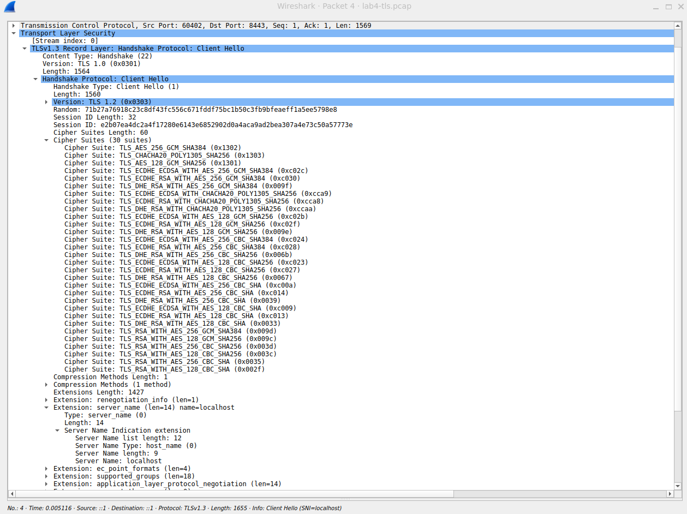
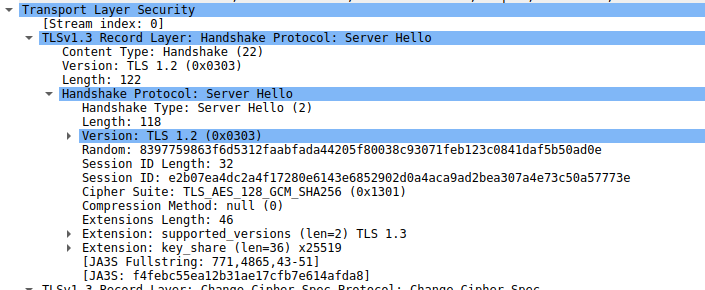

# Lab 4 — OS & Networking: Trace, Debug, and Read the Substrate

For this lab I used WSL with Ubuntu. 

### 1.1: Start QuickNotes + capture

A
```
evilmice@DESKTOP-I36ND4E:~/DevOps-Intro$ cd ~/DevOps-Intro/app
evilmice@DESKTOP-I36ND4E:~/DevOps-Intro/app$ go run .
2026/06/12 19:25:05 quicknotes listening on :8080 (notes loaded: 5)
```

B (left tcpdump on ctrl+c)
```
evilmice@DESKTOP-I36ND4E:~/DevOps-Intro$ sudo tcpdump -i lo -nn -s 0 -A 'tcp port 8080' -w ~/DevOps-Intro/lab4-trace.pcap
tcpdump: listening on lo, link-type EN10MB (Ethernet), snapshot length 262144 bytes
^C10 packets captured
20 packets received by filter
0 packets dropped by kernel
```

C
```
evilmice@DESKTOP-I36ND4E:~/DevOps-Intro$ curl -v -X POST http://localhost:8080/notes \
tent-Ty>   -H 'Content-Type: application/json' \
>   -d '{"title":"trace me","body":"in flight"}'
Note: Unnecessary use of -X or --request, POST is already inferred.
* Host localhost:8080 was resolved.
* IPv6: ::1
* IPv4: 127.0.0.1
*   Trying [::1]:8080...
* Established connection to localhost (::1 port 8080) from ::1 port 52504
* using HTTP/1.x
> POST /notes HTTP/1.1
> Host: localhost:8080
> User-Agent: curl/8.18.0
> Accept: */*
> Content-Type: application/json
> Content-Length: 39
>
* upload completely sent off: 39 bytes
< HTTP/1.1 201 Created
< Content-Type: application/json
< Date: Fri, 12 Jun 2026 16:29:53 GMT
< Content-Length: 93
<
{"id":8,"title":"trace me","body":"in flight","created_at":"2026-06-12T16:29:53.988447359Z"}
* Connection #0 to host localhost:8080 left intact
```

### 1.2: Decode the capture

```
evilmice@DESKTOP-I36ND4E:~/DevOps-Intro$ sudo tcpdump -r ~/DevOps-Intro/lab4-trace.pcap -nn -A | tee ~/DevOps-Intro/lab4-trace.txt
reading from file /home/evilmice/DevOps-Intro/lab4-trace.pcap, link-type EN10MB (Ethernet), snapshot length 262144
```

The TCP three-way handshake (SYN → SYN/ACK → ACK)
SYN
```
19:29:53.987996 IP6 ::1.52504 > ::1.8080: Flags [S], seq 386744764, win 65476, options [mss 65476,sackOK,TS val 1500821491 ecr 0,nop,wscale 10], length 0
`.%..(.@......................................A..........0.........
Yt.........
```

SYN/ACK
```
19:29:53.988010 IP6 ::1.8080 > ::1.52504: Flags [S.], seq 912116795, ack 386744765, win 65464, options [mss 65476,sackOK,TS val 2865432133 ecr 1500821491,nop,wscale 10], length 0
`....(.@....................................6].;..A......0.........
...EYt.....
```

ACK
```
19:29:53.988021 IP6 ::1.52504 > ::1.8080: Flags [.], ack 1, win 64, options [nop,nop,TS val 1500821491 ecr 2865432133], length 0
`.%.. .@......................................A.6].<...@.(.....
Yt.....E
```

The HTTP request line (`POST /notes HTTP/1.1`) + the JSON body
```
19:29:53.988156 IP6 ::1.52504 > ::1.8080: Flags [P.], seq 1:176, ack 1, win 64, options [nop,nop,TS val 1500821491 ecr 2865432133], length 175: HTTP: POST /notes HTTP/1.1
`.%....@......................................A.6].<...@.......
Yt.....EPOST /notes HTTP/1.1
Host: localhost:8080
User-Agent: curl/8.18.0
Accept: */*
Content-Type: application/json
Content-Length: 39

{"title":"trace me","body":"in flight"}
```

The HTTP response line (`HTTP/1.1 201 Created`) + the response JSON
```
19:29:53.988758 IP6 ::1.8080 > ::1.52504: Flags [P.], seq 1:207, ack 176, win 64, options [nop,nop,TS val 2865432134 ecr 1500821491], length 206: HTTP: HTTP/1.1 201 Created
`......@....................................6].<..Bl...@.......
...FYt..HTTP/1.1 201 Created
Content-Type: application/json
Date: Fri, 12 Jun 2026 16:29:53 GMT
Content-Length: 93

{"id":8,"title":"trace me","body":"in flight","created_at":"2026-06-12T16:29:53.988447359Z"}

```

The connection close (`FIN` or `RST`)
```
19:29:53.989082 IP6 ::1.52504 > ::1.8080: Flags [F.], seq 176, ack 207, win 64, options [nop,nop,TS val 1500821492 ecr 2865432134], length 0
`.%.. .@......................................Bl6].
...@.(.....
Yt.....F
19:29:53.989153 IP6 ::1.8080 > ::1.52504: Flags [F.], seq 207, ack 177, win 64, options [nop,nop,TS val 2865432134 ecr 1500821492], length 0
`.... .@....................................6].
..Bm...@.(.....
...FYt..
19:29:53.989172 IP6 ::1.52504 > ::1.8080: Flags [.], ack 208, win 64, options [nop,nop,TS val 1500821492 ecr 2865432134], length 0
`.%.. .@......................................Bm6].....@.(.....
Yt.....F
```

### 1.3: Run the five debugging commands

```
evilmice@DESKTOP-I36ND4E:~/DevOps-Intro$ ss -tlnp | grep :8080
LISTEN 0      4096               *:8080            *:*    users:(("quicknotes",pid=6936,fd=3))
evilmice@DESKTOP-I36ND4E:~/DevOps-Intro$ ip route show
default via 172.17.160.1 dev eth0 proto kernel
172.17.160.0/20 dev eth0 proto kernel scope link src 172.17.174.25
evilmice@DESKTOP-I36ND4E:~/DevOps-Intro$ mtr -rwc 5 localhost
Start: 2026-06-12T19:34:27+0300
HOST: DESKTOP-I36ND4E Loss%   Snt   Last   Avg  Best  Wrst StDev
  1.|-- localhost        0.0%     5    0.1   0.1   0.0   0.1   0.0
evilmice@DESKTOP-I36ND4E:~/DevOps-Intro$ dig +short example.com @1.1.1.1
8.47.69.0
8.6.112.0
evilmice@DESKTOP-I36ND4E:~/DevOps-Intro$ journalctl --user -u quicknotes -n 20 || true
-- No entries --
```

### 1.4: Document

_What would you check first if QuickNotes returned 502?_

If QuickNotes returned 502 Bad Gateway, I would walk the outside-in chain: Is the process running? `ps aux | grep quicknotes`. Is it listening? `ss -tlnp | grep 8080`. Is it reachable? `curl -v localhost:8080/health`. Are there resource constraints? `htop` for CPU/memory, `df -h` for disk. What do the application logs say? Check stderr output or `journalctl`. The 502 status typically means a proxy or load balancer can't reach the backend, the most common causes are the backend process crashing, binding to the wrong interface, or exhausting file descriptors.

## Task 2 — Outside-In Debugging on a Broken Deploy

### 2.1: Run a broken instance

Two QuickNotes instances attempted to bind to port 8080
Commands
```
evilmice@DESKTOP-I36ND4E:~/DevOps-Intro/app$ ADDR=:8080 go run . &
[1] 7818
evilmice@DESKTOP-I36ND4E:~/DevOps-Intro/app$ PID1=$!
evilmice@DESKTOP-I36ND4E:~/DevOps-Intro/app$ sleep 22026/06/12 22:35:11 quicknotes listening on :8080 (notes loaded: 8)

evilmice@DESKTOP-I36ND4E:~/DevOps-Intro/app$ ADDR=:8080 go run . 2>&1 | tee /tmp/qn-broken.log
2026/06/12 22:35:56 quicknotes listening on :8080 (notes loaded: 8)
```
Error
```
2026/06/12 22:35:56 listen: listen tcp :8080: bind: address already in use
exit status 1
```

### 2.2: Walk the outside-in chain

Documented command + output + decision
```
evilmice@DESKTOP-I36ND4E:~/DevOps-Intro/app$ ps -ef | grep quicknotes
evilmice    7891    7818  0 22:35 pts/0    00:00:00 /home/evilmice/.cache/go-build/c5/c501fb9a28e45d716591fc47ef7c12cfd2f461d9d75196e6404696687391a71a-d/quicknotes
evilmice    7998     324  0 22:40 pts/0    00:00:00 grep --color=auto quicknotes
evilmice@DESKTOP-I36ND4E:~/DevOps-Intro/app$ ss -tlnp | grep 8080
LISTEN 0      4096               *:8080            *:*    users:(("quicknotes",pid=7891,fd=3))
evilmice@DESKTOP-I36ND4E:~/DevOps-Intro/app$ curl -s -o /dev/null -w "%{http_code}\n" http://localhost:8080/health
200
evilmice@DESKTOP-I36ND4E:~/DevOps-Intro/app$ sudo iptables -L -n -v 2>/dev/null || sudo nft list ruleset 2>/dev/null || true
[sudo: authenticate] Password:
evilmice@DESKTOP-I36ND4E:~/DevOps-Intro/app$ dig +short localhost
127.0.0.1
```

The first instance works. The second failed because the port was already taken — no network or DNS issue.
### 2.3: Repair + re-verify

```
evilmice@DESKTOP-I36ND4E:~/DevOps-Intro/app$ kill $PID1
leep 1
ADDR=:8080 go run . &
sleep 1
curl -s http://localhost:8080/health[1]+  Terminated                 ADDR=:8080 go run .
evilmice@DESKTOP-I36ND4E:~/DevOps-Intro/app$ sleep 1
evilmice@DESKTOP-I36ND4E:~/DevOps-Intro/app$ ADDR=:8080 go run . &
[1] 8073
evilmice@DESKTOP-I36ND4E:~/DevOps-Intro/app$ sleep 1
2026/06/12 22:43:27 quicknotes listening on :8080 (notes loaded: 8)
2026/06/12 22:43:27 listen: listen tcp :8080: bind: address already in use
exit status 1
[1]+  Exit 1                     ADDR=:8080 go run .
evilmice@DESKTOP-I36ND4E:~/DevOps-Intro/app$ curl -s http://localhost:8080/health
{"notes":8,"status":"ok"}
```

Killed PID 7818. Restarted a single instance on :8080. `curl /health` returned 200.

### 2.4: Document


The root cause (`bind: address already in use`)
Port collision — the first process already held `:8080`. The second could not bind.

A mini-postmortem (≤ 200 words) framed blamelessly: what's _systemic_ about this kind of failure, and what tooling could prevent it?

This is a classic "port already in use" failure, systemic, not personal. Two processes raced for the same port, and the second lost. The immediate cause was starting a second QuickNotes without stopping the first. The deeper issue is the absence of a process lifecycle manager that would prevent such collisions.
In production, this failure mode is common during deployments: the new instance starts before the old one is fully terminated, causing a brief "bind" conflict that can drop traffic. Tools like systemd socket activation solve this by passing the listening socket to the new process, ensuring only one holder exists. A simpler guard `lsof -i :8080` in a startup script would also catch the conflict before it happens.
The fix is not "be more careful." It is to automate the lifecycle so this mistake becomes structurally impossible. Health checks, readiness probes, and orchestrated restarts (Docker, systemd, Kubernetes) all prevent this class of failure by managing port ownership explicitly.

## Bonus Task — Decode the TLS Handshake

### B.1: Add an HTTPS layer

```
evilmice@DESKTOP-I36ND4E:~/DevOps-Intro/app$ echo 'localhost:8443 {
>   reverse_proxy localhost:8080
> }' | sudo tee /etc/caddy/Caddyfile
localhost:8443 {
  reverse_proxy localhost:8080
}
evilmice@DESKTOP-I36ND4E:~/DevOps-Intro/app$ sudo systemctl restart caddy
Warning: The unit file, source configuration file or drop-ins of caddy.service changed on disk. Run 'systemctl daemon-reload' to reload units.
```

### B.2: Capture the TLS handshake

```
evilmice@DESKTOP-I36ND4E:~/DevOps-Intro$ sudo tcpdump -i lo -nn -s 0 -w ~/DevOps-Intro/lab4-tls.pcap 'tcp port 8443'
[sudo: authenticate] Password:
tcpdump: listening on lo, link-type EN10MB (Ethernet), snapshot length 262144 bytes
^C23 packets captured
46 packets received by filter
0 packets dropped by kernel
```

```
evilmice@DESKTOP-I36ND4E:~/DevOps-Intro$ curl -vk https://localhost:8443/health
* Host localhost:8443 was resolved.
* IPv6: ::1
* IPv4: 127.0.0.1
*   Trying [::1]:8443...
* ALPN: curl offers h2,http/1.1
* TLSv1.3 (OUT), TLS handshake, Client hello (1):
* SSL Trust: peer verification disabled
* TLSv1.3 (IN), TLS handshake, Server hello (2):
* TLSv1.3 (IN), TLS change cipher, Change cipher spec (1):
* TLSv1.3 (IN), TLS handshake, Encrypted Extensions (8):
* TLSv1.3 (IN), TLS handshake, Certificate (11):
* TLSv1.3 (IN), TLS handshake, CERT verify (15):
* TLSv1.3 (IN), TLS handshake, Finished (20):
* TLSv1.3 (OUT), TLS change cipher, Change cipher spec (1):
* TLSv1.3 (OUT), TLS handshake, Finished (20):
* SSL connection using TLSv1.3 / TLS_AES_128_GCM_SHA256 / x25519 / id-ecPublicKey
* ALPN: server accepted h2
* Server certificate:
*   subject:
*   start date: Jun 12 19:55:03 2026 GMT
*   expire date: Jun 13 07:55:03 2026 GMT
*   issuer: CN=Caddy Local Authority - ECC Intermediate
*   Certificate level 0: Public key type EC/prime256v1 (256/128 Bits/secBits), signed using ecdsa-with-SHA256
*   Certificate level 1: Public key type EC/prime256v1 (256/128 Bits/secBits), signed using ecdsa-with-SHA256
*  SSL certificate verification failed, continuing anyway!
* Established connection to localhost (::1 port 8443) from ::1 port 60402
* using HTTP/2
* [HTTP/2] [1] OPENED stream for https://localhost:8443/health
* [HTTP/2] [1] [:method: GET]
* [HTTP/2] [1] [:scheme: https]
* [HTTP/2] [1] [:authority: localhost:8443]
* [HTTP/2] [1] [:path: /health]
* [HTTP/2] [1] [user-agent: curl/8.18.0]
* [HTTP/2] [1] [accept: */*]
> GET /health HTTP/2
> Host: localhost:8443
> User-Agent: curl/8.18.0
> Accept: */*
>
* Request completely sent off
* TLSv1.3 (IN), TLS handshake, Newsession Ticket (4):
< HTTP/2 200
< alt-svc: h3=":8443"; ma=2592000
< content-type: application/json
< date: Fri, 12 Jun 2026 19:57:16 GMT
< server: Caddy
< content-length: 26
<
{"notes":8,"status":"ok"}
* Connection #0 to host localhost:8443 left intact
```

### B.3: Decode with Wireshark

Client Hello 

_Which negotiation step kills TLS 1.0 / 1.1 in 2026?_
TLS 1.0 and 1.1 are killed at the **ClientHello** step. A client offering only TLS 1.0 or 1.1 sends its version in the ClientHello; a modern server (TLS 1.2+) responds with a ServerHello at TLS 1.2 or higher, or rejects the connection entirely with a protocol version alert. RFC 8996 formally deprecated TLS 1.0/1.1 in March 2021. Major browsers removed support in 2020-2021. In 2026, any service still accepting TLS 1.0/1.1 would fail PCI-DSS compliance and be flagged by security scanners. The negotiation step is the single choke point, if the client cannot offer >= 1.2, the handshake never proceeds to key exchange.


Server Hello 



The certificate chain shown by `openssl s_client -connect localhost:8443 -showcerts </dev/null`
```
evilmice@DESKTOP-I36ND4E:~/DevOps-Intro$ openssl s_client -connect localhost:8443 -showcerts </dev/null 2>/dev/null | head -50
CONNECTED(00000003)
---
no peer certificate available
---
No client certificate CA names sent
Negotiated TLS1.3 group: <NULL>
---
SSL handshake has read 7 bytes and written 1533 bytes
Verification: OK
---
New, (NONE), Cipher is (NONE)
Protocol: TLSv1.3
This TLS version forbids renegotiation.
Compression: NONE
Expansion: NONE
No ALPN negotiated
Early data was not sent
Verify return code: 0 (ok)
---
```

