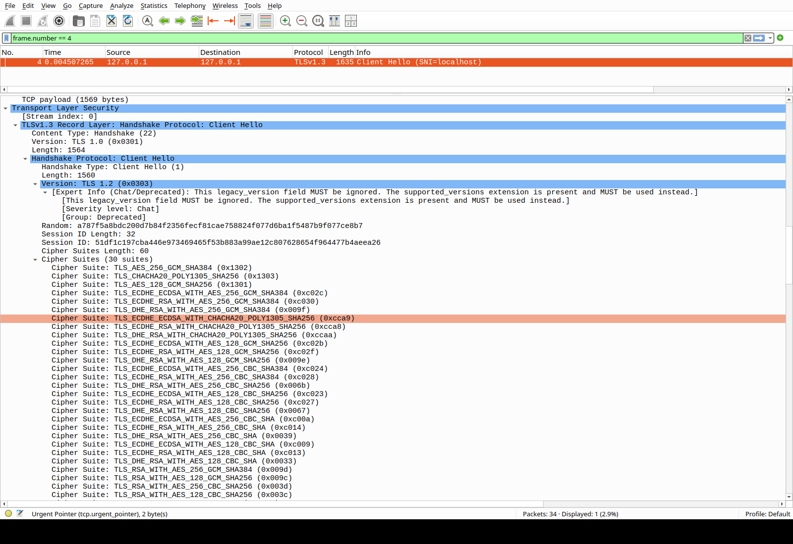
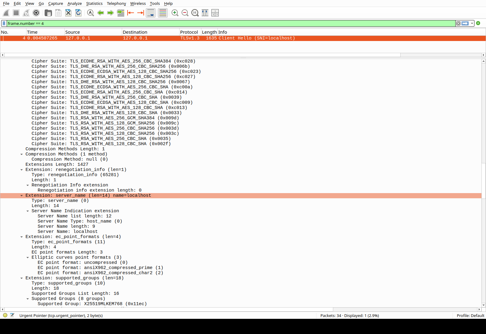
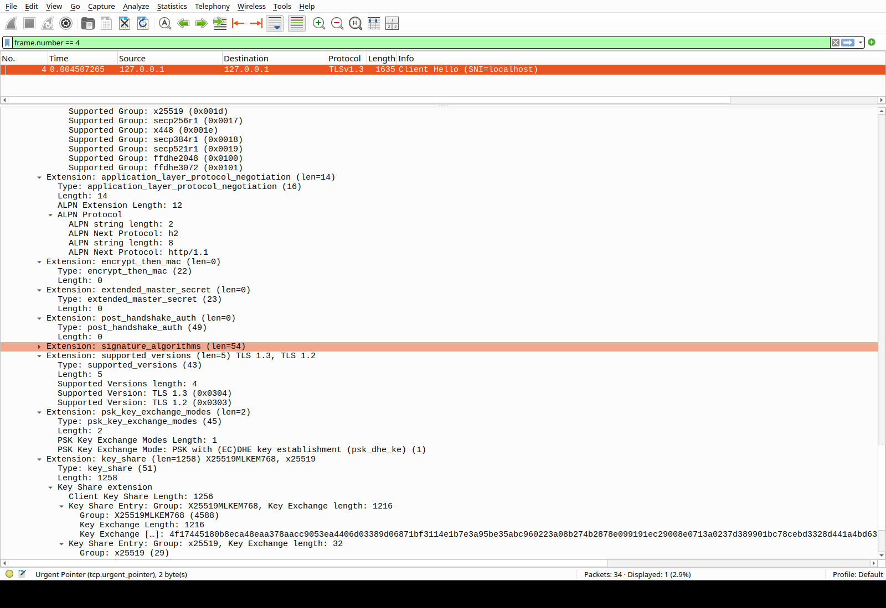
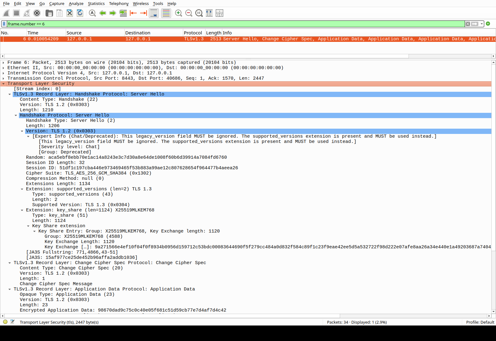
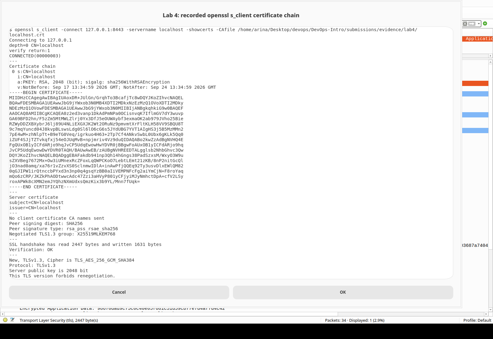

# Lab 4 — OS and Networking

Student: Arina ([@sonder314](https://github.com/sonder314))

## Method

I built QuickNotes from the course source using the repository-local Go toolchain.
I ran the binary directly to track the actual server PID, with separate temporary
data files and explicit environment variables. All command outputs below were
captured on my Linux host. The TLS proxy uses Python's standard library, listens
only on loopback, and forwards HTTPS requests to QuickNotes over HTTP.

Capture used `sudo -n dumpcap -i lo -s 0 -F pcap -a duration:12 -w - -f 'tcp port 8080'`
(and port 8443 for TLS), with stdout saved to the pcap file. Automatic capture
expiry avoided the host's signal restrictions encountered with tcpdump.
I decoded the saved HTTP capture with `tcpdump -r ... -nn -A`; no packets were fabricated.

## Task 1 — Request trace

The [HTTP pcap](evidence/lab4/lab4-trace.pcap) and
[decoded trace](evidence/lab4/lab4-trace.txt) contain the real POST request.
In the trace, client-to-8080 `Flags [S]`, the reverse `Flags [S.]`, and the next
client ACK establish the connection. The payload contains `POST /notes HTTP/1.1`
and the JSON title `trace me`; the reverse payload contains `201 Created` and the
new note. FIN packets close the connection. Sequence and acknowledgement numbers
connect these observations to the same TCP stream.

### Packet annotations

All frames below belong to `127.0.0.1:44302 → 127.0.0.1:8080` (or its reverse).
Frame numbers refer to the saved pcap; TCP numbers below are relative.

| Frames | Evidence | Meaning |
|---|---|---|
| 1, 2, 3 | SYN seq=0; SYN/ACK seq=0 ack=1; ACK ack=1 | Three-way handshake establishes the connection. |
| 4 | `POST /notes HTTP/1.1`, `Content-Type: application/json`, `{"title":"trace me","body":"in flight"}` | Actual HTTP request and 39-byte JSON body. |
| 6 | `HTTP/1.1 201 Created`; JSON has `id:6`, `title:"trace me"`, `body:"in flight"` | QuickNotes created and returned a note. |
| 8, 9, 10 | Client FIN/ACK, server FIN/ACK, final client ACK | Both directions close normally; FIN consumes one sequence number. |

### Five diagnostic results

Exact commands and complete outputs are included in the transcript and linked files.

| Check | Result and interpretation |
|---|---|
| [Listener](evidence/lab4/listeners.txt) | QuickNotes owns the loopback listener on port 8080. |
| [Routes](evidence/lab4/routes.txt) | Host routes are recorded; this request stays on loopback rather than using the default gateway. |
| [Reachability](evidence/lab4/reachability.txt) | Five localhost probes, 0% loss. |
| [DNS](evidence/lab4/dns-example.txt) | The query to 1.1.1.1 returns addresses for example.com. |
| [Journal](evidence/lab4/journal.txt) | No entries: QuickNotes was launched directly, not as a user systemd service. Its actual output is in [first.log](evidence/lab4/first.log). |

### What I would check first for HTTP 502

I would inspect the reverse proxy's error log and configured upstream address,
then use `ss -tlnp` and curl directly against that upstream from the proxy's
network namespace. A 502 means an HTTP intermediary answered but could not obtain
a valid upstream response; it does not by itself identify DNS, firewall or an
application failure. I would correlate service status, listener ownership and
application logs, then inspect routing, firewall counters and DNS as indicated
by connection errors. I would also check HTTP versus HTTPS upstream configuration.

## Task 2 — Outside-in decisions

1. **Process:** compare the first PID with the failed second PID. The second
   instance exits; the first is still alive. The exact bind error is in
   [broken.log](evidence/lab4/broken.log).
2. **Listener:** `ss` identifies the first instance as the owner of port 8080.
3. **Reachability:** HTTP 200 from `/health` belongs to the existing instance;
   it does not prove that the replacement deployment started.
4. **Firewall:** read the rules and counters without changing them. A local
   bind failure occurs before any inbound connection, and successful health
   traffic makes filtering an implausible cause of this specific failure.
5. **DNS:** inspect the localhost DNS answer. Curl and the numeric loopback
   listener independently establish local reachability; NSS `/etc/hosts`
   resolution and a DNS-only `dig` query need not behave identically.

I terminated only the conflicting process I started, waited for it to exit,
started the replacement with its own data file, then verified HTTP health and
the new listener PID. The command transcript below records these steps.

The exact startup error was:

```text
2026/09/17 16:34:59 listen: listen tcp 127.0.0.1:8080: bind: address already in use
```

The old listener belonged to PID 290359. After stopping it, the replacement
owned port 8080 as PID 291223 and returned `{"notes":4,"status":"ok"}`.

### Blameless mini-postmortem

A replacement instance failed because the prior instance still owned the same
address and port. A successful health probe masked the deployment failure by
reaching the old process. The systemic problem was unmanaged process ownership
and a readiness check that did not identify the deployed instance. A service
manager should coordinate shutdown and startup, enforce one instance per socket,
and report startup failures. Deployment readiness should include build or instance
identity. Port preflight checks improve diagnostics but cannot eliminate races;
the bind result remains authoritative. I repaired the conflict by stopping the
known old PID and verifying both the new listener owner and its health response.

## Bonus — TLS

The [TLS capture](evidence/lab4/lab4-tls.pcap),
[verbose HTTPS request](evidence/lab4/tls-curl.txt), and
[certificate chain](evidence/lab4/certificate-chain.txt) record a local HTTPS
connection through the proxy. The certificate is a self-signed localhost leaf;
there is no intermediate CA. `curl -k` is used for this isolated exercise only;
the OpenSSL command explicitly trusts the generated certificate.

The server minimum is TLS 1.2. Version negotiation during ClientHello processing
rejects a peer offering only TLS 1.0/1.1 because there is no permitted common
version, before application HTTP is exchanged. Modern ClientHello legacy version
fields must not be mistaken for the negotiated version: the supported_versions
extension carries TLS 1.3 negotiation. [RFC 8996](https://www.rfc-editor.org/rfc/rfc8996.html)
deprecated TLS 1.0/1.1 in March 2021; a calendar year itself does not reject TLS.
### Wireshark evidence and annotations

The following screenshots show the saved capture opened in Wireshark.
The [full decoded handshake](evidence/lab4/tls-decoded.txt) is also included.

**ClientHello, frame 4:** the client offers 30 cipher suites.



The `server_name` extension carries SNI `localhost`.



**Deprecation annotation:** `supported_versions` offers TLS 1.3 (`0x0304`) and
TLS 1.2 (`0x0303`), excluding TLS 1.0/1.1. The server's minimum is TLS 1.2.
It is the common-version selection when processing ClientHello that would
reject an old-only peer. This capture demonstrates modern negotiation; it does
not contain a separate attempted TLS 1.0/1.1 connection or a rejection alert.



**ServerHello, frame 6:** the server selects `TLS_AES_256_GCM_SHA384` (`0x1302`)
and TLS 1.3 in `supported_versions`. The legacy TLS 1.2 field is a compatibility
field, not the negotiated version.



**Certificate chain:** this screenshot displays the recorded `openssl s_client`
output. Subject and issuer are both `CN=localhost`; the self-signed RSA 2048-bit
certificate is valid from September 17 to September 24, 2026 (UTC).
Verification succeeds because this command explicitly supplies the test
certificate as its trust anchor, not because a public CA issued it.



## Actual command transcript

Collected: 2026-09-17T13:35:11.943544+00:00

### environment

```text
$ uname -a
Linux arina-ASUS-EXPERTBOOK-B1402CBA-B1402CBA 7.0.0-31-generic #31-Ubuntu SMP PREEMPT_DYNAMIC Sat Aug  1 04:26:38 UTC 2026 x86_64 GNU/Linux

Exit status: 0
```

### first-launch

```text
$ ADDR=127.0.0.1:8080 DATA_PATH=/home/arina/Desktop/devops/DevOps-Intro/.goenv/lab4/first.json SEED_PATH=/home/arina/Desktop/devops/DevOps-Intro/app/seed.json /home/arina/Desktop/devops/DevOps-Intro/.goenv/bin/quicknotes-lab4
PID: 290359
```

### post-curl

```text
$ curl --noproxy '*' -4 -v --max-time 10 http://localhost:8080/notes -H 'Content-Type: application/json' -d '{"title":"trace me","body":"in flight"}'
* Host localhost:8080 was resolved.
* IPv6: ::1
* IPv4: 127.0.0.1
  % Total    % Received % Xferd  Average Speed  Time    Time    Time   Current
                                 Dload  Upload  Total   Spent   Left   Speed

  0      0   0      0   0      0      0      0                              0*   Trying 127.0.0.1:8080...
* Established connection to localhost (127.0.0.1 port 8080) from 127.0.0.1 port 44302
* using HTTP/1.x
> POST /notes HTTP/1.1
> Host: localhost:8080
> User-Agent: curl/8.18.0
> Accept: */*
> Content-Type: application/json
> Content-Length: 39
>
} [39 bytes data]
* upload completely sent off: 39 bytes
< HTTP/1.1 201 Created
< Content-Type: application/json
< Date: Thu, 17 Sep 2026 13:34:36 GMT
< Content-Length: 93
<
{ [93 bytes data]

100    132 100     93 100     39   2994   1255                              0
100    132 100     93 100     39   2988   1253                              0
100    132 100     93 100     39   2982   1250                              0
* Connection #0 to host localhost:8080 left intact
{"id":6,"title":"trace me","body":"in flight","created_at":"2026-09-17T13:34:36.907988139Z"}

Exit status: 0
```

### lab4-trace

```text
$ tcpdump -r /home/arina/Desktop/devops/DevOps-Intro/submissions/evidence/lab4/lab4-trace.pcap -nn -tttt -A
reading from file /home/arina/Desktop/devops/DevOps-Intro/submissions/evidence/lab4/lab4-trace.pcap, link-type EN10MB (Ethernet), snapshot length 262144
2026-09-17 16:34:36.907102 IP 127.0.0.1.44302 > 127.0.0.1.8080: Flags [S], seq 1205284485, win 65495, options [mss 65495,sackOK,TS val 3267053868 ecr 0,nop,wscale 10], length 0
E..<.n@.@.LK............G......................
..I,.......

2026-09-17 16:34:36.907206 IP 127.0.0.1.8080 > 127.0.0.1.44302: Flags [S.], seq 1122597620, ack 1205284486, win 65483, options [mss 65495,sackOK,TS val 607147167 ecr 3267053868,nop,wscale 10], length 0
E..<..@.@.<.............B.z.G........0.........
$0T...I,...

2026-09-17 16:34:36.907232 IP 127.0.0.1.44302 > 127.0.0.1.8080: Flags [.], ack 1, win 64, options [nop,nop,TS val 3267053895 ecr 607147167], length 0
E..4.o@.@.LR............G...B.z....@.(.....
..IG$0T.
2026-09-17 16:34:36.907621 IP 127.0.0.1.44302 > 127.0.0.1.8080: Flags [P.], seq 1:176, ack 1, win 64, options [nop,nop,TS val 3267053896 ecr 607147167], length 175: HTTP: POST /notes HTTP/1.1
E....p@.@.K.............G...B.z....@.......
..IH$0T.POST /notes HTTP/1.1
Host: localhost:8080
User-Agent: curl/8.18.0
Accept: */*
Content-Type: application/json
Content-Length: 39

{"title":"trace me","body":"in flight"}
2026-09-17 16:34:36.907643 IP 127.0.0.1.8080 > 127.0.0.1.44302: Flags [.], ack 176, win 64, options [nop,nop,TS val 607147168 ecr 3267053896], length 0
E..4R~@.@..C............B.z.G./5...@.(.....
$0T...IH
2026-09-17 16:34:36.909516 IP 127.0.0.1.8080 > 127.0.0.1.44302: Flags [P.], seq 1:207, ack 176, win 64, options [nop,nop,TS val 607147170 ecr 3267053896], length 206: HTTP: HTTP/1.1 201 Created
E...R.@.@..t............B.z.G./5...@.......
$0T...IHHTTP/1.1 201 Created
Content-Type: application/json
Date: Thu, 17 Sep 2026 13:34:36 GMT
Content-Length: 93

{"id":6,"title":"trace me","body":"in flight","created_at":"2026-09-17T13:34:36.907988139Z"}

2026-09-17 16:34:36.909543 IP 127.0.0.1.44302 > 127.0.0.1.8080: Flags [.], ack 207, win 64, options [nop,nop,TS val 3267053898 ecr 607147170], length 0
E..4.q@.@.LP............G./5B.{....@.(.....
..IJ$0T.
2026-09-17 16:34:36.910325 IP 127.0.0.1.44302 > 127.0.0.1.8080: Flags [F.], seq 176, ack 207, win 64, options [nop,nop,TS val 3267053899 ecr 607147170], length 0
E..4.r@.@.LO............G./5B.{....@.(.....
..IK$0T.
2026-09-17 16:34:36.910396 IP 127.0.0.1.8080 > 127.0.0.1.44302: Flags [F.], seq 207, ack 177, win 64, options [nop,nop,TS val 607147171 ecr 3267053899], length 0
E..4R.@.@..A............B.{.G./6...@.(.....
$0T...IK
2026-09-17 16:34:36.910485 IP 127.0.0.1.44302 > 127.0.0.1.8080: Flags [.], ack 208, win 64, options [nop,nop,TS val 3267053899 ecr 607147171], length 0
E..4.s@.@.LN............G./6B.{....@.(.....
..IK$0T.

Exit status: 0
```

### listeners

```text
$ ss -tlnp 'sport = :8080'
State  Recv-Q Send-Q Local Address:Port Peer Address:PortProcess
LISTEN 0      4096       127.0.0.1:8080      0.0.0.0:*    users:(("quicknotes-lab4",pid=290359,fd=3))

Exit status: 0
```

### routes

```text
$ ip route show
default via 10.91.48.1 dev wlo1 proto dhcp src 10.91.55.239 metric 20600
10.91.48.0/20 dev wlo1 proto kernel scope link src 10.91.55.239 metric 600
25.0.0.0/8 dev ham0 proto kernel scope link src 25.18.146.180
172.17.0.0/16 dev docker0 proto kernel scope link src 172.17.0.1 linkdown
172.18.0.0/16 dev br-a697de2024cd proto kernel scope link src 172.18.0.1 linkdown
172.19.0.0/24 dev throne-tun proto kernel scope link src 172.19.0.1
172.19.0.0/16 dev br-e9a2f818d821 proto kernel scope link src 172.19.0.1 linkdown
172.20.0.0/16 dev br-3de5e854a2a1 proto kernel scope link src 172.20.0.1 linkdown
172.21.0.0/16 dev br-bc5d3e0cb1e1 proto kernel scope link src 172.21.0.1

Exit status: 0
```

### reachability

```text
$ mtr -4 -rwc 5 localhost
Start: 2026-09-17T16:34:48+0300
HOST: arina-ASUS-EXPERTBOOK-B1402CBA-B1402CBA Loss%   Snt   Last   Avg  Best  Wrst StDev
  1.|-- localhost                                0.0%     5    0.5   0.2   0.2   0.5   0.1

Exit status: 0
```

### dns-example

```text
$ dig +time=3 +tries=1 +short example.com @1.1.1.1
172.66.147.243
104.20.23.154

Exit status: 0
```

### journal

```text
$ journalctl --user -u quicknotes -n 20 --no-pager
-- No entries --

Exit status: 0
```

### broken-launch

```text
$ ADDR=127.0.0.1:8080 DATA_PATH=/home/arina/Desktop/devops/DevOps-Intro/.goenv/lab4/broken.json SEED_PATH=/home/arina/Desktop/devops/DevOps-Intro/app/seed.json /home/arina/Desktop/devops/DevOps-Intro/.goenv/bin/quicknotes-lab4
PID: 291202
```

### processes

```text
$ ps -p 290359,291202 -o pid,ppid,stat,args
    PID    PPID STAT COMMAND
 290359  290351 Sl+  /home/arina/Desktop/devops/DevOps-Intro/.goenv/bin/quicknotes-lab4

Exit status: 0
```

### broken-listener

```text
$ ss -tlnp 'sport = :8080'
State  Recv-Q Send-Q Local Address:Port Peer Address:PortProcess
LISTEN 0      4096       127.0.0.1:8080      0.0.0.0:*    users:(("quicknotes-lab4",pid=290359,fd=3))

Exit status: 0
```

### broken-health

```text
$ curl --noproxy '*' -4 -sS --max-time 10 -o /dev/null -w '%{http_code}
' http://localhost:8080/health
200

Exit status: 0
```

### firewall

```text
$ sudo -n iptables -L -n -v
Chain INPUT (policy ACCEPT 0 packets, 0 bytes)
 pkts bytes target     prot opt in     out     source               destination

Chain FORWARD (policy DROP 0 packets, 0 bytes)
 pkts bytes target     prot opt in     out     source               destination
 7014  495K DOCKER-USER  all  --  *      *       0.0.0.0/0            0.0.0.0/0
 7014  495K DOCKER-FORWARD  all  --  *      *       0.0.0.0/0            0.0.0.0/0

Chain OUTPUT (policy ACCEPT 0 packets, 0 bytes)
 pkts bytes target     prot opt in     out     source               destination

Chain DOCKER (5 references)
 pkts bytes target     prot opt in     out     source               destination
    0     0 ACCEPT     tcp  --  !br-bc5d3e0cb1e1 br-bc5d3e0cb1e1  0.0.0.0/0            172.21.0.4           tcp dpt:8003
    0     0 ACCEPT     tcp  --  !br-bc5d3e0cb1e1 br-bc5d3e0cb1e1  0.0.0.0/0            172.21.0.3           tcp dpt:9092
    0     0 ACCEPT     tcp  --  !br-bc5d3e0cb1e1 br-bc5d3e0cb1e1  0.0.0.0/0            172.21.0.7           tcp dpt:11434
    0     0 ACCEPT     tcp  --  !br-bc5d3e0cb1e1 br-bc5d3e0cb1e1  0.0.0.0/0            172.21.0.6           tcp dpt:6334
    0     0 ACCEPT     tcp  --  !br-bc5d3e0cb1e1 br-bc5d3e0cb1e1  0.0.0.0/0            172.21.0.6           tcp dpt:6333
    0     0 ACCEPT     tcp  --  !br-bc5d3e0cb1e1 br-bc5d3e0cb1e1  0.0.0.0/0            172.21.0.2           tcp dpt:5432
    0     0 DROP       all  --  !br-3de5e854a2a1 br-3de5e854a2a1  0.0.0.0/0            0.0.0.0/0
    0     0 DROP       all  --  !br-a697de2024cd br-a697de2024cd  0.0.0.0/0            0.0.0.0/0
    0     0 DROP       all  --  !br-bc5d3e0cb1e1 br-bc5d3e0cb1e1  0.0.0.0/0            0.0.0.0/0
    0     0 DROP       all  --  !br-e9a2f818d821 br-e9a2f818d821  0.0.0.0/0            0.0.0.0/0
    0     0 DROP       all  --  !docker0 docker0  0.0.0.0/0            0.0.0.0/0

Chain DOCKER-BRIDGE (1 references)
 pkts bytes target     prot opt in     out     source               destination
    0     0 DOCKER     all  --  *      br-3de5e854a2a1  0.0.0.0/0            0.0.0.0/0
    0     0 DOCKER     all  --  *      br-a697de2024cd  0.0.0.0/0            0.0.0.0/0
    8   480 DOCKER     all  --  *      br-bc5d3e0cb1e1  0.0.0.0/0            0.0.0.0/0
    0     0 DOCKER     all  --  *      br-e9a2f818d821  0.0.0.0/0            0.0.0.0/0
    0     0 DOCKER     all  --  *      docker0  0.0.0.0/0            0.0.0.0/0

Chain DOCKER-CT (1 references)
 pkts bytes target     prot opt in     out     source               destination
    0     0 ACCEPT     all  --  *      br-3de5e854a2a1  0.0.0.0/0            0.0.0.0/0            ctstate RELATED,ESTABLISHED
    0     0 ACCEPT     all  --  *      br-a697de2024cd  0.0.0.0/0            0.0.0.0/0            ctstate RELATED,ESTABLISHED
 6899  478K ACCEPT     all  --  *      br-bc5d3e0cb1e1  0.0.0.0/0            0.0.0.0/0            ctstate RELATED,ESTABLISHED
    0     0 ACCEPT     all  --  *      br-e9a2f818d821  0.0.0.0/0            0.0.0.0/0            ctstate RELATED,ESTABLISHED
    0     0 ACCEPT     all  --  *      docker0  0.0.0.0/0            0.0.0.0/0            ctstate RELATED,ESTABLISHED

Chain DOCKER-FORWARD (1 references)
 pkts bytes target     prot opt in     out     source               destination
 7014  495K DOCKER-CT  all  --  *      *       0.0.0.0/0            0.0.0.0/0
  115 17118 DOCKER-INTERNAL  all  --  *      *       0.0.0.0/0            0.0.0.0/0
  115 17118 DOCKER-BRIDGE  all  --  *      *       0.0.0.0/0            0.0.0.0/0
    0     0 ACCEPT     all  --  br-3de5e854a2a1 *       0.0.0.0/0            0.0.0.0/0
    0     0 ACCEPT     all  --  br-a697de2024cd *       0.0.0.0/0            0.0.0.0/0
  115 17118 ACCEPT     all  --  br-bc5d3e0cb1e1 *       0.0.0.0/0            0.0.0.0/0
    0     0 ACCEPT     all  --  br-e9a2f818d821 *       0.0.0.0/0            0.0.0.0/0
    0     0 ACCEPT     all  --  docker0 *       0.0.0.0/0            0.0.0.0/0

Chain DOCKER-INTERNAL (1 references)
 pkts bytes target     prot opt in     out     source               destination

Chain DOCKER-USER (1 references)
 pkts bytes target     prot opt in     out     source               destination

Exit status: 0
```

### nftables

```text
$ sudo -n nft list ruleset
# Warning: table ip nat is managed by iptables-nft, do not touch!
table ip nat {
	chain DOCKER {
		iifname != "br-bc5d3e0cb1e1" tcp dport 5437 counter packets 0 bytes 0 dnat to 172.21.0.2:5432
		iifname != "br-bc5d3e0cb1e1" tcp dport 6333 counter packets 0 bytes 0 dnat to 172.21.0.6:6333
		iifname != "br-bc5d3e0cb1e1" tcp dport 6334 counter packets 0 bytes 0 dnat to 172.21.0.6:6334
		iifname != "br-bc5d3e0cb1e1" tcp dport 11434 counter packets 0 bytes 0 dnat to 172.21.0.7:11434
		iifname != "br-bc5d3e0cb1e1" tcp dport 9092 counter packets 0 bytes 0 dnat to 172.21.0.3:9092
		iifname != "br-bc5d3e0cb1e1" tcp dport 8003 counter packets 0 bytes 0 dnat to 172.21.0.4:8003
	}

	chain PREROUTING {
		type nat hook prerouting priority dstnat; policy accept;
		fib daddr type local counter packets 5 bytes 318 jump DOCKER
	}

	chain OUTPUT {
		type nat hook output priority dstnat; policy accept;
		ip daddr != 127.0.0.0/8 fib daddr type local counter packets 0 bytes 0 jump DOCKER
	}

	chain POSTROUTING {
		type nat hook postrouting priority srcnat; policy accept;
		ip saddr 172.17.0.0/16 oifname != "docker0" counter packets 0 bytes 0 masquerade
		ip saddr 172.19.0.0/16 oifname != "br-e9a2f818d821" counter packets 4908 bytes 349845 masquerade
		ip saddr 172.21.0.0/16 oifname != "br-bc5d3e0cb1e1" counter packets 3 bytes 180 masquerade
		ip saddr 172.18.0.0/16 oifname != "br-a697de2024cd" counter packets 0 bytes 0 masquerade
		ip saddr 172.20.0.0/16 oifname != "br-3de5e854a2a1" counter packets 0 bytes 0 masquerade
	}
}
# Warning: table ip filter is managed by iptables-nft, do not touch!
table ip filter {
	chain DOCKER {
		ip daddr 172.21.0.4 iifname != "br-bc5d3e0cb1e1" oifname "br-bc5d3e0cb1e1" tcp dport 8003 counter packets 0 bytes 0 accept
		ip daddr 172.21.0.3 iifname != "br-bc5d3e0cb1e1" oifname "br-bc5d3e0cb1e1" tcp dport 9092 counter packets 0 bytes 0 accept
		ip daddr 172.21.0.7 iifname != "br-bc5d3e0cb1e1" oifname "br-bc5d3e0cb1e1" tcp dport 11434 counter packets 0 bytes 0 accept
		ip daddr 172.21.0.6 iifname != "br-bc5d3e0cb1e1" oifname "br-bc5d3e0cb1e1" tcp dport 6334 counter packets 0 bytes 0 accept
		ip daddr 172.21.0.6 iifname != "br-bc5d3e0cb1e1" oifname "br-bc5d3e0cb1e1" tcp dport 6333 counter packets 0 bytes 0 accept
		ip daddr 172.21.0.2 iifname != "br-bc5d3e0cb1e1" oifname "br-bc5d3e0cb1e1" tcp dport 5432 counter packets 0 bytes 0 accept
		iifname != "br-3de5e854a2a1" oifname "br-3de5e854a2a1" counter packets 0 bytes 0 drop
		iifname != "br-a697de2024cd" oifname "br-a697de2024cd" counter packets 0 bytes 0 drop
		iifname != "br-bc5d3e0cb1e1" oifname "br-bc5d3e0cb1e1" counter packets 0 bytes 0 drop
		iifname != "br-e9a2f818d821" oifname "br-e9a2f818d821" counter packets 0 bytes 0 drop
		iifname != "docker0" oifname "docker0" counter packets 0 bytes 0 drop
	}

	chain DOCKER-FORWARD {
		counter packets 7014 bytes 494674 jump DOCKER-CT
		counter packets 115 bytes 17118 jump DOCKER-INTERNAL
		counter packets 115 bytes 17118 jump DOCKER-BRIDGE
		iifname "br-3de5e854a2a1" counter packets 0 bytes 0 accept
		iifname "br-a697de2024cd" counter packets 0 bytes 0 accept
		iifname "br-bc5d3e0cb1e1" counter packets 115 bytes 17118 accept
		iifname "br-e9a2f818d821" counter packets 0 bytes 0 accept
		iifname "docker0" counter packets 0 bytes 0 accept
	}

	chain DOCKER-BRIDGE {
		oifname "br-3de5e854a2a1" counter packets 0 bytes 0 jump DOCKER
		oifname "br-a697de2024cd" counter packets 0 bytes 0 jump DOCKER
		oifname "br-bc5d3e0cb1e1" counter packets 8 bytes 480 jump DOCKER
		oifname "br-e9a2f818d821" counter packets 0 bytes 0 jump DOCKER
		oifname "docker0" counter packets 0 bytes 0 jump DOCKER
	}

	chain DOCKER-CT {
		oifname "br-3de5e854a2a1" ct state related,established counter packets 0 bytes 0 accept
		oifname "br-a697de2024cd" ct state related,established counter packets 0 bytes 0 accept
		oifname "br-bc5d3e0cb1e1" ct state related,established counter packets 6899 bytes 477556 accept
		oifname "br-e9a2f818d821" ct state related,established counter packets 0 bytes 0 accept
		oifname "docker0" ct state related,established counter packets 0 bytes 0 accept
	}

	chain DOCKER-INTERNAL {
	}

	chain FORWARD {
		type filter hook forward priority filter; policy drop;
		counter packets 7014 bytes 494674 jump DOCKER-USER
		counter packets 7014 bytes 494674 jump DOCKER-FORWARD
	}

	chain DOCKER-USER {
	}
}
# Warning: table ip6 nat is managed by iptables-nft, do not touch!
table ip6 nat {
	chain DOCKER {
	}

	chain PREROUTING {
		type nat hook prerouting priority dstnat; policy accept;
		fib daddr type local counter packets 0 bytes 0 jump DOCKER
	}

	chain OUTPUT {
		type nat hook output priority dstnat; policy accept;
		ip6 daddr != ::1 fib daddr type local counter packets 0 bytes 0 jump DOCKER
	}
}
table ip6 filter {
	chain DOCKER {
	}

	chain DOCKER-FORWARD {
		counter packets 0 bytes 0 jump DOCKER-CT
		counter packets 0 bytes 0 jump DOCKER-INTERNAL
		counter packets 0 bytes 0 jump DOCKER-BRIDGE
	}

	chain DOCKER-BRIDGE {
	}

	chain DOCKER-CT {
	}

	chain DOCKER-INTERNAL {
	}

	chain FORWARD {
		type filter hook forward priority filter; policy accept;
		counter packets 0 bytes 0 jump DOCKER-USER
		counter packets 0 bytes 0 jump DOCKER-FORWARD
	}

	chain DOCKER-USER {
	}
}
table ip raw {
	chain PREROUTING {
		type filter hook prerouting priority raw; policy accept;
		ip daddr 172.21.0.2 iifname != "br-bc5d3e0cb1e1" counter packets 0 bytes 0 drop
		ip daddr 172.21.0.5 iifname != "br-bc5d3e0cb1e1" counter packets 0 bytes 0 drop
		ip daddr 172.21.0.6 iifname != "br-bc5d3e0cb1e1" counter packets 0 bytes 0 drop
		ip daddr 172.21.0.7 iifname != "br-bc5d3e0cb1e1" counter packets 0 bytes 0 drop
		ip daddr 172.21.0.3 iifname != "br-bc5d3e0cb1e1" counter packets 0 bytes 0 drop
		ip daddr 172.21.0.4 iifname != "br-bc5d3e0cb1e1" counter packets 0 bytes 0 drop
	}
}
table inet sing-box {
	set inet4_local_address_set {
		type ipv4_addr
		flags interval
		elements = { 10.91.48.0/20, 25.0.0.0/8,
			     127.0.0.0/8, 172.17.0.0-172.21.255.255 }
	}

	chain prerouting_prematch {
		type filter hook prerouting priority dstnat - 1; policy accept;
		iifname "throne-tun" return
		meta l4proto != tcp return
		meta mark 0x00002024 ct mark set meta mark counter packets 0 bytes 0 return
		meta mark 0x00002025 counter packets 0 bytes 0 reject with tcp reset
		ct mark 0x00002024 return
		@th,110,2 0x1 counter packets 1522 bytes 91320 queue flags bypass to 100
	}

	chain output_prematch {
		type filter hook output priority mangle - 1; policy accept;
		oifname "throne-tun" return
		meta l4proto != tcp return
		meta mark 0x00002024 ct mark set meta mark counter packets 67579 bytes 34527947 return
		meta mark 0x00002025 counter packets 0 bytes 0 reject with tcp reset
		ct mark 0x00002024 return
		@th,110,2 0x1 counter packets 2840 bytes 170600 queue flags bypass to 100
	}

	chain output {
		type nat hook output priority mangle + 1; policy accept;
		meta mark 0x00002024 counter packets 1479 bytes 88742 return
		ct mark 0x00002024 counter packets 0 bytes 0 return
		ip daddr { 127.0.0.0/8 } counter packets 1786 bytes 134832 return
		meta nfproto ipv4 oifname != "lo" meta l4proto { tcp, udp } th dport 53 counter packets 1039 bytes 75530 dnat ip to 172.19.0.2
		ip daddr @inet4_local_address_set counter packets 0 bytes 0 return
		tcp option mptcp exists counter packets 0 bytes 0 drop
		meta nfproto ipv6 counter packets 10 bytes 800 reject with icmpv6 no-route
		meta nfproto ipv4 meta l4proto tcp counter packets 1894 bytes 113640 redirect to :34379 return
	}

	chain output_udp_icmp {
		type route hook output priority mangle; policy accept;
		meta l4proto != { icmp, udp, ipv6-icmp } return
		meta mark 0x00002024 counter packets 72 bytes 4625 return
		ct mark 0x00002024 counter packets 4011 bytes 451121 return
		ip daddr { 127.0.0.0/8 } counter packets 1775 bytes 134172 return
		ip daddr @inet4_local_address_set counter packets 1065 bytes 77220 return
		tcp option mptcp exists counter packets 0 bytes 0 drop
		meta nfproto ipv6 counter packets 70 bytes 5994 reject with icmpv6 no-route
		meta mark set 0x00002023 ct mark set meta mark counter packets 7568 bytes 7826638 return
	}

	chain prerouting {
		type nat hook prerouting priority dstnat + 1; policy accept;
		ct mark 0x00002024 counter packets 0 bytes 0 return
		iifname "throne-tun" counter packets 0 bytes 0 return
		ip daddr { 127.0.0.0/8 } counter packets 0 bytes 0 return
		ip saddr @inet4_local_address_set meta l4proto { tcp, udp } th dport 53 counter packets 0 bytes 0 dnat ip to 172.19.0.2
		ip daddr @inet4_local_address_set counter packets 1270 bytes 181246 return
		tcp option mptcp exists counter packets 0 bytes 0 drop
		meta nfproto ipv6 counter packets 0 bytes 0 reject with icmpv6 no-route
		meta nfproto ipv4 meta l4proto tcp counter packets 1 bytes 60 redirect to :34379 return
		meta mark set 0x00002023 ct mark set meta mark counter packets 5294 bytes 1229526 return
	}

	chain prerouting_udp_icmp {
		type filter hook prerouting priority dstnat + 2; policy accept;
		meta l4proto != { icmp, udp, ipv6-icmp } return
		iifname "throne-tun" counter packets 10283 bytes 4795679 return
		iifname != "throne-tun" ct mark 0x00002023 meta mark set ct mark counter packets 44293 bytes 16285410
		ct mark != 0x00002023 meta mark set 0x00002024 ct mark set meta mark counter packets 18770 bytes 3968355
	}
}

Exit status: 0
```

### dns-localhost

```text
$ dig +time=3 +tries=1 +short localhost
127.0.0.1

Exit status: 0
```

### repair-stop

```text
$ kill -TERM 290359
$ wait 290359
```

### repaired-launch

```text
$ ADDR=127.0.0.1:8080 DATA_PATH=/home/arina/Desktop/devops/DevOps-Intro/.goenv/lab4/repaired.json SEED_PATH=/home/arina/Desktop/devops/DevOps-Intro/app/seed.json /home/arina/Desktop/devops/DevOps-Intro/.goenv/bin/quicknotes-lab4
PID: 291223
```

### repaired-health

```text
$ curl --noproxy '*' -4 -fsS --max-time 10 http://localhost:8080/health
{"notes":4,"status":"ok"}

Exit status: 0
```

### repaired-listener

```text
$ ss -tlnp 'sport = :8080'
State  Recv-Q Send-Q Local Address:Port Peer Address:PortProcess
LISTEN 0      4096       127.0.0.1:8080      0.0.0.0:*    users:(("quicknotes-lab4",pid=291223,fd=3))

Exit status: 0
```

### certificate-generation

```text
$ openssl req -x509 -newkey rsa:2048 -nodes -keyout /home/arina/Desktop/devops/DevOps-Intro/.goenv/lab4/localhost.key -out /home/arina/Desktop/devops/DevOps-Intro/submissions/evidence/lab4/localhost.crt -days 7 -subj /CN=localhost -addext subjectAltName=DNS:localhost
..+......+.......+..+......+......+...+...+.......+........+...+....+..+.+............+............+......+..+......+.+++++++++++++++++++++++++++++++++++++++*....+.....+......+......+.+..+.+...........+..................+++++++++++++++++++++++++++++++++++++++*.....+.............+.....+...+......+...+...+....+...++++++
......+...+++++++++++++++++++++++++++++++++++++++*.........+..+......+....+...........+....+........+.............+..+.+............+++++++++++++++++++++++++++++++++++++++*.......+....+............+..+.+..++++++
-----

Exit status: 0
```

### tls-curl

```text
$ curl --noproxy '*' -4 -vk --max-time 10 https://localhost:8443/health
* Host localhost:8443 was resolved.
* IPv6: ::1
* IPv4: 127.0.0.1
  % Total    % Received % Xferd  Average Speed  Time    Time    Time   Current
                                 Dload  Upload  Total   Spent   Left   Speed

  0      0   0      0   0      0      0      0                              0*   Trying 127.0.0.1:8443...
* ALPN: curl offers h2,http/1.1
} [5 bytes data]
* TLSv1.3 (OUT), TLS handshake, Client hello (1):
} [1564 bytes data]
* SSL Trust: peer verification disabled
{ [5 bytes data]
* TLSv1.3 (IN), TLS handshake, Server hello (2):
{ [1210 bytes data]
* TLSv1.3 (IN), TLS change cipher, Change cipher spec (1):
{ [1 bytes data]
* TLSv1.3 (IN), TLS handshake, Encrypted Extensions (8):
{ [6 bytes data]
* TLSv1.3 (IN), TLS handshake, Certificate (11):
{ [816 bytes data]
* TLSv1.3 (IN), TLS handshake, CERT verify (15):
{ [264 bytes data]
* TLSv1.3 (IN), TLS handshake, Finished (20):
{ [52 bytes data]
* TLSv1.3 (OUT), TLS change cipher, Change cipher spec (1):
} [1 bytes data]
* TLSv1.3 (OUT), TLS handshake, Finished (20):
} [52 bytes data]
* SSL connection using TLSv1.3 / TLS_AES_256_GCM_SHA384 / X25519MLKEM768 / RSASSA-PSS
* ALPN: server did not agree on a protocol. Uses default.
* Server certificate:
*   subject: CN=localhost
*   start date: Sep 17 13:34:59 2026 GMT
*   expire date: Sep 24 13:34:59 2026 GMT
*   issuer: CN=localhost
*   Certificate level 0: Public key type RSA (2048/112 Bits/secBits), signed using sha256WithRSAEncryption
*  SSL certificate verification failed, continuing anyway!
* Established connection to localhost (127.0.0.1 port 8443) from 127.0.0.1 port 40686
* using HTTP/1.x
} [5 bytes data]
> GET /health HTTP/1.1
> Host: localhost:8443
> User-Agent: curl/8.18.0
> Accept: */*
>
* Request completely sent off
{ [5 bytes data]
* TLSv1.3 (IN), TLS handshake, Newsession Ticket (4):
{ [233 bytes data]
* TLSv1.3 (IN), TLS handshake, Newsession Ticket (4):
{ [233 bytes data]
* HTTP 1.0, assume close after body
< HTTP/1.0 200 OK
< Server: BaseHTTP/0.6 Python/3.14.4
< Date: Thu, 17 Sep 2026 13:35:00 GMT
< Content-Type: application/json
< Content-Length: 26
<
{ [5 bytes data]

100     26 100     26   0      0    317      0                              0
100     26 100     26   0      0    317      0                              0
100     26 100     26   0      0    317      0                              0
* shutting down connection #0
{"notes":4,"status":"ok"}

Exit status: 0
```

### certificate-chain

```text
$ openssl s_client -connect 127.0.0.1:8443 -servername localhost -showcerts -CAfile /home/arina/Desktop/devops/DevOps-Intro/submissions/evidence/lab4/localhost.crt
Connecting to 127.0.0.1
depth=0 CN=localhost
verify return:1
CONNECTED(00000003)
---
Certificate chain
 0 s:CN=localhost
   i:CN=localhost
   a:PKEY: RSA, 2048 (bit); sigalg: sha256WithRSAEncryption
   v:NotBefore: Sep 17 13:34:59 2026 GMT; NotAfter: Sep 24 13:34:59 2026 GMT
-----BEGIN CERTIFICATE-----
MIIDHzCCAgegAwIBAgIUAoxDR+JUlGn/GrqhTo3BcafjTc8wDQYJKoZIhvcNAQEL
BQAwFDESMBAGA1UEAwwJbG9jYWxob3N0MB4XDTI2MDkxNzEzMzQ1OVoXDTI2MDky
NDEzMzQ1OVowFDESMBAGA1UEAwwJbG9jYWxob3N0MIIBIjANBgkqhkiG9w0BAQEF
AAOCAQ8AMIIBCgKCAQEA0z2ed3vanp1DkAdPmNPa0OCisnvqK7IflmGV7dY3wuvp
GA69BFD2hn/F5zZm5MtMWLZlrj0Yx3DfJ5eOUWAybf3exmaOK2ab979JVho25Bie
RZWyDDZXBXybrJ6lj89U4NLiEXGXJK2Wt2ORuNz9pmvmtXrFltKLH58VV9SBQU8T
9c7mqYuncd04J8kvpBLswsLdg0Sl6lO6cG6s5JYdUBG7YVT1AIgHS3j5B5MzMMn2
7pE4wM+zhNlpTt+B9eTG0Veq/igrkuo4H63+2Tp7Cf4ANkvSwbL0Ubx6gKLk5Qq0
iZUF4SJjTZTvkqfxj54eOJUqMvB+npjmriv4Vz9duQIDAQABo2kwZzAdBgNVHQ4E
FgQUxOB1yICFdARjo9hqJvCP5UdqEwowHwYDVR0jBBgwFoAUxOB1yICFdARjo9hq
JvCP5UdqEwowDwYDVR0TAQH/BAUwAwEB/zAUBgNVHREEDTALgglsb2NhbGhvc3Qw
DQYJKoZIhvcNAQELBQADggEBAFakdb941np3Qh14hGngs38PadSzxsM/WxyO3W9u
sZXVBeg7672Mx+Ow3iUMnexRcZFoxLqQWPCKoO7LebtLEmt21zKB/8nP2nitGcQl
jO3nad0amq/xa76r1vZzvXS0SclnmwIDlA+inAwPfjQQEq92Ty3usvDlxEWlQM82
0qGJIPW1irQtnccbPYxd3n3np0q4gsqYzBB0aIiVEMPNFcFg2aiYmCjN+F8roYaq
mQo6zCRP/JKZkPhAODtwwcAdc47Zzi3aHVyP801yCFjyiMJyNmhctDpA+cfV2LSy
roxAPWk8cXMN2emJYQhzNXmUdxsQmzKix3b9YL/Mnn7fUqk=
-----END CERTIFICATE-----
---
Server certificate
subject=CN=localhost
issuer=CN=localhost
---
No client certificate CA names sent
Peer signing digest: SHA256
Peer signature type: rsa_pss_rsae_sha256
Negotiated TLS1.3 group: X25519MLKEM768
---
SSL handshake has read 2447 bytes and written 1631 bytes
Verification: OK
---
New, TLSv1.3, Cipher is TLS_AES_256_GCM_SHA384
Protocol: TLSv1.3
Server public key is 2048 bit
This TLS version forbids renegotiation.
Compression: NONE
Expansion: NONE
No ALPN negotiated
Early data was not sent
Verify return code: 0 (ok)
---
DONE
---
Post-Handshake New Session Ticket arrived:
SSL-Session:
    Protocol  : TLSv1.3
    Cipher    : TLS_AES_256_GCM_SHA384
    Session-ID: F10D91834C561F26DB6357A7A7009DE2B56252BE7C332E626A3CF15B22848EE0
    Session-ID-ctx:
    Resumption PSK: C6D04CCF7D6B80C22EE26B1D8A8579909E52EC9E717F0B1DF96DA2FE2AD78241A055818A6F893DE4F6781C31C846ED93
    PSK identity: None
    PSK identity hint: None
    SRP username: None
    TLS session ticket lifetime hint: 7200 (seconds)
    TLS session ticket:
    0000 - 20 4c 5f 41 d3 e7 a1 7d-b3 1d 84 77 a4 00 10 4a    L_A...}...w...J
    0010 - 1d 22 7b a2 e0 44 d2 99-9e 23 2e 35 72 87 bd 6d   ."{..D...#.5r..m
    0020 - 49 8f 54 1d 51 b6 b3 03-60 cb 80 7a bf a0 dc 0d   I.T.Q...`..z....
    0030 - 9a 5c 15 2d 41 07 e1 a3-45 15 8e 80 62 c4 bf 87   .\.-A...E...b...
    0040 - ba ae 6b 1a ca 8a fb 86-45 e6 f5 24 7e 4a 35 4b   ..k.....E..$~J5K
    0050 - 72 53 39 e9 5f 23 12 c8-36 95 c5 bd da bd c3 cf   rS9._#..6.......
    0060 - c3 1f 22 02 77 25 0c dc-6f 7c b3 ff 2b 0f b8 61   ..".w%..o|..+..a
    0070 - 2e 13 7c fc 9c 6d 12 81-3e fa 87 22 e8 59 d6 e4   ..|..m..>..".Y..
    0080 - 1a 64 07 80 15 86 53 c6-60 50 69 fc 6f 80 de c8   .d....S.`Pi.o...
    0090 - 6b d1 8c 27 aa 9d 1a 8d-29 af 36 01 15 76 fb 57   k..'....).6..v.W
    00a0 - 58 5b b6 c6 65 c0 24 2a-59 2f 8e 24 9c c6 35 9e   X[..e.$*Y/.$..5.
    00b0 - 37 32 54 38 d2 1e e5 62-27 be fa 51 af 78 90 b1   72T8...b'..Q.x..
    00c0 - c4 bd 96 aa 9c d2 61 9d-0e f3 dc 53 d3 9e 5c 4b   ......a....S..\K

    Start Time: 1789652100
    Timeout   : 7200 (sec)
    Verify return code: 0 (ok)
    Extended master secret: no
    Max Early Data: 0
---
read R BLOCK

Exit status: 0
```

### tls-packets

```text
$ tcpdump -r /home/arina/Desktop/devops/DevOps-Intro/submissions/evidence/lab4/lab4-tls.pcap -nn -tttt
reading from file /home/arina/Desktop/devops/DevOps-Intro/submissions/evidence/lab4/lab4-tls.pcap, link-type EN10MB (Ethernet), snapshot length 262144
2026-09-17 16:35:00.309043 IP 127.0.0.1.40686 > 127.0.0.1.8443: Flags [S], seq 3436878500, win 65495, options [mss 65495,sackOK,TS val 2871183076 ecr 0,nop,wscale 10], length 0
2026-09-17 16:35:00.309247 IP 127.0.0.1.8443 > 127.0.0.1.40686: Flags [S.], seq 433197031, ack 3436878501, win 65483, options [mss 65495,sackOK,TS val 469899003 ecr 2871183076,nop,wscale 10], length 0
2026-09-17 16:35:00.309293 IP 127.0.0.1.40686 > 127.0.0.1.8443: Flags [.], ack 1, win 64, options [nop,nop,TS val 2871183105 ecr 469899003], length 0
2026-09-17 16:35:00.313551 IP 127.0.0.1.40686 > 127.0.0.1.8443: Flags [P.], seq 1:1570, ack 1, win 64, options [nop,nop,TS val 2871183109 ecr 469899003], length 1569
2026-09-17 16:35:00.313583 IP 127.0.0.1.8443 > 127.0.0.1.40686: Flags [.], ack 1570, win 78, options [nop,nop,TS val 469899008 ecr 2871183109], length 0
2026-09-17 16:35:00.319098 IP 127.0.0.1.8443 > 127.0.0.1.40686: Flags [P.], seq 1:2448, ack 1570, win 78, options [nop,nop,TS val 469899013 ecr 2871183109], length 2447
2026-09-17 16:35:00.319124 IP 127.0.0.1.40686 > 127.0.0.1.8443: Flags [.], ack 2448, win 90, options [nop,nop,TS val 2871183114 ecr 469899013], length 0
2026-09-17 16:35:00.320994 IP 127.0.0.1.40686 > 127.0.0.1.8443: Flags [P.], seq 1570:1650, ack 2448, win 90, options [nop,nop,TS val 2871183116 ecr 469899013], length 80
2026-09-17 16:35:00.321152 IP 127.0.0.1.40686 > 127.0.0.1.8443: Flags [P.], seq 1650:1756, ack 2448, win 90, options [nop,nop,TS val 2871183116 ecr 469899013], length 106
2026-09-17 16:35:00.321272 IP 127.0.0.1.8443 > 127.0.0.1.40686: Flags [P.], seq 2448:2703, ack 1756, win 78, options [nop,nop,TS val 469899015 ecr 2871183116], length 255
2026-09-17 16:35:00.362313 IP 127.0.0.1.40686 > 127.0.0.1.8443: Flags [.], ack 2703, win 91, options [nop,nop,TS val 2871183158 ecr 469899015], length 0
2026-09-17 16:35:00.362354 IP 127.0.0.1.8443 > 127.0.0.1.40686: Flags [P.], seq 2703:2958, ack 1756, win 78, options [nop,nop,TS val 469899057 ecr 2871183158], length 255
2026-09-17 16:35:00.362389 IP 127.0.0.1.40686 > 127.0.0.1.8443: Flags [.], ack 2958, win 91, options [nop,nop,TS val 2871183158 ecr 469899057], length 0
2026-09-17 16:35:00.362557 IP 127.0.0.1.8443 > 127.0.0.1.40686: Flags [P.], seq 2958:3124, ack 1756, win 78, options [nop,nop,TS val 469899057 ecr 2871183158], length 166
2026-09-17 16:35:00.362590 IP 127.0.0.1.40686 > 127.0.0.1.8443: Flags [.], ack 3124, win 91, options [nop,nop,TS val 2871183158 ecr 469899057], length 0
2026-09-17 16:35:00.362666 IP 127.0.0.1.8443 > 127.0.0.1.40686: Flags [P.], seq 3124:3172, ack 1756, win 78, options [nop,nop,TS val 469899057 ecr 2871183158], length 48
2026-09-17 16:35:00.362680 IP 127.0.0.1.40686 > 127.0.0.1.8443: Flags [.], ack 3172, win 91, options [nop,nop,TS val 2871183158 ecr 469899057], length 0
2026-09-17 16:35:00.362910 IP 127.0.0.1.8443 > 127.0.0.1.40686: Flags [F.], seq 3172, ack 1756, win 78, options [nop,nop,TS val 469899057 ecr 2871183158], length 0
2026-09-17 16:35:00.362916 IP 127.0.0.1.40686 > 127.0.0.1.8443: Flags [P.], seq 1756:1780, ack 3172, win 91, options [nop,nop,TS val 2871183158 ecr 469899057], length 24
2026-09-17 16:35:00.362980 IP 127.0.0.1.8443 > 127.0.0.1.40686: Flags [R.], seq 3173, ack 1780, win 78, options [nop,nop,TS val 469899057 ecr 2871183158], length 0
2026-09-17 16:35:00.415890 IP 127.0.0.1.40690 > 127.0.0.1.8443: Flags [S], seq 2212463026, win 65495, options [mss 65495,sackOK,TS val 370898560 ecr 0,nop,wscale 10], length 0
2026-09-17 16:35:00.416009 IP 127.0.0.1.8443 > 127.0.0.1.40690: Flags [S.], seq 2663854310, ack 2212463027, win 65483, options [mss 65495,sackOK,TS val 3317187525 ecr 370898560,nop,wscale 10], length 0
2026-09-17 16:35:00.416032 IP 127.0.0.1.40690 > 127.0.0.1.8443: Flags [.], ack 1, win 64, options [nop,nop,TS val 370898597 ecr 3317187525], length 0
2026-09-17 16:35:00.416989 IP 127.0.0.1.40690 > 127.0.0.1.8443: Flags [P.], seq 1:1552, ack 1, win 64, options [nop,nop,TS val 370898598 ecr 3317187525], length 1551
2026-09-17 16:35:00.417021 IP 127.0.0.1.8443 > 127.0.0.1.40690: Flags [.], ack 1552, win 78, options [nop,nop,TS val 3317187526 ecr 370898598], length 0
2026-09-17 16:35:00.421837 IP 127.0.0.1.8443 > 127.0.0.1.40690: Flags [P.], seq 1:2448, ack 1552, win 78, options [nop,nop,TS val 3317187531 ecr 370898598], length 2447
2026-09-17 16:35:00.421878 IP 127.0.0.1.40690 > 127.0.0.1.8443: Flags [.], ack 2448, win 90, options [nop,nop,TS val 370898603 ecr 3317187531], length 0
2026-09-17 16:35:00.423716 IP 127.0.0.1.40690 > 127.0.0.1.8443: Flags [P.], seq 1552:1632, ack 2448, win 90, options [nop,nop,TS val 370898605 ecr 3317187531], length 80
2026-09-17 16:35:00.424128 IP 127.0.0.1.8443 > 127.0.0.1.40690: Flags [P.], seq 2448:2703, ack 1632, win 78, options [nop,nop,TS val 3317187533 ecr 370898605], length 255
2026-09-17 16:35:00.424813 IP 127.0.0.1.40690 > 127.0.0.1.8443: Flags [P.], seq 1632:1656, ack 2703, win 91, options [nop,nop,TS val 370898606 ecr 3317187533], length 24
2026-09-17 16:35:00.424849 IP 127.0.0.1.8443 > 127.0.0.1.40690: Flags [P.], seq 2703:2958, ack 1656, win 78, options [nop,nop,TS val 3317187534 ecr 370898606], length 255
2026-09-17 16:35:00.424877 IP 127.0.0.1.40690 > 127.0.0.1.8443: Flags [F.], seq 1656, ack 2958, win 91, options [nop,nop,TS val 370898606 ecr 3317187534], length 0
2026-09-17 16:35:00.425275 IP 127.0.0.1.8443 > 127.0.0.1.40690: Flags [F.], seq 2958, ack 1657, win 78, options [nop,nop,TS val 3317187534 ecr 370898606], length 0
2026-09-17 16:35:00.425327 IP 127.0.0.1.40690 > 127.0.0.1.8443: Flags [.], ack 2959, win 91, options [nop,nop,TS val 370898607 ecr 3317187534], length 0

Exit status: 0
```

## Completion checklist

- [x] HTTP pcap and real request/response trace collected.
- [x] Port conflict reproduced and repaired.
- [x] HTTPS capture and certificate chain collected.
- [x] Offline evidence review and Wireshark screenshots completed.
- [ ] Signed submission PR published.
- [ ] PR URL submitted through Moodle.
