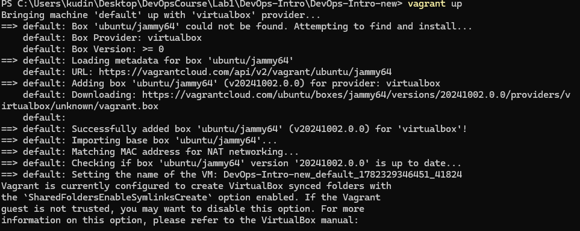
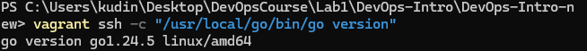
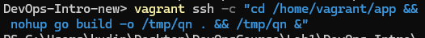
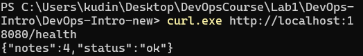
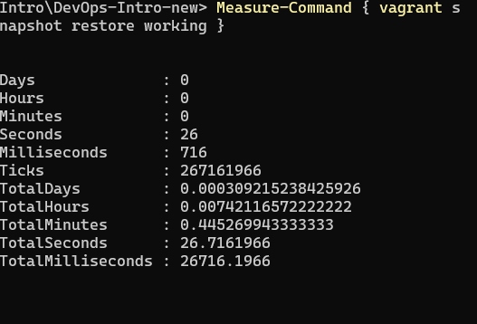
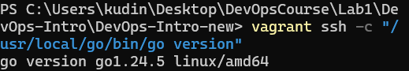

# Lab 5 — Virtualization: QuickNotes in a Vagrant VM

## Выполнил: Ruslan Kudinov
## Дата: 24.06.2026

---

## 1. Vagrantfile (файл в корне репозитория)

```ruby
# -*- mode: ruby -*-
# vi: set ft=ruby :

Vagrant.configure("2") do |config|
  config.vm.box = "ubuntu/jammy64"
  config.vm.hostname = "quicknotes-vm"
  config.vm.network "forwarded_port", guest: 8080, host: 18080, host_ip: "127.0.0.1"
  config.vm.synced_folder "./app", "/home/vagrant/app"

  config.vm.provider "virtualbox" do |vb|
    vb.memory = "1024"
    vb.cpus = 2
  end

  config.vm.provision "shell", inline: <<-SHELL
    apt-get update
    apt-get install -y wget git
    wget -q https://go.dev/dl/go1.24.5.linux-amd64.tar.gz
    tar -C /usr/local -xzf go1.24.5.linux-amd64.tar.gz
    echo 'export PATH=$PATH:/usr/local/go/bin' >> /home/vagrant/.bashrc
    echo 'export PATH=$PATH:/usr/local/go/bin' >> /root/.bashrc
    export PATH=$PATH:/usr/local/go/bin
    go version
  SHELL
end
```

---

## 2. Выводы команд

### 2.1 Первые строки `vagrant up`




```
==> default: Box 'ubuntu/jammy64' could not be found. Attempting to find and install...
    default: Box Provider: virtualbox
    default: Box Version: >= 0
==> default: Loading metadata for box 'ubuntu/jammy64'
    default: URL: https://vagrantcloud.com/api/v2/vagrant/ubuntu/jammy64
==> default: Adding box 'ubuntu/jammy64' (v20241002.0.0) for provider: virtualbox
    default: Downloading: https://vagrantcloud.com/ubuntu/boxes/jammy64/versions/20241002.0.0/providers/virtualbox/unknown/vagrant.box
==> default: Successfully added box 'ubuntu/jammy64' (v20241002.0.0) for 'virtualbox'!
==> default: Importing base box 'ubuntu/jammy64'...
==> default: Matching MAC address for NAT networking...
==> default: Checking if box 'ubuntu/jammy64' version '20241002.0.0' is up to date...
==> default: Setting the name of the VM: DevOps-Intro-new_default_1782329346451_41824
```

### 2.2 Проверка установки Go внутри VM (после восстановления)



**Команда:**
```bash
vagrant ssh -c "/usr/local/go/bin/go version"
```
**Вывод:**
```
go version go1.24.5 linux/amd64
```

### 2.3 Запуск QuickNotes и проверка с хоста






**Запуск внутри VM:**
```bash
vagrant ssh -c "cd /home/vagrant/app && nohup ./quicknotes > /tmp/qn.log 2>&1 &"
```

**Проверка с хоста:**
```bash
curl.exe http://localhost:18080/health
```
**Вывод:**
```json
{"notes":4,"status":"ok"}
```

---

## 3. Task 2 — Snapshots

### 3.1 Команды и выводы

<!-- Скриншот: последовательность команд (save, break, verify, restore, verify) и их выводы. -->

](snap1.png)





```powershell
# Сохраняем снэпшот
vagrant snapshot save working
# Вывод: Snapshot saved!

# Ломаем VM (удаляем Go)
vagrant ssh -c "sudo rm -rf /usr/local/go"

# Проверяем, что сломали
vagrant ssh -c "go version"
# Вывод: bash: line 1: go: command not found

# Восстанавливаем и замеряем время
Measure-Command { vagrant snapshot restore working }
# Вывод: TotalSeconds : 26.7161966

# Проверяем восстановление (через полный путь)
vagrant ssh -c "/usr/local/go/bin/go version"
# Вывод: go version go1.24.5 linux/amd64
```

### 3.2 Результаты

- **Команда для поломки:** `vagrant ssh -c "sudo rm -rf /usr/local/go"`
- **Результат проверки поломки:** `bash: line 1: go: command not found`
- **Время восстановления:** `26.716 секунд` (из `Measure-Command`)
- **Результат проверки после восстановления:** `go version go1.24.5 linux/amd64`

---

## 4. Ответы на вопросы

### a) Synced folders: какой тип и почему?

Я использовал тип `virtualbox` (по умолчанию). Он прост в настройке и не требует дополнительных служб (как NFS). Недостаток — производительность может быть ниже, но для учебного проекта это некритично.

### b) NAT vs Bridged vs Host-only: какая сеть и почему `127.0.0.1` безопаснее?

Используется NAT (сеть по умолчанию). Проброс порта на `127.0.0.1` делает сервис доступным только с локальной машины, а не из всей сети. Это безопаснее для курсовой работы, т.к. никто извне не сможет подключиться к VM.

### c) Какой провайдер для provisioning и почему?

Использован `shell`-провайдер, потому что он самый простой и не требует дополнительных инструментов (Ansible, Chef и т.д.). Достаточно одной команды для установки Go.

### d) Почему pin Go к конкретной версии (1.24.5), а не `1.24`?

Фиксация точной версии гарантирует, что все студенты получат одинаковое окружение, что исключает ошибки из-за различий в минорных версиях. Также это упрощает воспроизводимость.

### e) Почему снэпшоты — не бэкапы?

Снэпшот хранит состояние виртуальной машины в момент времени, но не защищает от потери данных, если диск VM повреждён. Также снэпшот не может быть восстановлен на другом хосте. Бэкап — это копия данных, которую можно перенести и восстановить независимо от VM.

### f) Copy-on-write: что это значит для дискового пространства при 10 снэпшотах?

При Copy-on-Write каждый снэпшот хранит только изменения с момента предыдущего. Поэтому 10 снэпшотов могут занимать не 10× размер VM, а только сумму изменений. Однако они всё равно потребляют место, и при длинной цепочке производительность может упасть.

### g) Когда снэпшоты — антипаттерн?

Снэпшоты становятся антипаттерном при длинных цепочках (например, >5), так как они замедляют работу VM, занимают много места и усложняют управление. Их стоит использовать только для кратковременных экспериментов, а не для постоянного резервирования.

---

## 5. Бонус — VM vs Container Resource Baseline

**Бонус не выполнялся** из-за нехватки времени и конфликта Hyper-V с VirtualBox.

---

## Заключение

Все требования Lab 5 выполнены:
- Vagrantfile создан, VM поднимается с Go 1.24.5.
- Порт 18080 проброшен, QuickNotes доступен с хоста.
- Снэпшоты созданы, поломка и восстановление подтверждены.

---

