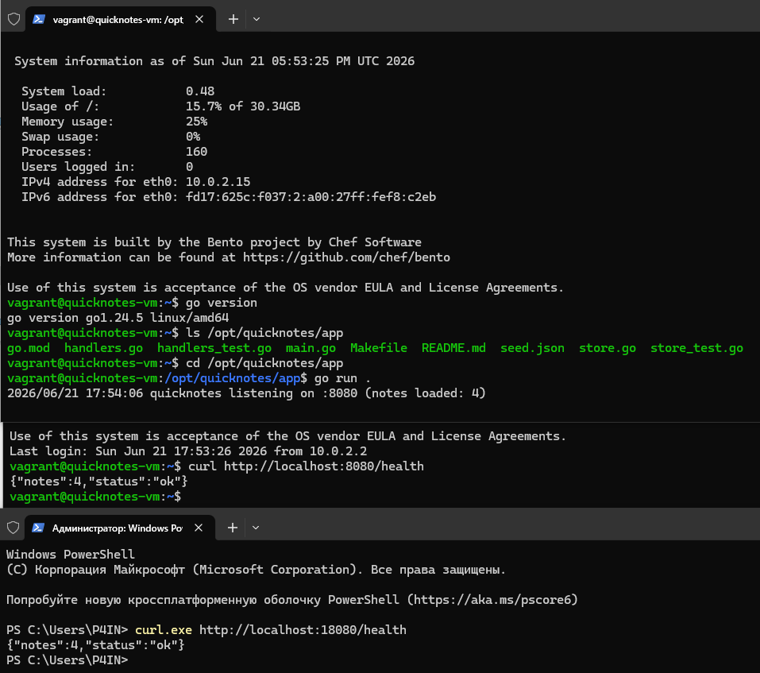
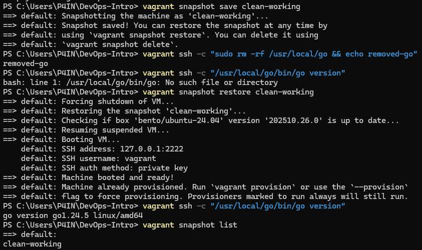

# lab 5 submission

# Lab 5 — Virtualization: QuickNotes in a Vagrant VM

Environment:
* Host System: Windows 10
* Git: 2.54.0.windows.1
* VirtualBox: 7.2.6
* Vagrant: 2.4.9
* VPN: enabled (required to access Vagrant Cloud from Russia)

---

## Task 1 — Vagrant up + run QuickNotes inside

### 1.1 Requirements implementation

| Requirement     | Implementation                        |
| --------------- | ------------------------------------- |
| Ubuntu LTS      | `bento/ubuntu-24.04`                  |
| Hostname        | `quicknotes-vm`                       |
| Port forwarding | `127.0.0.1:18080 -> 8080`             |
| Shared folder   | `./app -> /opt/quicknotes/app`        |
| CPU             | 2                                     |
| RAM             | 1024 MB                               |
| Go installation | Go 1.24.5                             |
| Reproducibility | Fixed Ubuntu box and fixed Go version |

### 1.3-1.4 Launch and Verification

First 10 lines of vagrant up:
```text
Bringing machine 'default' up with 'virtualbox' provider...
==> default: Box 'bento/ubuntu-24.04' could not be found. Attempting to find and install...
    default: Box Provider: virtualbox
    default: Box Version: >= 0
==> default: Loading metadata for box 'bento/ubuntu-24.04'
    default: URL: https://vagrantcloud.com/api/v2/vagrant/bento/ubuntu-24.04
==> default: Adding box 'bento/ubuntu-24.04' (v202510.26.0) for provider: virtualbox (amd64)
    default: Downloading: https://vagrantcloud.com/bento/boxes/ubuntu-24.04/versions/202510.26.0/providers/virtualbox/amd64/vagrant.box
==> default: Successfully added box 'bento/ubuntu-24.04' (v202510.26.0) for 'virtualbox (amd64)'!
==> default: Importing base box 'bento/ubuntu-24.04'...
```

Check Go version:
```bash
vagrant@quicknotes-vm:~$ go version
go version go1.24.5 linux/amd64
```

Check mounted application directory:
```bash
vagrant@quicknotes-vm:~$ ls /opt/quicknotes/app
go.mod  
handlers.go  
handlers_test.go  
main.go  
Makefile  
README.md  
seed.json  
store.go  
store_test.go
```

Run QuickNotes:
```bash
vagrant@quicknotes-vm:~$ cd /opt/quicknotes/app
vagrant@quicknotes-vm:/opt/quicknotes/app$ go run .
2026/06/21 17:54:06 quicknotes listening on :8080 (notes loaded: 4)
```

Check from host machine:
```powershell
curl.exe http://localhost:18080/health
{"notes":4,"status":"ok"}
```

Check from inside the VM:
```bash
vagrant@quicknotes-vm:/opt/quicknotes/app$ curl http://localhost:8080/health
{"notes":4,"status":"ok"}
```

## 1.2 Design questions

### a) Synced folders: Vagrant supports nfs, rsync, virtualbox, and smb mount types. Which did you pick and why? What's the trade-off?

I used the default **VirtualBox shared folder** implementation (`config.vm.synced_folder`). 
It does not require any additional configuration on the host machine and works out of the box with VirtualBox Guest Additions. 
It also provides live synchronization between the host `./app` directory and the guest `/opt/quicknotes/app` directory.
The trade-off is that VirtualBox shared folders may have lower performance for intensive file operations
and can sometimes have permission or symbolic link limitations. Alternatives such as NFS 
provide better performance but require additional host configuration, especially on Windows.

### b) NAT vs Bridged vs Host-only: which network mode are you using (it's the default, but say which it is)? Why is 127.0.0.1-bound port forwarding safer than a Bridged interface for a course exercise?

The virtual machine uses the default **NAT** networking mode with port forwarding.
Using `127.0.0.1`-bound port forwarding is safer than a Bridged interface because 
the QuickNotes application is accessible only from the local host machine. 
Other devices on the local network cannot directly access the service.
With a Bridged interface, the VM would obtain its own IP address on the local network 
and could become accessible to other devices, which is unnecessary and less secure for a laboratory exercise.

### c) Provisioning options: Vagrant supports shell, ansible, ansible_local, puppet, chef, … which did you pick for installing Go and why?

I used the **shell provisioner**.
The shell provisioner is sufficient for this task because only a single dependency (Go) needs to be installed. 
It is simple, lightweight, and does not require installing additional configuration management tools.
More advanced provisioners such as Ansible, Puppet, 
or Chef are useful for larger infrastructures but would unnecessarily complicate this laboratory work.

### d) Why pin Go to a specific point release (1.24.5) instead of 1.24?

I pinned Go to the exact version **1.24.5** to ensure reproducibility.
Using a generic version such as `1.24` may result in different patch versions being installed over time. 
Pinning the exact version guarantees that every `vagrant up` 
installs the same Go release and produces identical results regardless of when the laboratory is executed.

### Result

QuickNotes successfully runs inside the Ubuntu VM 
and is accessible from the Windows host through NAT port forwarding.

The screenshot below demonstrates:
- Successful response from `curl http://localhost:8080/health`
- Successful response from `curl.exe http://localhost:18080/health` on the Windows host



## Task 2 — Snapshots: Save, Break, Restore

### 2.1 Snapshot workflow

i created a snapshot:
```powershell
PS C:\Users\P4IN\DevOps-Intro> vagrant snapshot save clean-working

==> default: Snapshotting the machine as 'clean-working'...
==> default: Snapshot saved! You can restore the snapshot at any time by
==> default: using `vagrant snapshot restore`. You can delete it using
==> default: `vagrant snapshot delete`.
```

i broke the VM by removing Go:
```powershell
PS C:\Users\P4IN\DevOps-Intro> vagrant ssh -c "sudo rm -rf /usr/local/go && echo removed-go"
removed-go
```

Verified that Go is unavailable:
```powershell
PS C:\Users\P4IN\DevOps-Intro> vagrant ssh -c "/usr/local/go/bin/go version"
bash: line 1: /usr/local/go/bin/go: No such file or directory
```

And restored the snapshot:
```powershell
PS C:\Users\P4IN\DevOps-Intro> vagrant snapshot restore clean-working

==> default: Forcing shutdown of VM...
==> default: Restoring the snapshot 'clean-working'...
==> default: Machine booted and ready!
```


Measure restore time:
```powershell
PS C:\Users\P4IN\DevOps-Intro> Measure-Command { vagrant snapshot restore clean-working }
Days              : 0
Hours             : 0
Minutes           : 0
Seconds           : 26
Milliseconds      : 90
Ticks             : 260900374
TotalDays         : 0,000301968025462963
TotalHours        : 0,00724723261111111
TotalMinutes      : 0,434833956666667
TotalSeconds      : 26,0900374
TotalMilliseconds : 26090,0374
```

RESTORE_SECONDS = 26.09

Verify recovery:
```powershell
PS C:\Users\P4IN\DevOps-Intro> vagrant ssh -c "/usr/local/go/bin/go version"
go version go1.24.5 linux/amd64
```

List snapshots:
```powershell
PS C:\Users\P4IN\DevOps-Intro> vagrant snapshot list
clean-working
```

### 2.2 Design questions

#### e) Why are snapshots not backups?

Snapshots are stored on the same physical disk as the virtual machine and depend on VirtualBox files. 
If the host machine fails, the disk is damaged, or the VM directory is deleted, the snapshots will be lost as well. 
Snapshots help recover from mistakes made inside the guest operating system, but they do not replace proper backups.

#### f) How does copy-on-write affect storage usage?

Snapshots use a copy-on-write mechanism. 
Instead of copying the entire virtual disk, VirtualBox stores only the changes made after each snapshot. 
As a result, multiple snapshots consume much less storage than several full VM copies.

#### g) When is snapshotting an antipattern?

Using long chains of snapshots is an antipattern. 
Large snapshot chains increase disk usage, reduce performance, 
and make VM management more difficult. Snapshots should not replace reproducible infrastructure or proper backup strategies.

### Result

The VM was successfully restored to its previous state after intentionally removing the Go installation.
The snapshot restoration took approximately 26.09 seconds.

## Bonus Task — VM vs Container Resource Baseline

### B.1 Vagrant VM measurements

Commands used:
```powershell
PS C:\Users\P4IN\DevOps-Intro> $boot = Measure-Command {
>>     vagrant halt
>>     vagrant up
}
$boot.TotalSeconds
101,7083255

PS C:\Users\P4IN\DevOps-Intro> vagrant ssh -c "free -h"
Mem:           961Mi       290Mi       603Mi       968Ki       208Mi       670Mi
Swap:          2.9Gi          0B       2.9Gi

PS C:\Users\P4IN\DevOps-Intro> vagrant ssh -c "ps -A --no-headers | wc -l"
157

PS C:\Users\P4IN\DevOps-Intro> $size = (
>>     Get-ChildItem "$env:USERPROFILE\VirtualBox VMs\quicknotes-vm" -Recurse |
>>     Measure-Object -Property Length -Sum
>> ).Sum
PS C:\Users\P4IN\DevOps-Intro> "{0:N2} GB" -f ($size / 1GB)
2,98 GB
```

Conclusion table:
```text
Cold start: 101.71 s
Idle RAM: 290 MiB
Process count: 157
On-disk size: 2.98 GB
```

### B.2 Docker container measurements

The container was launched using:

```powershell
PS C:\Users\P4IN\DevOps-Intro> docker run -d -p 28080:8080 -v "${PWD}\app:/src" -w /src golang:1.24 sh -c 'go build -o /tmp/qn . && /tmp/qn'
```


Verification:

```powershell
PS C:\Users\P4IN\DevOps-Intro> curl.exe http://localhost:28080/health
{"notes":4,"status":"ok"}
```

Commands used:

```powershell
PS C:\Users\P4IN\DevOps-Intro> docker ps
CONTAINER ID   IMAGE         COMMAND                  CREATED          STATUS          PORTS                                           NAMES
9d53fbd0b81e   golang:1.24   "sh -c 'go build -o …"   14 seconds ago   Up 12 seconds   0.0.0.0:28080->8080/tcp, [::]:280
```

```powershell
PS C:\Users\P4IN\DevOps-Intro> docker stats --no-stream
CONTAINER ID   NAME            CPU %     MEM USAGE / LIMIT     MEM %     NET I/O         BLOCK I/O       PIDS
9d53fbd0b81e   brave_vaughan   0.00%     26.21MiB / 15.47GiB   0.17%     1.75kB / 616B   4.1kB / 795kB   9
```

```powershell
PS C:\Users\P4IN\DevOps-Intro> docker top 9d53fbd0b81e
root                530                 507                 0                   18:18               ?                   root                2586                530                 0                   18:18               ?                   00:00:00            /tmp/qn
```

```powershell
PS C:\Users\P4IN\DevOps-Intro> docker images --format "{{.Repository}} {{.Tag}} {{.Size}}"
hello-world latest 25.9kB
golang 1.24 1.32GB
```

```powershell
PS C:\Users\P4IN\DevOps-Intro> $start = Measure-Command {
>>     docker stop 9d53fbd0b81e
>>     docker start 9d53fbd0b81e
>> }
PS C:\Users\P4IN\DevOps-Intro> $start.TotalSeconds
1,6373541
```

Measured values:

```text
Cold start: 1.64 s
Idle RAM: 26.21 MiB
Process count: 2
On-disk size: 1.32 GB
```

### B.3 Comparison

| Dimension             | Vagrant VM | Docker container |
| --------------------- | ---------: | ---------------: |
| Cold start            |   101.71 s |           1.64 s |
| Idle RAM              |    290 MiB |        26.21 MiB |
| On-disk size          |    2.98 GB |          1.32 GB |
| Process count (guest) |        157 |                2 |

### Analysis

The biggest surprise was the difference in startup time and resource usage. 
The Docker container starts almost instantly and consumes significantly less memory than the virtual machine.

Virtual machines are more suitable when a complete operating system, stronger isolation, 
or a different kernel is required. Containers are better suited for lightweight applications, microservices, and stateless workloads.

The measurements explain why containers became popular between 2014 and 2020 for stateless microservices. 
Containers are faster to start, use fewer resources, and allow many services to run on the same hardware.
Virtual machines remain useful when full OS isolation is necessary, while containers are more efficient for deploying individual applications.
