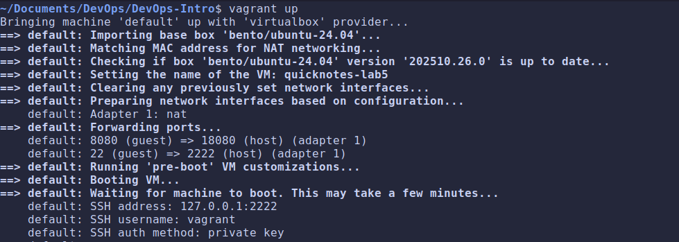
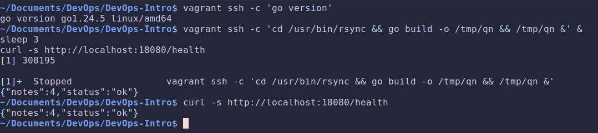

# Lab 5 submission

## Task 1: Vagrant Up + Run QuickNotes Inside

- [**Vagrant File**](https://sre.google/books/)

- **First 10 output lines:**

    

- **`curl` output:**

    

- **Design questions:**

  - **Vagrant supports nfs, rsync, virtualbox, and smb mount types. Which did you pick and why? What's the trade-off?**

    I used the default `virtualbox` shared folder. It's bidirectional and host edits appear in the guest instantly, needs no extra host tooling. The trade-off: VirtualBox shared folders have slower I/O than native disk and depend on Guest Additions matching the kernel. `rsync` would be faster to read inside the guest but is a one-way, point-in-time copy and host changes don't propagate until `vagrant rsync`, which is wrong for an edit-rebuild loop. `nfs`/`smb` are faster for large trees but add a daemon and a `sudo` host dependency, overkill for one small `app/` folder.

  - **Which network mode are you using (it's the default, but say which it is)? Why is 127.0.0.1-bound port forwarding safer than a Bridged interface for a course exercise?**

    The default is `NAT` with port forwarding. `127.0.0.1`-bound forwarding is safer than a Bridged interface because the guest port is reachable only from the host, nothing on the LAN/Wi-Fi can reach it. A Bridged interface puts the VM directly on the physical network with its own IP, exposing QuickNotes (which has no auth) to every device on the network.

  - **Vagrant supports shell, ansible, ansible_local, puppet, chef, … which did you pick for installing Go and why?**

    I used the `shell` provisioner. Installing go and writing one systemd unit is a handful of commands but using Ansible/Puppet/Chef would be an over kill for this simple app.

  - **Why pin Go to a specific point release (1.24.5) instead of 1.24?**

    `1.24` is a floating minor that resolves to whatever the latest patch is *the day we provision* two students (or the same student next month) could get different compilers, so builds aren't reproducible and a regression in a new patch
    could silently break the VM. Pinning the exact point release `1.24.5` makes `vagrant up` deterministic.

## Task 2: Save, Break, Restore