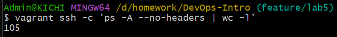
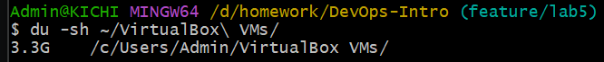
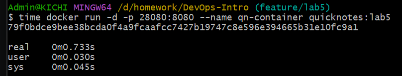
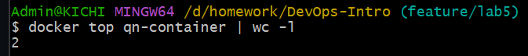
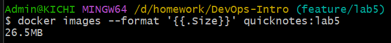

# 5 lab

Frolova AI, M25RO-01

a.frolova@innopolis.university

## Task1 - Vagrant Up + Run QuickNotes Inside

### Vagrantfile

Ссылка на файл: 

### Скриншоты

1. vagrant ssh

2. go version

3. внутри виртуалки:

4. c хоста:

вместо `vagrant ssh -c 'cd /path/to/synced/app && go build -o /tmp/qn && /tmp/qn &' &` запустила внутри виртуальной машины `go run .`

### Фрагмент vagrant up: 

### Ответы на вопросы

> Q: Синхронизированные папки: Vagrant поддерживает типы монтирования nfs, rsync, virtualbox и smb . Какой из них вы выбрали и почему? В чем компромисс?
> A: Мной был выбран virtualbox, потому что на win он работает из коробки без дополнительных настроек. Другие типы монтирования требуют дополнительных заморочек в настройке и запуске.

---

> Q: NAT, Bridged или Host-only: какой сетевой режим вы используете (по умолчанию используется Bridged, но укажите, какой именно)? Почему переадресация портов 127.0.0.1-bound безопаснее, чем использование интерфейса Bridged для выполнения задания?
> A: Я использовала режим NAT, который позволяет хосту не видеть виртуальную машину напрямую, но при этом осуществлять связь. Переадресация портов 127.0.0.1-bound безопаснее, так как 127.0.0.1 - это локальный адрес, то есть сервер доступен только с этого компьютера, а не всей сети, и как раз это исключает какой-либо доступ извне. Bridgе (мост) это связь напрямую между двумя хостами.

---

> Q: Варианты подготовки: Vagrant поддерживает shell, ansible, ansible_local, puppet, chef, … какой из них вы выбрали для установки Go и почему?
> A: я выбрала shell, так как, опять же, это один из самых простых вариантов для меня. Я описала в vagrantfile все, что нужно скачать и установить, что заняло всего несколько строчек кода, без необходимости создавать дополнительные файлы или погружаться в изучение новых языков.

---

> Q: Почему Go привязан к конкретной версии (1.24.5) вместо 1.24?
> A: Ссылаться на конкретную версию - более надежный вариант, исключающий ситуацию, когда версия обновилась, и окружение уже не будет таким же, как и до этого, хотя настройки были практически идентичные. Это гарантия того, что мой код заработает у другого человека, а также избавляет от багов из-за конфликтов версий.

## Task2 - Vagrant Up + Run QuickNotes Inside

### 2.1 Ломаем и восстанавливаем VM

1. VM работает (`vagrant status`):

2. Делаем snapshot (`vagrant snapshot save working`):

3. Ломаем VM (`vagrant ssh -c 'sudo rm -rf /usr/local/go'`):

4. Проверяем, что не работает (`vagrant ssh -c 'go version'`):

5. Восстанавливаю из snapshot (`vagrant snapshot restore working`):

6. Проверяю, что работает.

### 2.3 Вопросы

> Q: Снимки состояния не являются резервными копиями. Объясните в 2–3 предложениях, почему снимки состояния бесполезны при сбоях.
> A: Snapshot фиксирует состояние системы в момент времени и хранится на том же диске, что и сама система. Если случится такое, что диск повредится, или виртуальная машина будет случайно удалена, снимок так же удалится, и восстановить машину не удастся.

---

> Q: Копирование при записи: в VirtualBox снимки состояния в Vagrant создаются с копированием при записи. Что это значит с точки зрения использования диска, если вы делаете 10 снимков состояния вместо одного?
> A: Новый снимок сохраняет только изменения относительно предыдущей версии системы, но не полную ее копию. Если мы делаем 10 снимков состояний, это займет конечно гораздо меньше места, чем полная копия состояния системы, но все еще больше, чем сгтмлк одного состояния.

---

> Q: В каких случаях создание снимков состояния является антипаттерном? (Подсказка: длинные цепочки.)
> A: Snapshot является антипаттерном, так как длинные цепочки (такими можно считать уже длиной более трёх), во первых, занимают много пространстваю, что сильно замедляет работу и увеличивает время восстановления. К тому же, если один снимок в цепочке повредится, то можно считать поврежденной всю цепочку, и она будет непригодна для использования. Поэтому лучше все же делать нормальные бекапы.

## Bonus

## 1 Часть - запуск Virtual Box

### 1.1 Время холодной загрузки

### 1.2 Оперативная память VM в простое

### 1.3 Количество процессов

### 1.4 Объем памяти

## 2 Часть - Docker

### 2.1 Время загрузки

### 2.2 RAM 

### 2.3 Количество процессов

### 2.4 Размер образа

---

## Сравнительная таблица

| Dimension | Vagrant VM | Docker container |
|-----------|-----------|------------------|
| Cold start | 5m17s | 0.733s |
| Idle RAM | 163Mi | 2.734MiB |
| On-disk size | 3.3G | 26.5MB |
| Process count | 105 | 2 |

## Ответы на вопросы

> Q: Какие цифры вас удивили?
> A: Меня сильно удивила разница во времени запуска, Vagrant поднимался очень долго, в сравнении с Docker. По сравнительной таблице видно, что Docker оказался лучше по показателям, однако, учитывая, сколько времени я потратила на то, чтобы устранить ошибки docker, wsl и ubuntu (которые не устанавливались, пока я не перебрала кучу системных настроек), работа с Vagrant VM была менее болезненной.

---

> Q: Для каких рабочих нагрузок подходит та или иная модель?
> A: VM подходит для тяжелых приложений по типу баз данных, систем с жесткими требованиями к изоляции, а также приложений, которым нужно свое ядро или какие-то особенные драйверы. Контейнеры хорошо подойдут для микросервисов, CI-CD пайплайнов, которые должны запускаться за секунды (а мы уже увидели, что docker выигрывает)

---

> Q: Что говорят эти данные о том, почему в эпоху 2014–2020 годов контейнеры стали лучшим решением для микросервисов без сохранения состояния?
> A: Ключевое преимущество контейнеров в том, что они легче, быстрее и экономичнее. В эпоху микросервисов и облачных платформ скорость развёртывания и масштабирования стала критически важной. Контейнеры позволяют запускать сотни экземпляров приложения на одном хосте, тогда как VM в этом проигрывают. Именно эта эффективность сделала контейнеры стандартом для stateless приложений.