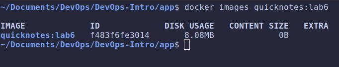
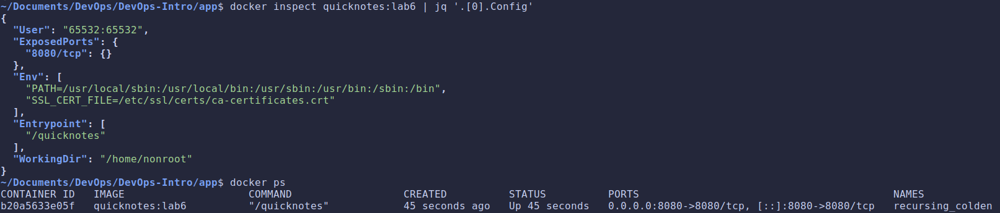
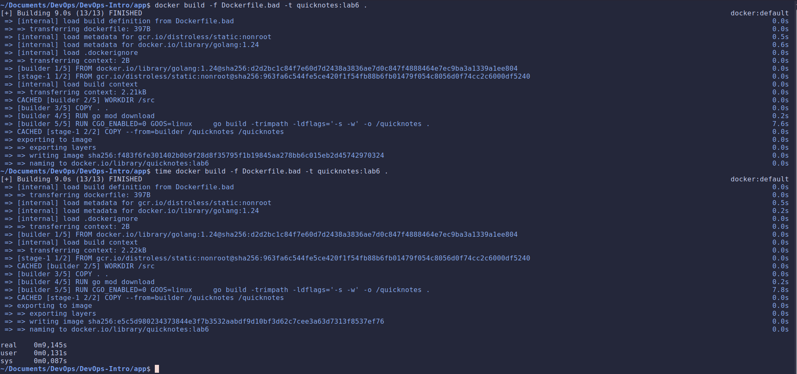
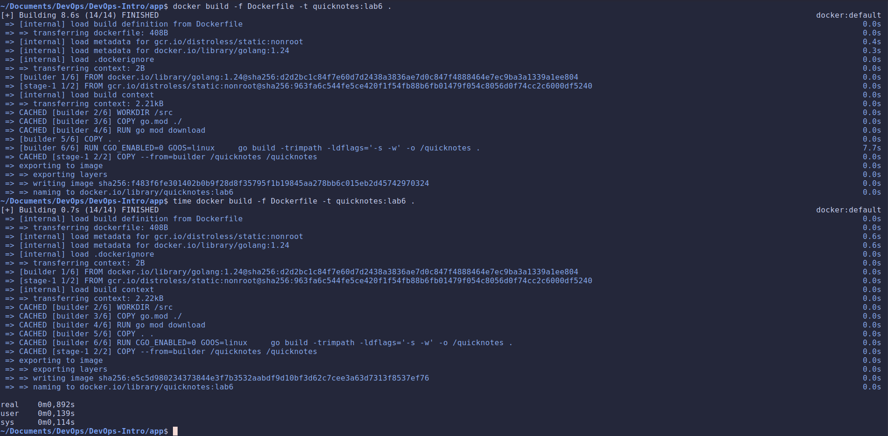
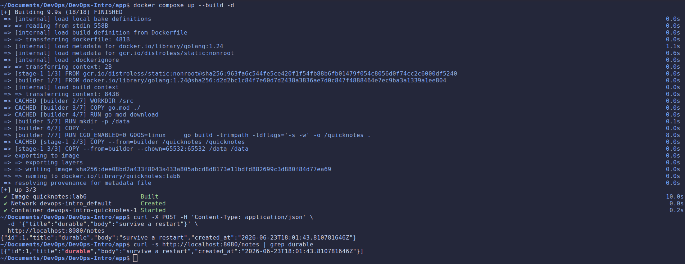
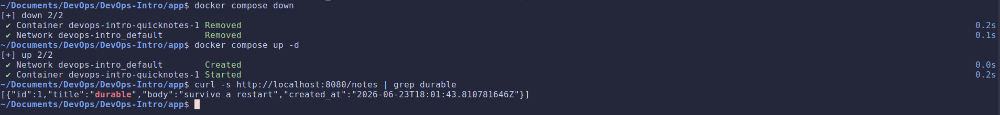
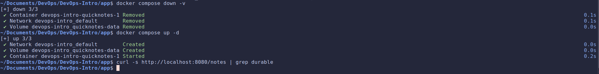

# Lab 6 submission

## Task 1: Multi-Stage Dockerfile

- [**Docker Image**](https://github.com/sparrow12345/DevOps-Intro/blob/feature/lab6/app/Dockerfile)

- **`docker images quicknotes:lab6` output and image size:**

    

- **`docker inspect` output:**

    

- **Design questions:**

  - **Why does layer-order matter?**

    Docker caches each instruction's layer, keyed on the instruction plus the files it touches. If a layer's inputs change, that layer and every layer after it are rebuilt.

    - With the bad ordering `COPY . .` touches all source.
    Any code edit invalidates that layer, so `go mod download` re-runs and re-downloads modules on every rebuild.
        

    - With well ordered version the download layer depends only on `go.mod`/`go.sum`. Editing source invalidates only the layers from `COPY . .`.
        

  - **Why `CGO_ENABLED=0`? What happens in distroless-static if you forget it?**

    With cgo enabled, go may link against the system C library. That produces a dynamically linked binary. `distroless/static` doesn't have such dependencies, and the binary will fail to start because it's missing C libraries that the system doesn't have.

  - **What is `gcr.io/distroless/static:nonroot`? What's in it, what isn't, and why does that matter for CVEs?**

    A minimal docker image that contains the bare minimum of what we need to run our app. It doesn't contain a shell, package manager or any other program that we might find in other distros. This reduces the attack surface on our service and the number of possible CVEs we might get on our service.

  - **`-ldflags='-s -w'` and `-trimpath`: what does each flag do, and what's the cost?**

    - `-s` strips the symbol table and debug info, `-w` strips DWARF table, together they reduce the binary size.
    - `-trimpath` remove all file system paths from the resulting executable, so builds are reproducible and don't leak your directory layout.

    These flags are useful for production builds, but they make debugging harder.

## Task 2: Compose + Healthcheck + Persistent Volume

- [**Docker Compose**](https://github.com/sparrow12345/DevOps-Intro/blob/feature/lab6/compose.yaml)

- **3-Steps Persistence:**

  - Note present:
    

  - Note present after `docker compose down`:
    

  - Note absent after `docker compose down -v`:
    

- **Design questions:**
  - **Distroless has no shell. How do you healthcheck it?**

    You can't use shell commands like `curl` or `wget` because distroless images don't have them. We can add a subcommand to our binary that performs an internal HTTP request to `/health` and with that we can check the health of our application without needing any external tools to do so.

  - **Why does `volumes: [quicknotes-data:/data]` survive `docker compose down`?**

    A named volume is a docker object managed by docker that doesn't get affected by the existence or absence of a container. It lives on the host machine and is not deleted when the container is removed unless we explicitly do so. This allows us to have persistent data that survives container restarts and recreations.

  - **`depends_on` without `condition: service_healthy` — what does it actually wait for? What's the bug it can cause?**

    `depends_on` without `condition: service_healthy` only waits for the container to start, not for the service to be ready. This can cause a bug where the dependent service tries to connect to the service before it's ready, leading to connection errors or failed requests.
