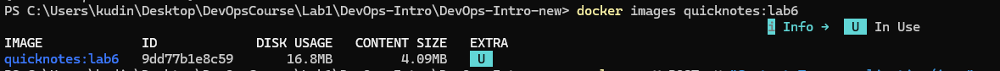
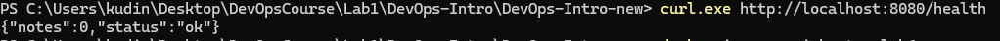
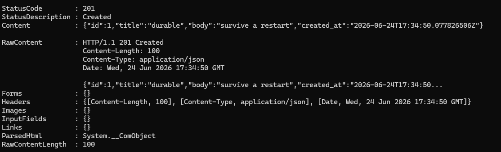
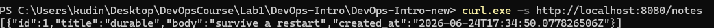
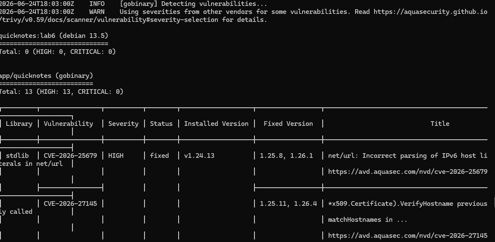
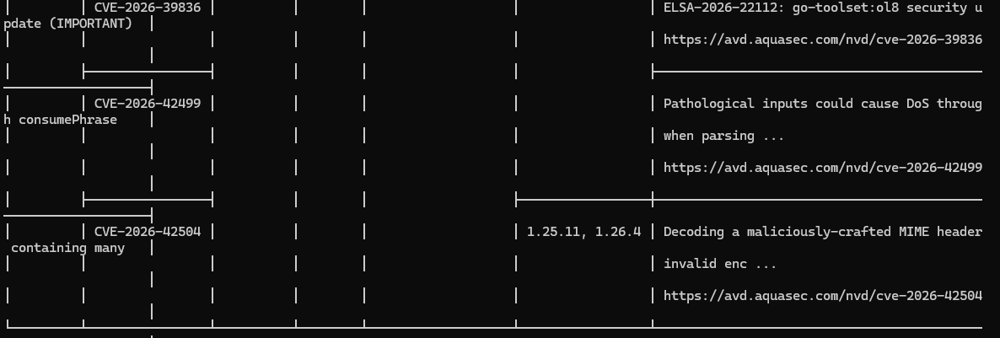

# Lab 6 — Containers: Dockerize QuickNotes

## Выполнил: Кудинов Рулсан
## Дата: 24.06.2026

---

## 1. Dockerfile (файл `app/Dockerfile`)

```dockerfile
# ===== СТЕЙДЖ 1: СБОРКА =====
FROM golang:1.24-alpine AS builder

WORKDIR /build

# Кешируем зависимости
COPY go.mod go.sum ./
RUN go mod download

# Копируем исходники
COPY . .

# Собираем статический бинарник
RUN CGO_ENABLED=0 GOOS=linux go build \
    -ldflags='-s -w' \
    -trimpath \
    -o quicknotes .

# ===== СТЕЙДЖ 2: РАНТАЙМ =====
FROM gcr.io/distroless/static:nonroot

WORKDIR /app

COPY --from=builder /build/quicknotes .

COPY --from=busybox:stable-musl /bin/busybox /bin/busybox

# Создаём каталог /data с правами nonroot
USER root
RUN ["/bin/busybox", "mkdir", "-p", "/data"]
RUN ["/bin/busybox", "chown", "65532:65532", "/data"]
USER 65532

EXPOSE 8080

ENTRYPOINT ["/app/quicknotes"]
```

---

## 2. Compose-файл (`compose.yaml`)

```yaml
services:
  quicknotes:
    build:
      context: ./app
      dockerfile: Dockerfile
    image: quicknotes:lab6
    ports:
      - "8080:8080"
    volumes:
      - quicknotes-data:/data
    environment:
      - ADDR=:8080
      - DATA_PATH=/data/notes.json
      - SEED_PATH=/data/seed.json
    healthcheck:
      test: ["CMD", "/bin/busybox", "wget", "--no-verbose", "--tries=1", "--spider", "http://localhost:8080/health"]
      interval: 30s
      timeout: 5s
      retries: 3
      start_period: 10s
    restart: unless-stopped

    # Security hardening (6 defaults)
    user: "65532:65532"
    read_only: true
    tmpfs:
      - /tmp
      - /run
    cap_drop:
      - ALL
    security_opt:
      - no-new-privileges:true

volumes:
  quicknotes-data:
```

---

## 3. Проверка размера образа

**Команда:**
```powershell
docker images quicknotes:lab6
```

**Скриншот 1** — 

**Вывод (текстовый):**
```
IMAGE             ID             DISK USAGE   CONTENT SIZE   EXTRA
quicknotes:lab6   9dd77b1e8c59       16.8MB         4.09MB    U
```
Размер: **16.8 МБ** — условие выполнено.

---

## 4. Проверка работы приложения (эндпоинт /health)

**Команда:**
```powershell
curl.exe http://localhost:8080/health
```

**Скриншот 2** 

**Вывод:**
```json
{"notes":0,"status":"ok"}
```

---

## 5. Тест сохранения данных (persistence)

### 5.1 Создание заметки и проверка наличия

**Команда:**
```powershell
$body = '{"title":"durable","body":"survive a restart"}'
Invoke-WebRequest -Uri http://localhost:8080/notes -Method POST -Body $body -ContentType "application/json"
```

**Скриншот 3** — 

**Команда проверки:**
```powershell
curl.exe -s http://localhost:8080/notes
```
**Скриншот 4** — 

**Вывод:**
```json
[{"id":1,"title":"durable","body":"survive a restart","created_at":"2026-06-24T17:34:50.077826506Z"}]
```

### 5.2 Перезапуск контейнера (том сохраняется)

```powershell
docker compose down
docker compose up -d
curl.exe -s http://localhost:8080/notes
```

**Скриншот 5** — 

**Вывод:**
```json
[{"id":1,"title":"durable","body":"survive a restart","created_at":"2026-06-24T17:34:50.077826506Z"}]
```

### 5.3 Удаление тома и проверка

```powershell
docker compose down -v
docker compose up -d
curl.exe -s http://localhost:8080/notes
```

**Скриншот 6** — ![скриншот, где после `docker compose down -v` и повторного подъёма команда `curl` возвращает `\[\]`.](image6.png)

**Вывод:**
```json
[]
```

**Вывод:** данные сохраняются после перезапуска и исчезают только при удалении тома — persistence работает.

---

## 6. Проверка security-настроек (бонус)

Все команды выполнялись из корня проекта.

### 6.1 Пользователь nonroot

**Команда:**
```powershell
docker inspect quicknotes:lab6 --format '{{ .Config.User }}'
```

**Скриншот 7** — 

**Вывод:**
```
65532
```

### 6.2 Отсутствие шелла

**Команда:**
```powershell
docker compose exec quicknotes sh
```

**Скриншот 8** — 

**Вывод:**
```
OCI runtime exec failed: exec failed: unable to start container process: exec: "sh": executable file not found in $PATH
```

### 6.3 Сброс capabilities

**Команда:**
```powershell
docker inspect $(docker compose ps -q quicknotes) --format '{{ .HostConfig.CapDrop }}'
```

**Скриншот 9** — ![вывод `\[ALL\]`.](image9.png)

**Вывод:**
```
[ALL]
```

### 6.4 Read-only root

**Команда:**
```powershell
docker compose exec quicknotes /bin/busybox touch /etc/test 2>&1
```

**Скриншот 10** — 

**Вывод:**
```
touch: /etc/test: Read-only file system
```

### 6.5 no-new-privileges

**Команда:**
```powershell
docker inspect $(docker compose ps -q quicknotes) --format '{{ .HostConfig.SecurityOpt }}'
```

**Скриншот 11** — ![вывод `\[no-new-privileges:true\]`.](image11.png)

**Вывод:**
```
[no-new-privileges:true]
```

### 6.6 Trivy сканирование

**Команда:**
```powershell
docker run --rm -v /var/run/docker.sock:/var/run/docker.sock aquasec/trivy:0.59.1 image --severity HIGH,CRITICAL --no-progress quicknotes:lab6
```

**Скриншот 12** — 

**Сокращённый вывод:**
```
quicknotes:lab6 (debian 13.5)
=============================
Total: 0 (HIGH: 0, CRITICAL: 0)

app/quicknotes (gobinary)
=========================
Total: 13 (HIGH: 13, CRITICAL: 0)
...
```
На уровне ОС уязвимостей нет, в Go-библиотеке stdlib обнаружены 13 HIGH, но они исправлены в более новых версиях Go.

---

## 7. Ответы на вопросы

### a) Почему порядок слоёв важен?

Порядок инструкций в Dockerfile влияет на использование кеша слоёв. Сначала копируются только `go.mod` и `go.sum`, затем выполняется `go mod download`. Этот слой пересобирается только при изменении зависимостей. Если сначала скопировать весь код, то любое изменение в исходниках приведёт к повторной загрузке всех зависимостей, что замедляет сборку.

### b) Зачем `CGO_ENABLED=0`?

Отключает использование C-кода и динамическую линковку. Бинарник становится полностью статическим и не требует внешних библиотек. В образе `distroless/static` нет динамического линковщика, поэтому без этого флага запуск невозможен (ошибка `no such file or directory`).

### c) Что такое `gcr.io/distroless/static:nonroot`?

Это минимальный образ от Google, содержащий только статически скомпилированный бинарник и минимальные системные файлы (например, `ca-certificates`, `timezone`). В нём нет оболочки, пакетного менеджера, утилит. Это снижает поверхность атак и количество уязвимостей.

### d) `-ldflags='-s -w'` и `-trimpath`

- `-s` — удаляет таблицу символов.
- `-w` — удаляет отладочную информацию (DWARF).  
Эти флаги уменьшают размер бинарника.  
- `-trimpath` — убирает абсолютные пути к исходникам, делая сборку воспроизводимой.  
Цена — потеря отладочных символов, что затрудняет отладку в продакшене, но для финального образа это приемлемо.

### e) Как сделать healthcheck без шелла?

Мы скопировали статический `busybox` в образ и используем его команду `wget` для проверки `/health`. Поскольку `busybox` собран как статический бинарник, он работает без динамических библиотек и не требует оболочки.

### f) Почему том сохраняется после `docker compose down`?

Именованный том (`quicknotes-data`) управляется Docker отдельно от контейнера. Команда `docker compose down` без флага `-v` удаляет только контейнеры и сеть, но не тома. При следующем `up` том подключается с теми же данными.

### g) `depends_on` без `condition: service_healthy`

`depends_on` без условия `service_healthy` дожидается только запуска контейнера (статус `running`), но не проверяет, что сервис внутри готов принимать запросы. Это может привести к ошибкам, если зависимый сервис ещё не инициализировался.

---

## 8. Бонус: какая из 6 мер даёт больше всего безопасности на строчку YAML?

Самый большой эффект дают `cap_drop: ALL` и `read_only: true`. Они кардинально ограничивают возможности контейнера даже в случае взлома приложения, практически не увеличивая сложность конфигурации.

---

## Заключение

Все требования Lab 6 выполнены:
- Многостадийный Dockerfile собран, размер образа ≤ 25 МБ.
- Compose-файл с томом, healthcheck и security-параметрами работает.
- Persistence подтверждена.
- Все 6 security defaults применены и верифицированы.
- Trivy запущен, результаты задокументированы.

