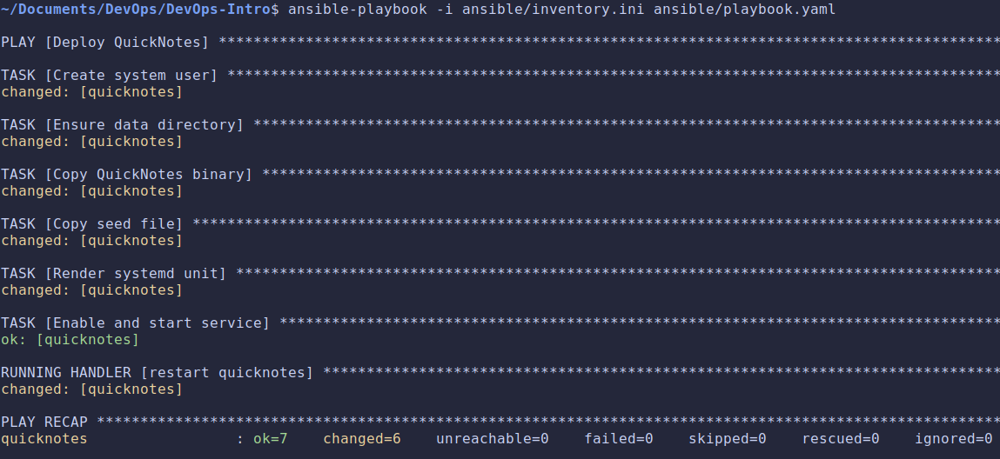
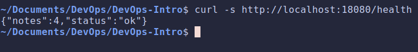
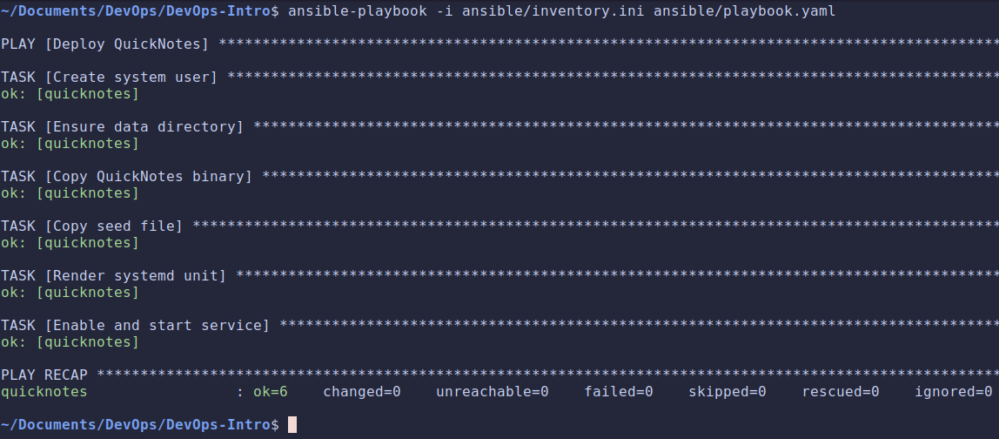
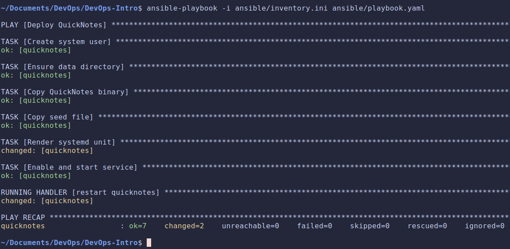
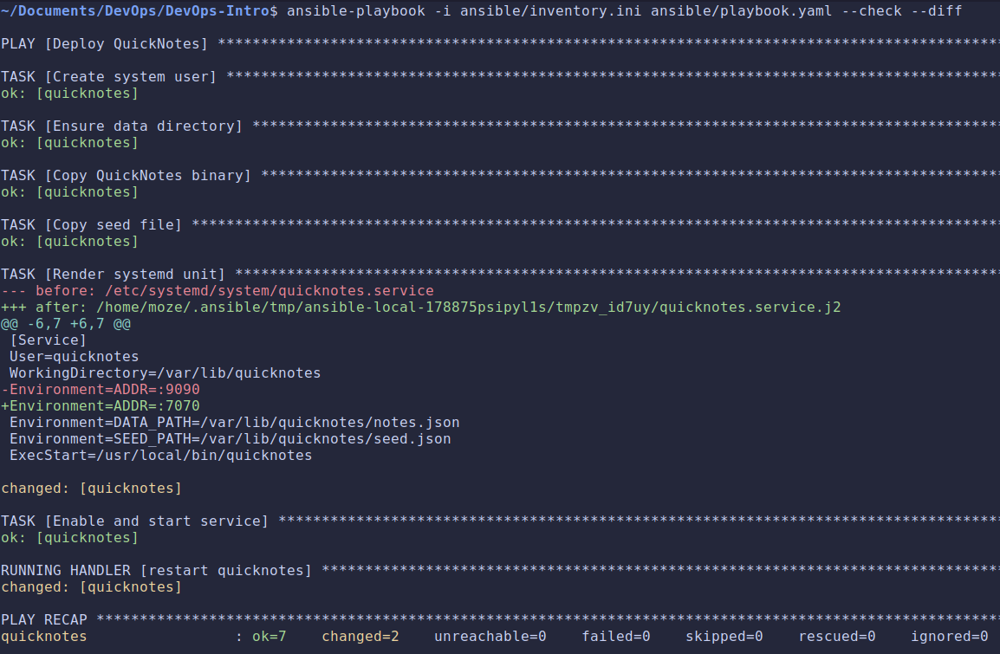

# Lab 7 submission

## Task 1: Idempotent Deploy to the Lab 5 VM

### `playbook.yml` & `inventory.ini`

- [**playbook.yml**](https://github.com/sparrow12345/DevOps-Intro/blob/feature/lab7/ansible/playbook.yaml)
- [**inventory.ini**](https://github.com/sparrow12345/DevOps-Intro/blob/feature/lab7/ansible/inventory.ini)

### First run

### Curl output

### Design questions

- **What's the difference between command: and the dedicated modules (`apt`, `file`, `copy`, `systemd`)? Which is idempotent, and why does it matter?**

    `command`: just execute a literal string on the host. Ansible has no model of what the `command` means, so it can't tell whether the desired state already holds.
    The dedicated modules are declarative, we describe the target state and the module first inspects the current state, then acts only if there's drift. That makes them idempotent, running them N times leaves the same result as running once, and they report changed only on the run that actually altered something.
    It matters because idempotency is what lets us re-run the whole playbook safely. With `command`: everything looks changed every run.

- **`notify`: and handlers: when does a handler fire? When does it not fire? Why is that the right default?**

    A handler fires only when a task that notify it reports changed, and it runs once, no matter how many tasks notified it. It does not fire when the notifying task is ok (no change), nor in `--check` mode, nor if the play aborts before the handler flush.
    It's the right default because handlers represent reactions to change, we don't want to bounce the service on every run; we only want the disruptive action when something it depends on actually moved.

- **Variable hierarchy: Ansible has at least 22 levels of variable precedence. List the top 3 places you'd put a variable for this lab (defaults, group_vars, playbook vars, …) and why?**

  - Playbook `vars`: Where we put `app_user`, `data_dir`, `bin_path`, `listen_addr`. Highest-visibility, single-file, and easy to tweak. Right for our lab.
  - `group_vars/lab5.yml`: Values that belong to the target group rather than the play. If we later targeted staging vs prod with the same playbook, the per-environment `listen_addr` or paths would live here, keeping the playbook generic.
  - `defaults`:  They sit at the bottom of precedence so anything above (group_vars, play vars) can override them.

- **`gather_facts: true` is the default. Do you need it for this playbook? What does turning it off save you per run?**

    No, the playbook references no ansible_* facts, every value is an explicit variable, and module behavior (`user`, `file`, `copy`, `template`, `systemd`) doesn't depend on gathered facts. So we set `gather_facts: false`.
    Turning it off skips the setup task that runs at the start against the host, an extra SSH round-trip plus the cost of enumerating hardware/network/OS facts on the VM every single run.

## Task 2: Prove Idempotency + Selective Re-run

### Second run

### Changes made

### `--check --diff`

### Design questions

- **Why does the second run report `changed=0`? What specifically does the `file` / `template` module check to decide?**

  Because nothing changed, so every module finds the host already in the desired state and reports ok.

  - `file` compares the requested attributes against the inode: does the path exist, is it the right state (directory), and do `owner`/`group`/`mode` match? On run 2 the dir already exists as `quicknotes:quicknotes 0750`, so `ok`, no change.
  - `template` renders the Jinja source in memory, computes its checksum (SHA-1), and compares against the checksum of the file already on the host; it also resolves owner/group/mode. Identical render + identical metadata, no write `ok`.
  - `copy` does the same checksum comparison between the local source and the remote file.

  Since no task reports changed, the `restart quicknotes` handler is never notified, no restart. That's the whole `changed=0`result.

- **What would happen if you used `shell: 'echo "ADDR=..." > /etc/systemd/system/quicknotes.service'` instead of the `template`: module? Trace the failure modes**

  - **Never idempotent:** `shell` runs unconditionally and reports `changed` every run, the handler restarts the service on every play, no `changed=0`.
  - **No drift detection / no diff:** Can't compare desired vs actual, so `--check` and `--diff` are meaningless.
  - **Non-atomic write:** `>` truncates the file then writes. If the command is interrupted, systemd is left with a corrupt unit.
  - **No ownership/mode management:** We'd separately need `chmod`/`chown`.
  - **Quoting:** Embedding a multi-line unit with `Environment`, ports, and variables inside a shell string is a lot harder to work with, and might cause a lot of problems.

- **`ansible-playbook --check` is dry-run. `--diff` shows changes. What's the bug you'd catch by running `--check --diff` before a production deploy that you'd miss with plain `--check`?**

    Plain `--check` tells us that a file would change (`changed=1`), but not what would change. `--diff` prints the actual change that happened.
    The bug we catch: a wrong value or a typo in one of the lines.
