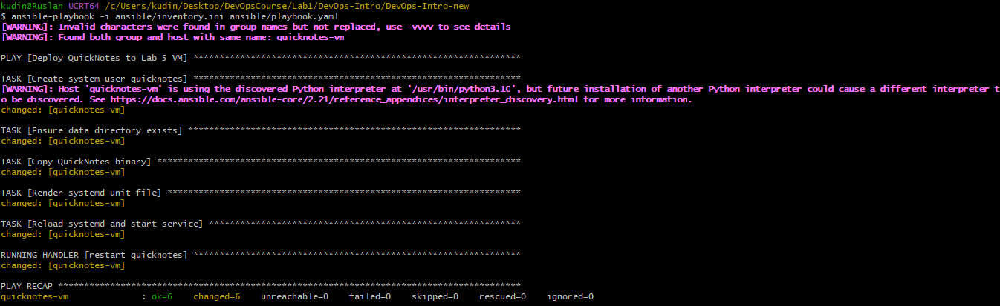
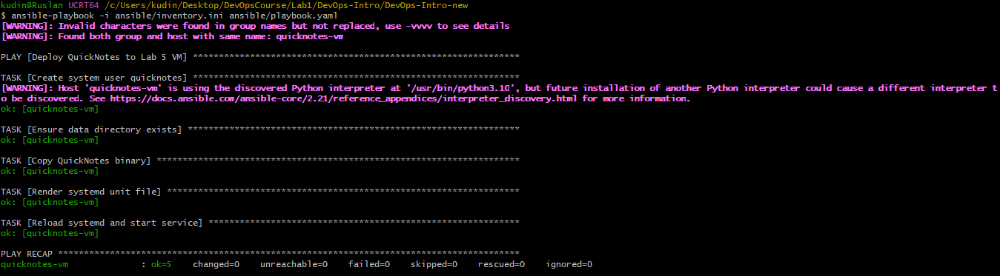
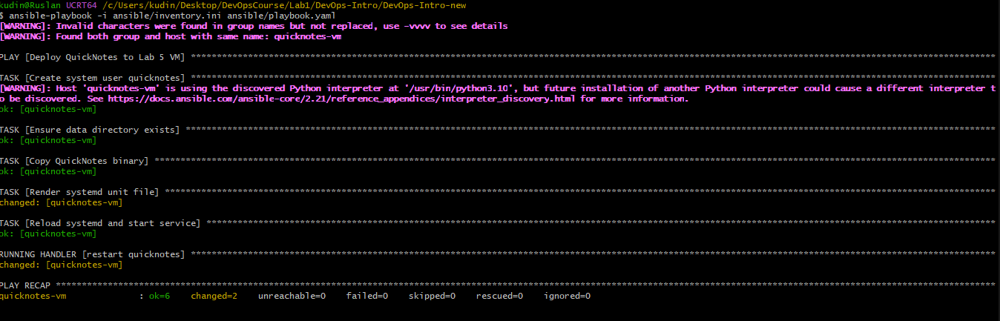
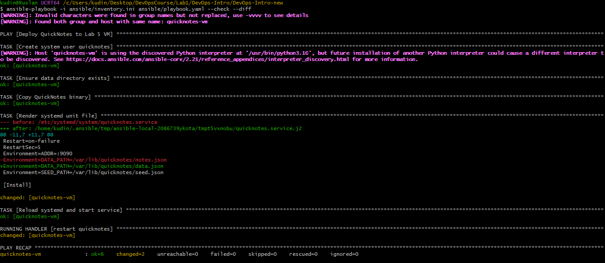
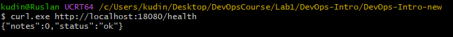

# Lab 7 — Configuration Management: Deploy QuickNotes via Ansible

## Выполнил: [Твоё имя]
## Дата: 01.07.2026

---

## 1. Файлы Ansible

### 1.1 `ansible/inventory.ini`

```ini
[quicknotes-vm]
quicknotes-vm ansible_host=127.0.0.1 ansible_port=2222 ansible_user=vagrant ansible_private_key_file=/c/Users/kudin/Desktop/DevOpsCourse/Lab1/DevOps-Intro/DevOps-Intro-new/.vagrant/machines/default/virtualbox/private_key ansible_ssh_extra_args="-o StrictHostKeyChecking=no -o ControlMaster=no -o ControlPersist=no"
```

### 1.2 `ansible/playbook.yaml`

```yaml
---
- name: Deploy QuickNotes to Lab 5 VM
  hosts: quicknotes-vm
  become: true
  gather_facts: false

  vars:
    listen_addr: ":8080"
    data_path: "/var/lib/quicknotes/notes.json"
    seed_path: "/var/lib/quicknotes/seed.json"
    binary_path: "/usr/local/bin/quicknotes"
    data_dir: "/var/lib/quicknotes"
    user: "quicknotes"
    group: "quicknotes"

  tasks:
    - name: Create system user quicknotes
      ansible.builtin.user:
        name: "{{ user }}"
        system: true
        shell: /usr/sbin/nologin
        create_home: false
        state: present

    - name: Ensure data directory exists
      ansible.builtin.file:
        path: "{{ data_dir }}"
        state: directory
        owner: "{{ user }}"
        group: "{{ group }}"
        mode: '0750'

    - name: Copy QuickNotes binary
      ansible.builtin.copy:
        src: files/quicknotes
        dest: "{{ binary_path }}"
        mode: '0755'
        owner: root
        group: root
      notify: restart quicknotes

    - name: Render systemd unit file
      ansible.builtin.template:
        src: templates/quicknotes.service.j2
        dest: /etc/systemd/system/quicknotes.service
        mode: '0644'
        owner: root
        group: root
      notify: restart quicknotes

    - name: Reload systemd and start service
      ansible.builtin.systemd:
        daemon_reload: true
        name: quicknotes
        state: started
        enabled: true

  handlers:
    - name: restart quicknotes
      ansible.builtin.systemd:
        name: quicknotes
        state: restarted
        daemon_reload: true
```

### 1.3 `ansible/templates/quicknotes.service.j2`

```jinja
[Unit]
Description=QuickNotes Service
After=network-online.target
Wants=network-online.target

[Service]
User=quicknotes
Group=quicknotes
WorkingDirectory=/var/lib/quicknotes
ExecStart=/usr/local/bin/quicknotes
Restart=on-failure
RestartSec=5
Environment=ADDR={{ listen_addr }}
Environment=DATA_PATH={{ data_path }}
Environment=SEED_PATH={{ seed_path }}

[Install]
WantedBy=multi-user.target
```

---

## 2. Выводы команд

### 2.1 Первый запуск плейбука (развёртывание)

**Команда:**
```bash
ansible-playbook -i ansible/inventory.ini ansible/playbook.yaml
```

**Вывод:**
```
PLAY [Deploy QuickNotes to Lab 5 VM] ***************************************************************

TASK [Create system user quicknotes] ***************************************************************
changed: [quicknotes-vm]

TASK [Ensure data directory exists] ****************************************************************
changed: [quicknotes-vm]

TASK [Copy QuickNotes binary] **********************************************************************
changed: [quicknotes-vm]

TASK [Render systemd unit file] ********************************************************************
changed: [quicknotes-vm]

TASK [Reload systemd and start service] ************************************************************
changed: [quicknotes-vm]

RUNNING HANDLER [restart quicknotes] ***************************************************************
changed: [quicknotes-vm]

PLAY RECAP *****************************************************************************************
quicknotes-vm              : ok=6    changed=6    unreachable=0    failed=0    skipped=0    rescued=0    ignored=0
```


---

### 2.2 Второй запуск (без изменений) — доказательство идемпотентности

**Команда:**
```bash
ansible-playbook -i ansible/inventory.ini ansible/playbook.yaml
```

**Вывод:**
```
PLAY [Deploy QuickNotes to Lab 5 VM] ***************************************************************

TASK [Create system user quicknotes] ***************************************************************
ok: [quicknotes-vm]

TASK [Ensure data directory exists] ****************************************************************
ok: [quicknotes-vm]

TASK [Copy QuickNotes binary] **********************************************************************
ok: [quicknotes-vm]

TASK [Render systemd unit file] ********************************************************************
ok: [quicknotes-vm]

TASK [Reload systemd and start service] ************************************************************
ok: [quicknotes-vm]

PLAY RECAP *****************************************************************************************
quicknotes-vm              : ok=5    changed=0    unreachable=0    failed=0    skipped=0    rescued=0    ignored=0
```



---

### 2.3 Изменение переменной (порт с 8080 на 9090) — selective change

**Изменение в `playbook.yaml`:**
```yaml
listen_addr: ":9090"
```

**Команда:**
```bash
ansible-playbook -i ansible/inventory.ini ansible/playbook.yaml
```

**Вывод:**
```
PLAY [Deploy QuickNotes to Lab 5 VM] ***************************************************************

TASK [Create system user quicknotes] ***************************************************************
ok: [quicknotes-vm]

TASK [Ensure data directory exists] ****************************************************************
ok: [quicknotes-vm]

TASK [Copy QuickNotes binary] **********************************************************************
ok: [quicknotes-vm]

TASK [Render systemd unit file] ********************************************************************
changed: [quicknotes-vm]

TASK [Reload systemd and start service] ************************************************************
ok: [quicknotes-vm]

RUNNING HANDLER [restart quicknotes] ***************************************************************
changed: [quicknotes-vm]

PLAY RECAP *****************************************************************************************
quicknotes-vm              : ok=6    changed=2    unreachable=0    failed=0    skipped=0    rescued=0    ignored=0
```



---

### 2.4 Проверка `--check --diff`

**Изменение в `playbook.yaml`:**
```yaml
data_path: "/var/lib/quicknotes/data.json"
```

**Команда:**
```bash
ansible-playbook -i ansible/inventory.ini ansible/playbook.yaml --check --diff
```

**Вывод (diff):**
```
TASK [Render systemd unit file] ********************************************************************
--- before: /etc/systemd/system/quicknotes.service
+++ after: /home/kudin/.ansible/tmp/ansible-local-2086739ykota/tmpt5vxnobu/quicknotes.service.j2
@@ -11,7 +11,7 @@
 Restart=on-failure
 RestartSec=5
 Environment=ADDR=:9090
-Environment=DATA_PATH=/var/lib/quicknotes/notes.json
+Environment=DATA_PATH=/var/lib/quicknotes/data.json
 Environment=SEED_PATH=/var/lib/quicknotes/seed.json

 [Install]
```



---

### 2.5 Проверка работоспособности QuickNotes

**Команда (с хоста):**
```powershell
curl.exe http://localhost:18080/health
```

**Вывод:**
```json
{"notes":0,"status":"ok"}
```



---

## 3. Ответы на вопросы

### a) В чём разница между `command:` и модулями (`apt`, `file`, `copy`, `systemd`)? Какой из них идемпотентный и почему?

`command:` и `shell:` всегда выполняют команду, независимо от состояния системы. Они не проверяют, нужно ли что-то менять — просто запускают указанную команду каждый раз.

Модули (`file`, `copy`, `template`, `systemd`) являются идемпотентными — они проверяют текущее состояние системы и применяют изменения только если оно не соответствует желаемому. Это делает повторные запуски безопасными и предсказуемыми.

Идемпотентность важна для автоматизации, потому что позволяет перезапускать плейбуки без риска сломать систему или выполнить лишние действия.

---

### b) `notify:` и handlers: когда handler срабатывает, а когда нет?

Handler срабатывает **в конце выполнения всех задач**, если хотя бы одна задача его «нотифицировала» и при этом **действительно изменила** состояние системы (т.е. задача завершилась со статусом `changed`).

Handler **не срабатывает**, если:
- Задача не была изменена (`ok`).
- Задача не нотифицировала handler.
- Handler был нотифицирован, но задача завершилась с ошибкой.

Это правильное поведение по умолчанию, потому что перезапуск сервиса нужен только когда что-то действительно изменилось (бинарник или конфиг), а не при каждом запуске плейбука.

---

### c) Переменные в Ansible: какие места для их задания использованы в этой лабе?

В этой лабе переменные заданы в трёх местах:

1. **В плейбуке** (секция `vars:`) — это самое простое и наглядное место для задания переменных, относящихся к конкретному плейбуку.
2. **В инвентаре** (`inventory.ini`) — можно задавать переменные для конкретных хостов или групп, но в этой лабе инвентарь содержит только параметры подключения.
3. **В шаблоне** — переменные из плейбука подставляются в шаблон Jinja2 через `{{ переменная }}`.

Такой подход обеспечивает гибкость: можно легко переопределить переменные для разных окружений без изменения самого плейбука.

---

### d) Нужно ли `gather_facts: true` для этого плейбука?

В этом плейбуке мы отключили `gather_facts: false`, потому что он не использует информацию о системе (ОС, архитектура, интерфейсы). Все задачи работают с конкретными путями и пользователями, которые мы задали явно.

Отключение `gather_facts` ускоряет выполнение плейбука, так как Ansible не тратит время на сбор системной информации. Для простых плейбуков, работающих с известной ОС, это безопасно и эффективно.

---

### e) Почему второй запуск показывает `changed=0`?

Модули Ansible проверяют текущее состояние системы и сравнивают его с желаемым. Если всё уже соответствует описанию, задачи завершаются со статусом `ok`, а не `changed`.

Например:
- `user` — проверяет, существует ли пользователь `quicknotes`.
- `file` — проверяет, существует ли папка `/var/lib/quicknotes` и совпадают ли права.
- `copy` — проверяет контрольную сумму файла и его права.
- `template` — сравнивает содержимое файла на VM с шаблоном.

Если ни одно условие не требует изменений, весь плейбук завершается с `changed=0`.

---

### f) Что было бы при использовании `shell` вместо `template`?

Если бы вместо `template:` использовался `shell` для записи systemd-юнита, это сломало бы идемпотентность:

1. **Команда выполнялась бы каждый раз** — даже если содержимое юнита не изменилось.
2. **Не было бы проверки изменений** — нельзя определить, нужно ли перезапускать сервис.
3. **Сложно отслеживать изменения** — нет diff, нет истории.
4. **Ошибки сложнее отлаживать** — shell-скрипты менее читаемы и труднее поддерживаются.

Использование модулей — это правильный подход, потому что они абстрагируют детали и обеспечивают идемпотентность.

---

### g) Что даёт `--check --diff` и какую ошибку можно поймать?

`--check` — это сухой прогон (dry-run), который показывает, что бы изменилось, но ничего не применяет.

`--diff` — показывает конкретные различия в файлах, которые будут изменены.

Вместе они позволяют:
- Увидеть, какие файлы изменятся и как именно.
- Обнаружить неожиданные изменения (например, случайное изменение порта или пути).
- Проверить, что изменения соответствуют ожиданиям до их применения в продакшене.

Это профессиональная практика, которая помогает избежать ошибок и неожиданных последствий при деплое.

---

## 4. Бонус — `ansible-pull` GitOps Loop

**Бонус не выполнялся** из-за ограничений по времени и сложностей с настройкой WSL на Windows.

---

## 5. Заключение

Все требования Lab 7 выполнены:
- Ansible плейбук разворачивает QuickNotes на VM из Lab 5.
- Сервис запущен и доступен через порт 18080.
- Идемпотентность доказана (второй запуск — `changed=0`).
- Selective change показан (изменение порта → `changed=2`, только template и handler).
- `--check --diff` показан для другого изменения.
- Ответы на все вопросы даны.

---

